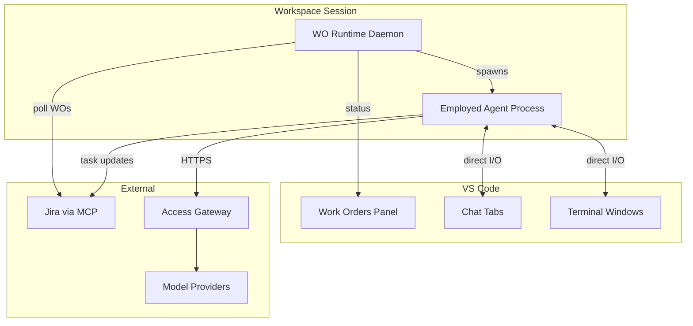

# IDE Integration

This document describes the VS Code plugin architecture for WO Runtime, including the Work Orders Panel, agent chat tabs, and terminal windows.

## Architecture Overview



## VS Code Plugin Components

The WO Runtime VS Code plugin provides three main components:

| Component | Purpose | Interaction |
|-----------|---------|-------------|
| **Work Orders Panel** | Task tree view and status | Read (WO Runtime → Panel) |
| **Chat Tabs** | Agent conversation UI | Bidirectional (User ↔ Agent) |
| **Terminal Windows** | Agent terminal UI | Bidirectional (User ↔ Agent) |

### Key Principle

VS Code is purely a UI layer. WO Runtime does not mediate user-agent interaction. Agents communicate directly with the user through VS Code UI components.

## Work Orders Panel

The Work Orders Panel displays the task tree for assigned Work Orders.

### Panel Layout

```
┌─────────────────────────────────────────────────────────────────────────────┐
│  WORK ORDERS                                                      [Refresh] │
├─────────────────────────────────────────────────────────────────────────────┤
│  ▼ WO-567: Implement user preferences              [Development]  In Progress│
│    │                                                                         │
│    ├── TASK-890: Root task                         ✓ Completed              │
│    │                                                                         │
│    ├── TASK-891: Implement API                     ✓ Completed              │
│    │                                                                         │
│    ├── TASK-892: Implement UI                      ⟳ In Progress   [Agent]  │
│    │   └── Agent: cursor-agent (claude-opus)       ↗ Open Chat              │
│    │                                                                         │
│    ├── TASK-893: Write tests                       ◯ Blocked                │
│    │   └── Depends on: TASK-891, TASK-892                                   │
│    │                                                                         │
│    └── TASK-894: Update docs                       ◯ Ready       [Human]    │
│        └── No Skilled Agent                        ↗ Pick Up                │
│                                                                              │
│  ▶ WO-568: Fix login timeout bug                   [Development]  Ready     │
└─────────────────────────────────────────────────────────────────────────────┘
```

### Panel Features

| Feature | Description |
|---------|-------------|
| **Tree view** | Hierarchical display of WO → Tasks → Sub-tasks |
| **Status badges** | Visual status (✓ Complete, ⟳ In Progress, ◯ Ready, ⊗ Blocked) |
| **Agent indicator** | Shows which tasks have agents, which are human |
| **Quick actions** | Open chat, open terminal, pick up task |
| **Refresh** | Manual refresh of WO state from Jira |

### Status Updates

WO Runtime daemon pushes status updates to the panel:

```
WO Runtime Daemon
    │
    ├── Polls Jira for task status
    ├── Detects agent completion events
    └── Sends update to VS Code Panel
            │
            └── Panel renders updated tree
```

## Agent Chat Tabs

Each Employed Agent execution appears as a chat tab.

### Chat Tab Structure

```
┌─────────────────────────────────────────────────────────────────────────────┐
│  TASK-892: Implement UI                                             × Close │
├─────────────────────────────────────────────────────────────────────────────┤
│  Agent: feature-implementation-agent                                         │
│  Capable Agent: cursor-agent | Model: claude-opus                           │
│  Status: In Progress                                                         │
├─────────────────────────────────────────────────────────────────────────────┤
│                                                                              │
│  [Agent]: I'll implement the user preferences UI component.                 │
│                                                                              │
│  I've analyzed the specification and will create:                           │
│  - PreferencesPanel.tsx - Main component                                    │
│  - usePreferences.ts - Custom hook                                          │
│  - preferences.css - Styles                                                 │
│                                                                              │
│  Creating sub-tasks for each component...                                   │
│                                                                              │
│  [User]: Please ensure dark mode support.                                   │
│                                                                              │
│  [Agent]: Understood. I'll add dark mode CSS variables                      │
│  and a theme toggle in the preferences panel.                               │
│                                                                              │
├─────────────────────────────────────────────────────────────────────────────┤
│  Type a message...                                              [Send] [⋮]  │
└─────────────────────────────────────────────────────────────────────────────┘
```

### Chat Tab Features

| Feature | Description |
|---------|-------------|
| **Header** | Task info, agent info, status |
| **Message history** | Agent and user messages |
| **Input field** | User can send messages to agent |
| **Actions menu** | Cancel, pause, view logs |

### Direct I/O

In chat mode, user and agent communicate directly:

```
User types message
    │
    └── VS Code Chat Panel
            │
            └── Agent process stdin
                    │
                    └── Agent processes message
                            │
                            └── Agent response to stdout
                                    │
                                    └── VS Code Chat Panel
                                            │
                                            └── User sees response
```

WO Runtime does not process or transform messages.

## Agent Terminal Windows

Terminal-based agents appear in dedicated terminal windows.

### Terminal Window Structure

```
┌─────────────────────────────────────────────────────────────────────────────┐
│  TASK-893: Write tests (codex-cli)                                  × Close │
├─────────────────────────────────────────────────────────────────────────────┤
│  $ codex --workspace /workspace/product-abc --task TASK-893                 │
│                                                                              │
│  Codex: Analyzing implementation for test coverage...                       │
│                                                                              │
│  Found components:                                                          │
│  - PreferencesPanel.tsx                                                     │
│  - usePreferences.ts                                                        │
│                                                                              │
│  Generating tests...                                                        │
│                                                                              │
│  Created: PreferencesPanel.test.tsx                                         │
│  Created: usePreferences.test.ts                                            │
│                                                                              │
│  Running tests...                                                           │
│  ✓ PreferencesPanel renders correctly                                       │
│  ✓ usePreferences returns default values                                    │
│  ✓ usePreferences updates on change                                         │
│                                                                              │
│  All tests pass. Task complete.                                             │
│                                                                              │
│  > _                                                                        │
└─────────────────────────────────────────────────────────────────────────────┘
```

### Terminal Features

| Feature | Description |
|---------|-------------|
| **Process output** | Agent process stdout/stderr |
| **User input** | User can type to agent stdin |
| **Scrollback** | Full history of agent execution |
| **Copy/paste** | Standard terminal interaction |

### Direct I/O

In terminal mode:

```
User types input
    │
    └── VS Code Terminal
            │
            └── Agent process stdin
                    │
                    └── Agent processes input
                            │
                            └── Agent writes to stdout
                                    │
                                    └── VS Code Terminal display
```

## I/O Mode Selection

### User Preference

Users can configure their preferred I/O mode:

```yaml
# User settings
wo-runtime:
  agent-io-preference: chat  # chat | terminal | auto
```

### Agent Capability

Some agents only support certain modes:

| Capable Agent | Chat | Terminal |
|---------------|------|----------|
| Cursor Agent | ✓ | ✓ |
| Copilot | ✓ | ✓ |
| Claude Code | ✗ | ✓ |
| Codex CLI | ✗ | ✓ |

### Auto Mode

In `auto` mode, the plugin selects based on:

1. Agent capability (terminal-only agents → terminal)
2. Skill recommendation (if specified)
3. User history (learned preference)

## Task Lifecycle in UI

### Task Appears in Panel

```
1. WO Runtime detects new/updated WO in Jira
2. WO Runtime updates panel via VS Code API
3. Panel shows task with status
```

### User Picks Up Human Task

```
1. User clicks "Pick Up" on ready human task
2. Task transitions to In-Progress
3. User works on task manually
4. User clicks "Complete" when done
5. WO Runtime updates Jira via MCP
```

### Agent Task Execution

```
1. WO Runtime spawns agent for task
2. Chat tab or terminal window opens
3. User sees agent working
4. User can interact (guidance, approvals)
5. Agent completes and notifies
6. UI shows task as completed
```

## Notifications

The plugin provides notifications for key events:

| Event | Notification |
|-------|--------------|
| New WO assigned | "New Work Order: WO-567 assigned to you" |
| Task ready | "Task TASK-892 is now ready for execution" |
| Agent needs input | "Agent on TASK-892 is waiting for your input" |
| Task completed | "Task TASK-892 completed successfully" |
| Task failed | "Task TASK-892 failed: [error summary]" |
| WO completed | "Work Order WO-567 completed" |

## VS Code Extension API Usage

### Panel Registration

```typescript
vscode.window.registerTreeDataProvider(
  'foundry.workOrders',
  new WorkOrdersTreeProvider(woRuntimeClient)
);
```

### Chat Tab Creation

```typescript
const panel = vscode.window.createWebviewPanel(
  'foundry.agentChat',
  `Task ${taskKey}`,
  vscode.ViewColumn.Beside,
  { enableScripts: true }
);
```

### Terminal Creation

```typescript
const terminal = vscode.window.createTerminal({
  name: `Task ${taskKey}`,
  shellPath: agentCommand,
  shellArgs: agentArgs,
  env: harnessEnvironment
});
```

## Read Next

- [agent-spawning.md](agent-spawning.md) — How agents are spawned
- [task-execution.md](task-execution.md) — Task tree and lifecycle
- [../ide/README.md](../ide/README.md) — Overall IDE module
- [end-to-end-work-order-flow.md](end-to-end-work-order-flow.md) — Full WO lifecycle
