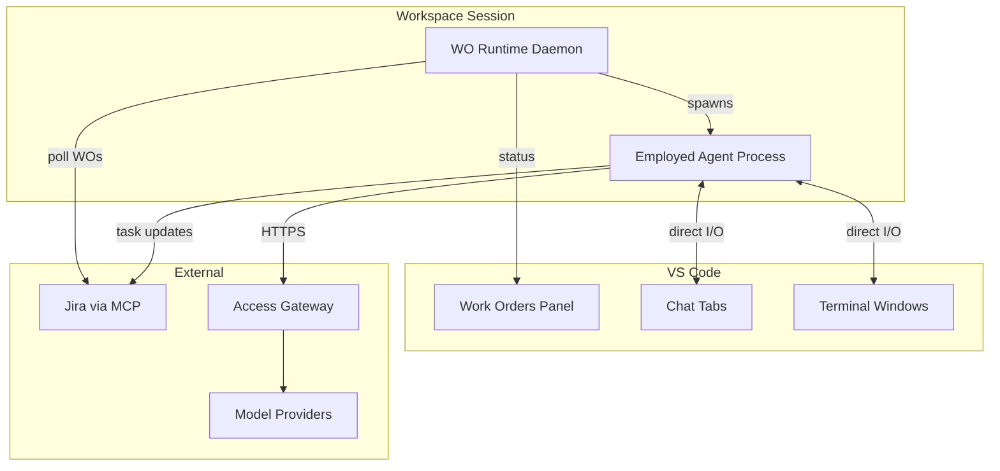

# IDE Integration

This document describes the VS Code plugin architecture for WO Runtime — plugin components, data flows, and the WO Runtime Daemon protocol.

For the builder experience (what users see and how to interact), see [IDE user guide: workspace sessions](../../ide/user-guide/workspace-sessions.md).

## ACE alignment

| ACE concept | How this module realizes it |
|-------------|---------------------------|
| **Workspace** | Provides the IDE surface for human interaction with Workspace Sessions |
| **IDE** | Implements the ACE IDE concept via VS Code extension (Work Orders Panel, Employed Agents Panel, editor tabs) |
| **Agent** | Renders agent I/O through editor Agent Output Tabs (chat or terminal) |
| **Task** | Displays folder-style task tree and status via sidebar and editor tabs |

## Architecture Overview



## VS Code Plugin Components

The WO Runtime VS Code plugin provides these components:

| Component | Purpose | Interaction |
|-----------|---------|-------------|
| **Work Orders Panel** (sidebar) | WO list, task tree, Personal Work entry | Read (WO Runtime → Panel) |
| **Employed Agents Panel** (right) | All employed agents in session; search/sort/filter | Read (WO Runtime → Panel); click opens output tab |
| **WO Detail + Task Tree tab** (editor) | Web-app-style WO detail + folder-style task tree | Read tree payload; click row opens output tab |
| **Agent Output Tabs** (editor) | Live or read-only chat/terminal transcript per agent session | Bidirectional when live (User ↔ Agent); read-only when completed |
| **Task Association Prompt** | Modal when starting agent outside task context | Builder selects Human Task or Personal Work |

Legacy bottom-panel terminal tabs (AGENT TERMINAL, TERMINAL, OUTPUT) remain for ambient CLI output; primary agent interaction is in editor tabs.

### Key Principle

VS Code is the UI layer for orchestration and navigation. WO Runtime does not mediate user-agent message content. Agents communicate directly with the user through Agent Output Tab surfaces (webview chat or integrated terminal). WO Runtime mediates metadata: task graph, agent list status, association prompts, and transcript persistence for completed sessions.

## WO Runtime Daemon Protocol

### Status Update Flow

WO Runtime daemon pushes status updates to the panel:

```
WO Runtime Daemon
    │
    ├── Polls Jira for task status
    ├── Detects agent completion events
    └── Sends update to VS Code Panel
            │
            └── Panel renders updated tree
```

### Direct I/O — Chat Mode

In chat mode, user and agent communicate directly without WO Runtime mediation:

```
User types message
    │
    └── VS Code Chat Panel
            │
            └── Agent process stdin
                    │
                    └── Agent processes message
                            │
                            └── Agent response to stdout
                                    │
                                    └── VS Code Chat Panel
```

### Direct I/O — Terminal Mode

In terminal mode:

```
User types input
    │
    └── VS Code Terminal
            │
            └── Agent process stdin
                    │
                    └── Agent processes input
                            │
                            └── Agent writes to stdout
                                    │
                                    └── VS Code Terminal display
```

## I/O Mode Selection

### User Preference Configuration

```yaml
# User settings
wo-runtime:
  agent-io-preference: chat  # chat | terminal | auto
```

### Agent Capability Matrix

| Capable Agent | Chat | Terminal |
|---------------|------|----------|
| Cursor Agent | ✓ | ✓ |
| Copilot | ✓ | ✓ |
| Claude Code | ✗ | ✓ |
| Codex CLI | ✗ | ✓ |

### Auto Mode Selection Logic

In `auto` mode, the plugin selects based on:

1. Agent capability (terminal-only agents → terminal)
2. Skill recommendation (if specified)
3. User history (learned preference)

## VS Code Extension API Usage

### Panel Registration

```typescript
vscode.window.registerTreeDataProvider(
  'foundry.workOrders',
  new WorkOrdersTreeProvider(woRuntimeClient)
);
```

### Chat Tab Creation

```typescript
const panel = vscode.window.createWebviewPanel(
  'foundry.agentChat',
  `Task ${taskKey}`,
  vscode.ViewColumn.Beside,
  { enableScripts: true }
);
```

### Terminal Creation

```typescript
const terminal = vscode.window.createTerminal({
  name: `Task ${taskKey}`,
  shellPath: agentCommand,
  shellArgs: agentArgs,
  env: harnessEnvironment
});
```

## Employed Agents Panel Data Flow

WO Runtime pushes agent session records to the IDE (WOR-FR-0038):

```
WO Runtime Daemon
    │
    ├── Agent Spawner starts/completes/fails session
    ├── Updates agents + tasks tables (Local State Store)
    └── Pushes AgentSessionEvent to IDE
            │
            └── Employed Agents Panel re-renders list
```

Example payload:

```json
{
  "sessionId": "uuid",
  "workOrderId": "WO-1234",
  "taskId": "TASK-892",
  "taskTitle": "Implement auth service",
  "skilledAgent": "foundry-dev-agent",
  "capableAgent": "cursor-agent",
  "model": "claude-4",
  "status": "waiting_for_input",
  "statusSnippet": "Approve PR?",
  "durationSeconds": 840,
  "ioMode": "chat"
}
```

Status values: `queued`, `working`, `waiting_for_input`, `completed`, `failed`.

## Task Tree Protocol

When the builder opens a WO tab, the plugin requests the task tree (WOR-FR-0039):

```
IDE → GET /wo/{workOrderId}/task-graph
WO Runtime → { nodes: [{ id, parentTaskId, title, state, syncScope, dependencies, ... }], ... }
```

The IDE builds a folder tree from `parentTaskId` (indentation + expand/collapse). Cross-task `dependencies` are rendered as inline text or badges on rows, not as graph edges.

Each node includes `syncScope` (`synced` | `local`) so the IDE can grey local-only rows. Clicking a row with an agent session requests output stream or transcript URL.

## Agent Output Tab Lifecycle

| Phase | IDE behavior | WO Runtime role |
|-------|--------------|-----------------|
| **Live** | Green banner; interactive input; opens webview or terminal bound to process | Optional transcript append to local store |
| **Completed** | Gray banner; read-only; artifacts list | Serves stored transcript (WOR-FR-0040) |
| **Failed** | Red banner; error summary; Retry / Escalate | Returns failure metadata + log tail |

Opening from Employed Agents Panel or task tree uses the same tab type keyed by `agentSessionId`.

## Task Association Prompt Protocol

When the builder starts an agent without task context (WOR-FR-0037):

```
IDE → POST /agent-sessions/start { capableAgentHint? }
WO Runtime → { requiresAssociation: true, choices: [ { taskId, title, woId }, ... , { personalWork: true } ] }
IDE → shows picker
Builder selects → POST /agent-sessions/{id}/associate { taskId | personalWork: true }
WO Runtime → spawns harness with task or Personal Work context
```

WO Runtime SHALL NOT pre-select a pending Human Task.

## Read Next

- [agent-spawning.md](agent-spawning.md) — How agents are spawned
- [task-execution.md](task-execution.md) — Task tree and lifecycle
- [IDE user guide: workspace sessions](../../ide/user-guide/workspace-sessions.md) — Builder experience
- [IDE module concepts](../../ide/README.md) — Overall IDE module
