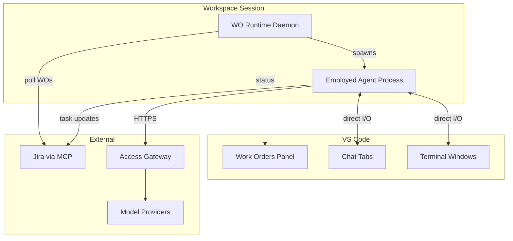

# IDE Integration

This document describes the VS Code plugin architecture for WO Runtime — plugin components, data flows, and the WO Runtime Daemon protocol.

For the builder experience (what users see and how to interact), see [IDE user guide: workspace sessions](../../ide/user-guide/workspace-sessions.md).

## ACE alignment

| ACE concept | How this module realizes it |
|-------------|---------------------------|
| **Workspace** | Provides the IDE surface for human interaction with Workspace Sessions |
| **IDE** | Implements the ACE IDE concept via VS Code extension (Work Orders Panel, Chat, Terminal) |
| **Agent** | Renders agent I/O through Chat Tabs and Terminal Windows |
| **Task** | Displays task tree and status via Work Orders Panel |

## Architecture Overview



## VS Code Plugin Components

The WO Runtime VS Code plugin provides three main components:

| Component | Purpose | Interaction |
|-----------|---------|-------------|
| **Work Orders Panel** | Task tree view and status | Read (WO Runtime → Panel) |
| **Chat Tabs** | Agent conversation UI | Bidirectional (User ↔ Agent) |
| **Terminal Windows** | Agent terminal UI | Bidirectional (User ↔ Agent) |

### Key Principle

VS Code is purely a UI layer. WO Runtime does not mediate user-agent interaction. Agents communicate directly with the user through VS Code UI components.

## WO Runtime Daemon Protocol

### Status Update Flow

WO Runtime daemon pushes status updates to the panel:

```
WO Runtime Daemon
    │
    ├── Polls Jira for task status
    ├── Detects agent completion events
    └── Sends update to VS Code Panel
            │
            └── Panel renders updated tree
```

### Direct I/O — Chat Mode

In chat mode, user and agent communicate directly without WO Runtime mediation:

```
User types message
    │
    └── VS Code Chat Panel
            │
            └── Agent process stdin
                    │
                    └── Agent processes message
                            │
                            └── Agent response to stdout
                                    │
                                    └── VS Code Chat Panel
```

### Direct I/O — Terminal Mode

In terminal mode:

```
User types input
    │
    └── VS Code Terminal
            │
            └── Agent process stdin
                    │
                    └── Agent processes input
                            │
                            └── Agent writes to stdout
                                    │
                                    └── VS Code Terminal display
```

## I/O Mode Selection

### User Preference Configuration

```yaml
# User settings
wo-runtime:
  agent-io-preference: chat  # chat | terminal | auto
```

### Agent Capability Matrix

| Capable Agent | Chat | Terminal |
|---------------|------|----------|
| Cursor Agent | ✓ | ✓ |
| Copilot | ✓ | ✓ |
| Claude Code | ✗ | ✓ |
| Codex CLI | ✗ | ✓ |

### Auto Mode Selection Logic

In `auto` mode, the plugin selects based on:

1. Agent capability (terminal-only agents → terminal)
2. Skill recommendation (if specified)
3. User history (learned preference)

## VS Code Extension API Usage

### Panel Registration

```typescript
vscode.window.registerTreeDataProvider(
  'foundry.workOrders',
  new WorkOrdersTreeProvider(woRuntimeClient)
);
```

### Chat Tab Creation

```typescript
const panel = vscode.window.createWebviewPanel(
  'foundry.agentChat',
  `Task ${taskKey}`,
  vscode.ViewColumn.Beside,
  { enableScripts: true }
);
```

### Terminal Creation

```typescript
const terminal = vscode.window.createTerminal({
  name: `Task ${taskKey}`,
  shellPath: agentCommand,
  shellArgs: agentArgs,
  env: harnessEnvironment
});
```

## Read Next

- [agent-spawning.md](agent-spawning.md) — How agents are spawned
- [task-execution.md](task-execution.md) — Task tree and lifecycle
- [IDE user guide: workspace sessions](../../ide/user-guide/workspace-sessions.md) — Builder experience
- [IDE module concepts](../../ide/README.md) — Overall IDE module
