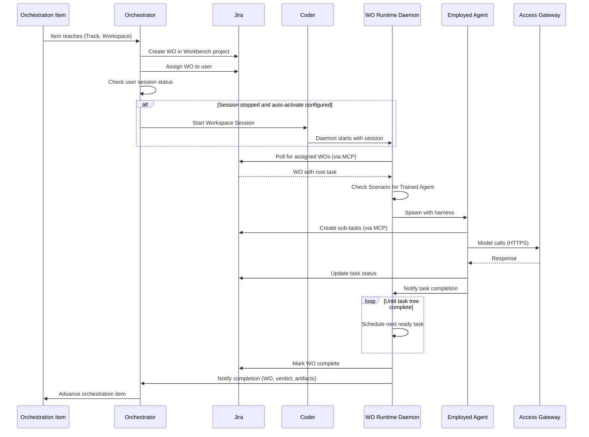

# End-to-End Work Order Flow

This document describes the complete lifecycle of a Work Order from creation by the Orchestrator through execution by the WO Runtime to completion notification.

## Overview



## Phase 1: Orchestrator Creates Work Order

### Input: Orchestration Item

The Orchestrator receives an orchestration item that has reached a (Track, Workspace) state:

| Item Type | Example Trigger |
|-----------|-----------------|
| PI (Product Intent) | Approved PI moves to Development track |
| Discovery Case | Research task assigned to analyst |
| Release Intent | Release approved, deployment work begins |

### WO Creation

1. **Determine context** — Orchestrator identifies (Track, Workspace Type) from orchestration state
2. **Select Workbench** — From orchestration item's product affiliation
3. **Create WO in Jira** — One Jira Project per Workbench holds all WOs

```
Jira Project: PRODUCT-ABC-WO
├── WO-567: Implement user preferences feature
│   ├── Scenario: implement-feature
│   ├── Work Type: Development
│   └── Source: PI-123
```

### WO Assignment

Orchestrator assigns the WO to a user based on:

| Factor | Description |
|--------|-------------|
| **Skill matching** | User has skills for the Scenario |
| **Capacity** | User has available capacity |
| **Affinity** | User worked on related items |
| **Manual override** | Admin manually assigns |

### Session Activation Decision

After assignment, Orchestrator checks user's session status:

```
1. Is user's Workspace Session running?
   ├── Yes → WO Runtime daemon will pick up WO
   └── No → Check user's auto-activation config
            ├── Auto-activate enabled → Start Coder workspace
            └── Auto-activate disabled → WO waits in Jira
```

**Auto-activation configuration** (per user):

```yaml
session-activation:
  auto-activate: true
  trigger-scenarios:
    - implement-feature
    - code-review
  quiet-hours:
    start: "22:00"
    end: "08:00"
    timezone: "America/New_York"
```

## Phase 2: WO Runtime Execution

### Daemon Startup

When a Workspace Session starts (manually or via Orchestrator activation):

1. Coder starts the workspace container
2. WO Runtime daemon starts as a service
3. Daemon authenticates to Jira via MCP

### WO Polling

The daemon continuously polls Jira for WOs:

```
1. Query Jira: "WOs assigned to me in this Workbench"
2. For each WO:
   a. Fetch task tree
   b. Identify ready tasks (dependencies met)
   c. Schedule for execution
```

### Task Execution Loop

For each ready task:

```
1. Read task's Scenario
2. Check if Scenario has Trained Agent
   ├── Yes → Spawn Employed Agent
   └── No → Surface in UI for human pickup
3. If agent spawned:
   a. Agent executes skill
   b. Agent may create sub-tasks
   c. Agent updates task status
   d. Agent notifies completion
4. Check for newly ready tasks
5. Repeat until task tree complete
```

### Trained Agent Check

The WO Runtime checks for a Trained Agent:

```
Location: workspaces/{workspace-type}/scenarios/{scenario}/trained-agent/agent.yaml

If exists:
  - Parse agent.yaml
  - Select Raw Agent (first available)
  - Prepare harness
  - Spawn Employed Agent
  
If not exists:
  - Task is for human completion
  - Task appears in web console and IDE panel
  - Session owner picks up manually
```

### Agent Spawning

See [agent-spawning.md](agent-spawning.md) for details. Summary:

1. Prepare environment variables
2. Copy skills to workspace
3. Configure MCP connectors (Jira MCP auto-provided)
4. Merge knowledge context
5. Issue Delegation Token
6. Spawn agent process
7. Inject harness

### Sub-Task Creation

Skills can create sub-tasks via explicit Jira MCP tool calls:

```python
# In skill execution
create_task(
    project="PRODUCT-ABC-WO",
    parent=current_task_key,
    summary="Implement database migration",
    scenario="implement-migration",
    dependencies=["TASK-891", "TASK-892"]
)
```

Task templates are defined in skills:

```yaml
# In SKILL.md or skill config
task_templates:
  - name: implementation-subtask
    fields:
      scenario: implement-component
      type: Sub-task
```

### Dependency Handling

Tasks form a Directed Acyclic Graph (DAG):

```
TASK-890 (Root)
├── TASK-891 (depends: none) ← Ready
├── TASK-892 (depends: 891) ← Blocked
└── TASK-893 (depends: 891, 892) ← Blocked

After TASK-891 completes:
├── TASK-891 ✓ Complete
├── TASK-892 (depends: 891 ✓) ← Ready
└── TASK-893 (depends: 891 ✓, 892) ← Still blocked
```

**Cross-user dependencies:** When a dependency is fulfilled that unblocks a task assigned to another user:

1. WO Runtime marks task as Ready in Jira
2. Orchestrator detects Ready task assigned to inactive user
3. Orchestrator may activate that user's session (if configured)

### Human Task Handoff

Tasks without Trained Agents:

1. Task appears in web console work queue
2. Task appears in IDE Work Orders Panel
3. Session owner sees task in their "My Work" view
4. Session owner manually completes the task
5. Session owner marks task complete in UI

## Phase 3: Completion

### Task Tree Completion

A Work Order is complete when:

- All tasks in the task tree are in terminal state (Completed or Cancelled)
- Failed tasks have been either resolved or accepted

### WO Completion

1. WO Runtime detects all tasks complete
2. WO Runtime marks WO complete in Jira
3. WO Runtime gathers artifacts:
   - Code changes (PR links)
   - Documentation updates
   - Test results
   - Build artifacts

### Completion Notification

WO Runtime notifies Orchestrator:

```json
{
  "work_order": "WO-567",
  "verdict": "success",
  "completed_at": "2026-05-28T14:30:00Z",
  "artifacts": {
    "pull_requests": ["PR-234", "PR-235"],
    "test_coverage": 0.87,
    "build_id": "build-12345"
  },
  "metrics": {
    "total_tasks": 12,
    "agent_tasks": 8,
    "human_tasks": 4,
    "total_duration_hours": 6.5,
    "agent_cost_usd": 12.34
  }
}
```

### Orchestrator Advances

Upon receiving completion notification:

1. Orchestrator records completion in orchestration history
2. Orchestrator advances parent orchestration item
3. Orchestrator may create next WO in sequence

Example flow:

```
PI-123: Implement user preferences
├── Discovery Case DC-456 ✓ Complete
├── WO-567 (Development) ✓ Complete  ← Just completed
├── WO-568 (QA) ← Orchestrator creates next
└── WO-569 (Release) ← Waiting
```

## Example Walkthrough: Implement Feature

### Step 1: PI Approval

```
Product Intent PI-123 approved
├── Track: Development
├── Workspace: Development
└── Product: PRODUCT-ABC
```

### Step 2: Orchestrator Creates WO

```
Orchestrator:
1. Creates WO-567 in Jira (PRODUCT-ABC-WO project)
2. Sets Scenario: implement-feature
3. Assigns to alice@example.com (skill match)
4. Checks Alice's session → stopped
5. Checks Alice's config → auto-activate: true
6. Starts Alice's Coder workspace
```

### Step 3: WO Runtime Starts

```
Coder workspace starts
WO Runtime daemon initializes
Daemon authenticates to Jira MCP
Daemon polls: "WOs assigned to Alice in PRODUCT-ABC"
Finds WO-567
```

### Step 4: Root Task Execution

```
WO-567 root task (Scenario: implement-feature)
├── Trained Agent exists: feature-implementation-agent
├── WO Runtime prepares harness
├── WO Runtime spawns Cursor Agent with claude-opus
└── Employed Agent starts execution
```

### Step 5: Skill Creates Sub-Tasks

```
Agent executes code-generator skill
Skill analyzes specification
Skill creates sub-tasks via Jira MCP:
├── TASK-891: Implement backend API (scenario: implement-api)
├── TASK-892: Implement frontend component (scenario: implement-component)
├── TASK-893: Write tests (scenario: write-tests, depends: 891, 892)
└── TASK-894: Update documentation (scenario: update-docs, no trained agent)
```

### Step 6: Sub-Task Execution

```
WO Runtime processes ready tasks:

TASK-891: Has Trained Agent → Spawn agent → Execute → Complete
TASK-892: Has Trained Agent → Spawn agent → Execute → Complete
TASK-893: Now ready → Spawn agent → Execute → Complete
TASK-894: No Trained Agent → Surface in UI

Alice picks up TASK-894:
├── Opens documentation file
├── Writes documentation manually
├── Marks task complete in IDE
```

### Step 7: WO Completes

```
All tasks complete:
├── TASK-891 ✓
├── TASK-892 ✓
├── TASK-893 ✓
└── TASK-894 ✓

WO Runtime:
1. Marks WO-567 complete in Jira
2. Gathers artifacts (PR-234, test results)
3. Notifies Orchestrator
```

### Step 8: Orchestrator Advances PI

```
Orchestrator receives completion:
1. Records WO-567 completion
2. Advances PI-123 to QA track
3. Creates WO-568 (QA testing)
4. Assigns to bob@example.com (QA role)
```

## Error Scenarios

### Agent Failure

```
Agent encounters error:
├── Logs error to task in Jira
├── Marks task as Failed
├── WO Runtime surfaces for human intervention
└── Session owner can: retry, skip, or escalate
```

### Session Crash

```
Coder workspace crashes:
├── WO Runtime daemon terminates
├── In-progress tasks remain In-Progress in Jira
├── On session restart:
│   └── WO Runtime picks up from Jira state
└── Partial work may be lost (agent memory not persisted)
```

### Quota Exhaustion

```
Access Gateway returns 429 (quota exceeded):
├── Agent receives error
├── If graceful mode: Agent saves state, pauses
├── If hard-stop mode: Agent terminates
└── Task remains In-Progress until quota refreshes or human intervenes
```

## Related Concepts

- [Work Order](../../concepts/work-order.md) — Instantiation of a Scenario for execution
- [Task](../../concepts/task.md) — Unit of work completed by human-agent teams
- [Scenario](../../concepts/scenario.md) — Ingress contract defining what work a Workspace accepts
- [Workspace Session](../../concepts/workspace-session.md) — Ephemeral development environment
- [Agent Model](../../concepts/agent-model.md) — Three-tier hierarchy (Raw → Trained → Employed)
- [Delegation](../../concepts/delegation.md) — Authority transfer from human to agent
- [WO Runtime Daemon](../concepts/wo-runtime-daemon.md) — Coordinates WO execution (module-specific)
- [Task Manager](../concepts/task-manager.md) — Manages task trees (module-specific)
- [Agent Spawner](../concepts/agent-spawner.md) — Spawns Employed Agents (module-specific)

## Read Next

- [task-execution.md](task-execution.md) — Task tree and state machine details
- [agent-spawning.md](agent-spawning.md) — Harness and spawning process
- [ide-integration.md](ide-integration.md) — How tasks appear in the IDE
- [../../orchestrator/README.md](../../orchestrator/README.md) — Orchestrator architecture
