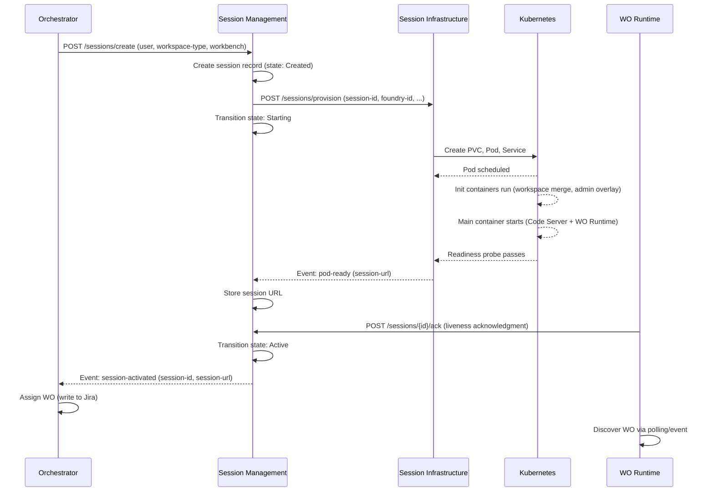
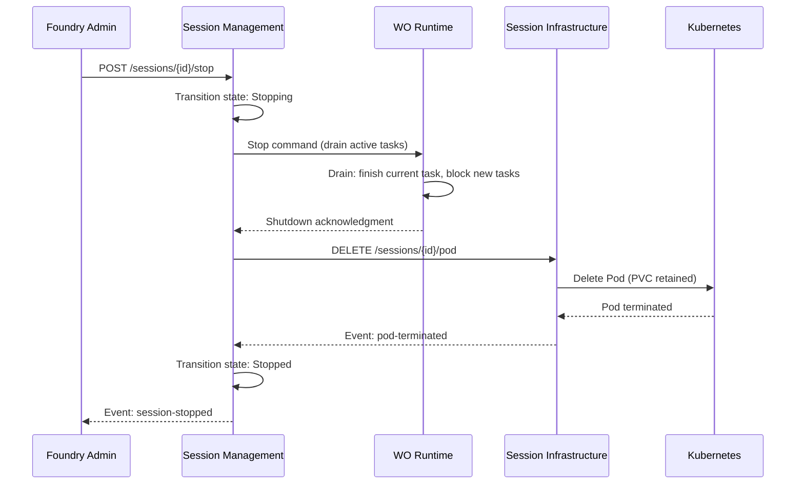

# Sequence Diagrams

End-to-end time-ordered flows for platform developers implementing any participant.

## Session creation flow



## Session stop flow



## Pod crash recovery flow

```mermaid
sequenceDiagram
    participant K8S as Kubernetes
    participant WSI as Session Infrastructure
    participant WSM as Session Management
    participant WOR as WO Runtime

    K8S->>K8S: Pod crashes (OOM, process exit, etc.)
    K8S->>K8S: Restart pod (restartPolicy: Always)
    K8S-->>WSI: Pod restarting event
    WSI-->>WSM: Event: pod-restarting (session-id)
    Note over WSM: Liveness timeout clock running (60s)
    K8S->>K8S: Init containers re-run
    K8S->>K8S: Main container starts
    WOR->>WSM: POST /sessions/{id}/ack (re-acknowledgment)
    WSM->>WSM: Reset liveness timer; remain Active
    Note over WSM: If ack does NOT arrive within 60s:
    WSM->>WSM: Transition: Active → Unhealthy
    WSM->>WSI: Query pod status via K8s API
    alt Pod running but WO Runtime unhealthy
        WSI-->>WSM: Pod exists, container running
        WSM->>WSM: Wait additional 30s for ack
    else Pod gone or CrashLoopBackOff
        WSI-->>WSM: Pod failed
        WSM->>WSM: Transition: Unhealthy → Stopped
    end
```

## Read Next

- [interface-contracts.md](interface-contracts.md) — API schemas
- [failure-modes.md](failure-modes.md) — recovery strategies
