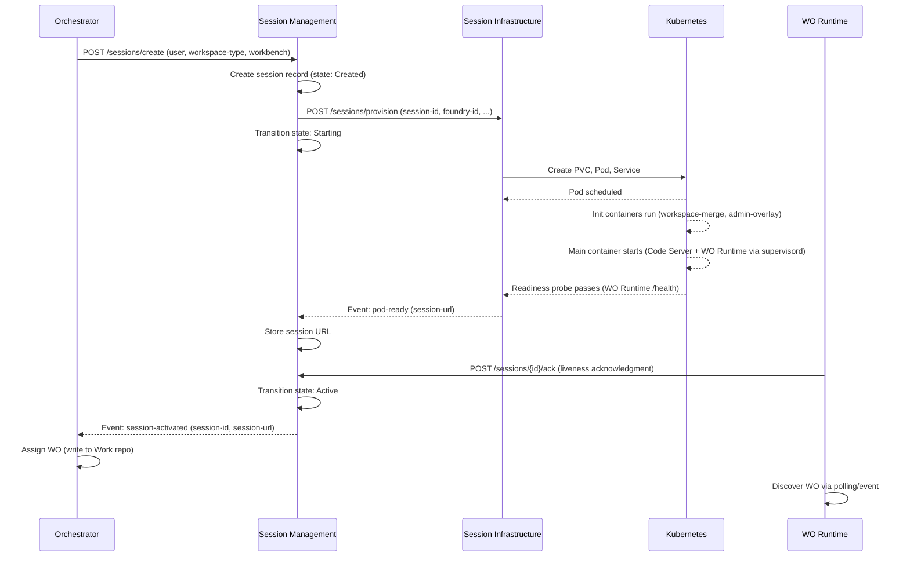
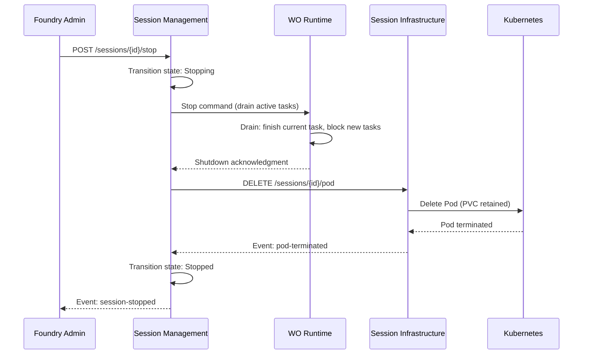

# Sequence Diagrams

End-to-end time-ordered flows for platform developers implementing Session Infrastructure, Session Management, WO Runtime, or Orchestrator participants.

## Session creation flow

Orchestrator requests a session; Session Management delegates provisioning to Session Infrastructure; WO Runtime acks liveness to activate the session.



**Key timing constraints:**
- WSI-NFR-0001: Readiness probe passes within 90s of provision request
- WSI-NFR-0002: Session URL accessible within 10s of pod readiness
- WO Runtime sends liveness ack within 30s of container start (WOR-FR-0030)

---

## Session stop flow

Admin or policy triggers stop; WO Runtime drains; Session Infrastructure deletes pod and retains PVC.



**Grace period:** 30s preStop hook (WSI-NFR-0004). If drain exceeds grace period, WOR reports pending tasks in shutdown ack.

---

## Pod crash recovery flow

Kubernetes restarts the pod; WO Runtime re-acks; Session Management decides whether to remain Active or transition to Unhealthy/Stopped.

```mermaid
sequenceDiagram
    participant K8S as Kubernetes
    participant WSI as Session Infrastructure
    participant WSM as Session Management
    participant WOR as WO Runtime

    K8S->>K8S: Pod crashes (OOM, process exit, etc.)
    K8S->>K8S: Restart pod (restartPolicy: Always)
    K8S-->>WSI: Pod restarting event
    WSI-->>WSM: Event: pod-restarting (session-id)
    Note over WSM: Liveness timeout clock running (60s)
    K8S->>K8S: Init containers re-run
    K8S->>K8S: Main container starts
    WOR->>WSM: POST /sessions/{id}/ack (re-acknowledgment)
    WSM->>WSM: Reset liveness timer; remain Active
    Note over WSM: If ack does NOT arrive within 60s:
    WSM->>WSM: Transition: Active → Unhealthy
    WSM->>WSI: Query pod status via K8s API
    alt Pod running but WO Runtime unhealthy
        WSI-->>WSM: Pod exists, container running
        WSM->>WSM: Wait additional 30s for ack
    else Pod gone or CrashLoopBackOff
        WSI-->>WSM: Pod failed
        WSM->>WSM: Transition: Unhealthy → Stopped
    end
```

**PVC behavior:** Crash restart rebinds the same PVC. Init containers re-apply merge and overlay layers.

---

## Related documentation

- [interface-contracts.md](interface-contracts.md) — Event and API schemas referenced in flows
- [failure-modes.md](failure-modes.md) — Recovery strategies per failure type
- [pod-lifecycle.md](pod-lifecycle.md) — Probes and graceful shutdown details
- [../../workspace-session-management/platform-developer-guide/session-state-machine.md](../../workspace-session-management/platform-developer-guide/session-state-machine.md) — Session state transitions
