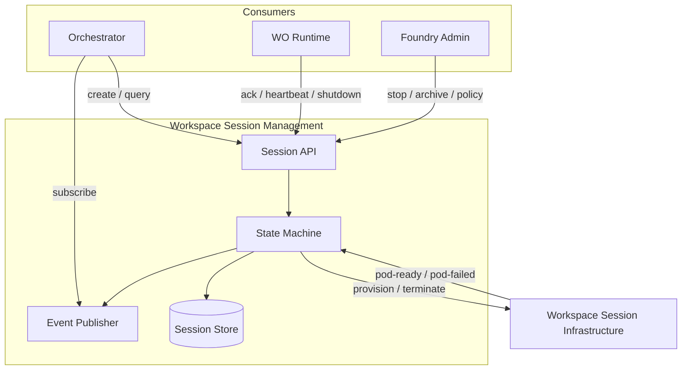

# Workspace Session Management

**Module scope:** Control-plane lifecycle for Workspace Sessions — create, track, terminate, and publish session events. Does not know about Work Orders.

## Purpose

Workspace Session Management is the source of truth for session lifecycle in the Foundry management plane. When a builder needs an environment to work in, something must decide whether a session exists, drive it from creation through activation, enforce idle and lifetime policies, and tell the rest of the platform when a session is ready or gone. That responsibility belongs here — not to WO Runtime (which runs inside the pod), not to Session Infrastructure (which provisions Kubernetes resources), and not to Orchestrator (which bridges sessions to Work Orders).

The module exists because session lifecycle is a high-frequency, latency-sensitive control-plane concern. Heartbeats arrive every 15 seconds per active session; state queries must be fast; and a failure in liveness logic should not take down Foundry provisioning or Work Catalog Management. Session Management is deployed as a standalone service with its own schema, scaling, and release cycle, while sharing the same PostgreSQL instance as Management (no foreign key constraints to Management tables).

Primary consumers are the **Orchestrator** (queries and creates sessions, listens for `session-activated`) and **WO Runtime** (liveness acknowledgment, heartbeats, shutdown acknowledgment, stop/drain commands). Foundry admins use the admin API for force-stop, archive, and policy configuration.

## What this module does

- **Session lifecycle** — persist and enforce the state machine: Created → Starting → Active → Stopping → Stopped → Archived → Deleted
- **Provisioning delegation** — on create, request pod provisioning from [Workspace Session Infrastructure](../workspace-session-infrastructure/README.md); store session URL when ready
- **Liveness protocol** — accept WO Runtime acknowledgment and heartbeats; detect unhealthy sessions; piggyback stop/drain on heartbeat responses
- **Session events** — publish `session-created`, `session-starting`, `session-activated`, `session-unhealthy`, `session-stopping`, `session-stopped`, `session-archived` on every transition
- **Query API** — list and filter sessions by user, workspace type, workbench, and state
- **Policy enforcement** — idle timeout and max session lifetime (configurable per Foundry)

## What this module does NOT do

- **Does not know about Work Orders** — Orchestrator assigns WOs after sessions activate; WO Runtime discovers work independently
- **Does not provision Kubernetes resources** — Session Infrastructure owns pods, PVCs, ingress, and URLs
- **Does not execute tasks or spawn agents** — WO Runtime owns in-session execution
- **Does not define workspace content** — Management owns Workshop Definition Repos and Workbench templates
- **Does not own the Kubernetes cluster** — Foundry admin provides cluster endpoints via Foundry settings (consumed by Session Infrastructure)

## Architecture

**Typical creation flow:**

1. Orchestrator calls `POST /api/v1/sessions` with user, workspace type, workbench, and foundry IDs
2. Session Management creates a record (state: **Created**), publishes `session-created`, transitions to **Starting**, publishes `session-starting`
3. Session Management calls Session Infrastructure to provision the pod
4. Session Infrastructure returns session URL on pod readiness (`session-infrastructure.pod-ready`)
5. WO Runtime boots in the pod and sends liveness acknowledgment
6. Session Management transitions to **Active**, publishes `session-activated` (includes session URL)
7. Orchestrator receives the event and proceeds with WO assignment (outside this module)

## Session state machine

| State | Meaning |
|-------|---------|
| **Created** | Session record exists; provisioning not yet requested |
| **Starting** | Provision request sent to Session Infrastructure; awaiting pod ready + liveness ack |
| **Active** | Pod ready; WO Runtime acknowledged; session URL available |
| **Unhealthy** | Liveness timeout exceeded; recovery in progress |
| **Stopping** | Stop requested; draining WO Runtime; terminating pod |
| **Stopped** | Pod terminated; PVC retained (per Infrastructure policy); session not usable |
| **Archived** | Long-term retention; storage snapshot per Infrastructure policy |
| **Deleted** | Record and infrastructure reclaimed |

Terminal transitions for operational use: **Stopped** (pause/resume), **Archived** (retain evidence), **Deleted** (full cleanup).

→ [platform-developer-guide/session-state-machine.md](platform-developer-guide/session-state-machine.md) — guards, timeouts, side effects

## Session events

All state transitions emit events on the platform message queue with a shared envelope (session ID, foundry ID, user ID, workspace type, workbench ID, optional session URL, timestamp, metadata).

| Event | When emitted |
|-------|----------------|
| `session-created` | Record persisted (Created) |
| `session-starting` | Provision request issued (Starting) |
| `session-activated` | Liveness ack received (Active) |
| `session-unhealthy` | Liveness timeout exceeded |
| `session-stopping` | Stop initiated |
| `session-stopped` | Pod terminated; session not active |
| `session-archived` | Archive completed |

→ [concepts/session-events.md](concepts/session-events.md) — delivery semantics and consumers

## ACE concepts realized

| Concept | How Session Management realizes it |
|---------|-------------------------------------|
| [Workspace Session](../concepts/workspace-session.md) | Control-plane lifecycle and URL registry; runtime environment is provisioned elsewhere |
| [Workspace](../concepts/workspace.md) | Sessions are scoped to a workspace type within a Workbench |

## Key design decisions

- **Standalone service, shared database, no FK constraints.** Separate container and schema; references Foundry, Workbench, and User by ID only. Logically coupled to Management by convention; physically decoupled for independent scaling and failure isolation.
- **Sessions are not Work Orders.** No WO IDs, assignment, or completion semantics in this module.
- **Active requires liveness ack.** Pod readiness alone is insufficient; WO Runtime must acknowledge within the liveness window.
- **Heartbeats carry commands.** Stop and drain directives can be returned on heartbeat responses to avoid extra round-trips.
- **Infrastructure is asynchronous.** Provisioning and pod events are integrated via callbacks/events from Session Infrastructure.

## Dependencies

| Dependency | Relationship |
|------------|--------------|
| [Workspace Session Infrastructure](../workspace-session-infrastructure/README.md) | Provisions pods; returns session URL; reports pod failures |
| [Orchestrator](../orchestrator/README.md) | Creates and queries sessions; listens for `session-activated` |
| [Work Order Runtime](../work-order-runtime/README.md) | Liveness ack, heartbeats, shutdown ack; receives stop/drain |
| [Management](../management/README.md) | Foundry/Workbench/User IDs (by reference, not validated on every request) |

## Key concepts

### Platform-wide concepts

| Concept | What Session Management does with it |
|---------|--------------------------------------|
| [Workspace Session](../concepts/workspace-session.md) | Owns control-plane lifecycle and event stream |

### Module-specific concepts

| Concept | Definition |
|---------|------------|
| [Session lifecycle](concepts/session-lifecycle.md) | State machine, transitions, and who triggers each |
| [Session events](concepts/session-events.md) | Event envelope, consumers, ordering |
| [Session identity](concepts/session-identity.md) | Composite key and addressing model |

→ [concepts/README.md](concepts/README.md) — Full module concept index

## Documentation

| Guide | Audience | Index |
|-------|----------|-------|
| Concepts | Anyone | This README, [concepts/](concepts/) |
| [User guide](user-guide/) | Foundry admins | View sessions, force-stop, policies |
| [Foundry Platform developer guide](platform-developer-guide/) | Platform engineers | APIs, state machine, contracts |

## Read Next

- [../concepts/workspace-session.md](../concepts/workspace-session.md) — platform-wide Workspace Session definition
- [../workspace-session-infrastructure/README.md](../workspace-session-infrastructure/README.md) — Kubernetes provisioning and session URLs
- [../orchestrator/README.md](../orchestrator/README.md) — session query/creation and WO assignment
- [../work-order-runtime/README.md](../work-order-runtime/README.md) — in-session worker and management-plane interface
- [platform-developer-guide/interface-contracts.md](platform-developer-guide/interface-contracts.md) — API and event schemas
