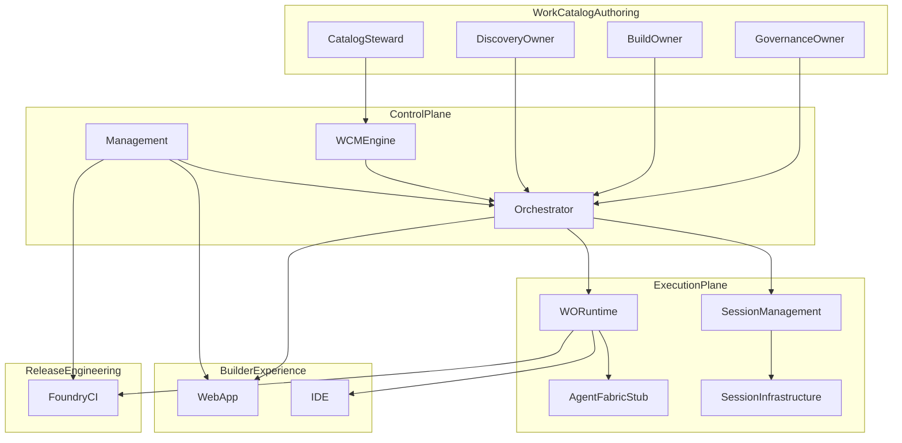

# Dependency Graph — Phase 1 Streams

Squad blocking relationships and critical path for Phase 1 delivery.

## Stream dependency diagram



## Critical path

The longest dependency chain for golden-path demo:

```text
Work Catalog (steward: schema)
  → Control Plane (M0: Workbench + WCM)
    → Work Catalog (M1: first authoritative scenario)
      → Control Plane + Execution Plane (M1: one WO runs)
        → Work Catalog Build (M2: PI workflow)
          → Control Plane (M2: Build OI end-to-end)
            → Work Catalog Discovery (M3: DC workflow + handoff)
              → Control Plane (M3: Discovery + handoff)
                → All streams (M4: governance + traceability)
                  → M5: demo
```

**Bottleneck:** Control Plane + Execution Plane on the critical path. Builder Experience can parallelize with mocks until M1.

## Blocking matrix

| Producer | Consumer | Blocks | Milestone |
|----------|----------|--------|-----------|
| Work Catalog Authoring | Control Plane | Orchestrator cannot implement handlers without authoritative catalog | M1+ |
| Control Plane (MGT) | Control Plane (ORC) | Entity IDs and catalog resolution before workflows run | M0 |
| Control Plane | Execution Plane | WO creation before Runtime executes | M1 |
| Execution Plane | Control Plane | `work-order-completed` before OI advances | M1 |
| Control Plane | Builder Experience | Entity APIs before Web App create flows | M2 |
| Execution Plane | Builder Experience | Session + task APIs before IDE integration | M1 |
| Execution Plane | Release Engineering | Implementation PR before CI runs | M2 |
| Control Plane | Builder Experience | Traceability API | M4 |
| All streams | Integration lead | E2E demo | M5 |

## Parallel work safe zones

| Streams | Can proceed in parallel after |
|---------|------------------------------|
| Execution Plane (WSI/WSSM) + Control Plane (MGT provisioning) | Program kickoff |
| Builder Experience (UI mocks) + Execution Plane | Program kickoff |
| Release Engineering (CI skeleton) + Execution Plane | M0 (Workbench exists) |
| Work Catalog Discovery owner + Work Catalog Build owner | M0 (schema contract) |
| Release Engineering + Builder Experience | Minimal overlap — coordinate on PR status UX |

## Read next

- [contract-gates.md](contract-gates.md) — interface contracts between streams
- [../milestones.md](../milestones.md) — milestone sequence
- [../people-plan.md](../people-plan.md) — stream roster
