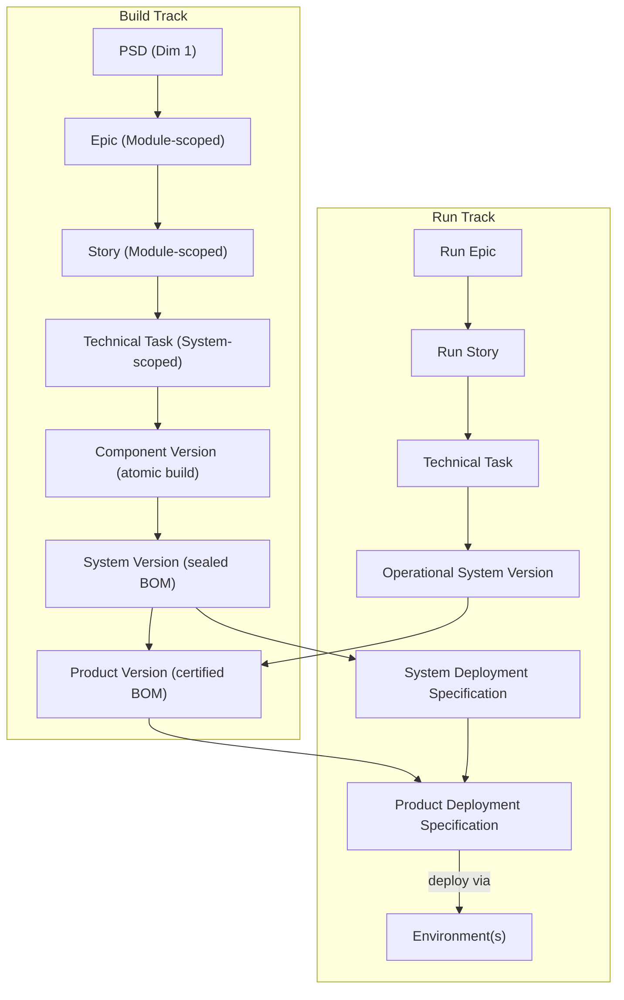
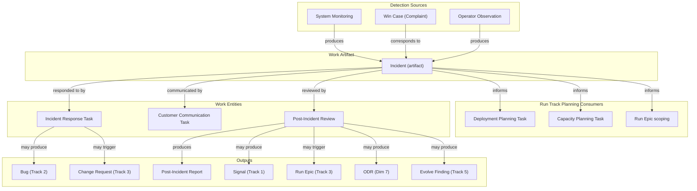
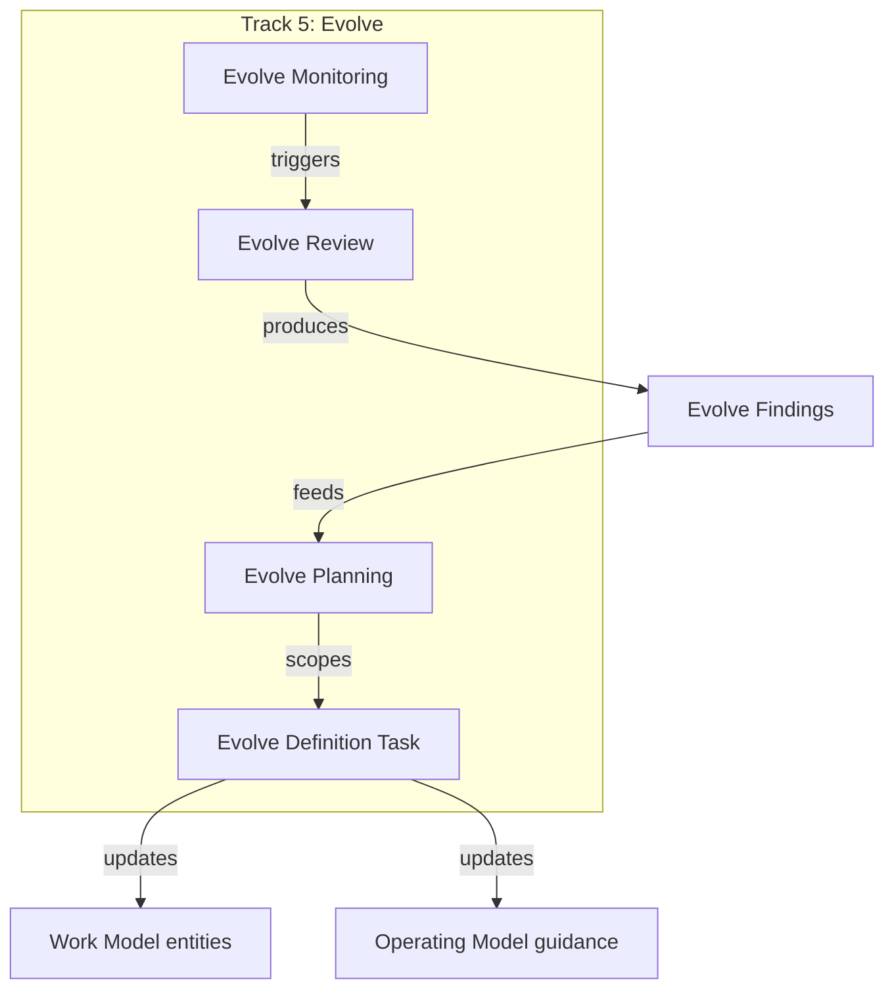
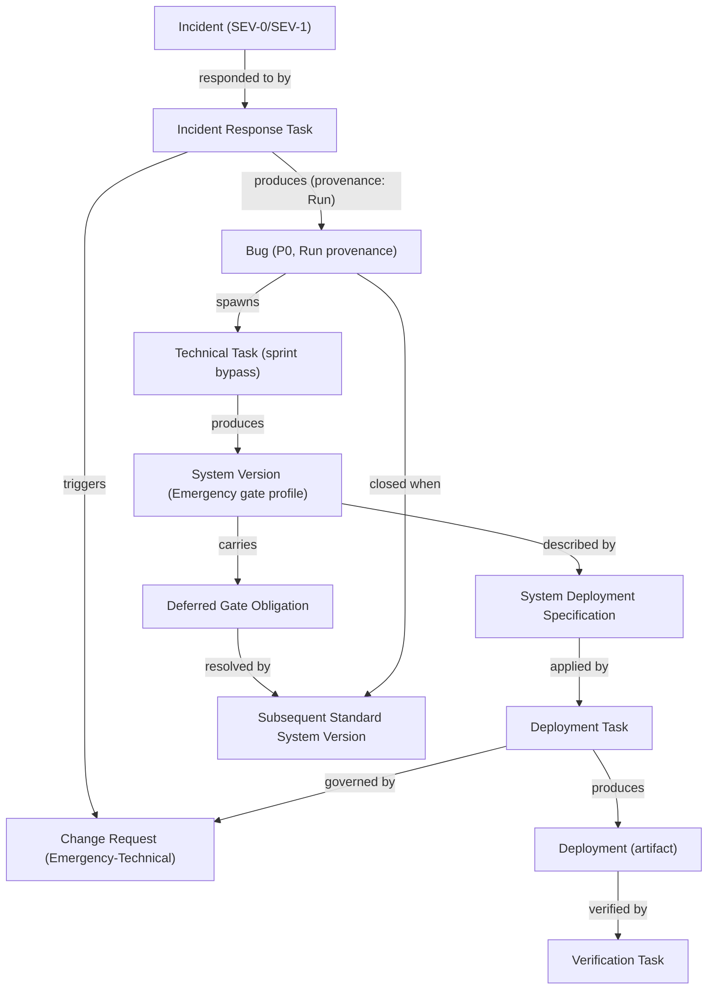
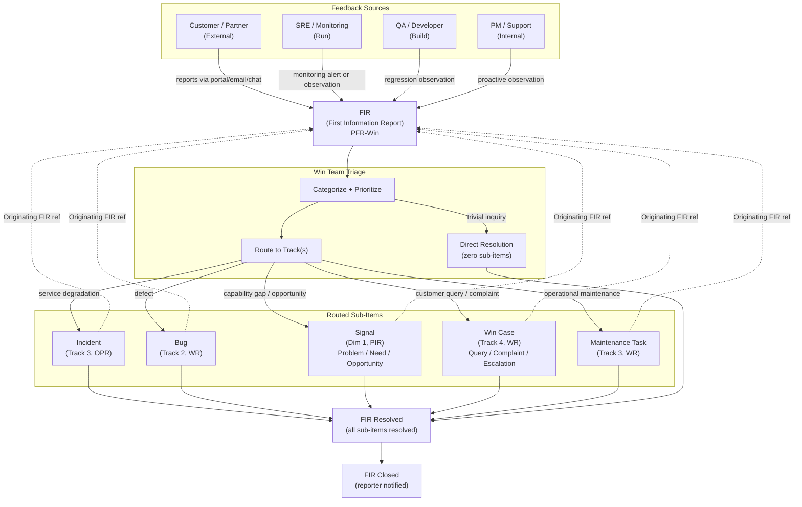
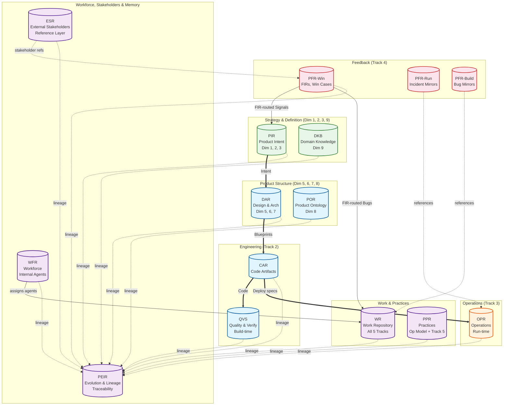

# UPIM Visual Models

> **DR-036 authority note:** Deployment/versioning semantics in DR-036 supersede DR-026–029 for operational use. Diagrams marked historical retain Package/SDD labels for design context; prefer Seeds 16–17 and updated diagrams 1–2, 5.

## Purpose

This file collects visual models (mermaid diagrams) that illustrate cross-entity relationships, cross-track flows, and architectural patterns in the Unified Product Information Model. These diagrams complement the entity definitions (in `entities/`) and narrative seeds (in `narrative-seeds.md`) by providing visual representations of flows that span multiple entities and tracks.

## Maintenance

Each diagram carries:
- **Title** — what the diagram shows
- **Source** — the plan or decision record that produced it
- **Reflects** — which decision record(s) and entities the diagram represents

Diagrams may go stale as the model evolves. When entities, relationships, or flows are modified, check whether existing diagrams need updating. The source and reflects fields help identify staleness: if a referenced DR is superseded or an entity is renamed, the diagram likely needs revision.

This is a working document — add new diagrams as the model evolves rather than leaving them in ephemeral plan files.

---

## 1. Composition Levels and Run Track Flow

**Source:** Plan `composition_levels_and_run_track_3c7f70e2`
**Reflects:** DR-026 (Build Track Detailing), DR-027 (Composition Levels), DR-028 (Deployment Descriptors)

Shows the Build Track producing Component Versions, System Versions, and Product Versions; Run Track produces Deployment Specifications and applies them to environments. Reflects DR-036.



---

## 2. Change-to-Deployment Workflow

**Source:** Plan `change-to-deployment_workflow_d93f53f7`
**Reflects:** DR-029 (Change-to-Deployment Workflow Redesign), DR-027, DR-028

Shows Dim 5 Product Specification, Dim 7 Deployment Train/Station, and Track 3 deployment workflow per DR-036.

```mermaid
graph TB
  subgraph defModel [Definition Model]
    ProdSpec["Product Specification (Dim 5)"]
    Train[Deployment Train (Dim 7)]
    Station[Station]
    DepEnv[Deployment Environment]

    Train -->|contains| Station
    Station -->|targets| DepEnv
    ProdSpec -->|declares| Systems["Systems (Dim 5)"]
  end

  subgraph workModel [Work Model - Track 3]
    CR[Change Request]
    DP[Deployment Plan]
    DPT[Deployment Planning Task]
    DrillTask[Deployment Drill Task]
    DeployTask[Deployment Task]
    VerifyTask[Verification Task]

    SysVer[System Version]
    ProdVer[Product Version]
    SDS[System Deployment Specification]
    PDS[Product Deployment Specification]
    DeployRecord["Deployment (artifact)"]

    CR -->|"scoped to"| Train
    CR -->|contains| DP
    DP -->|produces| DPT
    DPT -->|"produces"| SDS
    DPT -->|"produces"| PDS
    SysVer --> SDS
    ProdVer --> PDS
    SDS --> PDS
    DrillTask -->|"predecessor to"| DeployTask
    DeployTask -->|"applies"| SDS
    DeployTask -->|"applies"| PDS
    DeployTask -->|"produces"| DeployRecord
  end
```

---

## 3. Incident Management Flow

**Source:** Plan `incident_management_refactor_53441906`
**Reflects:** DR-030 (Incident Management Refactor)

Shows how detection sources produce Incident artifacts, which are handled by work entities (Incident Response Task, Customer Communication Task, Post-Incident Review), producing outputs across multiple tracks, while also informing Run Track planning tasks.



---

## 4. Track 5: Evolve Flow

**Source:** Plan `track_5_evolve_and_artifact_catalog_abc94030`
**Reflects:** DR-022 (Track 5: Evolve and Artifact Type Catalog)

Shows how Evolve Monitoring triggers Evolve Review, which produces Evolve Findings that feed Evolve Planning, which scopes Evolve Definition Tasks that update both Work Model entities and Operating Model guidance.



---

## 5. Emergency Fix Path

**Source:** Plan `hotfix_emergency_fix_path_4084a483`
**Reflects:** DR-031 (Hotfix / Emergency Fix Path), DR-029 (Emergency-Technical CR), DR-030 (Incident Response Task)

Shows the end-to-end hotfix chain spanning Build Track (P0 Bug → Emergency System Version) and Run Track (Emergency-Technical CR → Deployment), with the deferred-gate obligation loop.



---

## FIR Intake and Routing Flow (DR-032)



---

## Foundry Repository Landscape — 15-Repository Topology (DR-033)



---
