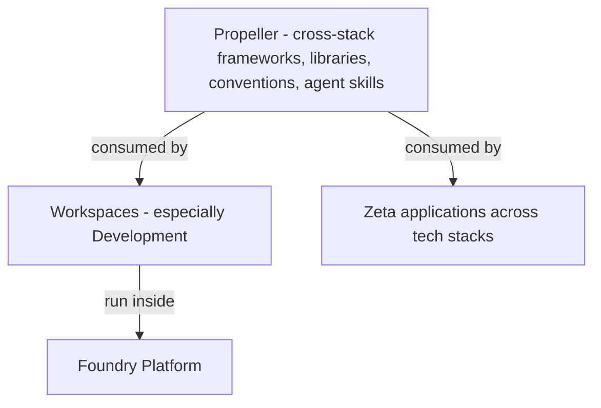

# Propeller

## What Propeller is

Propeller is a **parallel workstream of the Foundry engineering team** that builds the cross-stack frameworks, libraries, and conventions used across Zeta tech stacks. In platform-engineering organizations elsewhere, this is often a sub-area of the platform-engineering practice. At Zeta, the Foundry engineering team has chosen to colocate it under [foundry/](../README.md) because the Foundry Platform consumes Propeller heavily, and because the team's engineering competencies overlap.

## What Propeller is *not*

Propeller is **not part of the Foundry Platform**. The Foundry Platform delivers ACE and UPIM capabilities — workshops, projects, workspaces, intent routing, governance, CI, and UPIM-backed entities. Propeller is upstream of all of that: it is the foundations that *Workspaces* (especially the Development Workspace) consume.

In executive narrative, Propeller is sometimes called **Build Accelerators**; **Propeller** is the canonical name in this folder.

The distinction matters operationally:

- A Foundry Platform module ships as part of the platform's deployment.
- A Propeller framework or library ships as a dependency — pulled into a Zeta application or a Workspace's IDE profile.

A reader who is looking for what the platform does should read [../foundry-platform/README.md](../foundry-platform/README.md). A reader who is looking for what is reusable across the company's tech stacks belongs here.

## Audience

Primary readers are wider Zeta engineering — anyone building application code, libraries, or runtimes that will benefit from cross-stack conventions. Secondary readers are Foundry Platform builders who want to know what foundations they can rely on.

## Current scope

From [propeller.TODO](propeller.TODO):

- **Java 21, GraalVM Native Image** — runtime baseline for Zeta-Java services.
- **Spring Boot 3.x, 12-factor app** — application framework convention.
- **Distroless container images** — container baseline.
- **Module, Product Specification skills** — agent skills for module-level and product-level specification work.
- **Module Package, Product Package specification skills** — agent skills for packaging.
- **Tenant Logging, Tenant Metrics** — multi-tenant observability primitives.
- **Value Streams support** — alignment to value-stream-based delivery.
- **CCE strengthening** — improvements to the Common Code Environment.
- **Curated skills for various development tasks** — agent skills consumed by Workspaces.

These items are heterogeneous — some are runtime baselines, some are application frameworks, some are agent skills, some are observability primitives. The unifying property is that they are **reusable across stacks**, not specific to any one application or workspace.

## How Propeller relates to ACE and the Foundry Platform

Propeller artifacts are **consumed**, not embedded. Workspaces and applications take a runtime baseline, a framework convention, or a curated agent skill from Propeller and use it; Propeller does not run inside a Workspace.

A Development Workspace's Rocket profile may include Propeller-provided skills; a release pipeline may produce containers from Propeller-baselined distroless images. Neither makes Propeller part of the Foundry Platform — both are uses of Propeller artifacts.

## Governance independence

Because Propeller is consumed across tech stacks at Zeta — not only by the Foundry Platform — its governance is independent of the Foundry Platform's governance. Decisions about Propeller's runtime versions, framework upgrades, or skill catalogs are made by the Propeller workstream's owners, with input from consumers.

This independence is intentional. Coupling Propeller's release rhythm to the Foundry Platform's release rhythm would slow Propeller for non-Foundry consumers and over-stabilize the Foundry Platform for the cross-stack reality.

## Read next

- [propeller.TODO](propeller.TODO) — current backlog.
- [../ace/workspaces/development.md](../ace/workspaces/development.md) — the Workspace that consumes Propeller most heavily.
- [../foundry-platform/README.md](../foundry-platform/README.md) — for contrast: what the platform itself does.
