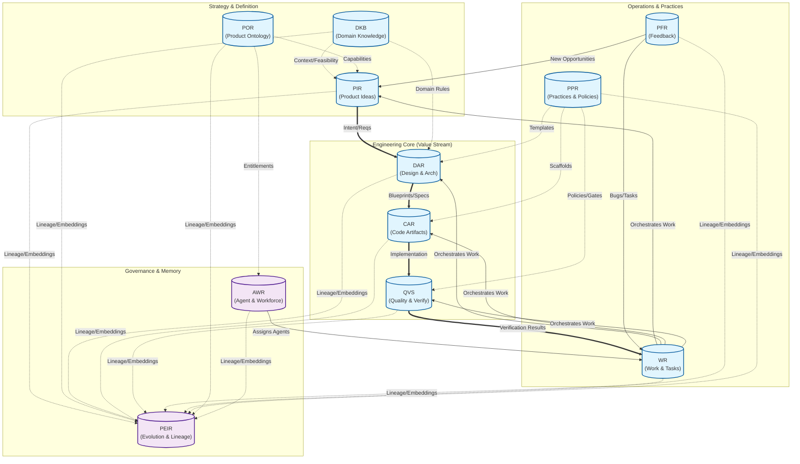

# Agent-Native Product Engineering System - Repository Architecture Guide

## Table of Contents

- [Introduction](#introduction)
- [Product Idea Repository (PIR)](#product-idea-repository-pir)
- [Domain Knowledge Base (DKB)](#domain-knowledge-base-dkb)
- [Design & Architecture Repository (DAR)](#design--architecture-repository-dar)
- [Code Artifact Repository (CAR)](#code-artifact-repository-car)
- [Quality Verification System (QVS)](#quality-verification-system-qvs)
- [Product Evolution & Impact Repository (PEIR)](#product-evolution--impact-repository-peir)
- [Product Practitioner Repository (PPR)](#product-practitioner-repository-ppr)
- [Product Ontology Repository (POR)](#product-ontology-repository-por)
- [Product Feedback Repository (PFR)](#product-feedback-repository-pfr)
- [Work Repository (WR)](#work-repository-wr)
- [Agent Work Registry (AWR)](#agent-work-registry-awr)
- [End-to-End Information & Value Flow](#end-to-end-information--value-flow)


---

## Introduction

This guide is designed to help architects understand the structure and function of the repositories that enable the Agent-Native Product Engineering System. These repositories are the collaborative foundation for both AI and human agents throughout the product lifecycle. The following sections summarize each repository’s **intent**, **contents**, **best practices**, **information flow**, and provide an end-to-end example of a product idea as it traverses the system.

---

## Product Idea Repository (PIR)

**Intent:** Capture and structure product opportunities, problems, and initial requirements.

**Contents:**
- Product ideas & opportunity spaces
- Problem definitions
- User/job stories
- Feature intents
- High-level requirements
- Acceptance criteria
- Business constraints
- Product goals, OKRs, KPIs
- Product briefs & narratives

**Purpose:** Central workspace for product intent, empowering agents (Product, PM, Planner) to evaluate opportunities and expected outcomes.

**Best Practices**
- **Do:**  
  - Keep ideas clear and lightweight until validated  
  - Track version history as ideas evolve
- **Don’t:**  
  - Include design/implementation details  
  - Store customer complaints (use PFR)


---

## Domain Knowledge Base (DKB)

**Intent:** Establish a shared, canonical understanding of the business and domain.

**Contents:**
- Glossaries, ontologies, taxonomies
- Business rules, models, event definitions
- Regulatory and policy frameworks
- Contextual and background knowledge

**Purpose:** Stabilizes semantic grounding for requirements and architecture.

**Best Practices**
- **Do:**  
  - Keep definitions canonical and domain-wide  
  - Use structured formats (e.g. ontologies)
- **Don’t:**  
  - Store product-specific requirements or implementation artifacts

---

## Design & Architecture Repository (DAR)

**Intent:** Capture the structural and behavioral design blueprints.

**Contents:**
- Architecture diagrams (C4, layered, events, data flow)
- Sequence diagrams
- Component & API models
- Data/event models
- UX flow artifacts
- Architecture decision records (ADRs)
- Interface definitions

**Purpose:** Reference for Architect, Developer, API, and Verifier Agents.

**Best Practices**
- **Do:**  
  - Align architecture with PIR and DKB  
  - Record decisions in ADRs
- **Don’t:**  
  - Store code or test cases  
  - Store low-level infrastructure configs

---

## Code Artifact Repository (CAR)

**Intent:** Store the system’s implementation artifacts.

**Contents:**  
- Source code (scaffolds, stubs)
- Developer test code (unit and module tests; excludes Product Acceptance Tests)
- Local code embeddings indices for this sub-repository (non-authoritative; for developer tooling)
- Build scripts, local configs
- Generated code artifacts
- Service mocks/stubs
- CI pipeline definitions for non-release builds (feature/dev branches)

> **Note:** CAR contains only build-time and development-time artifacts. All runtime concerns (deploy configs, SLOs, production rollout) are managed by SRE-owned repositories, in line with the Type-7 SRE topology.
>
> **Note:** CAR hosts unit and module tests required for developer workflows. Product Acceptance Tests and release CI pipelines are governed by QVS. QVS defines coverage policies and gates that apply to CAR tests and consumes their coverage evidence.
>
> **Note:** CAR embeddings are intended for local code intelligence (IDE/agent tooling) within this sub-repository. PEIR owns the cross-repo knowledge graph, global embedding registry, and aggregated vector indices.

**Best Practices**
- **Do:**  
  - Make code modular and traceable to design  
  - Maintain semantic code embeddings for agent comprehension
- **Don’t:**  
  - Store deployment/runtime configs (SRE domain)  
  - Store acceptance test artifacts or release pipeline definitions (QVS is source of truth for acceptance tests, verification policies, and release CI)

---

## Quality & Verification Store (QVS)

**Intent:** The authoritative source for software correctness and compliance.

**Contents:**  
- Acceptance test code (automated Product Acceptance Tests)  
- Test cases/test suites  
- Auto-generated tests  
- Test coverage reports  
- Static analysis results  
- Security/compliance scans  
- Performance benchmarks  
- Linting rules  
- Review & audit logs  
- Policy manifests pinned from PPR (verification policies, thresholds, gates)  
- Release CI pipeline definitions (build, test, quality gates) consuming PPR policies

> **Note:** PPR is the source of truth for verification policy specifications and thresholds. QVS consumes and pins policy versions from PPR, executes gates in release CI, and stores evidence/results. Unit and module tests live in CAR for developer workflows; QVS enforces gates and consumes their coverage and results as evidence.

**Best Practices**
- **Do:**  
  - Align all tests to intent from PIR and design from DAR  
  - Ensure verification logic is fully machine-readable  
  - Define coverage thresholds and quality gates; enforce them in release CI pipelines
- **Don’t:**  
  - Store production telemetry/logs

---

## Product Evolution & Impact Repository (PEIR)

**Intent:** Ensure traceability, lineage, and change impact reasoning.

**Contents:**  
- Knowledge graph (product, design, code, tests, issues)
- Change history (intent, architecture, code diffs)
- Release lineage
- Impact/downstream effect graphs
- Agent reasoning and decision logs
- Regression histories
- Negative learning ("regret logs")
- Global embedding registry (artifact URIs → vector metadata, provenance, model/version pins)
- Cross-repo vector indices and semantic graph projections (authoritative, queryable)
- Embeddings for all product-evolution artifacts across repositories (PIR, DKB, DAR, CAR, QVS, PPR, POR, PFR, WR, AWR, PEIR)

**Purpose:** Acts as time-aware, causal memory for agents—enabling continuity and avoidance of regressions.

**Best Practices**
- **Do:**  
  - Enforce strict versioning and artifact lineage  
  - Maintain consistency of artifact relationships  
  - Record immutable lineage snapshots and edges; corrections use “supersedes/corrects” relations  
  - Ingest evidence as references (e.g., to QVS reports) rather than storing binaries  
  - Compute durable historical metrics (cycle time, rework) from lineage
- **Don’t:**  
  - Store speculative/early ideas (should reside in PIR)  
  - Store mutable operational state (WR is the source of truth for live state)

---

## Product Practitioner Repository (PPR)

**Intent:** Curate reusable standards, templates, and professional practices.

**Contents:**  
- Best practices/playbooks  
- Prompt/UX/component templates  
- Architecture templates  
- Boilerplate code scaffolds  
- Coding/testing/design standards  
- Verification policy specifications and reusable policy templates (coverage thresholds, gate definitions, evidence contracts)
- Editorial/documentation conventions

**Purpose:** Houses reusable, domain-agnostic professional knowledge (practices), distinct from domain content in DKB.

**Best Practices**
- **Do:**  
  - Keep artifacts general-purpose and reusable
- **Don’t:**  
  - Store product/domain-specific rules

---

## Product Ontology Repository (POR)

**Intent:** Define the structure, capabilities, and maturity states of the shipped product.

**Contents:**  
- Formal ontology of shipped products  
- Capability catalog and feature hierarchy  
- Maturity stages (e.g. Beta, GA, Deprecated)  
- Dependency mapping (capabilities & features)  
- Customer-facing specifications  
- Internal feature models (variants, constraints, entitlements)

**Purpose:** Serves as canonical source for product structure—supports agent reasoning for product evolution, entitlement, and configuration.

> *The legacy PCMM repository evolves into POR.*

**Best Practices**
- **Do:**  
  - Maintain a single canonical product ontology
- **Don’t:**  
  - Store detailed requirements (these belong in PIR)

---

## Product Feedback Repository (PFR)

**Intent:** Capture, categorize, and route real-world feedback.

**Contents:**  
- Bugs/incidents/problems (ITIL)
- Customer complaints
- Support tickets
- Qualitative customer input (chat/email/NPS/CSAT)
- Enhancement requests
- Observations from Ops/SRE
- RCA documents

**Purpose:** Feed the quality-improvement loop—detects pain points, drives updates to intents (PIR) and test plans (QVS/WR).

**Best Practices**
- **Do:**  
  - Enforce consistent tagging/categorization for agent triage
- **Don’t:**  
  - Store product intents or architecture change records

---

## Work Repository (WR)

**Intent:** Represent all actual work performed by human and AI agents.

### A. Work Objects
- Epics, stories, tasks, subtasks
- Research items, reviews, verifications, patches/fixes
- Automated and human-assigned tasks
- Cross-team work items

### B. Work Breakdown & Planning
- Task decomposition and dependency graphs
- Critical paths, assigned agent(s), required artifacts
- Deliverables, time estimates/SLAs
- Workflows, sequences

### C. Execution State
- Status (planned, in-progress, blocked, completed, etc.)
- Timestamps (start, finish, update cadence) in UTC
- Artifacts produced (store canonical URIs to artifacts; no binaries)
- Verification outcomes
- Effort logs, failure modes, retries, escalations

### D. Responsibility & Attribution
- Human agents: Developer, Architect, SDET, PM, QA, Designer
- AI agents: DevAgent, TestAgent, DesignAgent, ResearchAgent, PlannerAgent, ReviewerAgent

### E. Workflow Memory
- Origin/rationale for tasks
- Decomposition/decision history
- Lessons learned
- Feedback integration (into PFR)

**Best Practices**
- **Do:**  
  - Make all task structures machine-readable  
  - Maintain bi-directional traceability to PIR, DAR, CAR, QVS
- **Don’t:**  
  - Embed code, binaries, or design artifacts directly (store URIs only)  
  - Use WR as a long-term archive (apply rolling retention; lineage is archived in PEIR)

> **Notes:**  
> - WR is the system of record for live, mutable operational state.  
> - PEIR holds immutable lineage snapshots of WR changes; corrections in PEIR are modeled via “supersedes/corrects.”  
> - Evidence (e.g., QVS test reports) is referenced by URI from WR; binaries remain in their source repositories.

---

## Agent & Workforce Repository (AWR)

### 1. Purpose

AWR is the system of record for all human and AI agent identities, capabilities, roles, governance, and workforce planning—enabling scalable, governed human–AI collaboration.

### 2. Scope

Covers these conceptual areas:
- **Agent Registry:** All agent identities (AI and human)  
- **Role Model:** Definitions, responsibilities, and capabilities  
- **Responsibility Allocation Ledger:** Assignment traceability  
- **Workforce Allocation:** Loads, availability, assignment rules  
- **Behavioral & Performance Metrics:** Telemetry, drift, quality  
- **Governance & Safety:** Permissions, escalation, boundaries

### 3. Agent Registry Model

AWR tracks:

**For AI Agents:**
- Agent ID/version/description
- Underlying model identity (e.g. LLM version)
- Capabilities/tools
- Repository access permissions
- Safety and operational constraints
- Workload quotas, behavioral metrics, drift and health data

**For Human Agents:**
- Role-based (non-PII) identity
- Skills and expertise matrix
- Functional domain (engineering, QA, PM, etc.)
- Proficiency tier
- Availability windows
- Assignment and review authorities

### 4. Role Model Specification

Defines agent behavior and boundaries via:
- Scope and intended outcomes
- Required skills/capabilities
- Allowed/prohibited actions
- Accessible repositories/tools
- Output expectations and verification standards
- Escalation authorization

*Agents (human or AI) are mapped to roles—with roles enforcing safety and predictability.*

### 5. Responsibility Allocation Ledger

Stores, for every work item:
- Assigned agent(s)
- Responsibility type (plan/execute/verify/approve)
- Execution logs (timestamped)
- Delegation/escalation chains
- Approvals and verification signatures
- Outcome summaries and quality stats

*Integrates with WR for full traceability.*

### 6. Workforce Allocation Model

Tracks and allocates:
- Workload per agent
- Active assignments, idle capacity
- Overutilization alerts
- Skill-based and SLA-driven assignment rules
- Human–AI workload balancing

*Enables intelligent multi-agent planning.*

### 7. Behavioral & Performance Metrics

AWR aggregates:
- Task success/rework rates
- Quality scores (from QVS)
- Collaboration effectiveness
- Reliability, drift, and human agent growth

*Drives automated improvements and governance checks.*

### 8. Governance & Safety Framework

Implements:
- Role-based access control (RBAC)
- Per-agent repository permissions
- Restricted/oversight domains
- Segregation-of-duties enforcement
- Escalation and override protocols
- Audit policies and explainability requirements

*Crucial for enterprise and regulated environments.*

### 9. Integration with Other Repositories

AWR orchestrates agent interaction and access throughout the system:
- **PIR:** Assigns PM/Planner for idea refinement  
- **DKB:** Aligns access with roles/capabilities  
- **DAR:** Identifies authorized Architect/Designer  
- **CAR:** Controls Developer agent permissions  
- **QVS:** Defines QA/SDET roles for verification  
- **WR:** Manages all agent work assignments  
- **PFR:** Routes feedback to responsible agents  
- **PEIR:** Links agent identity to lineage/impact records  
- **POR:** Controls ontology/capability access per role

### 10. Information Flow Involving AWR

1. New task enters WR  
2. WR queries AWR for eligible agents (role, skills, availability, safety)
3. AWR assigns the task
4. Agent executes and updates WR/QVS
5. AWR logs responsibility, updates metrics
6. Changes propagate to PEIR for lineage/history
7. Governance / safety checks run

*Ensures a secure, governed, and transparent agent workflow.*

### 11. Example Product Development Lifecycle (AWR in Action)

**Step 1:** PM Agent creates a product idea in PIR  
**Step 2:** AWR selects appropriate agents (PM, Research) for elaboration  
**Step 3:** Architect Agent (as authorized by AWR) creates designs in DAR  
**Step 4:** Developer Agent (assigned by AWR) implements the design in CAR  
**Step 5:** Test Agent (allocated by AWR) validates code in QVS  
**Step 6:** All task progress and outcomes are logged in WR, referencing AWR for responsibility  
**Step 7:** PEIR logs full artifact and decision lineage (PIR → DAR → CAR → QVS)  
**Step 8:** Issues and feedback in PFR are routed to responsible agents via AWR

---

## End-to-End Information & Value Flow



1. Idea is captured in PIR  
2. DKB checks domain feasibility  
3. DAR produces architectural blueprint  
4. CAR implements design as code  
5. QVS verifies code correctness  
6. PEIR logs evolution and relationships  
7. PFR ingests user/system feedback, closing the loop and updating PIR/WR  
8. PPR provides reusable standards/practices influencing all design/code/verification  
9. WR coordinates, executes, and tracks agent work through the lifecycle

**Sample Product Idea Cycle:**
1. Product idea with goals enters PIR  
2. Agents consult DKB for applicable domain knowledge  
3. Architect Agent drafts system design, records ADRs in DAR  
4. Developer Agent implements code in CAR  
5. Test Agent produces behavior checks in QVS  
6. Execution and dependencies tracked in WR  
7. PEIR retains all lineage across repositories  
8. PFR gathers feedback, drives updates to both WR (work items) and PIR (future ideas)
---

## Landscape Topology & Discovery

**Scope:** All repositories are scoped to a Landscape.

### Definition (C4-inspired)
A Landscape is the C4 System Landscape boundary for a product/program within an enterprise. It encompasses the people and software systems (internal and external) that collaborate to deliver the product’s capabilities. The Landscape serves as the highest-level context boundary for repositories, policies, identities, and lineage in this guide.

- Purpose: provide a coherent semantic, architectural, and governance scope for a product/program.
- Boundaries: aligns with C4 System Landscape; external systems are modeled as dependencies but remain outside the Landscape boundary.
- Isolation: repositories, policies, and identities default to Landscape-local scope; cross-landscape links require explicit URIs and approvals.
- Identity: all artifact URIs are prefixed with `<landscape>` to ensure global uniqueness and traceability.

### Mono vs Poly within a Landscape
- Mono-repos (one per repo-type per landscape): `PIR`, `DKB`, `DAR`, `PEIR`, `PPR`, `POR`, `PFR`, `AWR`
- Poly-repos (multiple per repo-type per landscape): `CAR`, `QVS`, `WR`

### Discovery Index
- Maintain a per-landscape discovery index mapping:
  - `<repo-type> → <repo-id> → location, owners, ACL class`
  - Exposed as a machine-readable manifest (YAML/JSON) and registered in PEIR for lineage.
- Constraints:
  - `<repo-id>`: DNS-safe kebab-case, unique within `<repo-type>` in the landscape.
  - URIs MUST include `<landscape>` to avoid collisions across landscapes.

### Policy Distribution
- Verification policy specifications live in `PPR` (SoT), versioned and reusable across the landscape.
- `QVS` repos pin specific `PPR` policy versions and execute gates; evidence flows back to `QVS` and lineage to `PEIR`.

## Global Identity & Referencing

**Purpose:** Provide a universal, stable way to reference any artifact across repositories to enable unambiguous traceability, policy enforcement, and automation.

### URI Scheme

Use canonical artifact URIs for all cross-repository references. Repositories are scoped to a Landscape, and multiple sub-repositories can exist under each repo-type:

```text
artifact://<landscape>/<repo-type>/<repo-id>/<artifact-type>/<artifact-name>|<artifact-id>@<version>
# Components
# - <landscape>: the landscape identifier (e.g., 'eon')
# - <repo-type>: one of PIR, DKB, DAR, CAR, QVS, PEIR, PPR, POR, PFR, WR, AWR
# - <repo-id>: identifier of the sub-repository within that type (e.g., 'core', 'payments', 'platform')
# - <artifact-type>: repo-defined category (e.g., adr, api, test, capability, policy, work-item)
# - <artifact-name>|<artifact-id>: human-readable name OR opaque stable id (prefer name + stable id when available)
# - @<version>: semantic version or immutable revision hash; omit only if strictly immutable
```

### Rules
- Every artifact that can be referenced MUST have a stable identity; prefer semantic versioning for human-authored specs and immutable digests for generated outputs.
- Cross-repo links MUST use canonical URIs (no relative paths). WR, PEIR, and QVS MUST reference artifacts via URIs.
- Repo types own their `<artifact-type>` taxonomy. Each sub-repo MUST document its taxonomy in its README and register `<repo-id>` in a discovery index.
- `<repo-id>` MUST be unique within a `<repo-type>` namespace and resolvable via the discovery index.
- PEIR MUST record lineage edges using URIs and include timestamps in UTC, provenance, and justification.

### Examples
- DAR ADR (core designs):  
  `artifact://eon/DAR/DAR-core/adr/choose-message-bus@1.2.0`
- QVS Test Case (checkout test suite):  
  `artifact://eon/QVS/QVS-checkout/test/payment-declined@3.1.0`
- CAR Service API (payments service):  
  `artifact://eon/CAR/CAR-payments/api/payments-service@2.4.1`
- POR Capability (global ontology):  
  `artifact://eon/POR/POR-global/capability/checkout/payment-processing@1.0.0`
- WR Work Item (program code 'pushpa' repo):  
  `artifact://eon/WR/WR-pushpa/work-item/EPIC-1234@2025.12.10`

### PEIR Lineage Record (fields)
- from_uri, to_uri, relation (e.g., derives_from, verifies, implements)
- version_info (both ends)
- timestamp_utc
- source (pipeline/agent)
- rationale (short text or pointer)

---

## Embeddings & Knowledge Graph: Ownership and Synchronization

**Objective:** Eliminate ambiguity between local, developer-facing embeddings and the authoritative, cross-repo knowledge graph and indices.

### Ownership
- **CAR (per `<repo-type>/<repo-id>`):**
  - Generates and stores local embeddings for source code, API specs, and developer docs within that sub-repo.
  - Purpose: accelerate IDE and agent-local features (navigation, autocomplete, local semantic search).
  - Scope: non-authoritative; limited to sub-repo content; versioned with code.
- **PEIR (global):**
  - Owns the cross-repo knowledge graph and the authoritative embedding registry.
  - Aggregates embeddings across all repositories and artifact types; builds queryable vector indices keyed by canonical artifact URIs.
  - Records provenance: model identity, parameters, source commit(s), creation timestamp (UTC), and toolchain version.

### Artifact Scope (PEIR)
- Product intents and narratives (PIR)
- Domain ontologies, glossaries, rules (DKB)
- Architecture artifacts: ADRs, diagrams (textual sources), models (DAR)
- Source code and APIs (CAR)
- Tests, policies, coverage/evidence (QVS)
- Practitioner templates and standards (PPR)
- Product ontology and capabilities (POR)
- Feedback, tickets, incidents, RCAs (PFR)
- Work items, decomposition, decision summaries (WR)
- Agent roles, metrics, governance specs (AWR)
- Lineage records and reasoning logs (PEIR)

### Modalities & Extractors
- Text-first embeddings from canonical textual forms (Markdown, YAML/JSON, code).
- Diagrams/graphics: embed textual sources (e.g., PlantUML/Mermaid); for binaries, extract structured captions/labels before embedding.
- Ontologies/graphs: embed concept labels and relation phrases; retain structured graph in PEIR for hybrid search.
- Policies/tests: embed descriptions and assertions while preserving executable sources as artifacts.

### Synchronization & Events
- Triggers:
  - CAR code changes merged to main → emit event to PEIR to (re)ingest and refresh global indices.
  - New or updated artifacts in any repo (PIR, DKB, DAR, QVS, POR, PFR, WR, AWR) → emit ingestion events to PEIR.
  - Model/policy changes in PEIR (e.g., new embedding model) → PEIR schedules reindex jobs and records new versions.
- Mechanism:
  - Event payloads MUST include canonical URIs, commit SHAs, and embedding manifest references.
  - Idempotent ingestion: PEIR deduplicates by (URI, version, model-id, params-hash).

### Versioning & Reproducibility
- Embeddings MUST be tied to the artifact URI including `@<version>`.
- Embedding manifests MUST include:
  - `artifact_uri`, `artifact_version`
  - `model_id`, `model_version`, `parameters_hash`
  - `source_commit`, `toolchain_version`, `created_at_utc`
- PEIR keeps historical embeddings for lineage; the “active” index is the latest policy-compliant version.

### Security & Governance
- AWR governs access to embeddings and indices by role; sensitive artifacts MUST be excluded or redacted upstream.
- CAR MUST avoid embedding PII or restricted content; PEIR enforces redaction policies during ingestion.
- Export controls: cross-tenant export disabled by default; audit logs recorded in PEIR.

### File & Location Conventions
- CAR:
  - Store manifests under `artifact://<landscape>/CAR/<repo-id>/embedding-manifest/<name>|<id>@<version>`
  - Store local indices under `artifact://<landscape>/CAR/<repo-id>/embedding-index/<name>|<id>@<version>`
- PEIR:
  - Register global entries under `artifact://<landscape>/PEIR/global-embedding-registry/<artifact-id>@<version>`
  - Expose queryable indices under `artifact://<landscape>/PEIR/vector-index/<domain>|<scope>@<version>`

---

## WR ↔ PEIR Boundaries and Defaults

**Source of Truth**  
- WR: live, mutable operational state (status, assignee, ETA, notes, current artifact URIs).  
- PEIR: immutable lineage snapshots and edges; corrections via “supersedes/corrects.”

**Snapshot Cadence**  
- Event-driven deltas emitted on: create, assignment/status change, PR merge, QVS gate pass/fail, reopen/close.  
- Nightly full snapshot for reconciliation.

**Granularity**  
- One node per WR work item, plus per-change lineage edges in PEIR.

**Identity & Versioning**  
- WR maintains a mutable record with internal revision.  
- PEIR snapshot URIs: `artifact://WR/<repo-id>/work-item/<key>@<event-seq>`
  (one version per emitted event).

**Evidence & Attachments**  
- QVS is source of truth for reports/logs; WR stores URIs only.  
- PEIR references evidence via edges; no binaries stored.

**Timestamps (UTC)**  
- WR: `created_at`, `updated_at`, `due_at`.  
- PEIR: `event_at` (primary), `snapshot_at`, `ingested_at`.  
- Ordering by (`event_at`, sequence); tolerate minor clock skew.

**Corrections & Deletions**  
- WR edits and soft-deletes allowed.  
- PEIR never deletes; uses “terminated” edges and “corrects/supersedes” relations.

**Access Control**  
- WR writes by assignees/leads under AWR.  
- PEIR writes only via ingestion pipeline; backfills require AWR-approved roles.

**Retention**  
- WR: rolling 12–24 months (configurable).  
- PEIR: long-term archival and regulated retention policies.

**Event Model & Idempotency**  
- Payload includes artifact URI, previous/new version, change-set hash, actor, `event_at`.  
- Idempotency key: (URI, version/hash); retries deduplicated.

**Linking to Other Repositories**  
- WR stores only canonical URIs.  
- PEIR materializes edges to PIR, DKB, DAR, CAR, QVS, POR, PFR, AWR.

**Metrics Ownership**  
- WR: live dashboards.  
- PEIR: durable historical metrics (cycle time, rework, DORA-like), recomputed on late events.

**Embeddings**  
- WR stores no vectors.  
- PEIR embeds WR titles/descriptions/decision notes on significant updates.

---

## Future Clarifications

- AWR-driven ACL reconciliation across poly repos (CAR/QVS/WR): Automate repo ACLs from AWR role model; periodic reconciliation and audit attestations.
- Cross-repo events & automation: Standardize event types (PR merge, policy update, test results), payload schema (URIs, versions, hashes, event_at), handlers, retries, and idempotency keys.
- File formats & schemas: Mandate canonical machine-readable formats per repo and publish minimal JSON Schemas (PIR items, DAR ADRs/models, CAR artifact manifests, QVS test metadata/policies, WR work items, PEIR lineage edges).
- Quality gates & policy linkage: Author verification policies in PPR; define linkage to POR capabilities and PIR intents; QVS pins versions and executes gates.
- Access & approval matrix: Define AWR roles → repo write/approve rights → gate responsibilities; derive branch protections from matrix.
- Time & retention defaults: Confirm UTC-only timestamps everywhere; define per-repo retention and archival (WR rolling; PEIR long-term); reconcile clock skew rules.
- Security & compliance: Classification levels, redaction policies (especially for PEIR ingestion), export controls, and AWR-governed access patterns.
- Golden path lifecycle: End-to-end example with PR sequence, artifact URIs, gate checks, event emissions, and lineage snapshots.
- POR ↔ DAR mapping: Enforce mapping of architecture elements to POR capabilities; validate in CAR CI and record mapping edges in PEIR.
