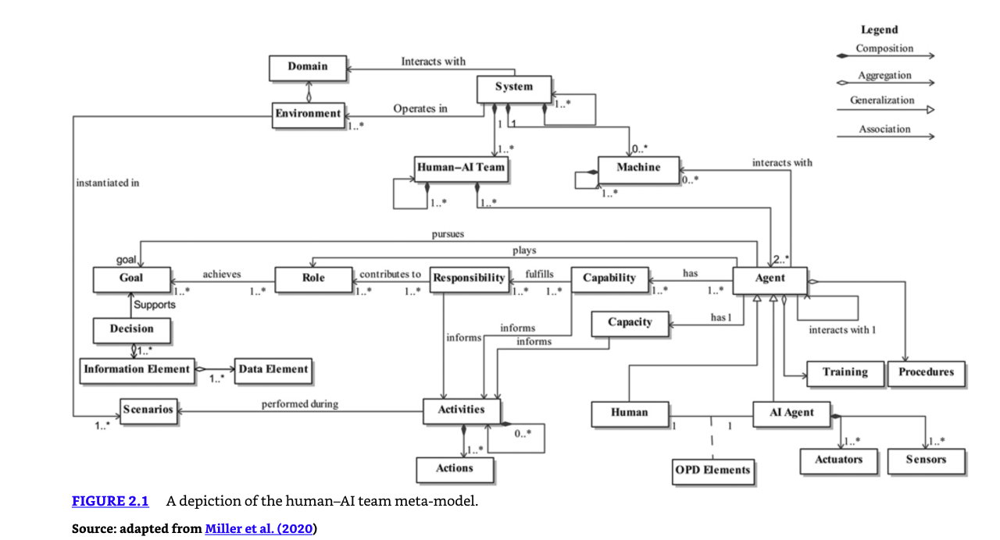

# Olympus Hub - For Everything That Is Ops

Olympus Hub is a operations management platform designed for large and medium enterprises to model, manage, and optimize business operations across any business domain. The platform provides a unified framework where enterprises can define domain-specific workbenches, model business entities, and manage operations through AI-powered agents, regardless of the underlying enterprise systems.

## What is Operations? 

**Operations** are systematic responses to business events and requests that follow a structured pattern of sensing, interpreting, deciding, and acting. In the context of Olympus Hub, operations represent the codified execution of business processes through human-AI collaboration.

### The Operational Pattern

Every operation follows the same fundamental flow defined by our ontology:

1. **Signals** emerge from the business environment (events, requests, exceptions, observations)
2. **Triggers** interpret these signals and activate relevant scenarios
3. **Scenarios** determine which roles are involved and what procedures should be executed
4. **Operations** (procedures, workflows, cases) prescribe the actual work to be done
5. **Agents** (human and AI) collaborate to execute these operations

### Types of Operations

**IT Operations (ITSM):**
- Managing and maintaining IT systems and infrastructure
- Incident response, change management, problem resolution
- Service delivery and support processes

**Business Domain Operations:**
- **HR Operations**: Employee lifecycle management, payroll, benefits administration
- **Finance Operations**: Invoice processing, expense management, financial reporting
- **Customer Operations**: Support ticket resolution, onboarding, account management
- **Sales Operations**: Lead management, opportunity tracking, deal closure
- **Marketing Operations**: Campaign execution, lead nurturing, performance tracking

### What Makes Something "Operational"

An activity becomes operational when it meets **most** of these criteria:
- **Follows repeatable patterns** that can be documented and improved
- **Involves multiple stakeholders** with defined roles and responsibilities
- **Has measurable outcomes** that can be tracked and optimized
- **Requires coordination** between humans and systems
- **Benefits from standardization** and systematic approaches

**Note:** Not all criteria need to be met. For example, a simple approval process might only involve one stakeholder but still be operational if it follows repeatable patterns and has measurable outcomes. The key is that the activity can be systematically modeled and improved using the operational framework.

### Operations vs. Other Work

**Operations** are systematic, repeatable, and improvable through process optimization.

**Not Operations** include:
- Pure creative work where the process is the product
- Completely novel situations requiring improvisation
- Spontaneous human activities and relationships
- Research and discovery without established patterns

The key distinction is that operations can be **systematically modeled, measured, and improved** using the four-layer ontology framework.   

## Why Focus on Operations?

If we can view an Operation domain as a domain of collaboration between people and systems either to operate the systems or to operate a business function through this collaboration, then a vast majority of business activities can be seen as "Operations". The team of people can also be seen as a team of Human Agents and AI Agents.

### The Universal Pattern: Signal → Trigger → Scenario → Operation

Every business activity follows the same fundamental pattern defined in our ontology:

1. **Signals** emerge from the environment (events, exceptions, observations, requests)
2. **Triggers** interpret these signals and activate relevant scenarios
3. **Scenarios** determine which roles are involved and what automations should be invoked
4. **Operations** (procedures, workflows, cases) prescribe the actual work to be done
5. **Agents** (human and AI) collaborate to execute these operations

### The Four Layers of Business Reality

Our ontology reveals that all business activities operate across four interconnected layers:

- **Perception Layer**: What's happening? (Signals, Triggers, Scenarios)
- **Normative Layer**: What ought to be done? (Roles, Goals, SOPs, Responsibilities, Capabilities)
- **Execution Layer**: How is it done? (Operations, Activities, Actions, Agent collaboration)
- **Automation Layer**: How is it codified and scaled? (Automations, Automation Runtimes, Tools)

### Human-AI Collaboration as the New Operating Model

Refer to the following model of a system of Human and AI collaboration:

Each Workbench in Olympus Hub should be seen as such a 'System' of Agents and Machines in an Environment. The Machine in the model above maps to one or more information systems relevant for the specific business domain.

### The Foundation: Systems Thinking

See the [Ontology Reference](./ontology-reference.md) for the complete foundation model.

This requires Systems Thinking. Modeling of effective and optimal collaboration between Systems and People.

**Why Focus on Operations:**

1. **Universal Pattern**: Most business processes follow the same Signal→Trigger→Scenario→Operation flow
2. **Agent Collaboration**: Operational work involves human and AI agents working together with defined roles, capabilities, and responsibilities
3. **Systematic Approach**: Business activities can be systematically modeled, automated, and optimized using the four-layer ontology
4. **Scalable Framework**: The same operational framework applies whether you're managing IT systems, HR processes, financial operations, or customer service
5. **Continuous Improvement**: Operations thinking enables measurement, optimization, and evolution of business processes

Whether you're handling a customer service ticket, processing a loan application, managing inventory, or responding to a security incident, you're following the same operational pattern: sensing what's happening, determining what should be done, executing the work through agent collaboration, and codifying successful patterns for future automation.

## What is Not Operations?

While the operational framework applies broadly, it's important to recognize its boundaries. The following types of work fall outside the scope of "Operations":

### Completely Unknown Scenarios
- **Novel situations** that have never been encountered before
- **Crisis events** that require immediate improvisation without established procedures
- **Breakthrough innovations** that create entirely new categories of work
- **Black swan events** that are unpredictable and unprecedented

### Pure Creative Work
- **Artistic creation** (music, visual arts, literature) where the process is the product
- **Pure research** where the goal is discovery rather than execution
- **Philosophical inquiry** and abstract thinking
- **Personal relationships** and social bonding

### Spontaneous Human Activities
- **Casual conversations** and informal interactions
- **Personal hobbies** and recreational activities
- **Spiritual practices** and religious observances
- **Pure leisure** and entertainment

### The Boundary is Fluid

It's worth noting that the boundary between "Operations" and "Not Operations" is not rigid:

- **Creative work** often becomes operationalized when it becomes a business process (e.g., design systems, content production workflows)
- **Unknown scenarios** can be incorporated into the operational framework once they're understood and patterns emerge
- **Human agency** remains essential even within operational frameworks, as agents exercise judgment, creativity, and adaptation

The operational framework is most valuable for work that involves:
- **Repeatable patterns** that can be improved over time
- **Collaboration** between humans and systems
- **Measurable outcomes** that can be optimized
- **Structured approaches** to achieving goals

---

## Next Steps

Now that you understand the conceptual foundation of "Everything is Ops," explore the detailed documentation:

| Document | What You'll Learn |
|----------|-------------------|
| [Ontology Reference](./ontology-reference.md) | Deep dive into the four-layer ontology with examples |
| [Applicability Guide](./olympus-hub-applicability-guide.md) | Where Olympus Hub delivers value and how to assess readiness |
| [Hub Architecture](../02-system-design/hub-architecture.md) | Detailed system design: Workbenches, Agents, Signals, Operations |

---

*This document provides the conceptual foundation. For detailed system specifications including Workbench design, Signal types, Task Management, and Agent definitions, see the [Hub Architecture](../02-system-design/hub-architecture.md) document.*