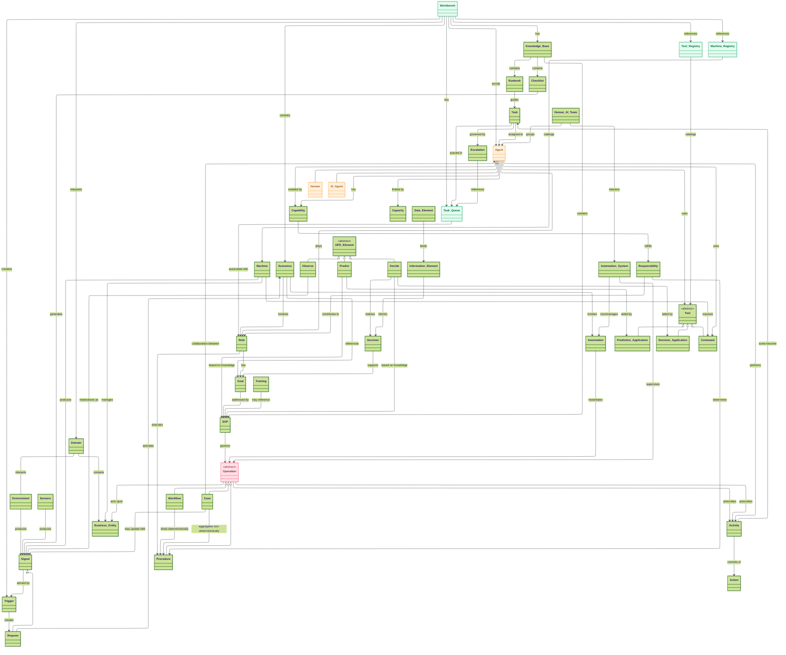
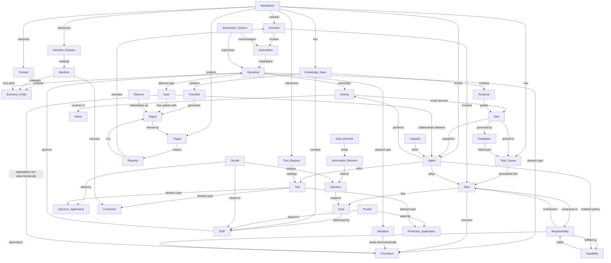

# Ontology: Visual Diagrams

This document contains visual representations of the Human–AI Team Operations ontology.

---

**Navigation:** [← Automation Layer](./ontology-4-automation-layer.md) | [Ontology Reference](./ontology-reference.md)

---

## Table of Contents

- [Mermaid Class Diagram (Layered)](#mermaid-class-diagram-layered)
- [Mermaid Ontology Graph](#mermaid-ontology-graph)

---

## Mermaid Class Diagram (Layered)

This diagram shows the class hierarchy and key relationships between ontology concepts. Colors indicate key entity types:
- 🟢 **Mint**: Infrastructure concepts (Workbench, Queues, Registries)
- 🟠 **Peach**: Agent concepts (Human, AI Agent)
- 🔴 **Rose**: Operation concept

---

## Mermaid Ontology Graph

This diagram shows the relationships between all ontology concepts, organized by layer.

---

## How to Read These Diagrams

### Class Diagram Notation
- **Solid arrows with triangles (`<|--`)**: Inheritance (e.g., `Human` inherits from `Agent`)
- **Solid arrows (`-->`)**: Relationship with label
- **Dashed lines (`--`)**: Association
- **`<<abstract>>`**: Abstract type that must be specialized

### Ontology Graph Notation
- **Arrows with labels**: Directed relationships
- **Comments (`%%`)**: Section headers for clarity

---

**Navigation:** [← Automation Layer](./ontology-4-automation-layer.md) | [Ontology Reference](./ontology-reference.md)

