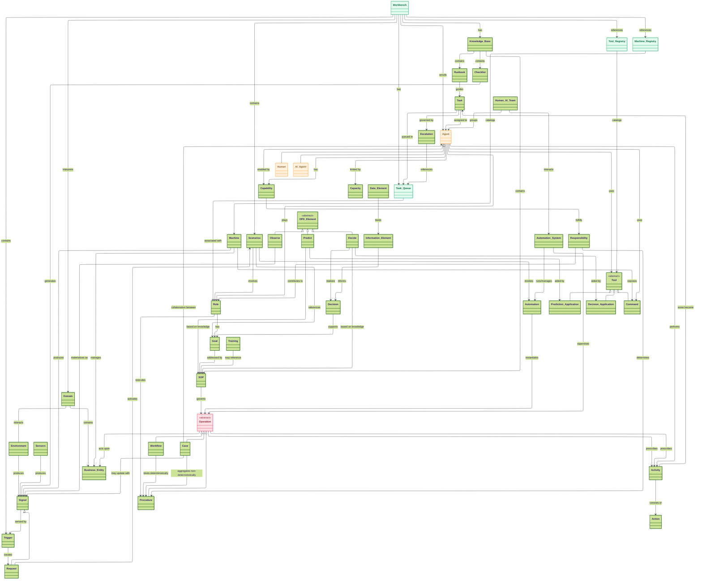
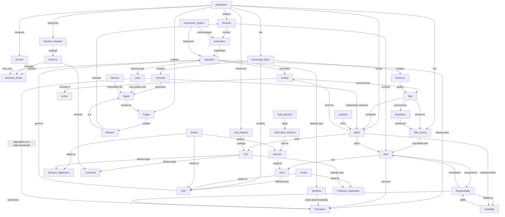

# Ontology of Human–AI Team Operations

This reference explains every concept in the ontology and how they relate.  
Core runtime lifecycle (strict, no shortcuts): **[Signal](#signal) → [Trigger](#trigger) → [Scenario](#scenario) → [Automation](#automation) → [Operation](#operation-abstract) → [Activity](#activity) → [Action](#action)**.

- See also: the **[Class Diagram (layered)](#appendix-mermaid-class-diagram-layered)** and **[Ontology Graph](#appendix-mermaid-ontology-graph)** at the end.

---

## Table of Contents

- [Reading Guide by Role](#reading-guide-by-role)  
  - [Guide 1: Executive & Business Stakeholders](#guide-1-executive--business-stakeholders)  
  - [Guide 2: Operations Engineers & System Operators](#guide-2-operations-engineers--system-operators)  
  - [Guide 3: Architects & Developers](#guide-3-architects--developers)  
- [Introduction](#introduction)  

- [1. Perception Layer](#1-perception-layer)  
  - [Domain](#domain)  
  - [Workbench](#workbench)  
  - [Business Entity](#business-entity)  
  - [Environment](#environment)  
  - [Machine](#machine)  
  - [Sensors](#sensors)  
  - [Signal](#signal)  
  - [Request](#request)  
  - [Trigger](#trigger)  
  - [Scenario](#scenario)  
  - [OPD Elements](#opd-elements-observe-predict-decide)  
- [2. Normative Layer](#2-normative-layer)  
  - [Role](#role)  
  - [Goal](#goal)  
  - [SOP (Standard Operating Procedure)](#sop-standard-operating-procedure)  
  - [Responsibility](#responsibility)  
  - [Capability](#capability)  
  - [Capacity](#capacity)  
  - [Decision](#decision)  
  - [Information Element](#information-element)  
  - [Data Element](#data-element)  
  - [Knowledge Base (KB)](#knowledge-base-kb)  
  - [Runbook](#runbook)  
  - [Checklist](#checklist)  
- [3. Execution Layer](#3-execution-layer)  
  - [Operation (abstract)](#operation-abstract)  
  - [Procedure](#procedure)  
  - [Workflow](#workflow)  
  - [Case](#case)  
  - [Activity](#activity)  
  - [Task](#task)  
  - [Escalation](#escalation)  
  - [Task Queue](#task-queue)  
  - [Action](#action)  
  - [Agent](#agent)  
  - [Human](#human)  
  - [AI Agent](#ai-agent)  
  - [Human–AI Team](#humanai-team)  
  - [Training](#training)  
- [4. Automation Layer](#4-automation-layer)  
  - [Automation](#automation)  
  - [Automation Runtime](#automation-system)  
  - [Tool (abstract)](#tool-abstract)  
  - [Prediction Application](#prediction-application)  
  - [Decision Application](#decision-application)  
  - [Command / Actuator](#command--actuator)  
  - [Tool Registry](#tool-registry)  
  - [Machine Registry](#machine-registry)  
- [Appendix: Mermaid Diagrams](#appendix-mermaid-diagrams)  
  - [Mermaid Class Diagram (layered)](#appendix-mermaid-class-diagram-layered)  
  - [Mermaid Ontology Graph](#appendix-mermaid-ontology-graph)

---

## Reading Guide by Role

This ontology serves as the **ubiquitous language** for Olympus Hub. Different stakeholders need different levels of detail. Use this guide to navigate the document based on your role.

### Guide 1: Executive & Business Stakeholders

**For:** Operations Executives, Product Managers, Compliance Officers, Audit Teams, Business Analysts

**Your goal:** Understand what concepts mean and how they relate, without implementation details.

**Start here:** Read the [Introduction](#introduction) and the layer summaries ([Perception](#perception-layer--whats-happening), [Normative](#normative-layer--what-ought-to-be-done), [Execution](#execution-layer--how-is-it-done), [Automation](#automation-layer--how-is-it-codified-and-scaled)).

**Key sections for you:**
| Focus Area | Relevant Concepts |
|------------|-------------------|
| **Understanding Operations** | [Domain](#domain), [Workbench](#workbench), [Scenario](#scenario), [Operation](#operation-abstract) |
| **Compliance & Governance** | [SOP](#sop-standard-operating-procedure), [Knowledge Base](#knowledge-base-kb), [Checklist](#checklist), [Escalation](#escalation) |
| **Workforce & AI** | [Agent](#agent), [Human](#human), [AI Agent](#ai-agent), [Role](#role), [Responsibility](#responsibility) |
| **Customer Interaction** | [Request](#request) (especially Service Requests), [Task](#task) |

<details>
<summary><strong>📖 Quick Reference Glossary (click to expand)</strong></summary>

#### Core Flow (How Work Happens)

| Term | Plain Language | Banking Example |
|------|----------------|-----------------|
| **Signal** | Something happened that the system noticed | A $50,000 wire transfer was initiated |
| **Trigger** | A rule that decides what to do with what happened | "If wire > $10K to new beneficiary, create review request" |
| **Request** | A formal ask for something to be done | "Review this wire transfer for AML compliance" |
| **Scenario** | The situation we're responding to | "Large wire to new international beneficiary" |
| **Operation** | The work being done to handle the situation | The AML review investigation |
| **Activity** | A step in the work | "Verify beneficiary identity" |
| **Task** | A step assigned to a person or AI | "Analyst: Review transaction history" |
| **Action** | A specific thing done to complete a task | Click "Approve" in the system |

#### People and Systems

| Term | Plain Language | Banking Example |
|------|----------------|-----------------|
| **Agent** | Anyone (human or AI) who does work | A fraud analyst or a chatbot |
| **Human** | A person doing operational work | Dispute analyst, branch teller |
| **AI Agent** | Software that does operational work | Fraud scoring model, document classifier |
| **Role** | A job function with defined duties | "Senior Fraud Analyst" |
| **Capability** | What someone can do (skills) | "Trained in AML regulations" |
| **Capacity** | How much someone can handle | "Can process 25 cases per day" |

#### Rules and Knowledge

| Term | Plain Language | Banking Example |
|------|----------------|-----------------|
| **SOP** | The official way to handle a situation | "Dispute Resolution Procedure" |
| **Knowledge Base** | Where all the guidance documents live | Policy repository, procedure manuals |
| **Runbook** | Step-by-step guide for a specific task | "How to verify a customer's identity" |
| **Checklist** | Regular reviews that must be done | "Daily cash position review" |
| **Goal** | What we're trying to achieve | "Resolve disputes within 10 days" |
| **Responsibility** | What someone is accountable for | "Ensure AML compliance" |

#### Work Organization

| Term | Plain Language | Banking Example |
|------|----------------|-----------------|
| **Domain** | A business area we're managing | Dispute resolution, fraud prevention |
| **Workbench** | Everything needed to run a business area | The Dispute Workbench with all its tools |
| **Business Entity** | The things we're managing | Accounts, transactions, customers |
| **Task Queue** | Where tasks wait to be picked up | "Fraud Analyst Queue" |
| **Escalation** | Moving unfinished work to someone senior | Not resolved in 4 hours → Senior Analyst |

#### Types of Work

| Term | Plain Language | When to Use |
|------|----------------|-------------|
| **Procedure** | A defined sequence of steps | Routine, repeatable work |
| **Workflow** | Multiple people's procedures connected | Work passing between roles |
| **Case** | Flexible investigation that evolves | Complex, unpredictable work |

#### Request Types

| Type | Who Starts It | Banking Example |
|------|---------------|-----------------|
| **Service Request** | Customer (or agent for customer) | Dispute filing, account closure |
| **Business Request** | Internal staff | Reconciliation adjustment |
| **System Request** | An application | Failed batch, system error |

</details>

---

### Guide 2: Operations Engineers & System Operators

**For:** Operations Engineers, Workbench Designers, Process Analysts, Operations Team Leads

**Your goal:** Understand how to configure and operate workbenches, define scenarios, and manage day-to-day operations.

**Start here:** Read Guide 1's glossary first if any terms are unfamiliar, then focus on these sections.

**Key sections for you:**
| Focus Area | Relevant Concepts |
|------------|-------------------|
| **Workbench Design** | [Workbench](#workbench), [Domain](#domain), [Scenario](#scenario), [Trigger](#trigger) |
| **Request & Signal Flow** | [Signal](#signal), [Request](#request), [Trigger](#trigger), I/O Gateway Signal Types |
| **Work Execution** | [Operation](#operation-abstract), [Procedure](#procedure), [Workflow](#workflow), [Case](#case) |
| **Task Management** | [Task](#task), [Task Queue](#task-queue), [Escalation](#escalation), [Activity](#activity) |
| **Agent Configuration** | [Agent](#agent), [Role](#role), [Capability](#capability), [Capacity](#capacity), [Training](#training) |
| **Knowledge Management** | [SOP](#sop-standard-operating-procedure), [Knowledge Base](#knowledge-base-kb), [Runbook](#runbook), [Checklist](#checklist) |
| **Tool & Machine Access** | [Tool Registry](#tool-registry), [Machine Registry](#machine-registry), [Command / Actuator](#command--actuator) |

**Diagrams to study:**
- [Mermaid Ontology Graph](#appendix-mermaid-ontology-graph) — shows relationships
- [Mermaid Class Diagram](#appendix-mermaid-class-diagram-layered) — shows inheritance and structure

---

### Guide 3: Architects & Developers

**For:** Solution Architects, Platform Engineers, Backend Developers, Integration Engineers

**Your goal:** Understand the complete conceptual model, relationships, and how to implement systems that conform to this ontology.

**Start here:** Read the full [Introduction](#introduction), then work through each layer systematically.

**Key sections for you:**
| Focus Area | Relevant Concepts |
|------------|-------------------|
| **System Integration** | [Machine](#machine), [Sensors](#sensors), [Environment](#environment), [Signal](#signal) |
| **I/O Architecture** | [Trigger](#trigger), I/O Gateway Signal Types, [Request](#request) types |
| **Automation Design** | [Automation](#automation), [Automation Runtime](#automation-system), [Operation](#operation-abstract) |
| **Agent Framework** | [Agent](#agent), [Human](#human), [AI Agent](#ai-agent), [Human–AI Team](#humanai-team) |
| **Tool Development** | [Tool](#tool-abstract), [Prediction Application](#prediction-application), [Decision Application](#decision-application), [Command / Actuator](#command--actuator) |
| **Registry Design** | [Tool Registry](#tool-registry), [Machine Registry](#machine-registry), [Workbench](#workbench) |
| **Data Model** | [Business Entity](#business-entity), [Data Element](#data-element), [Information Element](#information-element) |

**Diagrams to implement against:**
- [Mermaid Class Diagram (layered)](#appendix-mermaid-class-diagram-layered) — reference data model
- [Mermaid Ontology Graph](#appendix-mermaid-ontology-graph) — relationship constraints

**Implementation notes:**
- All concepts with "abstract" in parentheses require specialization
- Relationships marked with arrows indicate runtime dependencies
- Workbench is the primary tenant isolation boundary

---

## Introduction

The ontology of Human–AI Team Operations is organized into **four layers**.  
Each layer represents a distinct way of knowing and acting in the system, from raw perception of the world to codified automations that can be executed at scale.  
This layered approach makes it easier to understand *what is happening*, *what ought to be done*, *how it is actually done*, and *how it is codified in systems*.  

---

## Perception Layer — *“What’s happening?”*

The Perception Layer is concerned with **observing and interpreting reality**.  
It captures how the **environment** and its components — machines, sensors, data feeds — generate **signals**. These signals are then interpreted by **triggers** into meaningful **scenarios** that Human–AI teams must respond to.  

It is descriptive, not prescriptive: this layer does not say what should be done, only what *is happening*. It is the sensory nervous system of the ontology.  

**Example (aviation):**  
- A temperature sensor detects an engine overheating and emits a signal.  
- A trigger interprets that signal and activates the scenario “Engine Overheating.”  

**Example (banking):**  
- Login logs show 5 failed attempts in 2 minutes.  
- A trigger interprets this signal and activates the scenario “Suspicious Login Attempt.”  

---

## Normative Layer — *“What ought to be done?”*

The Normative Layer defines the **standards, rules, and goals** that shape expected behavior in a given scenario. It is *normative* because it encodes what ought to be done, not just what can be done.  

Here we find **roles** (who is responsible), **goals** (what outcomes they must achieve), **responsibilities** (duties), **capabilities and capacities** (what they can do and how much), and **SOPs** (codified best practices). This layer also covers **decisions**, where agents — human or AI — choose a course of action, often aided by information, data, and decision-support tools.  

It is the legal and procedural backbone: the framework of obligations and standards against which execution is measured.  

**Example (aviation):**  
- Role: Pilot.  
- Goal: Maintain aircraft safety.  
- SOP: Follow the engine flameout checklist.  
- Decision: Continue to destination or divert for emergency landing.  

**Example (banking):**  
- Role: Security Analyst.  
- Goal: Prevent account takeover.  
- SOP: Lock account after 3 failed attempts, notify the user.  
- Decision: Escalate incident to fraud response team.  

---

## Execution Layer — *“How is it done?”*

The Execution Layer is where **work actually happens**.  
Here, normative rules and goals are operationalized into **operations**:  
- **Procedures** (deterministic steps for a role),  
- **Workflows** (deterministic binding of procedures across multiple roles), and  
- **Cases** (non-deterministic, evolving collaborations across roles).  

These operations prescribe **activities**, which in turn consist of atomic **actions** performed by **agents** — humans or AI — often collaborating as a **Human–AI Team**. Training also lives here, ensuring agents have the skills needed to bridge their capabilities to specific role requirements.  

It is the execution muscle: the actual practice of duties under real conditions.  

**Example (aviation):**  
- Procedure: Pilot executes the flameout checklist.  
- Workflow: Pilot, Co-pilot, and Air Traffic Controller coordinate in a defined sequence.  
- Case: An evolving emergency response as new signals (engine fire, loss of altitude) come in.  

**Example (banking):**  
- Procedure: Security analyst checks logs, verifies user, resets password.  
- Workflow: Analyst investigates → IT resets account → Customer notified.  
- Case: Fraud investigation evolves as new suspicious transactions are reported.  

---

## Automation Layer — *“How is it codified and scaled?”*

The Automation Layer represents the **codified definitions** of operations, and the systems that run them.  
Here, **automations** are the software representations of procedures, workflows, or cases. These definitions live inside an **automation system**, which is a software orchestration platform responsible for instantiating and supervising live operations.  

This layer ensures consistency, scalability, and enforceability. It allows complex human–AI operations to be reliably repeated, monitored, and adapted by software systems.  

**Example (aviation):**  
- A case management automation codifies how incident reports flow between pilots, controllers, and maintenance teams.  
- The automation system (a case management platform) instantiates a new case when a trigger fires.  

**Example (banking):**  
- A BPMN workflow automation codifies suspicious login handling: lock account, notify user, reset password.  
- The automation system (e.g., Camunda, Temporal) automatically instantiates and supervises this workflow when the suspicious login scenario is triggered.  

---

## Layering Summary

The four layers connect in sequence:  

1. **Perception**: Detect what is happening.  
2. **Normative**: Define what ought to be done.  
3. **Execution**: Carry out what must be done.  
4. **Automation**: Codify and scale how it is done.  

Together they form a complete loop: from sensing reality, through norms and duties, into action, and finally into codified systems that sustain operations at scale.

## 1. Perception Layer

### Domain
**Definition:** Conceptual scope of business operations (e.g., dispute resolution, reconciliation, KYC, fraud detection).  
**Role:** Frames typical [Scenarios](#scenario) and [Goals](#goal); contains [Business Entities](#business-entity).  
**Relationships:** Interacts with the [Environment](#environment); contains [Business Entities](#business-entity); **interpreted through a [Workbench](#workbench)**.

**Important:** Domain is a conceptual/notional construct—it is never directly modeled or instantiated in the framework. A Domain is **interpreted through a Workbench**, which is the operational realization of that domain.

**Example:** The "Dispute Resolution" domain is interpreted through a "Dispute Workbench" that defines how disputes are handled.

**See also:** [Workbench](#workbench), [Business Entity](#business-entity), [Environment](#environment), [Scenario](#scenario)

---

### Workbench
**Definition:** A logical unit encapsulating everything required to operate a business [Domain](#domain).  
**Role:** The operational realization of a Domain; the container for all domain-specific configuration, definitions, and runtime entities.  

**Relationships:**
- **Interprets** a [Domain](#domain) (1:1 notional mapping)
- **Contains** [Scenarios](#scenario) (one Workbench can have many Scenarios)
- **Contains** [Triggers](#trigger), [Signals](#signal), [Requests](#request), [Operations](#operation-abstract)
- **References** [Business Entities](#business-entity) relevant to the domain
- **References** [Environment](#environment) (Machines, Sensors in scope)
- **Has** [Tool Registry](#tool-registry) (whitelisted Tools)
- **Has** [Machine Registry](#machine-registry) (accessible Machines)
- **Has** [Task Queues](#task-queue) (for work distribution)
- **Has** enrolled [Agents](#agent) (Human and AI)
- **Has** [Knowledge Base](#knowledge-base-kb) (SOPs, policies, Runbooks)

**Workbench Contents:**

| Category | What It Contains |
|----------|------------------|
| **Domain Model** | Business Entities, lifecycle states, validation rules |
| **Environment** | Machines, Sensors in scope for this Workbench |
| **Scenarios** | Operational requirements (why, when, how) |
| **Triggers** | Signal → Request bindings |
| **Request Definitions** | Domain-specific Request types |
| **Tool Registry** | Whitelisted Tools (from System/Tenant registry) |
| **Machine Registry** | Accessible Machines (from System/Tenant registry) |
| **Task Queues** | Queues for work distribution by Role/Group |
| **Agents** | Enrolled Human and AI agents |
| **Knowledge Base** | SOPs, policies, Runbooks, Checklists |

**Workbench Lifecycle:**

| Stage | Description |
|-------|-------------|
| **Define** | Tenant creates Workbench definition (from Blueprint or empty) |
| **Configure** | Tenant configures Triggers, Scenarios, Task Queues, etc. |
| **Enroll** | Agents are enrolled to operate in this Workbench |
| **Operate** | Operations run within this Workbench |
| **Evolve** | Tenant continuously evolves the Workbench definition |

**Scoping:**
All of the following are **always scoped to exactly one Workbench**:
- Signals
- Triggers  
- Requests
- Scenarios
- Operations

**Workbench Blueprints:**
A Workbench can be created:
- **From a Blueprint**: System-level template that provides pre-configured patterns
- **From empty**: Start with no pre-configuration

```
Workbench Blueprint (System-level)
  └── instantiated as → Workbench Definition (Tenant-level)
       └── customized with tenant-specific config
```

**Example:** "Dispute Workbench" encapsulates everything for handling disputes—scenarios for fraud disputes, billing disputes, ATM disputes; enrolled analysts; registered investigation tools; task queues for dispute analysts.

**See also:** [Domain](#domain), [Scenario](#scenario), [Tool Registry](#tool-registry), [Machine Registry](#machine-registry), [Task Queue](#task-queue)

---

### Business Entity
**Definition:** A fundamental object within a [Domain](#domain) that represents a real-world concept of business significance. Business Entities are **what [Operations](#operation-abstract) act upon**.  
**Role:** The subject matter of operations; entities have state, lifecycle, and relationships that operations manage.  
**Relationships:**  
- Exist within a [Domain](#domain)  
- Managed by [Machines](#machine) (applications/systems)  
- Acted upon by [Operations](#operation-abstract)  
- Referenced in [Signals](#signal) (entity state changes trigger signals)  
- Subject to business rules and validation  

**Characteristics:**

| Aspect | Description |
|--------|-------------|
| **Identity** | Unique identifier within the domain |
| **State** | Current values of properties; may have lifecycle states (draft → active → closed) |
| **Lifecycle** | Creation, updates, state transitions, archival |
| **Relationships** | Links to other Business Entities (Customer → Orders → Payments) |

**Examples by Domain:**

| Domain | Business Entities |
|--------|-------------------|
| **E-commerce** | Customer, Order, Product, Payment, Shipment |
| **Banking** | Account, Transaction, Customer, Card, Loan |
| **HR** | Employee, Position, Department, Leave Request |
| **IT Operations** | Incident, Change Request, Configuration Item, Service |

**See also:** [Domain](#domain), [Machine](#machine), [Operation](#operation-abstract), [Signal](#signal)

---

### Environment
**Definition:** The *real* operational setting of an enterprise, including:
- Endpoints (HTTP/TCP) where systems are deployed.
- Access mechanisms (tokens, secrets).
- Event buses/topics to publish/subscribe.
- File drops / object stores for batch I/O.

**Role:** Hosts real I/O and produces [Signals](#signal).  
**Relationships:** Produces [Signals](#signal); contains [Machines](#machine) and [Sensors](#sensors); interacts with the [Automation Runtime](#automation-system).  
**Example:** Kafka topics for transactions, OAuth-secured APIs, S3 buckets for statement files.

**See also:** [Signal](#signal), [Automation Runtime](#automation-system)

---

### Machine
**Definition:** Deployed compute systems (apps, services, devices) within the [Environment](#environment). 

When the domain is about a functional business like Order Management, Invntory Management, then machines are the software applications that an entrprise uses to manage these functions. These are usually the Line-of-Business systems or the Core Systems (as in Banking). The signals of interest from these appliations relate to changes in the functional domain.

When the domain is about technical operations of a systems, then the Machine is the system being managed. The Sensors and signals of relevance differ between the functional and technical operations, while the machine in reference may still be the same.

**Role:** Emit or transform [Signals](#signal). Expose [Commands](#command--actuator) that can be invoked by [Agents](#agent).  
**Relationships:** May host [Sensors](#sensors); produces [Signals](#signal); exposes [Commands](#command--actuator).  
**Example:** A payment switch microservice emitting authorization events and exposing commands like `authorizeTransaction`, `reversePayment`.

**See also:** [Sensors](#sensors), [Signal](#signal), [Command / Actuator](#command--actuator)

---

### Sensors
**Definition:** Any mechanism that monitors the operational environment and reports what it observes. Sensors detect changes, anomalies, or events and convert them into [Signals](#signal).  
**Role:** Materialize "Observe" in OPD—the eyes and ears of the operational system.  
**Relationships:** Produce [Signals](#signal); may be embedded in [Machines](#machine) or deployed independently.

**Types of Sensors:**

| Category | Description | Banking Examples |
|----------|-------------|------------------|
| **Transaction Monitors** | Watch financial flows in real-time | Payment velocity monitors, Large transaction alerts |
| **Behavioral Analytics** | Detect unusual patterns | Login anomaly detection, Spending pattern analysis |
| **Compliance Monitors** | Ensure regulatory adherence | AML transaction screening, OFAC watchlist matching |
| **System Health** | Monitor technical infrastructure | Core banking uptime, API latency monitors |
| **Document Sensors** | Detect document arrivals/changes | Statement file arrival, KYC document upload |

**Examples (Banking):**
- **Fraud Tap:** Monitors card transactions and emits signals when spending patterns deviate from customer norms
- **AML Scanner:** Watches wire transfers and emits signals when beneficiary matches watchlist entries
- **Reconciliation Monitor:** Detects when account balances don't match between systems

**Examples (Technical):**
- **CPU/Memory Probe:** Publishes resource utilization metrics
- **Log Aggregator:** Detects error patterns in application logs

**See also:** [Signal](#signal), [OPD Elements](#opd-elements-observe-predict-decide), [Machine](#machine)

---

### Signal
**Definition:** Atomic observation/event (telemetry, log, message, file arrival).  
**Role:** Starts the runtime flow; sensed by I/O Gateways in the [Environment](#environment).  
**Relationships:** Produced by [Environment](#environment)/[Machine](#machine)/[Sensors](#sensors); fed into a [Trigger](#trigger).  

**Core Signal Types:**

| Type | Description | Example |
|------|-------------|---------|
| **Event** | State change published by [Machines](#machine) | Order placed, Payment completed |
| **Observation** | Information of interest, not yet a problem | High transaction volume, Unusual pattern |
| **Exception** | Error or failure requiring attention | Transaction failed, API timeout |
| **Request** | Explicit ask for operational attention | Password reset, Dispute filing (see [Request](#request)) |

#### I/O Gateway Signal Types

Each I/O Gateway senses signals from specific protocols. These signal types are **extensible**—new I/O Gateways may introduce new signal types as the platform grows.

| I/O Gateway | Signal Type | Protocol Origin | Description |
|-------------|-------------|-----------------|-------------|
| **Atropos** | Event | Pub-Sub Event Bus | State changes from [Machines](#machine); Topics, Subscriptions |
| **Cronus** | Exception | Publisher API | Business-level errors requiring operational attention |
| **Cronus** | Observation | Publisher API | Business-level information of interest |
| **Heracles** | HTTP-Request | HTTP/REST/MCP | API calls from users, applications, or agents |
| **Dia** | Batch-Request | SFTP/HTTP/WebDAV | File arrivals containing batch data |
| **Kale** | Time-Signal | Scheduler | Scheduled triggers at defined intervals |

**Extensibility:** As new I/O Gateways are added (e.g., for new protocols like GraphQL, gRPC, WebSocket), new signal types can be introduced. The core ontology (Signal → Trigger → Request → Scenario → Operation) remains stable.

**Note:** All signals (except Request) flow through [Triggers](#trigger) which transform them into [Requests](#request). Requests have special behavior—see below.

**See also:** [Request](#request), [Trigger](#trigger), [Observe](#opd-elements-observe-predict-decide)

---

### Request
**Definition:** A [Signal](#signal) that explicitly asks for operational attention, always activating a [Scenario](#scenario) via an implicit [Trigger](#trigger).  
**Role:** The standardized input to [Operations](#operation-abstract); [Triggers](#trigger) bind protocol-specific signals to Requests, making Operations channel-agnostic.  

**Request Types (Framework-Level Classification):**

The framework classifies Requests into three types based on **who initiates** them and **how participants are authorized**. This classification affects agent enablement, authorization models, and task assignment patterns.

| Type | Initiated By | Subject Association | Authorization Model |
|------|--------------|---------------------|---------------------|
| **Service Request** | Customers (self-service) or Agents on behalf of customers (assisted) | **Required** — always identifies a customer as subject | Identity-based (self-service) or Role-based (assisted); subject may receive [Tasks](#task) |
| **Business Request** | Internal operations teams | **Optional** — no enforcement | Role and group-based |
| **System Request** | [Machines](#machine), Applications | **Optional** — no enforcement | Machine identity (credentials, keys, certs) |

#### Service Requests
A Service Request always has a **subject** identified as a customer of the business. The request can be initiated in two ways:
- **Self-service**: The customer initiates directly (portals, mobile apps, IVR)
- **Assisted**: An [Agent](#agent) initiates on behalf of the customer (contact center, branch)

**Key Characteristics:**
- Always associated with an identified **subject** (the customer)
- **Initiation authorization**:
  - Self-service: Identity-based (the customer themselves)
  - Assisted: Role-based (contact center agent, branch staff acting on behalf of customer)
- [Tasks](#task) within the [Operation](#operation-abstract) can be assigned to:
  - The subject (customer) themselves—enabled as a special participant type
  - [Agents](#agent) of the business/organization—based on roles or identity
- Framework treats customer participants as a **special agent type**—they must be enabled differently
- Channels: Self-service portals, mobile apps, contact center, IVR, branch

**Example (Self-service):** A customer (subject) files a "Dispute Filing Request" via mobile app. During investigation:
- The customer is assigned a Task to upload supporting documents
- A Dispute Analyst (agent) is assigned a Task to review transaction history

**Example (Assisted):** A contact center agent files a "Dispute Filing Request" on behalf of a customer who called in. The customer remains the subject, but the agent initiated the request.

#### Business Requests
Initiated by **internal users** of the Hub tenant's organization—operations teams, back-office staff, managers.

**Key Characteristics:**
- Does **not** enforce association with an external subject (customer), though optional
- Authorization modeled by [Roles](#role) and groups rather than just named individuals
- Participants are enrolled [Agents](#agent) (Human or AI) within the organization
- Typical internal operations workflow

**Example:** A reconciliation analyst initiates a "Manual Adjustment Request" to correct a settlement discrepancy. No customer subject is required, though the request may optionally reference affected accounts.

#### System Requests
Initiated by **applications or [Machines](#machine)** for integration purposes or to escalate issues that cannot be auto-resolved.

**Key Characteristics:**
- Does **not** enforce association with an external subject (customer), though optional
- For application integration use cases (API-driven operations)
- For resolution of issues that systems cannot handle autonomously
- Authorization via machine identity mechanisms (application credentials, API keys, certificates, etc.)

**Examples:**
- A distributed system detects a version conflict and creates a "Version Conflict Resolution Request"
- A payment gateway encounters an unknown upstream error in a critical decision and escalates via "Upstream Error Investigation Request"
- A batch processor creates a "Failed Record Review Request" for records that failed validation

---

**Key Characteristics (All Request Types):**
- **Implicit Trigger**: Requests always activate their target [Scenario](#scenario)—no explicit Trigger definition needed for Request→Scenario binding
- **Channel Agnostic**: A Request looks the same to [Operations](#operation-abstract) regardless of origin channel
- **Bound by Triggers**: [Triggers](#trigger) transform Events, Observations, Exceptions, and protocol messages into Requests

**Relationships:**  
- Is a type of [Signal](#signal)  
- Created by [Triggers](#trigger) from other Signals or protocol messages  
- Activates [Scenarios](#scenario) (implicit trigger behavior)  
- Acted upon by [Operations](#operation-abstract)  
- References [Business Entities](#business-entity)  
- May assign [Tasks](#task) to requestors (especially Service Requests)

**Domain-Specific Request Types:**  
Beyond this framework classification, each [Workbench](#workbench) defines its own **domain-specific request types** that are idiomatic to that domain (e.g., "Dispute Filing Request," "Clearance Exception Request," "Account Closure Request"). These are configured in the Workbench definition.

**See also:** [Signal](#signal), [Trigger](#trigger), [Scenario](#scenario), [Operation](#operation-abstract), [Task](#task)

---

### Trigger
**Definition:** A binder that transforms [Signals](#signal) and protocol messages into [Requests](#request), making [Operations](#operation-abstract) channel-agnostic.  
**Role:** The critical binding mechanism between I/O and Operations; executed by I/O Gateways ([Machines](#machine) in the [Environment](#environment)).  

**Trigger Responsibilities:**

| Responsibility | Description |
|----------------|-------------|
| **Filter** | Determine which incoming [Signals](#signal) should proceed |
| **Transform** | Convert protocol-specific format to/from [Request](#request)/Response |
| **Access** | Enforce authorization rules at I/O boundary |
| **Bind** | Map protocol message → [Request](#request) (input) and Response → protocol message (output) |

**Relationships:**  
- Receives [Signals](#signal) (Events, Observations, Exceptions) and protocol messages  
- Creates [Requests](#request) in standardized format  
- Defined in operational configurations (e.g., Workbench definitions)  
- Executed by I/O Gateways ([Machines](#machine))  

**Example:** On "5 failed logins" (Event), create "Suspicious Login Investigation" (Request).

**See also:** [Signal](#signal), [Request](#request), [Scenario](#scenario)

---

### Scenario
**Definition:** A situational context activated by a [Trigger](#trigger).  
**Role:** Determines which [Roles](#role) are involved and which [Automations](#automation) should be invoked.  
**Relationships:** Activated by [Trigger](#trigger); involves [Roles](#role); references their [Goals](#goal); invokes an [Automation](#automation).  
**Example:** “Unauthorized device login” involving Security Analyst, SRE, and an AI monitor.

**See also:** [Automation](#automation), [Role](#role)

---

### OPD Elements (Observe, Predict, Decide)

The OPD cycle is the fundamental cognitive loop that drives operational decision-making. Every operational response—whether by humans or AI—follows this pattern.

**Observe:** The act of sensing and capturing what is happening in the operational environment. Observations become [Signals](#signal) that can trigger operational responses.  
- **Banking Example:** Monitoring real-time transactions and detecting a $50,000 wire transfer to a new beneficiary in a high-risk country.

**Predict:** Using knowledge ([SOPs](#sop-standard-operating-procedure)) and analytical tools ([Prediction Applications](#prediction-application)) to anticipate outcomes, assess risk, or forecast what might happen next.  
- **Banking Example:** A fraud scoring model predicts 87% probability this transaction is fraudulent based on pattern analysis.

**Decide:** The act of choosing a course of action, performed by an [Agent](#agent), often aided by decision-support [Tools](#decision-application). Decisions produce a [Decision](#decision) outcome that drives subsequent [Actions](#action).  
- **Banking Example:** The fraud analyst decides to hold the transaction for manual review rather than auto-approve or auto-decline.

**The OPD Cycle in Practice:**

```
OBSERVE                    PREDICT                     DECIDE
   │                          │                           │
   ▼                          ▼                           ▼
What happened?          What might happen?         What should we do?
   │                          │                           │
   ▼                          ▼                           ▼
[Signals]              [Prediction Apps]          [Decision Apps]
                       [SOPs/Knowledge]           [Agent Judgment]
```

**See also:** [Decision](#decision), [Tool](#tool-abstract), [SOP](#sop-standard-operating-procedure)

---

## 2. Normative Layer

### Role
**Definition:** A functional responsibility played by an [Agent](#agent) in a [Scenario](#scenario).  
**Role:** Specifies duties and what Procedures are executed.  
**Relationships:** Has [Goals](#goal); executes [Procedures](#procedure); is played by [Agents](#agent); composed of [Responsibilities](#responsibility).  
**Example:** "Security Analyst," "Controller," "Reviewer."

**See also:** [Goal](#goal), [Procedure](#procedure), [Agent](#agent), [Responsibility](#responsibility)

---

### Goal
**Definition:** Desired outcomes associated with a [Role](#role); **defined per role**, not per scenario.  
**Role:** Drive [SOP](#sop-standard-operating-procedure) design and [Operation](#operation-abstract) selection.  
**Relationships:** Addressed by [SOPs](#sop-standard-operating-procedure); referenced by [Scenarios](#scenario); supported by [Decisions](#decision).  
**Example:** “Maintain safe separation of aircraft,” “Protect user accounts from takeover.”

**See also:** [SOP](#sop-standard-operating-procedure), [Scenario](#scenario)

---

### SOP (Standard Operating Procedure)
**Definition:** Codified guidance to meet [Goals](#goal).  
**Role:** **Governs** [Operations](#operation-abstract) (Procedures, Workflows, Cases); provides knowledge for OPD Predict/Decide.  
**Relationships:** Address [Goals](#goal); govern [Operations](#operation-abstract).  
**Example:** "Lock account after 3 failed attempts; notify user; require step-up auth."

**See also:** [Operation](#operation-abstract), [Procedure](#procedure), [Workflow](#workflow), [Case](#case), [Decision](#decision)

---

### Responsibility
**Definition:** A specific accountability or duty assigned to a [Role](#role). Responsibilities define **what** a role is expected to accomplish, without specifying **how** to accomplish it.  
**Role:** Articulates the "what" a role is accountable for; provides the basis for performance measurement and compliance.  
**Relationships:** Contributes to [Role](#role); fulfilled by [Capabilities](#capability); determines [Procedures](#procedure).

**Responsibility vs. Procedure:**
- **Responsibility** = What you must achieve (outcome-focused)
- **Procedure** = How you achieve it (process-focused)

**Banking Examples by Role:**

| Role | Responsibilities |
|------|------------------|
| **Dispute Analyst** | Investigate disputed transactions within SLA; Determine liability accurately; Document findings completely |
| **Credit Underwriter** | Assess creditworthiness objectively; Ensure regulatory compliance; Approve within delegated authority |
| **AML Analyst** | Review suspicious activity alerts; File SARs when required; Maintain investigation documentation |
| **Branch Manager** | Ensure branch operational compliance; Resolve escalated customer issues; Manage staff performance |

**Compliance Perspective:**
Responsibilities are often derived from:
- Regulatory requirements (e.g., "Report suspicious transactions within 30 days")
- Internal policies (e.g., "Respond to customer complaints within 48 hours")
- Service level agreements (e.g., "Process wire transfers within 2 hours")

**See also:** [Role](#role), [Capability](#capability), [Procedure](#procedure)

---

### Capability
**Definition:** The skills, knowledge, certifications, or functional abilities an [Agent](#agent) possesses that enable them to perform work and fulfill [Responsibilities](#responsibility).  
**Role:** Enable [Activities](#activity); matched to [Responsibilities](#responsibility) to determine role eligibility.  
**Relationships:** Fulfills [Responsibilities](#responsibility); possessed by [Agents](#agent); developed through [Training](#training).

**Capability vs. Capacity:**
- **Capability** = "Can they do it?" (qualitative—skills and knowledge)
- **Capacity** = "How much can they do?" (quantitative—workload limits)

**Types of Capabilities:**

| Type | Description | Banking Examples |
|------|-------------|------------------|
| **Domain Knowledge** | Understanding of business rules and regulations | AML regulations, Credit policy, Card network rules |
| **Technical Skills** | Ability to use systems and tools | Core banking navigation, Fraud detection tools |
| **Analytical Skills** | Ability to interpret data and draw conclusions | Transaction pattern analysis, Risk assessment |
| **Communication** | Ability to interact with stakeholders | Customer negotiation, Regulatory correspondence |
| **Certifications** | Formal qualifications | CAMS (AML), CFE (Fraud), Credit analyst certification |

**Human Agent Capabilities (Examples):**
- Fraud investigation expertise
- Regulatory compliance knowledge
- Customer de-escalation skills
- Multi-language proficiency

**AI Agent Capabilities (Examples):**
- Pattern recognition across large datasets
- Natural language processing for document analysis
- Real-time transaction scoring
- Automated data extraction from documents

**Capability Matching:**
When a [Task](#task) requires specific capabilities, only [Agents](#agent) with matching capabilities can be assigned:

```
Task: "Review SAR Filing"
Required Capabilities: [AML Knowledge, CAMS Certification, SAR Writing]
                              │
                              ▼
               Match against Agent Capability Profile
                              │
                              ▼
               Eligible Agents assigned via Task Queue
```

**See also:** [Capacity](#capacity), [Training](#training), [Responsibility](#responsibility), [Task Queue](#task-queue)

---

### Capacity
**Definition:** The quantitative limits on how much work an [Agent](#agent) can handle—measured in time, throughput, or concurrent task limits.  
**Role:** Constrains [Activities](#activity) and informs workload distribution; prevents agent overload.  
**Relationships:** Limits [Agents](#agent); considered by [Task Queues](#task-queue) for assignment strategies.

**Capacity vs. Capability:**
- **Capability** = "Can they do it?" (qualitative)
- **Capacity** = "How much can they do?" (quantitative)

**Capacity Dimensions:**

| Dimension | Description | Banking Examples |
|-----------|-------------|------------------|
| **Concurrent Tasks** | Maximum tasks in-progress simultaneously | Analyst can work on 5 cases at once |
| **Daily Throughput** | Tasks completable per day | Underwriter processes 25 applications/day |
| **Availability** | Hours available for work | Agent works 8 hours, 5 days/week |
| **Response Time** | Time to first action on new tasks | Must pick up task within 15 minutes |

**Human vs. AI Capacity:**

| Agent Type | Typical Capacity Characteristics |
|------------|----------------------------------|
| **Human** | Limited by working hours, fatigue, context-switching costs; high quality on complex judgment tasks |
| **AI** | Near-unlimited throughput for suitable tasks; 24/7 availability; may need human oversight for edge cases |

**Capacity in Practice:**
```
Agent: Fraud Analyst (Human)
├── Max Concurrent Cases: 8
├── Daily Capacity: 25 cases
├── Working Hours: 09:00-17:00 EST
└── Current Load: 6 cases (75% utilized)

Agent: Document Classifier (AI)
├── Max Concurrent: 1000 documents
├── Daily Capacity: 50,000 documents
├── Availability: 24/7
└── Current Load: 342 documents (0.3% utilized)
```

**See also:** [Capability](#capability), [Agent](#agent), [Task Queue](#task-queue)

---

### Decision
**Definition:** Act by a human or AI [Agent](#agent) to select a course of action.  
**Role:** Supports [Goals](#goal); may be aided by [Decision Applications](#decision-application).  
**Relationships:** Informed by [Information Elements](#information-element); realized in OPD **Decide**.  
**Example:** “Block IP,” “Escalate incident,” “Approve credit.”

**See also:** [Decision Application](#decision-application), [Goal](#goal)

---

### Information Element
**Definition:** Data that has been analyzed, contextualized, and made meaningful for decision-making. Information Elements transform raw facts into actionable insights.  
**Role:** Bridges raw [Data Elements](#data-element) to decision-ready knowledge; tells the story behind the data.  
**Relationships:** Fed by [Data Elements](#data-element); informs [Decisions](#decision); used by [Agents](#agent) during [Activities](#activity).

**The Data → Information Transformation:**

| Data Element (Raw) | Information Element (Meaningful) |
|--------------------|----------------------------------|
| `login_attempts: 5, timespan: 120s, device: new` | "5 failed logins from new device within 2 minutes—potential account takeover attempt" |
| `transfer_amount: 50000, dest_country: NG, beneficiary: first_time` | "Large first-time transfer to high-risk jurisdiction—requires enhanced due diligence" |
| `account_balance: -500, overdraft_limit: 0` | "Account is overdrawn with no overdraft protection—potential NSF situation" |

**Banking Examples:**
- **Dispute Context:** "Customer has disputed 3 transactions in the last 90 days, all from the same merchant category"
- **Credit Assessment:** "Applicant's debt-to-income ratio is 45%, above our 40% threshold"
- **Fraud Pattern:** "This card was used in Lagos and London within 30 minutes—physically impossible"

**See also:** [Data Element](#data-element), [Decision](#decision)

---

### Data Element
**Definition:** Raw, unprocessed facts as they are recorded—not yet interpreted or contextualized. Data Elements are the building blocks from which [Information Elements](#information-element) are derived.  
**Role:** Source material for analysis and decision support; the "atoms" of operational knowledge.  
**Relationships:** Feeds [Information Elements](#information-element); stored in systems; referenced by [Operations](#operation-abstract).

**Characteristics:**
- Objective and factual (no interpretation)
- Timestamped and attributable to a source
- May be structured (database records) or unstructured (documents, logs)

**Banking Examples:**

| Category | Data Elements |
|----------|---------------|
| **Transaction Data** | Amount, timestamp, merchant ID, MCC code, terminal location |
| **Customer Data** | Account number, name, address, phone, email, date of birth |
| **Authentication Data** | Login timestamp, IP address, device fingerprint, geolocation |
| **Document Data** | PDF content, upload timestamp, file hash, document type |
| **System Data** | API response code, processing time, error message |

**Example Record:**
```json
{
  "transaction_id": "TXN-2024-001234",
  "amount": 5000.00,
  "currency": "USD",
  "timestamp": "2024-01-15T14:32:05Z",
  "merchant_id": "M-9876",
  "mcc_code": "5411",
  "card_present": false,
  "ip_address": "102.89.45.12"
}
```

**See also:** [Information Element](#information-element)

---

### Knowledge Base (KB)
**Definition:** A repository of all information resources required for [Agents](#agent) and operations automation engineers to complete various [Requests](#request).  
**Role:** Authoritative source of guidance for [Decisions](#decision) and [Actions](#action).  
**Relationships:** Contains [SOPs](#sop-standard-operating-procedure), policies, [Runbooks](#runbook), control function [Checklists](#checklist); referenced by [Agents](#agent) during [Operations](#operation-abstract).

**Characteristics:**
- Written in human-friendly language
- Authoritative and versioned
- Includes: SOPs, policies, procedures, control function checklists, product information

**Scope:**

| Level | Content | Managed By |
|-------|---------|------------|
| **System KB** | Industry knowledge, domain best practices, regulatory guidance | Platform Operators |
| **Tenant KB** | Tenant-specific policies, product information, business rules | Tenant Admins |

**Example:** "Dispute Resolution SOP," "Fraud Detection Policy," "KYC Compliance Checklist."

**See also:** [SOP](#sop-standard-operating-procedure), [Runbook](#runbook), [Checklist](#checklist)

---

### Runbook
**Definition:** A set of steps an [Agent](#agent) should perform when handling a specific [Task](#task).  
**Role:** Task-level guidance; the SOP of a [Task](#task).  
**Relationships:** Referenced by [Tasks](#task); may be referenced by [SOPs](#sop-standard-operating-procedure); part of [Knowledge Base](#knowledge-base-kb).

**Hierarchy:**

| Term | Scope | Governs |
|------|-------|---------|
| **SOP** | Operation-level | How an entire [Operation](#operation-abstract) should be handled |
| **Runbook** | Task-level | Steps an agent should perform for a specific [Task](#task) |

```
SOP (Operation)
  └── may reference multiple Runbooks (for Tasks within that Operation)
```

**Characteristics:**
- Versioned and authoritative
- May be reused across different [Operations](#operation-abstract), though reuse value may be limited in practice
- Human-readable with optional structured steps for automation

**Example:** "Verify Transaction Details Runbook," "Escalation Procedure Runbook," "Document Upload Review Runbook."

**See also:** [SOP](#sop-standard-operating-procedure), [Task](#task), [Knowledge Base](#knowledge-base-kb)

---

### Checklist
**Definition:** A structured representation of routine reviews or checks that [Agents](#agent) are required to perform proactively on a schedule.  
**Role:** Control/governance utility for generating periodic [Signals](#signal) and aggregating operation outcomes.  
**Relationships:** Generates Time-Signals (via scheduling); triggers [Requests](#request); aggregates [Operation](#operation-abstract) outcomes.

**Characteristics:**
- Defined at [Workbench](#workbench) level
- Schedule-driven: Hourly, Daily, Weekly, Monthly, etc.
- Quality, governance, or audit related activities
- Access-controlled visibility to checklist and associated [Requests](#request)

**How Checklists Work:**

```
Checklist Item + Schedule Config
        │
        ▼
  Time-Signal (via Kale)
        │
        ▼
  Business Request (role-based tasks)
        │
        ▼
  Operation (Procedure/Workflow/Case)
        │
        ▼
  Aggregated Outcomes (visibility in Checklist)
```

**Note:** Checklist is NOT an [Operation](#operation-abstract) type like Procedure/Workflow/Case. It is a scheduling and aggregation utility that *uses* Operations.

**Example:** "Daily Cash Position Review," "Weekly Reconciliation Audit," "Monthly Compliance Attestation."

**See also:** [Signal](#signal), [Request](#request), [Operation](#operation-abstract), [Knowledge Base](#knowledge-base-kb)

---

## 3. Execution Layer

### Operation (abstract)
**Definition:** Runtime instance of work invoked by a [Scenario](#scenario), instantiated from an [Automation](#automation).  
**Kinds:** [Procedure](#procedure), [Workflow](#workflow), [Case](#case).  
**Role:** Prescribes [Activities](#activity) for [Agents](#agent). **Governed by** [SOPs](#sop-standard-operating-procedure).  
**Relationships:** Instantiated by [Automation](#automation); occurs within [Scenario](#scenario); governed by [SOP](#sop-standard-operating-procedure).  
**Example:** "Password Reset Operation," "Aircraft Separation Workflow," "Fraud Investigation Case."

**See also:** [Automation](#automation), [Activities](#activity), [SOP](#sop-standard-operating-procedure)

---

### Procedure
**Definition:** A type of [Operation](#operation-abstract) that represents a sequence of decisions and activities for a **single [Role](#role)** to meet its [Goals](#goal) in a [Scenario](#scenario).  
**Role:** Unit playbook for one role; deterministic sequence of steps.  
**Relationships:** Is an [Operation](#operation-abstract); prescribes [Activities](#activity); executed by a single [Role](#role).  
**Note:** Procedures are not limited to deterministic, rule-based sequences. They can include human judgment, creative decision-making, and adaptive activities that rely on human agency and expertise. The term "procedure" refers to the structured approach to work, not the elimination of human discretion.  
**Example:** Analyst procedure: check logs → verify user → reset password.

**See also:** [Operation](#operation-abstract), [Workflow](#workflow), [Case](#case)

---

### Workflow
**Definition:** Deterministic binding of multiple [Procedures](#procedure) across different [Roles](#role).  
**Role:** Cross-role orchestration with a defined sequence.  
**Relationships:** Binds [Procedures](#procedure); is an [Operation](#operation-abstract).  
**Example:** New employee onboarding: HR → IT → Manager.

**See also:** [Case](#case), [Automation](#automation)

---

### Case
**Definition:** Non-deterministic, evolving collaboration across [Roles](#role) to resolve a [Scenario](#scenario).  
**Role:** Supports flexible paths; can incorporate new [Signals](#signal) over time.  
**Relationships:** Aggregates [Procedures](#procedure); may update with [Signals](#signal); collaboration between [Agents](#agent).  
**Note:** Cases handle non-deterministic work within **known scenarios**. For completely unknown scenarios that emerge outside the defined ontology, new scenarios and their corresponding operations must be created through human agency and creative problem-solving.  
**Example:** Security incident response that evolves as new alerts arrive.

**See also:** [Workflow](#workflow), [Signal](#signal)

---

### Activity
**Definition:** An operationally observable step performed during an [Operation](#operation-abstract). Represents the **intent** to be achieved.  
**Role:** Track progress within an Operation; each Activity represents a meaningful milestone or step.  
**Relationships:**  
- Prescribed by [Operations](#operation-abstract)  
- Consist of [Actions](#action) (atomic execution steps)  
- **Some** Activities are delegated to [Agents](#agent) as [Tasks](#task)  
- May be fully automated (no Task) or require agent involvement (becomes a Task)  

**Example:**  
- "Receive Alert" (automated, no Task)  
- "Analyze Transaction" (delegated to Security Analyst as a Task)  
- "Notify Customer" (automated, no Task)  

**See also:** [Task](#task), [Actions](#action), [Operation](#operation-abstract)

---

### Task
**Definition:** A **subset of [Activities](#activity)** that require delegation to an [Agent](#agent) (Human or AI).  
**Role:** The assignable, trackable unit of work with ownership, status, and lifecycle. Not all Activities become Tasks—only those requiring agent involvement.  
**Relationships:**  
- A Task **is an** [Activity](#activity) that requires agent involvement  
- Assigned to [Agents](#agent) (Human or AI)  
- Executed within an [Operation](#operation-abstract)  
- May be queued in a Task Queue for assignment  
- Has status (pending, in-progress, completed, cancelled)  
- Consists of [Actions](#action) to achieve the Activity's intent  

**Task Assignment Methods:**
| Method | Description |
|--------|-------------|
| **Direct Assignment** | Assigned to a specific Agent |
| **Queue Assignment** | Placed in a Task Queue for any qualified Agent to pick up |
| **Group Assignment** | Assigned to a group where any member can complete |
| **Delegation** | Transferred from one Agent to another |

**Example:** "Analyze Transaction" assigned to Security Analyst; "Generate Summary Report" delegated to AI Agent.

**See also:** [Activity](#activity), [Agent](#agent), [Actions](#action), [Escalation](#escalation)

---

### Escalation
**Definition:** The process of advancing an unresolved [Task](#task) to the next level in its Escalation Matrix when the current level's threshold is exceeded.  
**Role:** Ensures Tasks are resolved within acceptable timeframes by progressively involving higher-priority or more capable assignees.  
**Relationships:** Governs [Task](#task) lifecycle; references [Roles](#role), Groups, or individual [Agents](#agent) at each level.

#### Escalation Matrix (EM)

An Escalation Matrix defines the levels through which a [Task](#task) progresses if unresolved:

| Component | Description |
|-----------|-------------|
| **Level** | A stage in the escalation path (0, 1, 2, ...) |
| **Assignee** | Task Queue for a Role, Group, or specific user at that level |
| **Threshold** | Time or condition after which escalation to next level occurs |

**Key Principles:**
- Every [Task](#task) definition has an **implicit Escalation Matrix** with at least one level (Level 0)
- A Task is initially assigned at **Level 0** of its associated EM
- If the Task remains unresolved when the threshold is exceeded, it is assigned to the next level
- Each level represents a task queue for a [Role](#role), Group, or named user

**Escalation Flow:**

```
Task Created
     │
     ▼
Level 0 (Initial Assignment)
  └── Assignee: Role/Group/User queue
  └── Threshold: e.g., 4 hours
     │
     │ (threshold exceeded, unresolved)
     ▼
Level 1 (First Escalation)
  └── Assignee: Senior Role/Manager queue
  └── Threshold: e.g., 2 hours
     │
     │ (threshold exceeded, unresolved)
     ▼
Level 2 (Second Escalation)
  └── Assignee: Supervisor/Specialist queue
  └── Threshold: e.g., 1 hour
     │
     ▼
  ... (continues as defined)
```

**Escalation Matrix Example:**

| Level | Assignee | Threshold |
|-------|----------|-----------|
| 0 | Dispute Analyst Queue (Role) | 4 hours |
| 1 | Senior Analyst Queue (Role) | 2 hours |
| 2 | Dispute Manager (User) | 1 hour |
| 3 | Operations Head (User) | 30 minutes |

**Implicit vs. Explicit EM:**
- **Implicit EM**: Every Task has a default single-level EM (Level 0 only, no escalation)
- **Explicit EM**: Task definition specifies multiple levels with thresholds

**Example:** A "Review Disputed Transaction" Task starts with Dispute Analyst queue (Level 0). If unresolved after 4 hours, escalates to Senior Analyst queue (Level 1). If still unresolved after 2 more hours, escalates to Dispute Manager (Level 2).

**See also:** [Task](#task), [Task Queue](#task-queue), [Role](#role), [Agent](#agent)

---

### Task Queue
**Definition:** A holding area for [Tasks](#task) awaiting assignment to or pickup by [Agents](#agent).  
**Role:** Enables work distribution based on [Role](#role), Group, or individual assignment; supports load balancing and capacity management.  
**Relationships:**  
- Holds [Tasks](#task) pending assignment  
- Associated with [Roles](#role), Groups, or specific [Agents](#agent)  
- Referenced in [Escalation](#escalation) Matrix levels  
- Defined within a [Workbench](#workbench)  

**Queue Attributes:**

| Attribute | Description |
|-----------|-------------|
| **Name** | Identifier for the queue (e.g., "Dispute Analyst Queue") |
| **Associated Role/Group** | Which Role or Group this queue serves |
| **Capacity** | Optional limit on queue depth |
| **Assignment Strategy** | How tasks are distributed to agents |
| **Priority Rules** | How tasks are ordered within the queue |

**Assignment Strategies:**

| Strategy | Description |
|----------|-------------|
| **FIFO** | First-in, first-out; oldest task assigned first |
| **Priority** | Higher priority tasks assigned first |
| **Round-Robin** | Tasks distributed evenly across available agents |
| **Skills-Based** | Tasks matched to agent skills/capabilities |
| **Load-Balanced** | Tasks assigned to least-loaded agent |

**Task Queue Lifecycle:**

```
Task Created
     │
     ▼
Task Queue (pending)
     │
     ├── Agent picks up (pull model)
     │   or
     └── System assigns (push model)
           │
           ▼
     Agent works on Task
           │
           ▼
     Task Completed/Escalated
```

**Visibility:**
- Agents see tasks in queues they are eligible for (based on Role/Group membership)
- Supervisors see aggregate queue metrics (depth, wait time, throughput)
- Access controlled per [Workbench](#workbench)

**Example:** "Dispute Analyst Queue" holds dispute review tasks. Agents with "Dispute Analyst" role can pick tasks from this queue. If a task remains in queue beyond threshold, it escalates to "Senior Analyst Queue".

**See also:** [Task](#task), [Escalation](#escalation), [Role](#role), [Agent](#agent), [Workbench](#workbench)

---

### Action
**Definition:** Atomic executable step taken to achieve an [Activity's](#activity) intent.  
**Role:** The actual execution—the "doing" that advances an Activity toward completion.  
**Relationships:** Compose [Activities](#activity); may invoke [Tools](#tool-abstract); may involve inline [Decisions](#decision).  

> **Clarification:** Actions may invoke [Tools](#tool-abstract) (Commands, Decision Applications, Prediction Applications, etc.) to effect change or to aid decisions. The Action is the execution; the Tool is the capability being used.  

**Action Types:**
| Type | Description | Example |
|------|-------------|---------|
| **Command Invocation** | Invoke an actuator/API on a [Machine](#machine) | Call `/lockAccount`, restart service |
| **Inline Decision** | Make a decision without a Decision Application | Choose next step based on data |
| **Data Operation** | Read, transform, or write data | Fetch customer history, update record |
| **Communication** | Send notification or message | Email customer, post to Slack |
| **Observation** | Log, record, or emit a signal | Write audit log, emit metric |

**Example:** "Check OTP," "Call API /lockAccount," "Update ticket status," "Decide to escalate."

**See also:** [Activity](#activity), [Tool](#tool-abstract), [Command / Actuator](#command--actuator), [Decision](#decision)

---

### Agent
**Definition:** Performer of work—human or AI.  
**Role:** Plays [Roles](#role), makes [Decisions](#decision), uses [Tools](#tool-abstract), performs [Activities](#activity), receives [Tasks](#task).  
**Relationships:** Specialized into [Human](#human) and [AI Agent](#ai-agent); enabled by/has [Capabilities](#capability); limited by [Capacity](#capacity); assigned [Tasks](#task).  
**Note:** Agent is an abstract concept that encompasses both Human and AI agents. Agents are not merely process executors—they exercise judgment, creativity, and agency. Human agents bring unique capabilities for creative problem-solving, ethical reasoning, and handling novel situations, while AI agents provide computational power, pattern recognition, and automation capabilities. The collaboration between human and AI agents leverages the strengths of both.

**See also:** [Human–AI Team](#humanai-team), [Tool](#tool-abstract), [Task](#task), [Capability](#capability), [Capacity](#capacity)

---

### Human
**Definition:** A human participant in operations who exercises judgment, creativity, and accountability. Humans are [Agents](#agent) with unique cognitive and social capabilities.  
**Role:** Performs [Activities](#activity), makes [Decisions](#decision), collaborates with [AI Agents](#ai-agent), and provides oversight for automated processes.

**Unique Value of Human Agents:**

| Capability | Description | Banking Example |
|------------|-------------|-----------------|
| **Contextual Reasoning** | Understanding nuance and exceptions | Recognizing a legitimate transaction that looks fraudulent |
| **Ethical Judgment** | Making value-based decisions | Deciding whether to waive a fee for a long-standing customer |
| **Empathy** | Understanding customer emotions | De-escalating an angry customer during a dispute |
| **Creative Problem-Solving** | Handling novel situations | Finding a solution for an unusual regulatory scenario |
| **Accountability** | Taking responsibility for outcomes | Signing off on a high-value credit decision |

**When Humans Are Essential:**
- High-stakes decisions with significant consequences
- Novel situations not covered by existing [SOPs](#sop-standard-operating-procedure)
- Customer interactions requiring empathy
- Regulatory attestations and sign-offs
- Ethical dilemmas and judgment calls

**Banking Examples:**
- **Dispute Resolution:** Understanding the customer's story beyond transaction data
- **Credit Exceptions:** Approving a loan outside standard criteria based on context
- **Fraud Investigation:** Interviewing customers and merchants
- **Compliance Escalations:** Determining SAR filing requirements

**See also:** [Agent](#agent), [Human–AI Team](#humanai-team), [AI Agent](#ai-agent)

---

### AI Agent
**Definition:** A software agent capable of autonomous perception, decision-making, and action within defined boundaries. AI Agents are [Agents](#agent) that operate programmatically, often using machine learning or rule-based systems.  
**Role:** Performs high-volume, repetitive, or data-intensive [Tasks](#task); assists [Humans](#human) with analysis and recommendations; executes [Commands](#command--actuator) on [Machines](#machine).

**AI Agent Capabilities:**

| Capability | Description | Banking Example |
|------------|-------------|-----------------|
| **Pattern Recognition** | Detecting anomalies in large datasets | Identifying fraud patterns across millions of transactions |
| **Document Processing** | Extracting information from documents | Reading and classifying KYC documents |
| **Natural Language** | Understanding and generating text | Summarizing customer communication history |
| **Predictive Analytics** | Forecasting outcomes | Predicting probability of loan default |
| **Process Automation** | Executing repetitive workflows | Auto-populating forms, sending notifications |

**AI Agent Operating Modes:**

| Mode | Description | Banking Example |
|------|-------------|-----------------|
| **Autonomous** | Acts independently within policy bounds | Auto-approving low-risk transactions |
| **Assistive** | Recommends actions for human approval | Suggesting dispute resolution outcome |
| **Supervised** | Human must approve before action | Recommending account closure |
| **Monitoring** | Observes and alerts, no action | Watching for unusual patterns |

**Governance and Oversight:**
- AI Agents operate under policies defined by [SOPs](#sop-standard-operating-procedure)
- High-stakes decisions require human oversight
- Actions are logged for audit and compliance
- Confidence thresholds determine when to escalate to humans

**Banking Examples:**
- **Transaction Scorer:** Assigns risk score to each transaction in real-time
- **Document Classifier:** Categorizes incoming customer documents (ID, proof of address, etc.)
- **Chatbot Agent:** Handles routine customer inquiries and escalates complex issues
- **Reconciliation Agent:** Matches transactions between systems and flags exceptions

**See also:** [Agent](#agent), [Tool](#tool-abstract), [Human](#human), [Human–AI Team](#humanai-team)

---

### Human–AI Team
**Definition:** Group of [Agents](#agent) (human + AI) collaborating in an [Operation](#operation-abstract).  
**Role:** Execute multi-role work.  
**Relationships:** Composed of [Agents](#agent); interacts with the [Automation Runtime](#automation-system).

**See also:** [Workflow](#workflow), [Case](#case)

---

### Training
**Definition:** **Pre-deployment** learning to equip [Agents](#agent) with role-specific skills—bridging general [Capability](#capability) to a specific [Role](#role) and its [Responsibilities](#responsibility).  
**Role:** Ensures agents are qualified to perform their duties; required before agents can be assigned [Tasks](#task).  
**Relationships:** Develops [Capabilities](#capability); may reference [SOPs](#sop-standard-operating-procedure); required for [Role](#role) assignment.

**Training for Human vs. AI Agents:**

| Aspect | Human Agent Training | AI Agent Training |
|--------|---------------------|-------------------|
| **Method** | Courses, mentorship, certification | Model training, fine-tuning, prompt engineering |
| **Content** | SOPs, regulations, tools, soft skills | Training data, examples, rules, guardrails |
| **Validation** | Exams, assessments, observation | Testing, validation datasets, A/B testing |
| **Ongoing** | Refresher training, updates | Model updates, continuous learning |

**Banking Training Examples (Human):**
- **Dispute Analyst Training:** Card network rules (Visa, Mastercard), investigation techniques, customer communication
- **AML Analyst Training:** BSA/AML regulations, CAMS certification, SAR writing
- **Credit Underwriter Training:** Credit policy, financial analysis, regulatory requirements

**Banking Training Examples (AI):**
- **Fraud Model Training:** Historical fraud patterns, feature engineering, threshold calibration
- **Document Classifier Training:** Labeled document examples, OCR optimization, accuracy validation
- **Chatbot Training:** Intent recognition, response templates, escalation rules

**Training Lifecycle:**
```
Identify Role Requirements
         │
         ▼
Design Training Curriculum
         │
         ▼
Deliver Training (Human) / Train Model (AI)
         │
         ▼
Assess Competency
         │
         ▼
Certify for Role ──► Agent can receive Tasks
         │
         ▼
Ongoing Development / Model Updates
```

**See also:** [Capability](#capability), [SOP](#sop-standard-operating-procedure), [Role](#role), [Agent](#agent)

---

## 4. Automation Layer

### Automation
**Definition:** The **blueprint or recipe** for how an [Operation](#operation-abstract) should run. It is the codified definition (in software) that can be instantiated multiple times by the [Automation Runtime](#automation-system).  
**Role:** Source of truth for executable behavior; defines the steps, decision points, and rules.  
**Relationships:** Invoked by [Scenarios](#scenario); instantiates [Operations](#operation-abstract); managed by the [Automation Runtime](#automation-system).

**Analogy:** If an [Operation](#operation-abstract) is a meal being cooked, the Automation is the recipe. Many meals (operation instances) can be cooked from the same recipe (automation).

**Automation Formats:**

| Format | Best For | Banking Example |
|--------|----------|-----------------|
| **BPMN** | Structured workflows with clear sequences | Loan origination workflow |
| **CMMN** | Flexible case management | Fraud investigation case |
| **DMN** | Decision logic and rules | Credit approval decision table |
| **Code/DSL** | Complex or custom logic | Real-time fraud scoring procedure |

**Automation Components:**

```
Automation Definition
├── Entry Criteria (when can it start?)
├── Activities & Tasks (what work is done?)
├── Decision Points (what choices are made?)
├── Transitions (how does work flow?)
├── Roles Required (who participates?)
├── SLAs & Escalations (what are the time bounds?)
└── Exit Criteria (when is it complete?)
```

**Banking Examples:**
- **Dispute Resolution Automation:** Defines steps from intake → investigation → resolution → notification
- **Account Opening Automation:** Defines KYC checks → credit checks → account creation → welcome
- **Wire Transfer Automation:** Defines validation → AML screening → approval → execution

**See also:** [Operation](#operation-abstract), [Automation Runtime](#automation-system), [SOP](#sop-standard-operating-procedure)

---

### Automation Runtime
**Definition:** The **execution platform** where [Automations](#automation) are run. It is the software orchestration system that instantiates, monitors, and supervises live [Operations](#operation-abstract).  
**Role:** Hosts automations; handles instantiation, monitoring, escalation, and lifecycle management.  
**Relationships:** Receives [Signals](#signal) from the [Environment](#environment); supervises [Operations](#operation-abstract); runs/manages [Automations](#automation).

**Analogy:** If [Automation](#automation) is the recipe, the Automation Runtime is the **kitchen**—the place with chefs (agents), equipment (tools), and the coordination to prepare meals (operations).

**Automation Runtime Responsibilities:**

| Responsibility | Description |
|----------------|-------------|
| **Instantiation** | Create new [Operations](#operation-abstract) when [Scenarios](#scenario) are triggered |
| **Orchestration** | Coordinate work across [Agents](#agent) and [Tools](#tool-abstract) |
| **State Management** | Track operation progress, activity status, and data |
| **Task Assignment** | Route [Tasks](#task) to appropriate [Agents](#agent) via [Task Queues](#task-queue) |
| **SLA Monitoring** | Track time-based thresholds and trigger [Escalations](#escalation) |
| **Audit & Compliance** | Log all actions for regulatory and audit purposes |

**Examples of Automation Runtimes:**

| System | Type | Typical Use |
|--------|------|-------------|
| **Camunda** | BPMN/DMN Engine | Structured workflows |
| **Temporal** | Workflow Orchestration | Durable, long-running workflows |
| **Pega** | Low-Code Platform | Case management |
| **ServiceNow** | ITSM/Workflow | IT and enterprise operations |
| **Olympus Hub** | Operations Platform | Human-AI collaborative operations |

**Banking Example:**
When a "Dispute Filing Request" arrives:
1. Automation Runtime receives the [Request](#request)
2. Instantiates the "Dispute Resolution" [Operation](#operation-abstract)
3. Creates [Tasks](#task) and assigns to [Task Queues](#task-queue)
4. Monitors SLAs and triggers [Escalations](#escalation) if needed
5. Tracks operation to completion

**See also:** [Scenario](#scenario), [Automation](#automation), [Operation](#operation-abstract)

---

### Tool (abstract)
**Definition:** Capabilities available to [Agents](#agent) that aid the OPD cycle: **Observe/Predict**, **Decide**, and **Act**.  
**Specializations:**  
- [Prediction Application](#prediction-application) — aids Observe/Predict  
- [Decision Application](#decision-application) — aids Decide  
- [Command / Actuator](#command--actuator) — aids Act  

**Relationships:** Used by [Agents](#agent); exposed by [Machines](#machine) (in the case of Commands).  
**Example:** Fraud scoring model (Prediction), decision dashboard (Decision), `lockAccount` API (Command).

**See also:** [Agent](#agent), [OPD Elements](#opd-elements-observe-predict-decide), [Machine](#machine)

---

### Prediction Application
**Definition:** A [Tool](#tool-abstract) that aids **Predict** (e.g., ML/analytics).  
**Role:** Provides forecasts/scores to inform [Decisions](#decision).  
**Example:** Model returning probability of fraud.

**See also:** [Tool](#tool-abstract), [Predict](#opd-elements-observe-predict-decide)

---

### Decision Application
**Definition:** A [Tool](#tool-abstract) that aids **Decide** (e.g., rule engines, DSS).  
**Role:** Supports or automates choice among actions.  
**Example:** Policy decision point evaluating access rules.

**See also:** [Decision](#decision), [Tool](#tool-abstract)

---

### Command / Actuator
**Definition:** An invocable capability exposed by a [Machine](#machine) that [Agents](#agent) can execute to effect change in the [Environment](#environment).  
**Also known as:** "Levers" in systems operations context; "Actuators" in robotics/AI agent terminology.  
**Role:** The interface between Agents and Machines; enables Agents to **Act** on the Environment. Commands are a specialization of [Tool](#tool-abstract).  
**Relationships:**  
- Exposed by [Machines](#machine)  
- Executed as [Actions](#action) by [Agents](#agent)  
- Registered in [Tool Registry](#tool-registry) (Commands are a type of Tool)  
- Used by both [Human](#human) and [AI Agent](#ai-agent)  

**Example:** `lockAccount`, `approveTransaction`, `restartService`, `updateFirewallRule`, `moveRobotArm`.

**See also:** [Tool](#tool-abstract), [Machine](#machine), [Actions](#action), [Agent](#agent), [Environment](#environment)

---

### Tool Registry
**Definition:** A catalog of [Tools](#tool-abstract) available for use by [Agents](#agent) in [Operations](#operation-abstract).  
**Role:** Central registry that enables Tool discovery, access control, and usage tracking.  
**Relationships:**  
- Contains [Tools](#tool-abstract) (Prediction Applications, Decision Applications, Commands/Actuators)  
- Referenced by [Workbenches](#workbench) (Tools are whitelisted per Workbench)  
- Used by [Agents](#agent) during [Operations](#operation-abstract)  

**Registry Levels:**

| Level | Scope | Managed By | Content |
|-------|-------|------------|---------|
| **System Registry** | Platform-wide | Platform Operators | Common Tools available to all tenants |
| **Tenant Registry** | Tenant-specific | Tenant Admins | Tenant-developed or licensed Tools |

**Inheritance Model:**
```
System Tool Registry (Platform-wide)
        │
        ▼
Tenant Tool Registry (Inherits, Extends, Overrides)
        │
        ▼
Workbench Tool Whitelist (Subset available in this Workbench)
```

**Tool Registration:**
- Tools are registered with metadata: name, version, capabilities, input/output schemas
- Tools can be versioned and deprecated
- Usage tracking for audit and analytics

**Example:** A "Fraud Detection Tool" is registered in the System Registry. Tenant inherits it, then whitelists it in the "Dispute Workbench" for use by Dispute Analysts.

**See also:** [Tool](#tool-abstract), [Workbench](#workbench), [Machine Registry](#machine-registry)

---

### Machine Registry
**Definition:** A catalog of [Machines](#machine) accessible within the [Environment](#environment) for a given scope.  
**Role:** Central registry for Machine discovery, credential management, and access control.  
**Relationships:**  
- Contains [Machines](#machine) and their exposed [Commands](#command--actuator)  
- Referenced by [Workbenches](#workbench) (Machines are made accessible per Workbench)  
- Accessed by [Agents](#agent) during [Operations](#operation-abstract)  

**Registry Levels:**

| Level | Scope | Managed By | Content |
|-------|-------|------------|---------|
| **System Registry** | Platform-wide | Platform Operators | Common infrastructure Machines |
| **Tenant Registry** | Tenant-specific | Tenant Admins | Tenant's enterprise systems |

**Inheritance Model:**
```
System Machine Registry (Platform infrastructure)
        │
        ▼
Tenant Machine Registry (Inherits, Extends, Overrides)
        │
        ▼
Workbench Machine Access (Subset accessible in this Workbench)
```

**Machine Registration:**
- Machines are registered with: endpoints, authentication, exposed Commands
- Command schemas (inputs, outputs) are discoverable
- Connectivity and health status tracked

**Example:** "Core Banking System" is registered in the Tenant Machine Registry with its exposed Commands (getAccountBalance, lockAccount, etc.). The "Dispute Workbench" is configured to access this Machine.

**See also:** [Machine](#machine), [Command / Actuator](#command--actuator), [Tool Registry](#tool-registry), [Workbench](#workbench)

---

## Appendix: Mermaid Diagrams

### Appendix: Mermaid Class Diagram (layered)



### Appendix: Mermaid Ontology Graph


