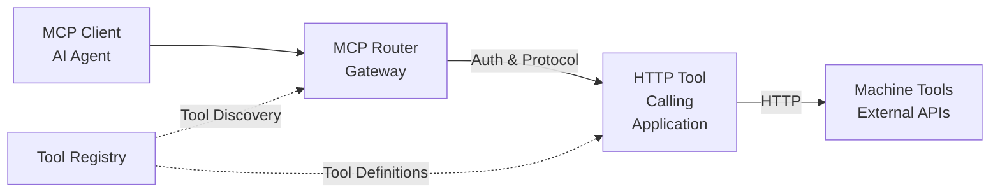

# Machine Template

> **Status:** 🟡 Draft  
> **Last Updated:** 2026-01-17

The `machine-template` is a special MCP Server template that exposes Tool Registry tools via MCP without request lifecycle overhead. It enables stateless tool invocation through a passthrough pattern where MCP Router acts as a gateway.

---

## Overview

**Purpose:** Expose Machine tools from the Tool Registry to AI agents via MCP without the overhead of request lifecycle management.

**Key Characteristics:**
- **Stateless**: No request lifecycle, no prompts, no resources, no sessions
- **Passthrough**: MCP Router acts as gateway (authentication, protocol translation)
- **Direct Invocation**: Tools invoked via HTTP Tool Calling Application
- **Tool Registry Integration**: Exposes tools from Tool Registry two-level model

---

## Architecture



**Flow:**
1. MCP Client calls tool via MCP protocol
2. MCP Router authenticates (JWT), authorizes (OPA), translates protocol
3. HTTP Tool Calling Application invokes tool natively
4. Machine tool (external API) processes request
5. Response flows back through same path

---

## CRD Structure

```yaml
apiVersion: hub.olympus.io/v1
kind: machine-template
metadata:
  name: core-banking-mcp
  namespace: acme-bank
spec:
  # Server identity
  server:
    name: core-banking-mcp
    display_name: "Core Banking Tools"
    description: "MCP server exposing core banking API tools"
    version: "1.0.0"
  
  # Workbench scope
  workbench_ref: payments-workbench
  
  # Tool source options
  tool_source:
    # Option A: All tools from a Machine
    machine_ref: acme-core-banking
    
    # Option B: Explicit tool list
    # tools:
    #   - get-account
    #   - get-transaction-history
    #   - validate-account
    #   - initiate-payment
  
  # Access control via OPA policy
  access_policy:
    # OPA Rego policy
    # Evaluates against access token claims, scopes, etc.
    # (exact policy structure TBD - C3 level detail)
```

### Tool Source Options

| Option | Description | Use Case |
|--------|-------------|----------|
| **Machine Reference** | Expose all tools from a specific Machine | Simple exposure of entire Machine toolset |
| **Explicit Tool List** | Select specific tools by ID | Fine-grained control, subset of Machine tools |

---

## Integration with Tool Registry

The `machine-template` integrates with the Tool Registry's two-level model:

### Tool Protocol (Abstract)

Tool Protocols are abstract specifications defined in Machine Definitions:

```yaml
tool_protocol:
  id: "get-account"
  name: "Get Account"
  protocol_type: "openapi"
  specification: { ... }
  input_schema: { ... }
  output_schema: { ... }
  machine_definition_id: "acme-core-banking"
```

### Tool (Concrete Instance)

Tools are concrete instances bound to a Machine with resolved endpoints:

```yaml
tool:
  id: "acme-get-account"
  protocol_id: "get-account"
  machine_id: "acme-core-banking"
  variables:
    base_url: "https://core.acme.com/api"
  access_control:
    discoverability:
      allowed_workbenches: ["payments-workbench"]
    invocation:
      allowed_roles: ["operator", "analyst"]
  flow_control:
    rate_limit: 100
    timeout_ms: 5000
```

### MCP Exposure

When `machine-template` references tools:
1. MCP Operator queries Tool Registry for tools (by Machine or explicit list)
2. Tools are registered with MCP Router
3. MCP Router exposes tools via MCP protocol
4. Client invokes tools via MCP Router
5. MCP Router translates to HTTP and invokes via HTTP Tool Calling Application

---

## Passthrough Pattern

### MCP Router as Gateway

MCP Router performs:
- **Authentication**: JWT validation
- **Authorization**: OPA policy evaluation
- **Protocol Translation**: MCP protocol → HTTP
- **Passthrough**: Forward to HTTP Tool Calling Application

MCP Router does NOT:
- Create requests
- Manage sessions
- Handle resource subscriptions
- Compile prompts

### HTTP Tool Calling Application

The HTTP Tool Calling Application:
- Receives HTTP tool invocation requests
- Resolves tool endpoint from Tool Registry
- Invokes external Machine tool
- Returns tool-native response
- No request lifecycle involved

---

## Comparison with Scenario-Based Templates

| Aspect | machine-template | Scenario-Based Templates |
|--------|------------------|--------------------------|
| **Request Lifecycle** | None (stateless) | Full lifecycle (create, update, complete) |
| **Prompts** | Not supported | Task solvers, guidance prompts |
| **Resources** | Not supported | Requests, tasks, queues, etc. |
| **Sessions** | Stateless | Session-bound with subscriptions |
| **Tool Source** | Tool Registry | Hub scenarios, requests, tasks |
| **Invocation** | Direct HTTP passthrough | Via Signal Exchange |
| **Use Case** | Stateless utility functions | Request-driven workflows |

---

## Example: Core Banking Tools

```yaml
apiVersion: hub.olympus.io/v1
kind: machine-template
metadata:
  name: core-banking-mcp
  namespace: acme-bank
spec:
  server:
    name: core-banking-mcp
    display_name: "Core Banking Tools"
    description: "Expose core banking API tools to AI agents"
    version: "1.0.0"
  
  workbench_ref: payments-workbench
  
  # Expose all tools from core banking machine
  tool_source:
    machine_ref: acme-core-banking
  
  access_policy:
    # Only operators and analysts can access
    # (OPA Rego policy - C3 detail)
```

**Exposed Tools:**
- `get-account` — Retrieve account details
- `get-transaction-history` — Get transaction history
- `validate-account` — Validate account status
- `initiate-payment` — Initiate payment transaction
- `check-balance` — Check account balance

**Client Usage:**
```json
{
  "method": "tools/call",
  "params": {
    "name": "get-account",
    "arguments": {
      "account_id": "ACC-12345"
    }
  }
}
```

---

## Access Control

Access control follows the same OPA-based model as other templates:

- **Tool Registry Permissions**: Tools have their own access control in Tool Registry
- **MCP Server Policy**: Additional OPA policy in `access_policy` field
- **Combined Evaluation**: Both policies must pass for tool invocation

---

## Related Documentation

- [Tool Registry](../registry-services/tool-registry.md) — Tool catalog and two-level model
- [HTTP Tool Calling Application](../hub-native-utilities/http-tool-calling-application.md) — Native HTTP tool invocation
- [MCP Router](../../05-infrastructure/mcp-router.md) — Gateway infrastructure
- [MCP Server CRD](./mcp-server-crd.md) — General CRD structure
- [ADR-0135](../../decision-logs/0135-machine-template-passthrough.md) — Machine Template Passthrough Pattern

---

*TODO: C3-level details — tool registration flow, OPA policy structure, error handling, rate limiting*
