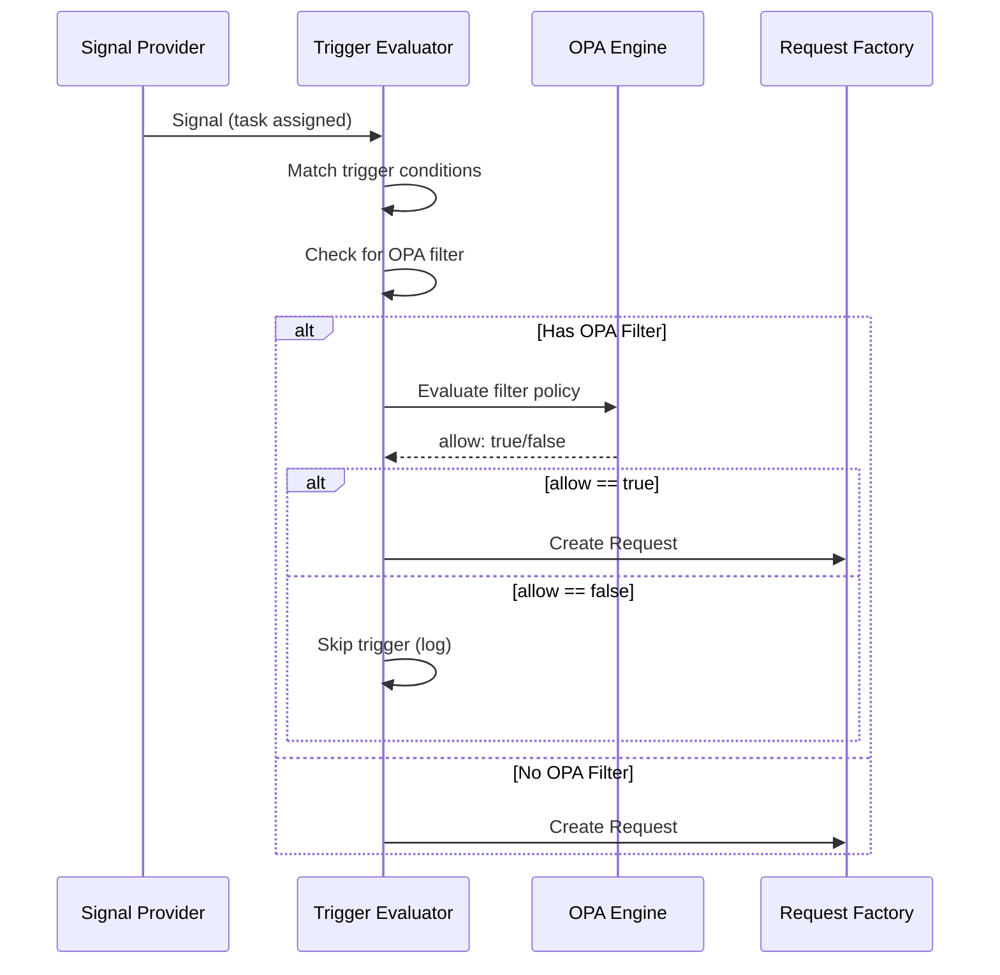

# Trigger Evaluator

> **Status:** 🔴 Stub — Placeholder for expansion

The Trigger Evaluator matches incoming signals against trigger definitions and executes transformations to create Request payloads.

---

## Overview

| Attribute | Value |
|-----------|-------|
| **Purpose** | Match signals to triggers, execute transformations |
| **Input** | Signals from Signal Providers |
| **Output** | Transformed payloads for Request Factory |
| **Configuration** | Trigger definitions from Workbench Management |

---

## Responsibilities

| Function | Description |
|----------|-------------|
| **Trigger Loading** | Load and cache trigger definitions from Workbench Management |
| **Signal Matching** | Evaluate signal against trigger conditions |
| **Transformation** | Apply trigger transformation rules |
| **Context Enrichment** | Fetch additional context for transformation |
| **Multi-match Handling** | Handle signals that match multiple triggers |

---

## Trigger Definition Structure

Trigger definitions are maintained in Workbench Management:

```yaml
trigger:
  id: string
  name: string
  workbench_id: string
  
  # Signal matching
  signal_source: string      # Which Signal Provider
  conditions:                # Matching conditions
    - field: string
      operator: string
      value: any
  
  # Transformation
  transformation:
    request_type: string
    mappings:
      - source: string       # JSONPath in signal
        target: string       # Field in request
    enrichments:
      - source: string       # External data source
        fields: array
  
  # Target
  scenario_id: string        # Which Scenario to activate
  
  # Behavior
  create_or_update: enum     # create_new | update_existing | create_or_update
  idempotency_key: string    # Field(s) for deduplication
```

---

## Matching Algorithm

```
For each incoming signal:
  1. Identify Signal Provider source
  2. Load triggers for that source (cached)
  3. For each trigger:
     a. Evaluate conditions against signal
     b. If all conditions match → trigger matches
  4. Handle match results:
     - No matches → log and discard (or dead-letter)
     - Single match → proceed to transformation
     - Multiple matches → apply multi-match policy
```

---

## Multi-Match Policies

| Policy | Description |
|--------|-------------|
| **First Match** | Use first matching trigger (by priority) |
| **All Matches** | Create request for each matching trigger |
| **Error** | Treat as configuration error |

---

## Persona Twin Trigger Evaluation

Trigger Evaluator supports specialized evaluation for Persona Twin triggers, including OPA filter processing.

### Persona Twin Trigger Types

| Trigger Type | Signal Source | Description |
|--------------|---------------|-------------|
| `task_assignment` | Task Management System | Tasks assigned to delegator |
| `platform_notification` | Platform Notifications | Notifications scoped to delegator |
| `time_schedule` | Kale Scheduler | Cron-like scheduled triggers |

### OPA Filter Evaluation

Persona Twin triggers can include OPA filters that are evaluated before the trigger fires:



### OPA Filter Input Structure

The Trigger Evaluator provides a standardized input structure for OPA filter evaluation:

```yaml
input:
  # Delegator information (injected by system)
  delegator_id: "user:john.smith@acme.com"
  
  # Trigger metadata
  trigger:
    id: string
    type: string  # task_assignment | platform_notification | time_schedule
    workbench_id: string
  
  # Signal payload (varies by type)
  payload:
    # For task_assignment
    task:
      id: string
      assignee: string
      priority: string
      category: string
      scenario_id: string
      created_at: datetime
    
    # For platform_notification
    notification:
      id: string
      recipient: string
      category: string
      scope: string
      message: string
    
    # For time_schedule
    schedule:
      cron: string
      timezone: string
  
  # Evaluation timestamp
  timestamp: datetime
```

### Example OPA Filter Policies

**High Priority Tasks Only:**

```rego
package persona.twin.task_filter

default allow = false

allow {
    input.payload.task.priority == "high"
}

allow {
    input.payload.task.priority == "critical"
}
```

**Business Hours Only:**

```rego
package persona.twin.business_hours

default allow = false

allow {
    hour := time.clock(input.timestamp)[0]
    hour >= 9
    hour < 17
}
```

**Exclude Routine Tasks:**

```rego
package persona.twin.exclude_routine

default allow = true

allow = false {
    input.payload.task.priority == "low"
    input.payload.task.category == "routine"
}
```

### Task Assignment Signal Processing

When a task is assigned to a user who is a delegator for a Persona Twin:

1. **Task Management System** observes task assignment
2. **Signal Dispatch** sends task assignment signal to Signal Exchange
3. **Trigger Evaluator** matches signal against Persona Twin triggers:
   - Checks `task_assignment.delegator` matches `task.assignee`
   - Evaluates OPA filter if present
4. **Request Factory** creates Request in Persona Twin Scenario

```yaml
# Task Assignment Signal
signal:
  type: "task.assigned"
  source: "task-management-system"
  payload:
    task:
      id: "task-123"
      assignee: "user:john.smith@acme.com"
      priority: "high"
      category: "dispute-review"
      scenario_id: "sc-dispute-resolution"
      created_at: "2026-01-14T10:00:00Z"
```

### Performance Considerations

| Concern | Mitigation |
|---------|------------|
| **Trigger Loading** | Cache trigger definitions per workbench |
| **OPA Compilation** | Pre-compile Rego policies at trigger creation |
| **OPA Evaluation** | Use OPA as library for low-latency evaluation |
| **Delegator Lookup** | Index Persona Twin triggers by delegator |

---

## Related Documentation

- [Signal Exchange Overview](./README.md)
- [Request Factory](./request-factory.md)
- [Workbench Management](../workbench-management/README.md)
- [Trigger Definitions](../workbench-management/trigger-definitions.md) — Persona Twin trigger configuration
- [Persona Twins](../../../olympus-seer-docs/seer-design/implementation-concepts/persona-twins.md) — Persona Twin concept documentation

---

*Trigger Evaluator matches signals to triggers, executes transformations, and supports OPA filter evaluation for Persona Twin triggers.*

