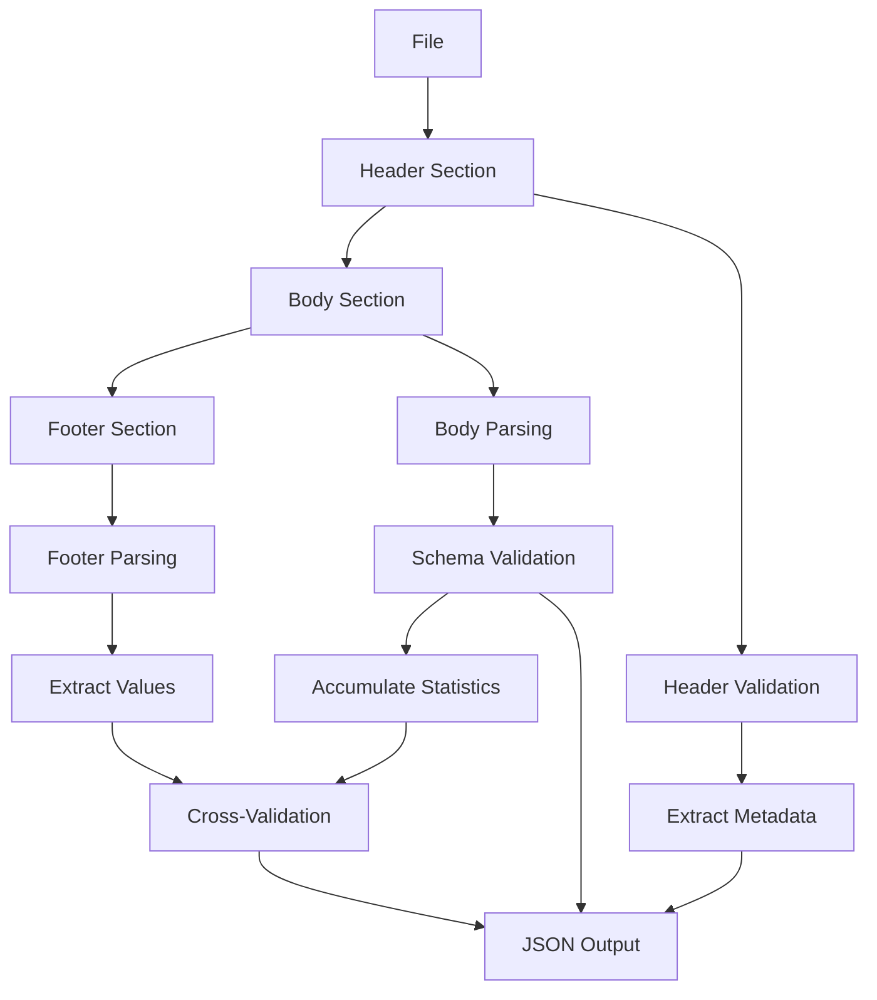

# File Format Specification

> **Status:** 🟡 Draft  
> **Audience:** Developers, Process Architects  
> **Last Updated:** 2026-01-11

Complete specification for file format schemas used by Dia file gateway parser. This specification enables declarative definition of CSV, TSV, and fixed-width file formats with header/footer validation and integrity checks.

---

## Introduction

### Purpose and Scope

This specification defines a YAML-based schema language for describing structured file formats (CSV, TSV, fixed-width) that Dia's file parser can process. The schema supports:

- **Header validation**: Pattern matching, metadata extraction, field mapping
- **Body parsing**: Schema-based field validation with type checking
- **Footer validation**: Computed value validation, cross-validation with body
- **Integrity checks**: File-level validation (hash, row counts, column consistency)
- **Error collection**: Collect all errors (not fail-fast) with per-rule reporting

### Relationship to Dia File Gateway

This format specification is used in Dia's file parsing pipeline:

```
File Arrival → Format Specification → Parser → Validated JSON Rows → Signal Exchange
```

The format specification is provided as part of the Trigger configuration in Workbench Management, allowing each file pattern to have its own parsing rules.

### File Structure

Files are divided into three sections: header, body, and footer. The parser validates each section according to the format specification:



**File Sections:**
- **Header**: File metadata, format identification, batch information (0-N rows)
- **Body**: Data records with schema validation (1-N rows)
- **Footer**: Totals, record counts, checksums, computed values (0-N rows)

### Design Principles

1. **Hybrid Validation Approach**: Combines declarative patterns (for structure) with rule-based validation (for complex logic) and schema-based field validation
2. **Collect All Errors**: Parser collects all validation errors rather than failing on first error
3. **Extract and Validate**: Headers and footers both extract metadata and validate content
4. **Cross-Validation After Full Read**: Footer validation occurs after entire file is parsed to enable computed value checks
5. **Per-Rule Error Reporting**: Each validation rule reports its own errors with context
6. **Streaming Validation**: Validation occurs during streaming parse for memory efficiency

---

## Schema Definition

### Complete Schema Structure

```yaml
fileFormat:
  # Format identification
  name: <string>                    # Required: Format identifier
  version: <string>                 # Optional: Format version (semver)
  description: <string>             # Optional: Human-readable description
  
  # File format type
  format: <string>                  # Required: "csv" | "tsv" | "fixed-width"
  encoding: <string>                # Optional: "utf-8" (default) | "utf-16" | "latin1" | ...
  
  # Dialect configuration (CSV/TSV only)
  dialect:
    delimiter: <string>             # Required for CSV/TSV: "," | "\t" | "|" | ...
    quote: <string>                 # Optional: Quote character (default: '"')
    escape: <string>                # Optional: Escape character (default: "\\")
    comment: <string>               # Optional: Comment line prefix (e.g., "#")
    skipInitialSpace: <boolean>     # Optional: Trim leading whitespace (default: false)
    doubleQuote: <boolean>          # Optional: Allow "" for escaped quote (default: true)
    lineTerminator: <string>        # Optional: "\n" | "\r\n" | "\r" (default: "\n")
  
  # File structure definition
  structure:
    header:
      rows: <integer>               # Required: Number of header rows (0 = no header)
      skip: <boolean>               # Optional: Skip header in output (default: false)
      validation:
        required: <boolean>         # Optional: Header must exist (default: true if rows > 0)
        
        # Pattern-based validation
        pattern: <string>           # Optional: Regex pattern for header row(s)
        
        # Field-level validation and extraction
        fields:
          - name: <string>          # Required: Field name for extracted value
            position: <integer>     # Required: Column position (0-based)
            extract: <string>       # Optional: Regex capture group name or pattern
            type: <string>          # Optional: "string" | "integer" | "decimal" | "date" | "datetime"
            format: <string>        # Optional: Format string (for dates: "%Y-%m-%d")
            constraints:
              required: <boolean>   # Optional: Field must be present
              pattern: <string>     # Optional: Regex pattern for validation
              enum: [<string>]      # Optional: Allowed values
              min: <number>         # Optional: Minimum value
              max: <number>         # Optional: Maximum value
        
        # Field mapping (for body schema alignment)
        field_mapping:
          - source: <string>        # Required: Header column name
            target: <string>         # Optional: Target field name (default: same as source)
            required: <boolean>      # Optional: Field must be present (default: false)
            type: <string>          # Optional: Expected type for validation
    
    body:
      startRow: <integer>           # Required: First data row (1-based, after header)
      endRow: <integer>              # Optional: Last data row (-1 = until footer, default: -1)
      schema:
        fields:
          - name: <string>           # Required: Field name
            position: <integer>      # Required: Column position (0-based) or range for fixed-width
            type: <string>           # Required: "string" | "integer" | "decimal" | "boolean" | "date" | "datetime"
            format: <string>        # Optional: Format string (for dates, decimals)
            constraints:
              required: <boolean>    # Optional: Field must be present (default: false)
              pattern: <string>     # Optional: Regex pattern
              enum: [<value>]       # Optional: Allowed values
              min: <number>         # Optional: Minimum value
              max: <number>         # Optional: Maximum value
              minLength: <integer>  # Optional: Minimum string length
              maxLength: <integer>  # Optional: Maximum string length
    
    footer:
      rows: <integer>               # Required: Number of footer rows (0 = no footer)
      skip: <boolean>                # Optional: Skip footer in output (default: true)
      validation:
        required: <boolean>          # Optional: Footer must exist (default: true if rows > 0)
        
        # Pattern-based parsing
        pattern: <string>           # Optional: Regex pattern for footer row(s)
        
        # Field extraction
        extract:
          <field_name>:             # Field name for extracted value
            from: <string>          # Required: Regex capture group name or pattern
            type: <string>         # Required: "string" | "integer" | "decimal" | "date"
            format: <string>       # Optional: Format string
        
        # Cross-validation rules (executed after full file read)
        cross_validate:
          - name: <string>          # Required: Validation rule name
            footer_field: <string>  # Required: Footer field to validate
            computed_from: <string> # Required: "body" | "header" | "file"
            computation: <string>   # Required: Expression (e.g., "count()", "sum(amount)", "sha256(...)")
            operator: <string>      # Required: "equals" | "greater_than" | "less_than" | "within"
            tolerance: <number>    # Optional: Allowed difference (for numeric comparisons)
  
  # File-level integrity checks
  integrity:
    checks:
      - type: <string>              # Required: "file_size" | "file_hash" | "row_count" | "column_count" | "header_footer_consistency"
        # Type-specific parameters
        min_bytes: <integer>        # For file_size
        max_bytes: <integer>        # For file_size
        algorithm: <string>          # For file_hash: "sha256" | "md5"
        expected: <string>          # For file_hash: Expected hash value (optional)
        min_rows: <integer>         # For row_count
        max_rows: <integer>         # For row_count
        expected: <integer>         # For column_count
        validate_all_rows: <boolean> # For column_count: Check all rows have same count
        rules: [<string>]           # For header_footer_consistency: Expression rules
  
  # Output configuration
  output:
    format: "json"                  # Required: Output format (always "json")
    perRow: <boolean>               # Required: Emit one JSON per row (default: true)
    includeMetadata: <boolean>       # Optional: Include row metadata (default: true)
    metadataFields: [<string>]      # Optional: Additional metadata fields to include
```

---

## Examples

### Example 1: Simple CSV (Basic Validation)

**Use Case**: Simple data import with header row, no footer, basic field validation.

**File Content:**
```csv
customer_id,email,status,created_at
CUST-001,customer1@example.com,active,2026-01-11
CUST-002,customer2@example.com,inactive,2026-01-10
CUST-003,customer3@example.com,active,2026-01-09
```

**Format Specification:**
```yaml
fileFormat:
  name: "customer-import-v1"
  format: "csv"
  encoding: "utf-8"
  
  dialect:
    delimiter: ","
    quote: '"'
    skipInitialSpace: true
  
  structure:
    header:
      rows: 1
      skip: false
      validation:
        required: true
        field_mapping:
          - source: "customer_id"
            required: true
          - source: "email"
            required: true
          - source: "status"
            required: true
          - source: "created_at"
            required: true
    
    body:
      startRow: 2
      schema:
        fields:
          - name: "customer_id"
            position: 0
            type: "string"
            constraints:
              required: true
              pattern: "^CUST-\\d+$"
          
          - name: "email"
            position: 1
            type: "string"
            constraints:
              required: true
              pattern: "^[\\w\\.-]+@[\\w\\.-]+\\.[a-zA-Z]{2,}$"
          
          - name: "status"
            position: 2
            type: "string"
            constraints:
              required: true
              enum: ["active", "inactive", "pending"]
          
          - name: "created_at"
            position: 3
            type: "date"
            format: "%Y-%m-%d"
            constraints:
              required: true
    
    footer:
      rows: 0
  
  integrity:
    checks:
      - type: "row_count"
        min_rows: 2  # At least header + 1 data row
        max_rows: 100000
  
  output:
    format: "json"
    perRow: true
    includeMetadata: true
```

**Output (per row):**
```json
{
  "data": {
    "customer_id": "CUST-001",
    "email": "customer1@example.com",
    "status": "active",
    "created_at": "2026-01-11"
  },
  "metadata": {
    "row_number": 2,
    "section": "body",
    "file_name": "customers.csv",
    "parse_timestamp": "2026-01-11T10:00:00Z"
  }
}
```

---

### Example 2: Medium Complexity (Header/Footer Validation)

**Use Case**: Settlement file with metadata header, data body, and totals footer. Cross-validation between header date and footer record count.

**File Content:**
```csv
FILE_TYPE:SETTLEMENT,DATE:2026-01-11,BATCH_ID:BATCH-001
transaction_id,amount,status,merchant_id
TXN-001,1500.00,completed,MERCH-001
TXN-002,2300.50,completed,MERCH-002
TXN-003,890.25,pending,MERCH-001
TOTAL,3,4690.75
```

**Format Specification:**
```yaml
fileFormat:
  name: "settlement-file-v1"
  format: "csv"
  encoding: "utf-8"
  
  dialect:
    delimiter: ","
    quote: '"'
  
  structure:
    header:
      rows: 1
      skip: false
      validation:
        required: true
        pattern: "^FILE_TYPE:(?P<file_type>\\w+),DATE:(?P<file_date>\\d{4}-\\d{2}-\\d{2}),BATCH_ID:(?P<batch_id>\\w+)$"
        fields:
          - name: "file_type"
            position: 0
            extract: "{file_type}"
            type: "string"
            constraints:
              required: true
              enum: ["SETTLEMENT", "RECONCILIATION"]
          
          - name: "file_date"
            position: 1
            extract: "{file_date}"
            type: "date"
            format: "%Y-%m-%d"
            constraints:
              required: true
          
          - name: "batch_id"
            position: 2
            extract: "{batch_id}"
            type: "string"
            constraints:
              required: true
              pattern: "^BATCH-\\d+$"
        
        field_mapping:
          - source: "transaction_id"
            required: true
          - source: "amount"
            required: true
          - source: "status"
            required: true
          - source: "merchant_id"
            required: true
    
    body:
      startRow: 2
      schema:
        fields:
          - name: "transaction_id"
            position: 0
            type: "string"
            constraints:
              required: true
              pattern: "^TXN-\\d+$"
          
          - name: "amount"
            position: 1
            type: "decimal"
            format: "0.00"
            constraints:
              required: true
              min: 0.01
          
          - name: "status"
            position: 2
            type: "string"
            constraints:
              required: true
              enum: ["completed", "pending", "failed"]
          
          - name: "merchant_id"
            position: 3
            type: "string"
            constraints:
              required: true
              pattern: "^MERCH-\\d+$"
    
    footer:
      rows: 1
      skip: true
      validation:
        required: true
        pattern: "^TOTAL,(?P<record_count>\\d+),(?P<total_amount>[\\d.]+)$"
        extract:
          record_count:
            from: "{record_count}"
            type: "integer"
          total_amount:
            from: "{total_amount}"
            type: "decimal"
        
        cross_validate:
          - name: "record_count_match"
            footer_field: "record_count"
            computed_from: "body"
            computation: "count()"
            operator: "equals"
          
          - name: "amount_total_match"
            footer_field: "total_amount"
            computed_from: "body"
            computation: "sum(amount)"
            operator: "equals"
            tolerance: 0.01
  
  integrity:
    checks:
      - type: "row_count"
        min_rows: 4  # Header + at least 1 data row + footer
        max_rows: 1000000
      
      - type: "column_count"
        expected: 4
        validate_all_rows: true
  
  output:
    format: "json"
    perRow: true
    includeMetadata: true
    metadataFields: ["file_type", "file_date", "batch_id"]
```

**Output (first body row with header metadata):**
```json
{
  "data": {
    "transaction_id": "TXN-001",
    "amount": 1500.00,
    "status": "completed",
    "merchant_id": "MERCH-001"
  },
  "metadata": {
    "row_number": 2,
    "section": "body",
    "file_name": "settlement_20260111.csv",
    "parse_timestamp": "2026-01-11T10:00:00Z",
    "file_type": "SETTLEMENT",
    "file_date": "2026-01-11",
    "batch_id": "BATCH-001"
  }
}
```

---

### Example 3: Complex (Full Validation Suite)

**Use Case**: Financial reconciliation file with multi-row header, complex footer with multiple computed values, extensive integrity checks, and cross-validation rules.

**File Content:**
```csv
RECONCILIATION_FILE
VERSION:2.0
DATE:2026-01-11
BANK_CODE:ACME-BANK-001
CURRENCY:USD
RECORD_COUNT:0
AMOUNT_TOTAL:0.00
HEADER_END
TXN-001,1500.00,completed,2026-01-10T10:00:00Z,MERCH-001,ACCT-001
TXN-002,2300.50,completed,2026-01-10T11:30:00Z,MERCH-002,ACCT-002
TXN-003,890.25,pending,2026-01-10T14:15:00Z,MERCH-001,ACCT-001
TXN-004,1200.00,failed,2026-01-10T16:45:00Z,MERCH-003,ACCT-003
FOOTER_START
RECORD_COUNT:4
AMOUNT_TOTAL:5890.75
COMPLETED_COUNT:2
COMPLETED_AMOUNT:3800.50
PENDING_COUNT:1
PENDING_AMOUNT:890.25
FAILED_COUNT:1
FAILED_AMOUNT:1200.00
FILE_HASH:sha256:abc123def456...
FOOTER_END
```

**Format Specification:**
```yaml
fileFormat:
  name: "reconciliation-file-v2"
  format: "csv"
  encoding: "utf-8"
  
  dialect:
    delimiter: ","
    quote: '"'
    skipInitialSpace: true
  
  structure:
    header:
      rows: 7  # First 7 rows are header
      skip: false
      validation:
        required: true
        
        # Validate first row
        fields:
          - name: "file_type"
            position: 0
            type: "string"
            constraints:
              required: true
              enum: ["RECONCILIATION_FILE"]
          
          - name: "version"
            position: 0  # Row 2, column 0
            extract: "VERSION:(?P<version>\\d+\\.\\d+)"
            type: "string"
            constraints:
              required: true
              pattern: "^\\d+\\.\\d+$"
          
          - name: "file_date"
            position: 0  # Row 3, column 0
            extract: "DATE:(?P<date>\\d{4}-\\d{2}-\\d{2})"
            type: "date"
            format: "%Y-%m-%d"
            constraints:
              required: true
          
          - name: "bank_code"
            position: 0  # Row 4, column 0
            extract: "BANK_CODE:(?P<code>[\\w-]+)"
            type: "string"
            constraints:
              required: true
              pattern: "^[A-Z]+-BANK-\\d+$"
          
          - name: "currency"
            position: 0  # Row 5, column 0
            extract: "CURRENCY:(?P<curr>[A-Z]{3})"
            type: "string"
            constraints:
              required: true
              enum: ["USD", "EUR", "GBP"]
        
        # Validate HEADER_END marker
        pattern: "^HEADER_END$"  # Row 7 must be "HEADER_END"
        
        field_mapping:
          - source: "transaction_id"
            required: true
          - source: "amount"
            required: true
          - source: "status"
            required: true
          - source: "timestamp"
            required: true
          - source: "merchant_id"
            required: true
          - source: "account_id"
            required: true
    
    body:
      startRow: 8  # After header
      schema:
        fields:
          - name: "transaction_id"
            position: 0
            type: "string"
            constraints:
              required: true
              pattern: "^TXN-\\d+$"
          
          - name: "amount"
            position: 1
            type: "decimal"
            format: "0.00"
            constraints:
              required: true
              min: 0.01
          
          - name: "status"
            position: 2
            type: "string"
            constraints:
              required: true
              enum: ["completed", "pending", "failed"]
          
          - name: "timestamp"
            position: 3
            type: "datetime"
            format: "%Y-%m-%dT%H:%M:%SZ"
            constraints:
              required: true
          
          - name: "merchant_id"
            position: 4
            type: "string"
            constraints:
              required: true
              pattern: "^MERCH-\\d+$"
          
          - name: "account_id"
            position: 5
            type: "string"
            constraints:
              required: true
              pattern: "^ACCT-\\d+$"
    
    footer:
      rows: 10  # FOOTER_START through FOOTER_END
      skip: true
      validation:
        required: true
        
        # Validate FOOTER_START marker
        pattern: "^FOOTER_START$"  # First footer row
        
        extract:
          record_count:
            from: "RECORD_COUNT:(?P<count>\\d+)"
            type: "integer"
          total_amount:
            from: "AMOUNT_TOTAL:(?P<amount>[\\d.]+)"
            type: "decimal"
          completed_count:
            from: "COMPLETED_COUNT:(?P<count>\\d+)"
            type: "integer"
          completed_amount:
            from: "COMPLETED_AMOUNT:(?P<amount>[\\d.]+)"
            type: "decimal"
          pending_count:
            from: "PENDING_COUNT:(?P<count>\\d+)"
            type: "integer"
          pending_amount:
            from: "PENDING_AMOUNT:(?P<amount>[\\d.]+)"
            type: "decimal"
          failed_count:
            from: "FAILED_COUNT:(?P<count>\\d+)"
            type: "integer"
          failed_amount:
            from: "FAILED_AMOUNT:(?P<amount>[\\d.]+)"
            type: "decimal"
          file_hash:
            from: "FILE_HASH:(?P<hash>sha256:[a-f0-9]+)"
            type: "string"
        
        cross_validate:
          - name: "record_count_match"
            footer_field: "record_count"
            computed_from: "body"
            computation: "count()"
            operator: "equals"
          
          - name: "total_amount_match"
            footer_field: "total_amount"
            computed_from: "body"
            computation: "sum(amount)"
            operator: "equals"
            tolerance: 0.01
          
          - name: "completed_count_match"
            footer_field: "completed_count"
            computed_from: "body"
            computation: "count(status == 'completed')"
            operator: "equals"
          
          - name: "completed_amount_match"
            footer_field: "completed_amount"
            computed_from: "body"
            computation: "sum(amount where status == 'completed')"
            operator: "equals"
            tolerance: 0.01
          
          - name: "pending_count_match"
            footer_field: "pending_count"
            computed_from: "body"
            computation: "count(status == 'pending')"
            operator: "equals"
          
          - name: "pending_amount_match"
            footer_field: "pending_amount"
            computed_from: "body"
            computation: "sum(amount where status == 'pending')"
            operator: "equals"
            tolerance: 0.01
          
          - name: "failed_count_match"
            footer_field: "failed_count"
            computed_from: "body"
            computation: "count(status == 'failed')"
            operator: "equals"
          
          - name: "failed_amount_match"
            footer_field: "failed_amount"
            computed_from: "body"
            computation: "sum(amount where status == 'failed')"
            operator: "equals"
            tolerance: 0.01
          
          - name: "file_hash_match"
            footer_field: "file_hash"
            computed_from: "body"
            computation: "sha256(concatenate(all_rows))"
            operator: "equals"
  
  integrity:
    checks:
      - type: "file_size"
        min_bytes: 100
        max_bytes: 10737418240  # 10GB
      
      - type: "file_hash"
        algorithm: "sha256"
        # Optional: expected hash for verification
      
      - type: "row_count"
        min_rows: 18  # Header (7) + at least 1 data row + Footer (10)
        max_rows: 10000000
      
      - type: "column_count"
        expected: 6
        validate_all_rows: true
      
      - type: "header_footer_consistency"
        rules:
          - "header.file_date == footer.batch_date"  # If footer has batch_date
          - "header.currency == footer.currency"     # If footer has currency
  
  output:
    format: "json"
    perRow: true
    includeMetadata: true
    metadataFields: ["file_type", "version", "file_date", "bank_code", "currency"]
```

**Output (first body row with header metadata):**
```json
{
  "data": {
    "transaction_id": "TXN-001",
    "amount": 1500.00,
    "status": "completed",
    "timestamp": "2026-01-10T10:00:00Z",
    "merchant_id": "MERCH-001",
    "account_id": "ACCT-001"
  },
  "metadata": {
    "row_number": 8,
    "section": "body",
    "file_name": "reconciliation_20260111.csv",
    "parse_timestamp": "2026-01-11T10:00:00Z",
    "file_type": "RECONCILIATION_FILE",
    "version": "2.0",
    "file_date": "2026-01-11",
    "bank_code": "ACME-BANK-001",
    "currency": "USD"
  }
}
```

---

## Schema Reference

### Field Types

| Type | Description | Format Support | Example |
|------|-------------|---------------|---------|
| `string` | Text data | N/A | `"customer_id"` |
| `integer` | Whole numbers | N/A | `12345` |
| `decimal` | Decimal numbers | `"0.00"`, `"0.000"` | `1500.00` |
| `boolean` | True/false | `"true/false"`, `"1/0"`, `"yes/no"` | `true` |
| `date` | Date only | `"%Y-%m-%d"`, `"%m/%d/%Y"` | `2026-01-11` |
| `datetime` | Date and time | `"%Y-%m-%dT%H:%M:%SZ"`, ISO 8601 | `2026-01-11T10:00:00Z` |

### Validation Rule Syntax

#### Pattern Matching

- **Regex patterns**: Standard regular expressions (PCRE-compatible)
- **Capture groups**: Named groups `(?P<name>...)` for extraction
- **Field extraction**: Use `{group_name}` in `extract` field to reference capture groups

#### Cross-Validation Computation Expressions

| Expression | Description | Example |
|------------|-------------|---------|
| `count()` | Count all body rows | `count()` |
| `count(condition)` | Count rows matching condition | `count(status == 'completed')` |
| `sum(field)` | Sum numeric field | `sum(amount)` |
| `sum(field where condition)` | Conditional sum | `sum(amount where status == 'completed')` |
| `avg(field)` | Average value | `avg(amount)` |
| `min(field)` | Minimum value | `min(amount)` |
| `max(field)` | Maximum value | `max(amount)` |
| `sha256(expression)` | SHA-256 hash | `sha256(concatenate(all_rows))` |
| `md5(expression)` | MD5 hash | `md5(file_content)` |

#### Comparison Operators

| Operator | Description | Use Case |
|----------|-------------|----------|
| `equals` | Exact match | Record counts, exact values |
| `greater_than` | Greater than | Minimum thresholds |
| `less_than` | Less than | Maximum thresholds |
| `within` | Within tolerance | Numeric comparisons with tolerance |

### Integrity Check Types

| Type | Parameters | Description |
|------|------------|-------------|
| `file_size` | `min_bytes`, `max_bytes` | Validate file size range |
| `file_hash` | `algorithm`, `expected` (optional) | Compute/verify file hash |
| `row_count` | `min_rows`, `max_rows` | Validate total row count |
| `column_count` | `expected`, `validate_all_rows` | Validate column count consistency |
| `header_footer_consistency` | `rules` (array of expressions) | Cross-validate header and footer fields |

---

## Output Format

### JSON Per-Row Structure

Each parsed row is emitted as a JSON object with the following structure:

```json
{
  "data": {
    // Parsed field values according to schema
    "field1": <value>,
    "field2": <value>
  },
  "metadata": {
    "row_number": <integer>,        // 1-based row number in file
    "section": <string>,             // "header" | "body" | "footer"
    "file_name": <string>,           // Source file name
    "parse_timestamp": <string>,      // ISO 8601 timestamp of parsing
    // Additional metadata fields from header (if includeMetadata: true)
    "<extracted_field>": <value>
  }
}
```

### Error Reporting Format

When validation errors occur, they are collected and reported separately:

```json
{
  "validation_results": {
    "status": "failed" | "partial" | "success",
    "errors": [
      {
        "rule_name": <string>,
        "stage": "header" | "body" | "footer" | "integrity" | "cross_validation",
        "severity": "error" | "warning",
        "message": <string>,
        "context": {
          "row_number": <integer>,
          "field": <string>,
          "value": <value>,
          "expected": <value>
        }
      }
    ],
    "summary": {
      "total_errors": <integer>,
      "total_warnings": <integer>,
      "rows_processed": <integer>,
      "rows_failed": <integer>
    }
  }
}
```

---

## Related Documentation

- [Dia File Gateway](../dia-file-gateway.md) - Overview of Dia file gateway
- [Parser Requirements](./parser-requirements.md) - Detailed implementation requirements
- [Signal Configuration Guide](../../../10-guides/signal-configuration-guide.md) - How to configure file triggers

---

*Status: 🟡 Draft - Specification phase*
