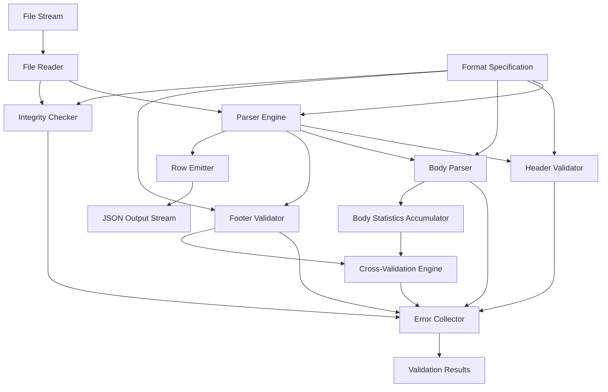
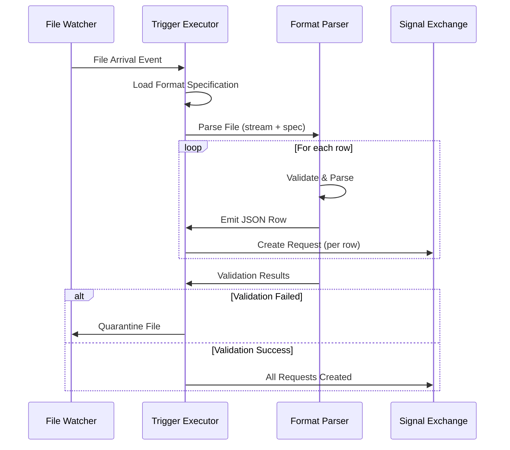

# Parser Requirements Document

> **Status:** 🟡 Draft  
> **Audience:** Dia Development Team  
> **Last Updated:** 2026-01-11

Detailed requirements for implementing the file format parser in Dia file gateway. This document provides architecture, API contracts, data structures, error handling, and implementation guidance.

---

## Executive Summary

### Purpose and Scope

This document specifies requirements for implementing a file format parser that:

- Parses CSV, TSV, and fixed-width files according to declarative format specifications
- Validates headers, body rows, and footers with pattern matching and schema validation
- Performs cross-validation and integrity checks after full file read
- Collects all errors (non-fail-fast) with per-rule error reporting
- Emits JSON per row with metadata during streaming parse
- Integrates with Dia file gateway for batch processing workflows

### Key Requirements Overview

1. **Streaming Parser**: Process large files (10GB+) with memory-efficient streaming
2. **Hybrid Validation**: Support declarative patterns, rule-based validation, and schema-based field validation
3. **Error Collection**: Collect all validation errors, categorize by stage, report per-rule
4. **Cross-Validation**: Validate footer computed values against body statistics after full read
5. **Metadata Extraction**: Extract file-level metadata from headers and include in output
6. **JSON Output**: Emit one JSON object per row with data and metadata

### Success Criteria

- Parser successfully processes files according to format specifications
- All validation errors are collected and reported (no silent failures)
- Memory usage remains constant regardless of file size
- Processing speed: ≥ 10MB/s for CSV files
- Integration with Dia file gateway triggers works seamlessly
- Error messages are clear and actionable

---

## High-Level Architecture

### Parser Component Architecture



### Component Responsibilities

| Component | Responsibility |
|-----------|----------------|
| **File Reader** | Stream file content, handle encoding, track position |
| **Parser Engine** | Orchestrate parsing stages, manage state |
| **Header Validator** | Validate header rows, extract metadata, pattern matching |
| **Body Parser** | Parse data rows, apply schema validation, accumulate statistics |
| **Footer Validator** | Validate footer rows, extract computed values |
| **Cross-Validation Engine** | Compare footer values against computed body statistics |
| **Error Collector** | Accumulate all errors, categorize, format for reporting |
| **Body Statistics Accumulator** | Compute aggregates (count, sum, etc.) during parsing |
| **Integrity Checker** | Perform file-level checks (hash, size, row counts) |
| **Row Emitter** | Format parsed rows as JSON with metadata |

### Integration with Dia File Gateway



---

## Functional Requirements

### 3.1 File Format Parsing

#### 3.1.1 Format Support

**REQ-FMT-001**: Parser MUST support the following file formats:
- CSV (Comma-Separated Values)
- TSV (Tab-Separated Values)
- Fixed-width (position-based)

**REQ-FMT-002**: Parser MUST support configurable dialect options:
- Delimiter character (CSV/TSV)
- Quote character
- Escape character
- Comment line prefix
- Line terminator (`\n`, `\r\n`, `\r`)
- Skip initial whitespace option

**REQ-FMT-003**: Parser MUST support multiple character encodings:
- UTF-8 (default)
- UTF-16 (LE/BE)
- Latin-1
- ASCII
- Configurable via format specification

#### 3.1.2 Header Row Detection and Parsing

**REQ-HDR-001**: Parser MUST detect and parse header rows according to specification:
- Support 0 to N header rows
- Validate header structure against patterns
- Extract metadata from header fields
- Map header column names to body schema fields

**REQ-HDR-002**: Parser MUST support pattern-based header validation:
- Regex pattern matching for header rows
- Named capture group extraction
- Field-level validation with constraints

**REQ-HDR-003**: Parser MUST extract metadata from headers:
- Store extracted values for inclusion in output metadata
- Make metadata available to all body rows
- Support multi-row header extraction

#### 3.1.3 Body Row Parsing

**REQ-BDY-001**: Parser MUST parse body rows according to schema:
- Apply field type conversion (string → integer, decimal, date, etc.)
- Validate field constraints (required, pattern, enum, min/max)
- Handle missing or malformed fields gracefully

**REQ-BDY-002**: Parser MUST accumulate statistics during parsing:
- Row count
- Sum, average, min, max for numeric fields
- Conditional aggregations (count where condition, sum where condition)
- Support for deferred cross-validation

**REQ-BDY-003**: Parser MUST handle fixed-width format:
- Position-based field extraction
- Support for field ranges (start:end positions)
- Whitespace trimming per field configuration

#### 3.1.4 Footer Row Detection and Parsing

**REQ-FTR-001**: Parser MUST detect and parse footer rows:
- Support 0 to N footer rows
- Validate footer structure against patterns
- Extract computed values from footer

**REQ-FTR-002**: Parser MUST support footer validation:
- Pattern-based parsing with regex
- Field extraction from footer rows
- Cross-validation against body statistics (after full read)

---

### 3.2 Validation Requirements

#### 3.2.1 Header Validation

**REQ-VAL-HDR-001**: Parser MUST validate header presence:
- Check if header exists when `required: true`
- Report error if header missing and required

**REQ-VAL-HDR-002**: Parser MUST validate header patterns:
- Match header rows against specified regex patterns
- Extract values using named capture groups
- Validate extracted values against constraints

**REQ-VAL-HDR-003**: Parser MUST validate header field mapping:
- Verify required header columns are present
- Map header column names to body schema fields
- Report missing required columns

#### 3.2.2 Body Validation

**REQ-VAL-BDY-001**: Parser MUST validate body rows against schema:
- Type checking (string, integer, decimal, boolean, date, datetime)
- Constraint validation (required, pattern, enum, min/max, minLength/maxLength)
- Format validation (date formats, decimal precision)

**REQ-VAL-BDY-002**: Parser MUST validate column consistency:
- All rows must have same column count (if `validate_all_rows: true`)
- Report rows with mismatched column counts

**REQ-VAL-BDY-003**: Parser MUST handle validation errors gracefully:
- Continue parsing after validation error
- Collect all errors for reporting
- Emit row with error indicator in metadata

#### 3.2.3 Footer Validation

**REQ-VAL-FTR-001**: Parser MUST validate footer presence:
- Check if footer exists when `required: true`
- Report error if footer missing and required

**REQ-VAL-FTR-002**: Parser MUST validate footer patterns:
- Match footer rows against specified regex patterns
- Extract computed values using named capture groups
- Validate extracted values against constraints

#### 3.2.4 Cross-Validation

**REQ-VAL-XVAL-001**: Parser MUST perform cross-validation after full file read:
- Compute body statistics (count, sum, etc.)
- Compare footer values against computed statistics
- Support tolerance for numeric comparisons
- Report all mismatches

**REQ-VAL-XVAL-002**: Parser MUST support cross-validation expressions:
- `count()` - total row count
- `count(condition)` - conditional count
- `sum(field)` - sum of numeric field
- `sum(field where condition)` - conditional sum
- `avg(field)`, `min(field)`, `max(field)` - aggregations
- `sha256(expression)`, `md5(expression)` - hash computations

#### 3.2.5 Integrity Checks

**REQ-VAL-INT-001**: Parser MUST perform file-level integrity checks:
- File size validation (min/max bytes)
- File hash computation and verification (optional expected hash)
- Total row count validation (min/max rows)
- Column count consistency validation
- Header-footer consistency validation

**REQ-VAL-INT-002**: Parser MUST support integrity check types:
- `file_size`: Validate file size range
- `file_hash`: Compute/verify file hash (SHA-256, MD5)
- `row_count`: Validate total row count
- `column_count`: Validate column count consistency
- `header_footer_consistency`: Cross-validate header and footer fields

---

### 3.3 Error Handling

#### 3.3.1 Error Collection Strategy

**REQ-ERR-001**: Parser MUST collect all errors (non-fail-fast):
- Continue parsing after encountering errors
- Accumulate errors from all validation stages
- Categorize errors by stage (header, body, footer, integrity, cross-validation)

**REQ-ERR-002**: Parser MUST report per-rule errors:
- Each validation rule reports its own errors
- Include rule name, stage, severity, message, and context
- Provide actionable error messages

**REQ-ERR-003**: Parser MUST categorize errors:
- **Structure errors**: Missing headers/footers, column count mismatches
- **Content errors**: Type mismatches, constraint violations, pattern mismatches
- **Integrity errors**: Hash mismatches, size violations, row count violations
- **Cross-validation errors**: Footer value mismatches with computed values

#### 3.3.2 Error Reporting Format

**REQ-ERR-004**: Parser MUST provide detailed error context:
- Row number where error occurred
- Field name (if applicable)
- Actual value vs expected value
- Validation rule that failed
- Stage where error occurred

**REQ-ERR-005**: Parser MUST aggregate error summary:
- Total error count
- Total warning count
- Rows processed vs rows failed
- Error breakdown by category

---

### 3.4 Streaming Parsing

#### 3.4.1 Stream-Based Processing

**REQ-STR-001**: Parser MUST process files in streaming mode:
- Read file in chunks (configurable buffer size)
- Process rows incrementally without loading entire file into memory
- Support files up to 10GB+ without memory issues

**REQ-STR-002**: Parser MUST validate during streaming:
- Validate header structure as it's read
- Validate body rows as they're parsed
- Accumulate statistics incrementally
- Defer footer validation until footer is read

**REQ-STR-003**: Parser MUST emit rows incrementally:
- Emit JSON per row as soon as row is parsed
- Include metadata with each row
- Support backpressure if consumer is slow

#### 3.4.2 Memory Efficiency

**REQ-STR-004**: Parser MUST maintain constant memory usage:
- Memory usage should not grow with file size
- Use streaming parsers (no DOM/SAX-style for CSV)
- Release parsed rows from memory after emission
- Cache only necessary state (statistics, errors)

**REQ-STR-005**: Parser MUST support progress reporting:
- Report rows processed
- Report bytes processed
- Support progress callbacks for monitoring

---

## API Contracts

### 4.1 Parser Interface

#### 4.1.1 Input

```typescript
interface ParseRequest {
  fileStream: ReadableStream<Uint8Array> | NodeJS.ReadableStream;
  formatSpec: FileFormatSpecification;  // YAML/JSON format specification
  options?: ParseOptions;
}

interface ParseOptions {
  bufferSize?: number;           // Default: 64KB
  encoding?: string;              // Override spec encoding
  progressCallback?: (progress: ParseProgress) => void;
  errorCallback?: (error: ValidationError) => void;
}
```

#### 4.1.2 Output

```typescript
interface ParseResponse {
  rows: AsyncIterable<ParsedRow>;
  validationResults: Promise<ValidationResults>;
}

interface ParsedRow {
  data: Record<string, any>;      // Parsed field values
  metadata: RowMetadata;
}

interface RowMetadata {
  row_number: number;             // 1-based row number
  section: "header" | "body" | "footer";
  file_name: string;
  parse_timestamp: string;        // ISO 8601
  [key: string]: any;              // Additional metadata from header
}
```

#### 4.1.3 Error Structure

```typescript
interface ValidationError {
  rule_name: string;
  stage: "header" | "body" | "footer" | "integrity" | "cross_validation";
  severity: "error" | "warning";
  message: string;
  context: ErrorContext;
}

interface ErrorContext {
  row_number?: number;
  field?: string;
  value?: any;
  expected?: any;
  actual?: any;
  tolerance?: number;
}
```

### 4.2 Configuration Schema

#### 4.2.1 Format Specification Schema

The format specification MUST conform to the JSON Schema defined in [File Format Specification](./file-format-specification.md).

**REQ-API-001**: Parser MUST validate format specification against JSON Schema before parsing.

**REQ-API-002**: Parser MUST support format specification in both YAML and JSON formats.

#### 4.2.2 Validation Rules

**REQ-API-003**: Parser MUST support the following validation rule types:
- Pattern matching (regex)
- Type conversion and validation
- Constraint checking (required, pattern, enum, min/max, minLength/maxLength)
- Cross-validation expressions

### 4.3 Response Format

#### 4.3.1 Success Response

```typescript
interface ValidationResults {
  status: "success" | "partial" | "failed";
  errors: ValidationError[];
  warnings: ValidationError[];
  summary: ValidationSummary;
}

interface ValidationSummary {
  total_errors: number;
  total_warnings: number;
  rows_processed: number;
  rows_failed: number;
  rows_successful: number;
}
```

#### 4.3.2 Error Response

When parsing fails completely (e.g., invalid format specification):

```typescript
interface ParseError {
  code: string;                   // Error code (see Error Codes section)
  message: string;
  details?: any;
}
```

---

## Data Structures

### 5.1 Format Specification

See [File Format Specification](./file-format-specification.md) for complete type definitions.

**Key Types:**
- `FileFormatSpecification`: Root specification object
- `Dialect`: CSV/TSV parsing options
- `HeaderSpec`: Header validation configuration
- `BodySpec`: Body parsing and validation configuration
- `FooterSpec`: Footer validation configuration
- `IntegrityCheck`: File-level integrity check configuration

### 5.2 Parsed Row Output

**REQ-DATA-001**: Each parsed row MUST be emitted as JSON with this structure:

```json
{
  "data": {
    "<field_name>": <parsed_value>
  },
  "metadata": {
    "row_number": <integer>,
    "section": "header" | "body" | "footer",
    "file_name": <string>,
    "parse_timestamp": <ISO8601_string>,
    "<extracted_metadata_field>": <value>
  }
}
```

**REQ-DATA-002**: Metadata MUST include:
- `row_number`: 1-based row number in file
- `section`: Which section the row belongs to
- `file_name`: Source file name
- `parse_timestamp`: When parsing occurred (ISO 8601)
- Additional fields extracted from header (if `includeMetadata: true`)

### 5.3 Validation Results

**REQ-DATA-003**: Validation results MUST include:
- Status: `success` (no errors), `partial` (some errors, some rows valid), `failed` (critical errors)
- Array of all errors with full context
- Array of warnings (non-blocking issues)
- Summary statistics

---

## Implementation Requirements

### 6.1 Parsing Engine

#### 6.1.1 Streaming Parser Implementation

**REQ-IMPL-001**: Parser MUST use streaming CSV/TSV parser library:
- Recommended: `csv-parse` (Node.js) or equivalent
- Support configurable delimiters, quotes, escapes
- Handle encoding conversion during stream

**REQ-IMPL-002**: Parser MUST implement state machine for file sections:
- States: `HEADER`, `BODY`, `FOOTER`, `DONE`
- Transition based on row count and patterns
- Track current section for validation and output

#### 6.1.2 Pattern Matching Engine

**REQ-IMPL-003**: Parser MUST support regex pattern matching:
- Use PCRE-compatible regex engine
- Support named capture groups `(?P<name>...)`
- Extract values from capture groups
- Validate extracted values against constraints

#### 6.1.3 Expression Evaluator for Cross-Validation

**REQ-IMPL-004**: Parser MUST implement expression evaluator:
- Support computation expressions: `count()`, `sum(field)`, `avg(field)`, etc.
- Support conditional expressions: `count(condition)`, `sum(field where condition)`
- Support hash computations: `sha256(...)`, `md5(...)`
- Evaluate expressions after full file read

**REQ-IMPL-005**: Parser MUST support comparison operators:
- `equals`: Exact match
- `greater_than`, `less_than`: Numeric comparisons
- `within`: Numeric comparison with tolerance

#### 6.1.4 Schema Validator

**REQ-IMPL-006**: Parser MUST implement schema-based validation:
- Type conversion (string → integer, decimal, date, datetime, boolean)
- Constraint checking (required, pattern, enum, min/max, minLength/maxLength)
- Format validation (date formats, decimal precision)
- Report all constraint violations per field

### 6.2 Validation Engine

#### 6.2.1 Rule-Based Validator

**REQ-IMPL-007**: Parser MUST implement rule-based validation:
- Execute validation rules in order
- Support pattern-based rules
- Support constraint-based rules
- Support cross-validation rules

#### 6.2.2 Type Converter and Validator

**REQ-IMPL-008**: Parser MUST implement type conversion:
- String → Integer: Parse integer, handle leading zeros
- String → Decimal: Parse decimal, handle precision
- String → Boolean: Support `true/false`, `1/0`, `yes/no`
- String → Date: Parse according to format string (`%Y-%m-%d`, etc.)
- String → DateTime: Parse ISO 8601 or custom format

**REQ-IMPL-009**: Parser MUST handle type conversion errors:
- Report conversion failures as validation errors
- Include original value and target type in error context
- Continue parsing other fields

#### 6.2.3 Constraint Checker

**REQ-IMPL-010**: Parser MUST implement constraint validation:
- `required`: Field must be present and non-empty
- `pattern`: Value must match regex pattern
- `enum`: Value must be in allowed list
- `min`/`max`: Numeric value must be in range
- `minLength`/`maxLength`: String length must be in range

#### 6.2.4 Cross-Validation Engine

**REQ-IMPL-011**: Parser MUST implement cross-validation:
- Accumulate body statistics during parsing
- After footer is read, compute all required statistics
- Compare footer values against computed values
- Report all mismatches with context

### 6.3 Error Collection

#### 6.3.1 Error Accumulator

**REQ-IMPL-012**: Parser MUST implement error accumulator:
- Collect errors from all validation stages
- Categorize errors by stage and type
- Maintain error context (row number, field, value, expected)

#### 6.3.2 Error Categorization

**REQ-IMPL-013**: Parser MUST categorize errors:
- **Structure errors**: File structure issues (missing sections, column count mismatches)
- **Content errors**: Data validation issues (type mismatches, constraint violations)
- **Integrity errors**: File-level integrity issues (hash mismatches, size violations)
- **Cross-validation errors**: Footer value mismatches

#### 6.3.3 Error Reporting Formatter

**REQ-IMPL-014**: Parser MUST format errors for reporting:
- Include rule name, stage, severity, message
- Include full context (row number, field, value, expected)
- Format error messages in human-readable format
- Support structured error output (JSON)

---

## Error Codes and Messages

### 7.1 Error Code Catalog

| Code | Category | Description | Severity |
|------|----------|-------------|----------|
| `FMT_SPEC_INVALID` | Configuration | Format specification is invalid | Error |
| `FMT_SPEC_MISSING` | Configuration | Format specification is missing | Error |
| `ENCODING_UNSUPPORTED` | Configuration | Character encoding not supported | Error |
| `DELIMITER_INVALID` | Configuration | Delimiter character invalid | Error |
| `HEADER_MISSING` | Structure | Required header is missing | Error |
| `HEADER_PATTERN_MISMATCH` | Content | Header row doesn't match pattern | Error |
| `HEADER_FIELD_MISSING` | Structure | Required header field is missing | Error |
| `HEADER_FIELD_INVALID` | Content | Header field value is invalid | Error |
| `BODY_ROW_COLUMN_MISMATCH` | Structure | Row has incorrect column count | Error |
| `BODY_FIELD_MISSING` | Structure | Required field is missing | Error |
| `BODY_FIELD_TYPE_MISMATCH` | Content | Field type conversion failed | Error |
| `BODY_FIELD_CONSTRAINT_VIOLATION` | Content | Field constraint validation failed | Error |
| `FOOTER_MISSING` | Structure | Required footer is missing | Error |
| `FOOTER_PATTERN_MISMATCH` | Content | Footer row doesn't match pattern | Error |
| `FOOTER_FIELD_INVALID` | Content | Footer field value is invalid | Error |
| `CROSS_VAL_RECORD_COUNT_MISMATCH` | Cross-validation | Footer record count doesn't match body | Error |
| `CROSS_VAL_AMOUNT_MISMATCH` | Cross-validation | Footer amount doesn't match body sum | Error |
| `CROSS_VAL_HASH_MISMATCH` | Cross-validation | Footer hash doesn't match computed hash | Error |
| `INTEGRITY_FILE_SIZE_VIOLATION` | Integrity | File size outside allowed range | Error |
| `INTEGRITY_HASH_MISMATCH` | Integrity | File hash doesn't match expected | Error |
| `INTEGRITY_ROW_COUNT_VIOLATION` | Integrity | Row count outside allowed range | Error |
| `INTEGRITY_COLUMN_COUNT_MISMATCH` | Integrity | Column count inconsistent across rows | Error |

### 7.2 Error Message Templates

**REQ-ERR-MSG-001**: Error messages MUST follow these templates:

- **Header Missing**: `"Required header is missing. Expected {rows} header row(s) but found {actual}."`
- **Header Pattern Mismatch**: `"Header row {row_number} doesn't match pattern '{pattern}'. Actual: '{actual_value}'."`
- **Field Missing**: `"Required field '{field_name}' is missing in row {row_number}."`
- **Field Type Mismatch**: `"Field '{field_name}' in row {row_number} cannot be converted to type {type}. Value: '{value}'."`
- **Field Constraint Violation**: `"Field '{field_name}' in row {row_number} violates constraint '{constraint}'. Value: '{value}', Expected: '{expected}'."`
- **Cross-Validation Mismatch**: `"Cross-validation failed for '{rule_name}': Footer field '{footer_field}' ({footer_value}) doesn't match computed value ({computed_value})."`

### 7.3 Error Severity Levels

| Severity | Description | Behavior |
|----------|-------------|----------|
| **Error** | Critical validation failure | Row is marked as failed, included in error count |
| **Warning** | Non-critical issue | Row is still valid, but warning is reported |

---

## Performance Requirements

### 8.1 Memory Constraints

**REQ-PERF-001**: Parser MUST maintain constant memory usage:
- Memory usage MUST NOT exceed 100MB for files of any size
- Use streaming parsers to avoid loading entire file
- Release parsed rows from memory after emission

### 8.2 Processing Speed

**REQ-PERF-002**: Parser MUST meet performance targets:
- CSV parsing: ≥ 10MB/s
- TSV parsing: ≥ 10MB/s
- Fixed-width parsing: ≥ 15MB/s
- Performance measured on typical hardware (4 CPU cores, 8GB RAM)

### 8.3 Large File Handling

**REQ-PERF-003**: Parser MUST handle large files:
- Support files up to 10GB+
- Process files without memory issues
- Support progress reporting for long-running parses

### 8.4 Concurrent Parsing

**REQ-PERF-004**: Parser MUST support concurrent parsing:
- Multiple files can be parsed concurrently
- Each parse operation is independent
- No shared state between concurrent parses

---

## Testing Requirements

### 9.1 Unit Test Coverage

**REQ-TEST-001**: Parser MUST have ≥ 80% code coverage:
- Test all validation rules
- Test all type conversions
- Test all error conditions
- Test edge cases (empty files, single row, etc.)

### 9.2 Integration Test Scenarios

**REQ-TEST-002**: Parser MUST have integration tests for:
- Complete parsing workflow (header → body → footer)
- Error collection across all stages
- Cross-validation with various computed values
- Integrity checks (hash, size, row counts)
- Streaming with large files (1GB+)

### 9.3 Edge Case Handling

**REQ-TEST-003**: Parser MUST handle edge cases:
- Empty files
- Files with only header
- Files with only footer
- Files with no header/footer
- Files with malformed rows
- Files with encoding issues
- Files with special characters

### 9.4 Performance Test Scenarios

**REQ-TEST-004**: Parser MUST have performance tests:
- Measure parsing speed for various file sizes
- Measure memory usage for large files
- Measure error collection overhead
- Benchmark cross-validation performance

---

## Integration Points

### 10.1 Integration with Dia File Gateway

**REQ-INT-001**: Parser MUST integrate with Dia file gateway:
- Receive file streams from Dia file watcher
- Receive format specifications from trigger configuration
- Emit parsed rows to trigger executor
- Report validation results for file quarantine decisions

### 10.2 Integration with Signal Exchange

**REQ-INT-002**: Parser output MUST be compatible with Signal Exchange:
- Emitted JSON rows can be used to create Requests
- Metadata is preserved for signal context
- Error information is available for signal payload

### 10.3 Configuration Management

**REQ-INT-003**: Parser MUST support configuration management:
- Format specifications stored in Workbench Management
- Specifications versioned and managed via CRDs
- Support for specification updates without code changes

### 10.4 Observability

**REQ-INT-004**: Parser MUST provide observability:
- **Metrics**: Rows processed, errors collected, parsing speed, memory usage
- **Logs**: Validation errors, parsing progress, performance metrics
- **Traces**: End-to-end tracing for file parsing operations

**Metrics to Expose:**
- `dia.parser.rows_processed_total` (counter)
- `dia.parser.rows_failed_total` (counter)
- `dia.parser.errors_total` (counter, by stage)
- `dia.parser.parse_duration_seconds` (histogram)
- `dia.parser.memory_usage_bytes` (gauge)

---

## Non-Functional Requirements

### 11.1 Security Considerations

**REQ-NFR-001**: Parser MUST handle security concerns:
- Validate file size limits to prevent DoS
- Sanitize error messages to prevent information leakage
- Handle malicious file content gracefully
- Support file content scanning for threats (optional)

### 11.2 Scalability Requirements

**REQ-NFR-002**: Parser MUST scale horizontally:
- Support concurrent parsing of multiple files
- No shared state between parse operations
- Support distributed parsing (future consideration)

### 11.3 Reliability Requirements

**REQ-NFR-003**: Parser MUST be reliable:
- Handle file read errors gracefully
- Recover from transient errors
- Provide detailed error information for debugging
- Support retry mechanisms for transient failures

### 11.4 Maintainability Requirements

**REQ-NFR-004**: Parser MUST be maintainable:
- Well-documented code
- Clear separation of concerns
- Extensible architecture for new format types
- Comprehensive test coverage

---

## Related Documentation

- [File Format Specification](./file-format-specification.md) - Complete format specification schema
- [Dia File Gateway](../dia-file-gateway.md) - Overview of Dia file gateway
- [Signal Configuration Guide](../../../10-guides/signal-configuration-guide.md) - How to configure file triggers

---

*Status: 🟡 Draft - Requirements phase*
