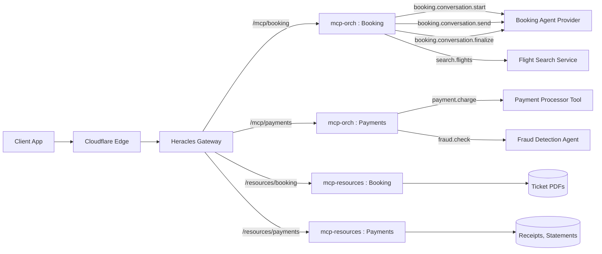

# mcp-orch.md — Olympus Seer MCP Orchestrator & Resource Service

## Table of Contents
1. [Purpose & Scope](#purpose--scope)  
2. [Primer: MCP Concepts Recap](#primer-mcp-concepts-recap)  
3. [Desired Architecture](#desired-architecture)  
4. [Backends in the Agentic World](#backends-in-the-agentic-world)  
5. [Tool Registration, Discovery & Lifecycle](#tool-registration-discovery--lifecycle)  
6. [Orchestration Responsibilities](#orchestration-responsibilities)  
7. [Interaction with Providers](#interaction-with-providers)  
8. [Protocol Integration with Heracles](#protocol-integration-with-heracles)  
9. [JSON-RPC Behavior in Orchestration](#json-rpc-behavior-in-orchestration)  
10. [Standardized Error Codes & Conventions](#standardized-error-codes--conventions)  
11. [Metrics (RPC Frame–Level)](#metrics-rpc-framelevel)  
12. [Observability & Reporting](#observability--reporting)  
13. [Security & Access Control](#security--access-control)  
14. [mcp-resources (Resource Service)](#mcp-resources-resource-service)  
15. [Operations Playbook](#operations-playbook)  
16. [Roadmap & Open Questions](#roadmap--open-questions)  

---

## Purpose & Scope

This document defines **mcp-orch** (the Orchestrator) and **mcp-resources** (the Resource Service) as part of **Olympus Seer**.  
It provides functional expectations, protocol-level details, and integration behaviors with **Heracles** (our Kong-based MCP Gateway).

- **Scope:** session orchestration, tool registration/discovery, error handling, metrics, resource serving.  
- **Not in scope:** technology stack or implementation-specific details.  
- **Audience:** platform engineers familiar with Kong/Heracles, JWT, and OTel.  

---

## Primer: MCP Concepts Recap

- **Tools:** callable units (functions, APIs, or even agents).  
- **Prompts:** templates that can be invoked as parameterized tools.  
- **Resources:** retrievable entities (e.g., tickets, PDFs).  

**Supported provider interfaces:**  
- **HTTP(S)** (request/response)  
- **Streamable HTTP** (long-lived JSON-RPC streaming over chunked HTTP)  

Why orchestration? Because MCP sessions are long-lived, multi-turn, and often involve multiple backends (tools, agents, and resource services).  

---

## Desired Architecture



This topology illustrates the end-to-end flow:  
- **Client → Cloudflare → Heracles → mcp-orch** for conversational and tool calls.  
- **Client → Cloudflare → Heracles → mcp-resources** for artifact/resource fetches.  
- Tool providers include both **simple services** (flight search, payment) and **agents** (fraud detection agent, booking agent).  

---

## Backends in the Agentic World

### Non-Agentic Providers
- Atomic functions: payment processors, flight lookup, fraud score API.  
- Stateless or short-lived, exposed via HTTP(S) or Streamable HTTP.  

### Agent Providers
- Conversational systems that expose tools.  
- Can be exposed as:  
  - **Single tool agent** (`agent.run`) → one tool handles each turn.  
  - **Multi-tool agent** (`agent.conversation.start`, `.send`, `.finalize`) → explicit lifecycle.  

**Trade-offs:**  
- Single tool: simpler client integration, less observability.  
- Multi-tool: explicit lifecycle, better policies/quotas, easier orchestration.  

---

## Tool Registration, Discovery & Lifecycle

### Registration (Provider → mcp-orch)
All tools **must** register with:  
- `name`, `namespace`, `version`, `description`.  
- `input_schema`, `output_schema`.  
- `interface`: HTTP(S) or Streamable HTTP.  
- **Access control policy** (mandatory):  
  - Allowed subjects (who may invoke).  
  - **Discoverability rules** (who may see in discovery).
  - Can use header values including `auth.session.scope` for rule evaluation.
  - **Policy engine**: OPA (Open Policy Agent) with embedded Rego policies.
  - **Policy specification**: Each tool must include Rego policy for access control and discovery.  
- `provider_id`, retry hints, SLA hints.  

### Discovery (mcp-orch → Clients)
- Aggregates all registered tools.  
- Applies **discoverability rules** → client sees only entitled tools.  
- **Templatized tool names and endpoints:** supports dynamic tool configuration using header values.
  - Tool names and endpoints can contain Mustache template variables (e.g., `{{tenant.id}}`, `{{subject.id}}`, `{{client.id}}`).
  - During discovery, mcp-orch replaces template variables with actual values from forwarded headers.
  - **Template Engine**: Mustache templates for logic-less variable substitution.
  - **Template Syntax**: `{{variable}}` format (e.g., `{{tenant.id}}`, `{{subject.id}}`).
  - Available template variables: `{{tenant.id}}`, `{{subject.id}}`, `{{client.id}}`, `{{client.app}}`, `{{auth.session.id}}`, `{{mcp.session.id}}`.
  - **Note:** `{{auth.session.scope}}` cannot be used in templates but can be used in discovery and access control rules.
- Discovery happens at session init (`initialize` / `discover`).  

### Lifecycle
- `register`, `update`, `suspend`, `resume`, `deregister`.  
- mcp-orch enforces lifecycle: unregistered or suspended tools cannot be invoked.  

---

## Orchestration Responsibilities

- Accept `X-MCP-Transport-Session` from Heracles, correlate all frames.  
- Parse JSON-RPC frames; dispatch to registered providers.  
- Forward headers:  
  - `X-MCP-Transport-Session`  
  - `X-Client-Id`  
  - `X-Client-App`
  - `X-Subject-Id`
  - `X-Authentication-Session-Id`
  - `X-Authentication-Session-Scope`
  - `X-Tenant-Id`
  - `X-Tool-Authorization` (when tool requires authorization)  
- Aggregate responses, stream partials, preserve ordering by `id`.  
- Normalize and enforce standardized error codes.  
- Support cancellation & retries.  

---

## Interaction with Providers

- Providers must implement **HTTP(S) or Streamable HTTP**.  
- mcp-orch forwards required headers:  
  - `X-MCP-Transport-Session`  
  - `X-Client-Id`  
  - `X-Client-App`
  - `X-Subject-Id`
  - `X-Authentication-Session-Id`
  - `X-Authentication-Session-Scope`
  - `X-Tenant-Id`
  - `X-Tool-Authorization` (when tool requires authorization)  
- Providers return results or progress in MCP JSON-RPC format.  
- Providers are responsible for respecting cancellations and streaming conventions.  

---

## Protocol Integration with Heracles

### Headers received from Heracles:
- `X-MCP-Transport-Session`  
- `X-Client-Id`  
- `X-Client-App`  
- `X-Subject-Id`
- `X-Authentication-Session-Id`
- `X-Authentication-Session-Scope`
- `X-Tenant-Id`
- `traceparent`, `baggage`

### Headers forwarded to tool providers:
- All headers from Heracles (as listed above)
- `X-Tool-Authorization` (JWT from Cipher for tool authorization)  

### Trailers returned to Heracles:
- `X-MCP-Result-Summary` (method, id, status, duration)  
- `X-MCP-Backend` (provider id)  
- `X-MCP-Error` (if error)  

---

## JSON-RPC Behavior in Orchestration

- Supported frame types: `request`, `result`, `error`, `progress`.  
- Session lifecycle: `initialize` → multi-turn dialogue → `finalize`.  
- Partial responses: streamed via `progress` frames.  
- Cancellation: `cancel` by id.  

---

## Standardized Error Codes & Conventions

mcp-orch aligns errors to **HTTP status conventions**:  

- `400` Invalid frame, validation failed.  
- `401/403` Unauthorized/Forbidden.  
- `404` Tool not found.  
- `409` Conflict (suspended/version mismatch).  
- `429` Rate limited / quota exceeded.  
- `408` Timeout.  
- `499` Client cancelled.  
- `502/503/504` Backend unavailable/error/timeout.  
- `500` Internal error.  

**JSON-RPC error object fields:**  
- `code`: aligned HTTP code.  
- `message`: human-readable.  
- `data`: provider_id, retry_after_ms, trace_id, details.  

---

## Metrics (RPC Frame–Level)

mcp-orch must emit detailed metrics:  

- **Per RPC call:**  
  - Latency histograms: time-to-first-byte, time-to-last-byte.  
  - Counts by outcome: success, error, cancelled, timeout.  
  - Success rate = success / total.  
  - Bytes in/out.  
  - Sub-invocations (fan-out) counts.  

- **Per session:**  
  - Concurrent sessions.  
  - Session duration.  
  - Frames per session.  

- **Per provider:**  
  - Error rates, latency p95/p99, availability.  

Metrics exported via **OTel**.  

---

## Observability & Reporting

- **Logs:** must include session id, client id, tool, provider, duration, error code.  
- **Traces:** spans per tool call, attributes for `mcp.session_id`, `provider_id`, `error.code`, `client.id`, `client.app`, `subject.id`, `auth.session.id`, `auth.session.scope`, `tenant.id`, `tool.authorization`.  
- **Trailers:** provide summaries for Heracles to enrich access logs.  

---

## Security & Access Control

- Relies on Heracles for JWT validation.  
- Enforces **per-tool access policies** from registration:  
  - Invocation rules.  
  - Discoverability rules.  
- Enforces resource scoping: resources tied to specific `<mcp-server-name>`.
- **Policy Engine Integration**: OPA (Open Policy Agent) for embedded policy evaluation.
  - **Reference**: [OPA Documentation](https://www.openpolicyagent.org/docs/)
  - **Rego Language**: [Rego Policy Language Guide](https://www.openpolicyagent.org/docs/latest/policy-language/)
  - **Java Integration**: [OPA Java SDK](https://github.com/open-policy-agent/opa-java-sdk)
  - **Policy Testing**: [OPA Test Framework](https://www.openpolicyagent.org/docs/latest/policy-testing/)
- **Policy Requirements**:
  - Each tool must provide Rego policies for access control and discovery.
  - Policies evaluated at runtime using forwarded header values.
  - Template variables supported: `{tenant.id}`, `{subject.id}`, `{client.id}`, `{client.app}`, `{auth.session.id}`, `{mcp.session.id}`.
  - `{auth.session.scope}` available for policy evaluation but not in templates.  

---

## Tool Specification Format

### JSON with Mustache Templates
- **Format**: JSON-based tool specifications with Mustache template variables.
- **Template Engine**: Mustache for logic-less variable substitution.
- **Java Libraries**: 
  - **Handlebars.java**: [https://github.com/jknack/handlebars.java](https://github.com/jknack/handlebars.java)
  - **JMustache**: [https://github.com/samskivert/jmustache](https://github.com/samskivert/jmustache)
- **Template Syntax**: `{{variable}}` format for header value substitution.

### Specification Structure
```json
{
  "name": "booking.conversation.start",
  "namespace": "booking", 
  "version": "1.0.0",
  "description": "Start booking conversation for {{tenant.id}}",
  "interface": "HTTP",
  "endpoint": "https://booking-{{tenant.id}}.example.com/api/conversation/start",
  "input_schema": {
    "type": "object",
    "properties": {
      "tenant_id": {
        "type": "string",
        "template": "{{tenant.id}}",
        "description": "Auto-populated from X-Tenant-Id header"
      }
    }
  },
  "access_control_policy": {
    "language": "rego",
    "policy": "package tool.booking\n\nallow_access {\n    input.headers[\"X-Tenant-Id\"] == \"tenant-123\"\n}"
  },
  "templates": {
    "endpoint": "https://{{tenant.id}}-booking.example.com/api/{{tool.name}}",
    "headers": {
      "X-Tenant-Context": "{{tenant.id}}",
      "X-User-Context": "{{subject.id}}"
    }
  }
}
```

### Template Variables
Available for substitution in tool specifications:
- `{{tenant.id}}` → from `X-Tenant-Id` header
- `{{subject.id}}` → from `X-Subject-Id` header  
- `{{client.id}}` → from `X-Client-Id` header
- `{{client.app}}` → from `X-Client-App` header
- `{{auth.session.id}}` → from `X-Authentication-Session-Id` header
- `{{mcp.session.id}}` → from `X-MCP-Transport-Session` header

### Template Processing
- **Registration**: Templates validated during tool registration.
- **Discovery**: Template variables replaced with actual header values.
- **Runtime**: Processed specifications used for tool invocation.

---

## Identity and Privileges of Tool Providers

### Tool Provider Identity
Every tool specification must have a corresponding tool provider application identity:
- **SPIFFE Identity**: Unique identifier for the tool provider application
- **Public Key Certificate**: Cryptographic identity for secure communication
- **Bot Identity**: Autonomous agents receive independent bot identities in Cipher IAM

### Authorization Flow
When a tool requires authorization from the subject, mcp-orch initiates an authorization dialog:

1. **Authorization Request**: mcp-orch presents authorization request to client
2. **Tool Provider Identification**: Provides names of tools requiring authorization
3. **Client Interaction**: Client contacts Cipher through MCP tools
4. **OIDC Access Grant**: Cipher presents OIDC-compliant access grant dialog
5. **User Approval**: User provides approval for requested privileges
6. **JWT Issuance**: Cipher issues JWT for tool-provider to impersonate user
7. **Acknowledgment**: Client receives acknowledgment (JWT never returned to client)

### Privilege Scoping
Privileges granted to tool-providers can be scoped to:
- **Transport Session**: Limited to current MCP transport session
- **Client Session**: Limited to current client session
- **Provider-Time-bound**: Independent of client session for specified duration (autonomous usage)
- **Provider-Perpetual**: Permanent authorization for autonomous agents

### Autonomous Agents
Tool-providers with independent privileges are classified as **autonomous agents**:
- Receive independent bot identity in Cipher IAM
- Identity associated with both tool-provider application and granting subject
- Bot represents sub-agent of the tool-provider
- Tool-provider represents itself as bot in all interactions

### Autonomous Agent Authorization Flow
For autonomous usage, tool-providers must request authorization tokens for each session:

1. **Signed Request**: Tool-provider makes signed request using SPIFFE certificate private key
2. **Request Parameters**: Includes subject-identity, session-id, and desired duration
3. **Cipher Validation**: Cipher validates the signed request and privilege grants
4. **Authorization Token**: Cipher returns authorization token for permissible duration
5. **Duration Limitation**: Token duration cannot exceed requested duration or grant limits
6. **Short Lifespan**: Authorization tokens are always short-lived (few minutes) regardless of grant duration

### Token Types
- **Grant JWT**: Long-lived or perpetual tokens stored by Cipher for privilege grants
- **Authorization JWT**: Short-lived session tokens issued to mcp-orch and tool-providers for actual usage

### Token Management
- **Grant Tokens**: Long-lived or perpetual tokens stored by Cipher, never exposed to tool-providers
- **Authorization Tokens**: Short-lived tokens (few minutes) issued to mcp-orch and tool-providers
- **Tool-Provider Tokens**: Inaccessible and unusable by any application other than tool-provider
- **Client/Transport Bound Tokens**: Retrievable only by mcp-orch, used only where permitted
- **Token Persistence**: Tool providers may not persist authorization tokens
- **Usability Checks**: mcp-orch verifies token usability before forwarding
- **Autonomous Sessions**: Each autonomous session requires fresh authorization token request

### Token Forwarding
- **Header**: JWT forwarded as `X-Tool-Authorization` HTTP header
- **Verification**: mcp-orch verifies token usability in current transport session
- **Client Transparency**: Client proceeds with tool use without presenting tokens directly

### Cipher Integration
Cipher IAM provides tools through mcp-orch for:
- **Privilege Management**: Users can manage tool-provider privileges
- **Effective Privileges**: Query available privileges for tool-providers in transport session
- **OIDC Compliance**: Full OIDC-compliant IAM service
- **Bearer Token Authentication**: Uses client's Bearer token (JWT) for user identification
- **Autonomous Authorization**: Validates signed requests from autonomous agents
- **Token Issuance**: Issues short-lived authorization tokens for tool-provider usage

### Security Model
- **Minimal Scope**: Combined usability checks and short token lifespan minimize misuse
- **Isolation**: Tokens are application-specific and non-transferable
- **Session Binding**: Transport session verification prevents token leakage
- **Audit Trail**: All privilege grants and token usage are auditable

---

## OPA Policy Engine Integration

### Embedded Policy Evaluation
- **Architecture**: OPA embedded within mcp-orch for high-performance policy evaluation.
- **Policy Language**: Rego for declarative access control and discovery rules.
- **Evaluation Context**: Policies receive forwarded header values and tool metadata.

### Policy Specification Requirements
- **Access Control Policy**: Mandatory Rego policy for tool invocation authorization.
- **Discovery Policy**: Optional Rego policy for tool visibility in discovery responses.
- **Policy Validation**: Syntax validation during tool registration.
- **Template Support**: Dynamic policy evaluation using header values.

### Developer Resources
- **OPA Documentation**: [https://www.openpolicyagent.org/docs/](https://www.openpolicyagent.org/docs/)
- **Rego Language Reference**: [https://www.openpolicyagent.org/docs/latest/policy-language/](https://www.openpolicyagent.org/docs/latest/policy-language/)
- **Java Integration Guide**: [https://github.com/open-policy-agent/opa-java-sdk](https://github.com/open-policy-agent/opa-java-sdk)
- **Policy Testing**: [https://www.openpolicyagent.org/docs/latest/policy-testing/](https://www.openpolicyagent.org/docs/latest/policy-testing/)
- **Performance Tuning**: [https://www.openpolicyagent.org/docs/latest/performance/](https://www.openpolicyagent.org/docs/latest/performance/)

### Policy Context Variables
Available in policy evaluation:
- `input.headers["X-Tenant-Id"]` → tenant context
- `input.headers["X-Subject-Id"]` → user identity
- `input.headers["X-Client-Id"]` → client application
- `input.headers["X-Authentication-Session-Scope"]` → session permissions
- `input.tool.namespace` → tool namespace
- `input.tool.version` → tool version

---

## mcp-resources (Resource Service)

- Independent service serving artifacts.  
- Path convention: `/resources/<mcp-server-name>/…`.  
- Must accept headers: `X-MCP-Transport-Session`, `X-Client-Id`, `X-Client-App`, `X-Subject-Id`, `X-Authentication-Session-Id`, `X-Authentication-Session-Scope`, `X-Tenant-Id`, `X-Tool-Authorization`.  
- Supports caching, audit logging, range requests.  
- Emits latency/size metrics.  

---

## Operations Playbook

- Debugging: invalid frames, missing trailers, unregistered tools.  
- Runbooks: retries, degraded backend modes, provider circuit breaking.  
- Dashboards: per-tool success rate, session concurrency, error % by HTTP code.  

---

## Roadmap & Open Questions

- Standardization of tool access control schemas.  
- Signed registration manifests.  
- Multi-region orchestration, session stickiness.  
- Standard for conversational agent registration (single-tool vs multi-tool lifecycle).  
- Audit/replay support for MCP sessions.
- **OPA Policy Management**:
  - Policy versioning and rollback strategies.
  - Centralized policy distribution and updates.
  - Policy performance optimization and caching.
  - **Reference**: [OPA Policy Management](https://www.openpolicyagent.org/docs/latest/management/)  

---
