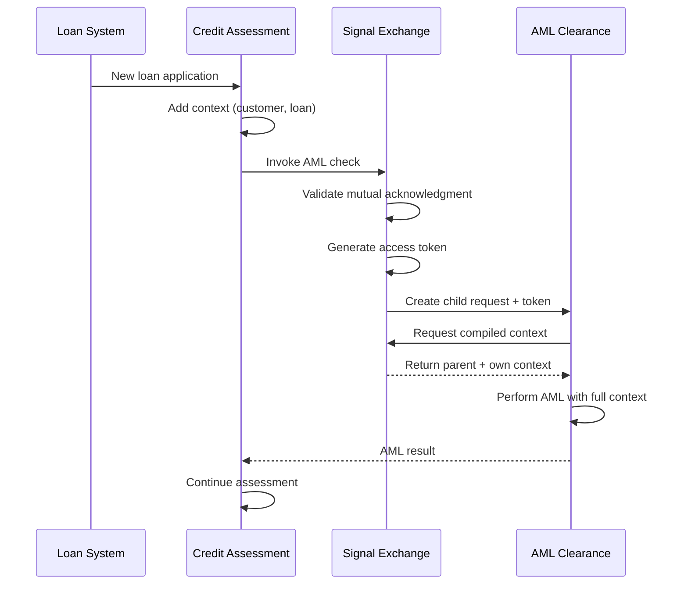

# Cross-Workbench Context Sharing Pattern

> **Status:** ✅ Complete  
> **Category:** Workbench Composition Pattern

---

## Overview

**Cross-Workbench Context Sharing** is a composite pattern that enables parent-child request relationships across workbench boundaries. Unlike the Workbench as Machine pattern (which treats cross-workbench invocations as external calls), this pattern creates true parent-child relationships with context inheritance and lifecycle cascade.

---

## The Premise

Enterprise operations often span multiple domains, each managed in its own workbench. Consider these scenarios:

- **Credit Assessment** in Retail Loans needs **AML Clearance** from Customer Lifecycle Operations
- **Loan Origination** needs **Collateral Valuation** from Treasury Operations
- **Fraud Investigation** needs **Customer Verification** from Identity Services

In each case:
1. The child operation needs access to the parent's context
2. The parent needs to know when the child completes
3. Both need to operate within their own domain's policies

Without cross-workbench context sharing, developers must manually serialize and forward context, and there's no automatic lifecycle coordination.

---

## How It Works

```
┌─────────────────────────────────────────────────────────────────────────────┐
│                    CROSS-WORKBENCH CONTEXT SHARING PATTERN                   │
├─────────────────────────────────────────────────────────────────────────────┤
│                                                                              │
│   WORKBENCH A (Parent)                  WORKBENCH B (Child)                  │
│   ────────────────────                  ───────────────────                  │
│                                                                              │
│   ┌─────────────────────┐               ┌─────────────────────┐             │
│   │ WorkbenchContext    │               │ WorkbenchContext    │             │
│   │ SharingSpec         │               │ SharingSpec         │             │
│   │                     │               │                     │             │
│   │ child_contexts:     │  ◀──mutual──▶ │ parent_contexts:    │             │
│   │   - workbench: B    │  acknowledge  │   - workbench: A    │             │
│   └─────────────────────┘               └─────────────────────┘             │
│                                                                              │
│   ┌─────────────────────┐               ┌─────────────────────┐             │
│   │ Parent Request      │               │ Child Request       │             │
│   │                     │   creates     │                     │             │
│   │ Context:            │ ────────────▶ │ cross_workbench:    │             │
│   │   verified_facts    │               │   parent_wb: A      │             │
│   │   constraints       │               │   token: JWT        │             │
│   └────────┬────────────┘               └──────────┬──────────┘             │
│            │                                       │                         │
│            │  ◀─── context access via token ─────  │                         │
│            │                                       │                         │
│            │  ◀─── lifecycle cascade (best-effort) │                         │
│            ▼                                       ▼                         │
│   ┌─────────────────────┐               ┌─────────────────────┐             │
│   │ Parent COMPLETED    │   notifies    │ Child COMPLETED     │             │
│   │                     │ ────────────▶ │ (PARENT_COMPLETED)  │             │
│   └─────────────────────┘               └─────────────────────┘             │
│                                                                              │
└──────────────────────────────────────────────────────────────────────────────┘
```

### Key Mechanisms

| Mechanism | Description |
|-----------|-------------|
| **Mutual Acknowledgment** | Both workbenches must configure reciprocal sharing |
| **Access Tokens** | JWT tokens grant child access to parent context |
| **Per-Workbench Depth** | Depth limits apply within each workbench |
| **Best-Effort Cascade** | Parent completion cascades to children asynchronously |

---

## Pattern Structure

### Configuration Components

| Component | Purpose |
|-----------|---------|
| `WorkbenchContextSharingSpec` | Workbench-level sharing configuration |
| `ScenarioAutomationSpec.contextSharing` | Scenario-level extension (union with workbench) |

### Runtime Components

| Component | Purpose |
|-----------|---------|
| Signal Exchange | Validates sharing config; creates cross-workbench requests |
| Request Lifecycle Manager | Compiles context from ancestor workbenches |
| Access Tokens | Secure cross-workbench context access |
| Notification Service | Cascade lifecycle events |

---

## When to Use This Pattern

### Use Cross-Workbench Context Sharing When:

| Scenario | Example |
|----------|---------|
| Child needs parent's full context | AML check needs loan details |
| Lifecycle coordination required | Cancel child when parent cancels |
| Multi-domain process with handoffs | Investigation spanning departments |
| Accumulated context matters | Each stage adds to shared context |

### Use Workbench as Machine Instead When:

| Scenario | Example |
|----------|---------|
| Simple tool invocation | Call validation service |
| No context needed | Fire-and-forget notification |
| Independent lifecycle | Child can continue after parent completes |
| Cross-subscription | Different billing/trust boundaries |

---

## Pattern Comparison

| Aspect | Workbench as Machine | Cross-Workbench Context Sharing |
|--------|---------------------|--------------------------------|
| **Request relationship** | Independent | Parent-child |
| **Context access** | Explicit forwarding | Automatic inheritance |
| **Lifecycle coupling** | None | Cascade on completion/cancel |
| **Configuration** | Machine registration | WorkbenchContextSharingSpec |
| **Subscription constraint** | Can be cross-subscription | Same subscription only |
| **Use case** | Reusable services | Collaborative processes |

---

## Architecture Components

### WorkbenchContextSharingSpec

```yaml
apiVersion: hub.olympus.io/v1
kind: WorkbenchContextSharingSpec
metadata:
  name: retail-loans-context-sharing
spec:
  workbench_ref:
    name: retail-loans-workbench
    subscription_id: sub-acme-prod
  
  parent_contexts:     # Who can be parent of this workbench
    - type: workbench | scenario
      workbench_ref: { name, subscription_id }
      scenario_ref: { name }  # Only for type: scenario
      enabled: boolean
  
  child_contexts:      # Where this workbench can create children
    - type: workbench | scenario
      workbench_ref: { name, subscription_id }
      scenario_ref: { name }
      enabled: boolean
```

### Cross-Workbench Request Fields

```yaml
request:
  id: "req-child-001"
  workbench_id: "customer-lifecycle-ops"
  
  hierarchy:
    parent_request_id: "req-parent-001"
    depth: 0                    # Resets per workbench
  
  cross_workbench:
    parent_workbench_id: "retail-loans-workbench"
    global_depth: 1             # Total across workbenches
    ancestor_context_tokens:
      - workbench_id: "retail-loans-workbench"
        token: "eyJhbGciOiJSUzI1NiIs..."
        scope: ["req-parent-001"]
```

---

## Step-by-Step Implementation

### Step 1: Configure Parent Workbench

```yaml
# parent-workbench-sharing.yaml
apiVersion: hub.olympus.io/v1
kind: WorkbenchContextSharingSpec
metadata:
  name: retail-loans-context-sharing
spec:
  workbench_ref:
    name: retail-loans-workbench
    subscription_id: sub-acme-prod
  
  parent_contexts: []
  
  child_contexts:
    - type: scenario
      workbench_ref:
        name: customer-lifecycle-ops
        subscription_id: sub-acme-prod
      scenario_ref:
        name: aml-clearance-check
      enabled: true
```

### Step 2: Configure Child Workbench

```yaml
# child-workbench-sharing.yaml
apiVersion: hub.olympus.io/v1
kind: WorkbenchContextSharingSpec
metadata:
  name: customer-ops-context-sharing
spec:
  workbench_ref:
    name: customer-lifecycle-ops
    subscription_id: sub-acme-prod
  
  parent_contexts:
    - type: scenario
      workbench_ref:
        name: retail-loans-workbench
        subscription_id: sub-acme-prod
      scenario_ref:
        name: credit-assessment
      enabled: true
  
  child_contexts: []
```

### Step 3: Deploy and Verify

```bash
kubectl apply -f parent-workbench-sharing.yaml
kubectl apply -f child-workbench-sharing.yaml

# Check for mutual acknowledgment
kubectl describe workbenchcontextsharingspec retail-loans-context-sharing
```

### Step 4: Access Context in Child

```python
# In child Hub Application
async def handle_request(request: Request):
    # Get compiled context including cross-workbench parent
    context = await request.get_compiled_context()
    
    # Access parent's verified facts
    for ancestor in context.ancestor_context:
        if ancestor.workbench_id == "retail-loans-workbench":
            loan_facts = ancestor.context.verified_facts
            # Use parent context...
```

---

## Example: Retail Loans AML Clearance

### Business Scenario

Credit assessment in Retail Loans needs AML clearance from Customer Lifecycle Operations. The AML agent needs access to:
- Customer identity
- Loan amount and purpose
- Existing constraints

### Flow Diagram



### Context Flow

```yaml
# Parent request context (R-A in retail-loans)
context:
  verified_facts:
    - type: customer_identity
      customer_id: "cust-12345"
    - type: loan_application
      loan_amount: 500000
      loan_purpose: "home_purchase"
  constraints:
    - "Requires AML clearance"

# Child request compiled context (R-B in customer-ops)
compiled_context:
  ancestor_context:
    - request_id: "R-A"
      workbench_id: "retail-loans-workbench"  # Cross-workbench!
      context:
        verified_facts:
          - type: customer_identity
            customer_id: "cust-12345"
          - type: loan_application
            loan_amount: 500000
  current_context:
    request_id: "R-B"
    workbench_id: "customer-lifecycle-ops"
    context:
      verified_facts: []  # AML agent will add
```

---

## Best Practices

### Configuration

| Do | Don't |
|----|-------|
| ✅ Use scenario-level sharing when possible | ❌ Share with entire workbench unnecessarily |
| ✅ Test mutual acknowledgment before deployment | ❌ Deploy one side without the other |
| ✅ Keep both configs in same repo/PR | ❌ Split configuration across teams |
| ✅ Monitor cascade completion rates | ❌ Ignore orphaned child requests |

### Development

| Do | Don't |
|----|-------|
| ✅ Handle context unavailability gracefully | ❌ Assume context will always be available |
| ✅ Add only necessary facts to context | ❌ Bloat context with unneeded data |
| ✅ Design for async lifecycle cascade | ❌ Expect synchronous parent notification |
| ✅ Use compiled-context API | ❌ Try to fetch parent context directly |

---

## Related Documentation

- [Cross-Workbench Context Sharing Concept](../02-system-design/implementation-concepts/workbench-context-sharing.md) — Core concept
- [Request Hierarchy](../04-subsystems/request-management/request-hierarchy.md) — Technical details
- [Workbench as Machine](./workbench-as-a-machine.md) — Alternative pattern
- [Cross-Workbench Context Sharing Guide](../10-guides/cross-workbench-context-sharing-guide.md) — Step-by-step guide
- [ADR-0115: Cross-Workbench Context Sharing](../decision-logs/0115-cross-workbench-context-sharing.md) — Decision rationale
