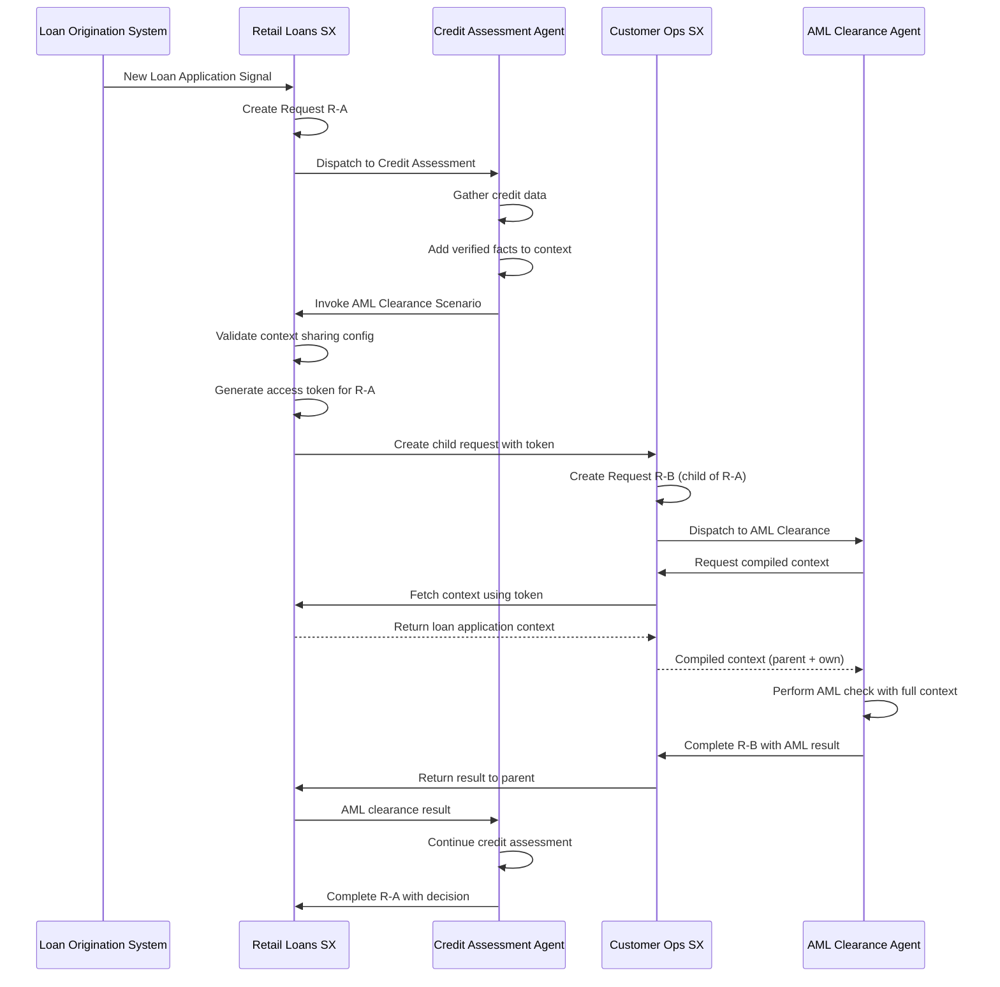

# Cross-Workbench Context Sharing Guide

> **Status:** ✅ Complete  
> **Audience:** Process Architects, Developers  
> **Prerequisites:** Understanding of [Request Hierarchy](../04-subsystems/request-management/request-hierarchy.md) and [Scenarios](../01-concepts/ontology-reference.md)

---

## Overview

This guide walks you through configuring cross-workbench context sharing, which enables parent-child request relationships across workbench boundaries. This is useful when agents in different operational domains need to collaborate with shared context.

---

## Quick Start

**Minimal Example:** Enable scenario A in Workbench 1 to create child requests in scenario B in Workbench 2:

```yaml
# Workbench 1: Allow creating children in Workbench 2
apiVersion: hub.olympus.io/v1
kind: WorkbenchContextSharingSpec
metadata:
  name: wb1-context-sharing
spec:
  workbench_ref:
    name: workbench-1
    subscription_id: sub-prod
  child_contexts:
    - type: scenario
      workbench_ref:
        name: workbench-2
        subscription_id: sub-prod
      scenario_ref:
        name: scenario-b
      enabled: true
---
# Workbench 2: Accept parents from Workbench 1
apiVersion: hub.olympus.io/v1
kind: WorkbenchContextSharingSpec
metadata:
  name: wb2-context-sharing
spec:
  workbench_ref:
    name: workbench-2
    subscription_id: sub-prod
  parent_contexts:
    - type: scenario
      workbench_ref:
        name: workbench-1
        subscription_id: sub-prod
      scenario_ref:
        name: scenario-a
      enabled: true
```

**Key Requirements:**
- Both workbenches must be in the same subscription
- Both sides must configure (mutual acknowledgment)
- Deploy both CRDs before invoking cross-workbench scenarios

---

## When to Use Cross-Workbench Context Sharing

### Good Use Cases

| Scenario | Why Cross-Workbench Context Sharing |
|----------|-------------------------------------|
| Credit assessment needs AML clearance | AML agent needs loan application context |
| Loan origination needs collateral valuation | Valuation agent needs loan and customer context |
| Fraud investigation needs customer verification | Verification agent needs case context |
| Multi-department process requiring handoffs | Each department needs to see accumulated context |

### When NOT to Use

| Scenario | Alternative |
|----------|-------------|
| Simple tool invocation without context needs | Use [Workbench as Machine](../02-system-design/implementation-concepts/workbench-as-machine.md) |
| Fire-and-forget requests | Use Machine/Tool pattern |
| Different subscriptions | Not supported; use explicit context forwarding |

---

## Step-by-Step Configuration

### Step 1: Identify the Workbenches and Scenarios

Determine:
- **Parent Workbench**: Where the initiating request lives
- **Child Workbench**: Where the child request will be created
- **Specific Scenarios** (optional): If only specific scenarios should share context

**Example:**
- Parent: `retail-loans-workbench` → `credit-assessment` scenario
- Child: `customer-lifecycle-ops` → `aml-clearance-check` scenario

### Step 2: Verify Same Subscription

Both workbenches must be in the same subscription. Cross-subscription context sharing is not supported.

```bash
# Verify workbenches are in same subscription
kubectl get workbench retail-loans-workbench -o jsonpath='{.spec.subscription_id}'
kubectl get workbench customer-lifecycle-ops -o jsonpath='{.spec.subscription_id}'
```

### Step 3: Create Parent Workbench Configuration

Create `WorkbenchContextSharingSpec` for the parent workbench:

```yaml
# retail-loans-context-sharing.yaml
apiVersion: hub.olympus.io/v1
kind: WorkbenchContextSharingSpec
metadata:
  name: retail-loans-context-sharing
  namespace: acme-bank
  labels:
    hub.olympus.io/workbench: retail-loans-workbench
spec:
  workbench_ref:
    name: retail-loans-workbench
    subscription_id: sub-acme-prod
  
  # This workbench doesn't accept parents from other workbenches
  parent_contexts: []
  
  # This workbench can create children in customer-lifecycle-ops
  child_contexts:
    - type: scenario                        # Specific scenario
      workbench_ref:
        name: customer-lifecycle-ops
        subscription_id: sub-acme-prod
      scenario_ref:
        name: aml-clearance-check           # Only this scenario
      enabled: true
```

### Step 4: Create Child Workbench Configuration

Create `WorkbenchContextSharingSpec` for the child workbench:

```yaml
# customer-ops-context-sharing.yaml
apiVersion: hub.olympus.io/v1
kind: WorkbenchContextSharingSpec
metadata:
  name: customer-ops-context-sharing
  namespace: acme-bank
  labels:
    hub.olympus.io/workbench: customer-lifecycle-ops
spec:
  workbench_ref:
    name: customer-lifecycle-ops
    subscription_id: sub-acme-prod
  
  # This workbench accepts parents from retail-loans
  parent_contexts:
    - type: scenario                        # Specific scenario
      workbench_ref:
        name: retail-loans-workbench
        subscription_id: sub-acme-prod
      scenario_ref:
        name: credit-assessment             # Only from this scenario
      enabled: true
  
  # This workbench doesn't create children in other workbenches
  child_contexts: []
```

### Step 5: Deploy Both Configurations

```bash
kubectl apply -f retail-loans-context-sharing.yaml
kubectl apply -f customer-ops-context-sharing.yaml
```

### Step 6: Verify Mutual Acknowledgment

Check that both sides are configured correctly:

```bash
# Check for warnings about one-sided configuration
kubectl describe workbenchcontextsharingspec retail-loans-context-sharing
kubectl describe workbenchcontextsharingspec customer-ops-context-sharing
```

If you see warnings like "CONTEXT_SHARING_ONE_SIDED", the reciprocal configuration is missing.

### Step 7: Test the Configuration

Invoke the child scenario from the parent and verify context inheritance:

```python
# In credit-assessment Hub Application
async def handle_loan_application(request: Request):
    # Gather initial context
    await request.add_verified_fact({
        "type": "loan_application",
        "customer_id": "cust-12345",
        "loan_amount": 500000,
        "loan_purpose": "home_purchase"
    })
    
    # Invoke AML check in customer-lifecycle-ops
    # This creates a cross-workbench child request with automatic context inheritance
    aml_result = await self.invoke_scenario(
        workbench="customer-lifecycle-ops",
        scenario="aml-clearance-check",
        input={"customer_id": "cust-12345"}
        # Parent context (loan_application facts) automatically available to child
        # via access token - no need to manually forward
    )
    
    # Continue with credit assessment using AML result...
```

In the child scenario, verify context is accessible:

```python
# In aml-clearance-check Hub Application
async def handle_aml_check(request: Request):
    # Access parent context via compiled-context
    context = await request.get_compiled_context()
    
    # Parent context is available!
    parent_facts = context.ancestor_context[0].context.verified_facts
    loan_amount = next(
        f["loan_amount"] for f in parent_facts 
        if f["type"] == "loan_application"
    )
    
    # Perform AML check with full context
    result = await self.perform_aml_screening(
        customer_id=request.input["customer_id"],
        transaction_amount=loan_amount
    )
    
    return result
```

---

## Real-World Example: Retail Loans AML Clearance

### Business Context

**Retail Loans Workbench** handles loan origination and credit assessment. When processing a new loan request, the Credit Assessment scenario needs AML (Anti-Money Laundering) clearance from the **Customer Lifecycle Operations Workbench**.

The AML agent needs access to:
- Customer identity information
- Loan amount and purpose
- Any existing constraints or flags

### Architecture

```
┌─────────────────────────────────────────────────────────────────────────────┐
│                        CROSS-WORKBENCH FLOW                                  │
│                                                                              │
│   RETAIL LOANS WORKBENCH                CUSTOMER LIFECYCLE OPS               │
│   ──────────────────────                ──────────────────────               │
│                                                                              │
│   ┌───────────────────────┐             ┌───────────────────────┐           │
│   │  Loan Origination     │             │  AML Clearance        │           │
│   │  System               │             │  Scenario             │           │
│   └──────────┬────────────┘             └───────────────────────┘           │
│              │                                     ▲                         │
│              ▼                                     │                         │
│   ┌───────────────────────┐                        │                         │
│   │  Credit Assessment    │   Cross-WB Request     │                         │
│   │  Request (R-A)        │ ───────────────────────┘                         │
│   │                       │         │                                        │
│   │  Context:             │         │     ┌───────────────────────┐         │
│   │  - Customer ID        │         └────▶│  AML Check            │         │
│   │  - Loan Amount        │               │  Request (R-B)        │         │
│   │  - Loan Purpose       │               │  (child of R-A)       │         │
│   │  - Income Data        │               │                       │         │
│   └───────────────────────┘               │  Can access R-A       │         │
│                                           │  context via token    │         │
│                                           └───────────────────────┘         │
│                                                                              │
└──────────────────────────────────────────────────────────────────────────────┘
```

### Configuration Files

#### 1. Retail Loans WorkbenchContextSharingSpec

```yaml
apiVersion: hub.olympus.io/v1
kind: WorkbenchContextSharingSpec
metadata:
  name: retail-loans-context-sharing
  namespace: acme-bank
spec:
  workbench_ref:
    name: retail-loans-workbench
    subscription_id: sub-acme-prod
  
  parent_contexts: []
  
  child_contexts:
    - type: scenario
      workbench_ref:
        name: customer-lifecycle-ops
        subscription_id: sub-acme-prod
      scenario_ref:
        name: aml-clearance-check
      enabled: true
```

#### 2. Customer Lifecycle Ops WorkbenchContextSharingSpec

```yaml
apiVersion: hub.olympus.io/v1
kind: WorkbenchContextSharingSpec
metadata:
  name: customer-ops-context-sharing
  namespace: acme-bank
spec:
  workbench_ref:
    name: customer-lifecycle-ops
    subscription_id: sub-acme-prod
  
  parent_contexts:
    - type: scenario
      workbench_ref:
        name: retail-loans-workbench
        subscription_id: sub-acme-prod
      scenario_ref:
        name: credit-assessment
      enabled: true
  
  child_contexts: []
```

#### 3. Credit Assessment ScenarioAutomationSpec (optional extension)

```yaml
apiVersion: hub.olympus.io/v1
kind: ScenarioAutomationSpec
metadata:
  name: credit-assessment-automation
  namespace: retail-loans-workbench
spec:
  normative_ref:
    name: credit-assessment-normative
    version: "1.0.0"
  
  application:
    ref:
      name: credit-assessment-agent
    runtime: seer
  
  triggers:
    - id: loan-application-received
      signal_source: loan-origination-system
  
  # Optional: extend workbench-level context sharing
  contextSharing:
    child_contexts:
      - type: scenario
        workbench_ref:
          name: customer-lifecycle-ops
        scenario_ref:
          name: aml-clearance-check
```

### Request Flow



### Context Inheritance in Action

When the AML agent requests compiled context:

```yaml
# GET /requests/R-B/compiled-context

response:
  request_id: "R-B"
  workbench_id: "customer-lifecycle-ops"
  
  ancestor_context:
    - request_id: "R-A"
      workbench_id: "retail-loans-workbench"  # Cross-workbench parent
      depth: 0
      context:
        version: "v2"
        verified_facts:
          - type: customer_identity
            customer_id: "cust-12345"
            verified: true
          - type: loan_application
            loan_amount: 500000
            loan_purpose: "home_purchase"
            applicant_income: 120000
        constraints:
          - "Loan requires AML clearance"
          - "Loan requires credit score > 700"
  
  current_context:
    request_id: "R-B"
    workbench_id: "customer-lifecycle-ops"
    depth: 0  # First request in this workbench
    context:
      version: "v1"
      verified_facts: []  # Initially empty, AML agent will add
```

### Lifecycle Cascade

When the Credit Assessment completes or cancels R-A:

1. R-B in Customer Lifecycle Ops is notified (best-effort)
2. R-B is marked as COMPLETED/CANCELLED with reason PARENT_COMPLETED/PARENT_CANCELLED
3. Access tokens for R-A are revoked
4. Any pending work in R-B is terminated gracefully

---

## Troubleshooting

### Issue: Child Request Not Created

**Symptoms:** Invoking cross-workbench scenario returns "context sharing not configured"

**Check:**
1. Both `WorkbenchContextSharingSpec` resources exist
2. Mutual acknowledgment is configured (parent lists child, child lists parent)
3. Both have `enabled: true`
4. Subscription IDs match

```bash
kubectl get workbenchcontextsharingspec -A
kubectl describe workbenchcontextsharingspec <name>
```

### Issue: Context Not Available

**Symptoms:** Child request cannot access parent context

**Check:**
1. Access token is present in child request
2. Parent request is still active (not completed/cancelled)
3. Token has not expired
4. Token signature is valid (JWT validation)

```yaml
# Check child request for token
kubectl get request R-B -o yaml | grep -A 10 ancestor_context_tokens
```

**If token validation fails:**
- Verify parent workbench's Request Lifecycle Manager is accessible
- Check token expiration time
- Verify parent request hasn't been completed/cancelled

### Issue: Cascade Not Working

**Symptoms:** Parent completes but child remains active

**Check:**
1. Network connectivity between workbenches
2. Notification service is running
3. Check for orphaned child requests

```bash
# Find potentially orphaned requests
kubectl get requests -l 'cross_workbench.orphaned=true'
```

---

## Best Practices

### Do's

| Practice | Reason |
|----------|--------|
| ✅ Use scenario-level sharing when possible | More secure; limits exposure |
| ✅ Test mutual acknowledgment before deployment | Avoid runtime failures |
| ✅ Monitor cascade completion rates | Catch network issues early |
| ✅ Design for context unavailability | Handle parent completion gracefully |
| ✅ Keep context minimal | Only add what child needs |

### Don'ts

| Anti-Pattern | Consequence |
|--------------|-------------|
| ❌ Share with entire workbench unnecessarily | Over-exposure of context |
| ❌ Assume context will always be available | Breaks when parent completes |
| ❌ Create deep cross-workbench chains | Latency and complexity |
| ❌ Forget to configure both sides | Runtime failures |

---

## Related Documentation

- [Cross-Workbench Context Sharing Concept](../02-system-design/implementation-concepts/workbench-context-sharing.md)
- [Request Hierarchy](../04-subsystems/request-management/request-hierarchy.md)
- [Workbench as Machine](../02-system-design/implementation-concepts/workbench-as-machine.md) — Alternative pattern
- [ADR-0115: Cross-Workbench Context Sharing](../decision-logs/0115-cross-workbench-context-sharing.md)
