# Guide: From Idea to Deployment with DevOps Workbench

> **Status:** 🟡 Draft  
> **Audience:** Automation Product Owner, Process Architect, Developer  
> **Last Updated:** 2026-01-09

---

## Table of Contents

1. [Overview](#overview)
2. [Key Concepts](#key-concepts)
3. [The Journey at a Glance](#the-journey-at-a-glance)
4. [Stage 1: Idea](#stage-1-idea)
5. [Stage 2: Intent](#stage-2-intent)
6. [Stage 3: Charter](#stage-3-charter)
7. [Stage 4: Design](#stage-4-design)
8. [Stage 5: Build](#stage-5-build)
9. [Stage 6: Test](#stage-6-test)
10. [Stage 7: Promote](#stage-7-promote)
11. [Stage 8: Deploy](#stage-8-deploy)
12. [Stage 9: Run](#stage-9-run)
13. [Stage 10: Evolve](#stage-10-evolve)
14. [Summary](#summary)
15. [Appendix: Creating a New Workbench](#appendix-creating-a-new-workbench-greenfield)

---

## Overview

This guide walks you through the complete journey of turning a business idea into a deployed automation capability. At each stage, we show how the **DevOps Workbench** — an AI-powered development assistant — accelerates your work while keeping you in control.

Whether you're building conventional rule-based automation or cognitive agentic systems, this guide shows how Hub and Seer work together to move you from concept to production.

---

## Key Concepts

Before diving in, here are the essential concepts you'll encounter. Each is explained briefly here; follow the links for full documentation.

### Workbench Types

| Workbench | What It Is | Your Role |
|-----------|------------|-----------|
| **Business Workbench** | Where your automation runs. Contains scenarios, applications, knowledge, and memory for a business domain (e.g., "Dispute Resolution"). | You operate here daily. |
| **DevOps Workbench** | An AI-powered assistant workbench that helps you build and evolve your Business Workbench. Contains AI agents that draft artifacts, scaffold code, and create Pull Requests. | You review and approve AI work. |

The DevOps Workbench connects to your Business Workbench via two "machines":
- **`{workbench}-gateway`** — Reads knowledge, memory, and scenario data from Business Workbench
- **`{workbench}-git`** — Commits CRDs and code to Business Workbench's Git repository

→ *Further reading: [DevOps Workbench Pattern](../09-composite-systems-and-patterns/devops-workbench/README.md)*

### Personas

| Persona | Responsibility |
|---------|----------------|
| **Automation Product Owner** | Owns the business case. Decides what to automate and why. |
| **Process Architect** | Designs the scenario. Defines how work flows and what rules apply. |
| **Developer** | Implements the automation. Writes code and configures tools. |
| **Supervisor** | Operates the automation. Manages queues, agents, and escalations. |

→ *Further reading: [Hub Personas](../08-personas-and-journeys/personas/README.md)*

### The Ideation Pipeline

Ideas progress through three stages before development begins:

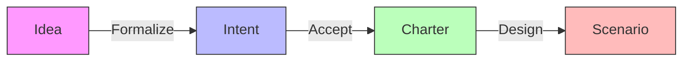

| Stage | What It Is | Who Creates It |
|-------|------------|----------------|
| **Idea** | An informal opportunity — a problem, observation, or suggestion. | Anyone |
| **Intent** | A formalized business case with success criteria. | Automation Product Owner |
| **Charter** | A design contract — the Intent accepted by Process Architect. | Process Architect |

→ *Further reading: [Automation Ideation Subsystem](../04-subsystems/automation-ideation/README.md)*

### Automation Approaches

At the Charter stage, you choose an automation approach:

| Approach | When to Use | Runtime |
|----------|-------------|---------|
| **Conventional** | Clear rules, deterministic logic, structured workflows | Atlantis (rules), Rhea (workflow), Perseus (batch) |
| **Agentic** | Requires reasoning, judgment, unstructured inputs | Seer (AI agents) |
| **Hybrid** | Some tasks conventional, some agentic | Mixed runtimes |

→ *Further reading: [Automation Lifecycle](../08-personas-and-journeys/journeys/automation-lifecycle.md)*

---

## The Journey at a Glance

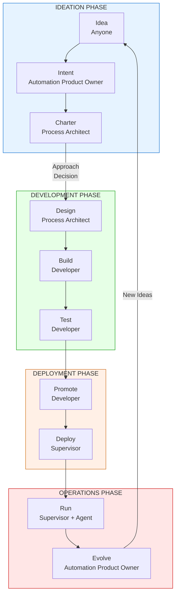

| Stage | Primary Persona | Business Workbench | DevOps Workbench |
|-------|-----------------|-------------------|------------------|
| **1. Idea** | Anyone → Automation Product Owner | Idea submitted | Idea Triage scenario runs |
| **2. Intent** | Automation Product Owner | — | Intent Drafting scenario runs |
| **3. Charter** | Process Architect | — | Intent Review scenario runs |
| **4. Design** | Process Architect | CRDs merged to Git | Scenario Drafting scenario runs |
| **5. Build** | Developer | CRDs + code merged to Git | App Scaffolding scenario runs |
| **6. Test** | Developer | CI runs, tests execute | Test Diagnosis scenario runs (on failure) |
| **7. Promote** | Developer | Artifacts promoted | Promotion Review scenario runs |
| **8. Deploy** | Supervisor | Scenario activated | — |
| **9. Run** | Supervisor, Agent | Automation operates | — |
| **10. Evolve** | Automation Product Owner | Feedback collected | Feedback Triage scenario runs |

---

## Stage 1: Idea

**Goal:** Capture a potential automation opportunity.

**Where it happens:**
- **Business Workbench:** Idea submitted via Automation Product Desk
- **DevOps Workbench:** Idea Triage scenario processes the submission

### What Happens

Anyone in your organization can submit an idea — a problem they've observed, a suggestion for improvement, or an opportunity for automation.

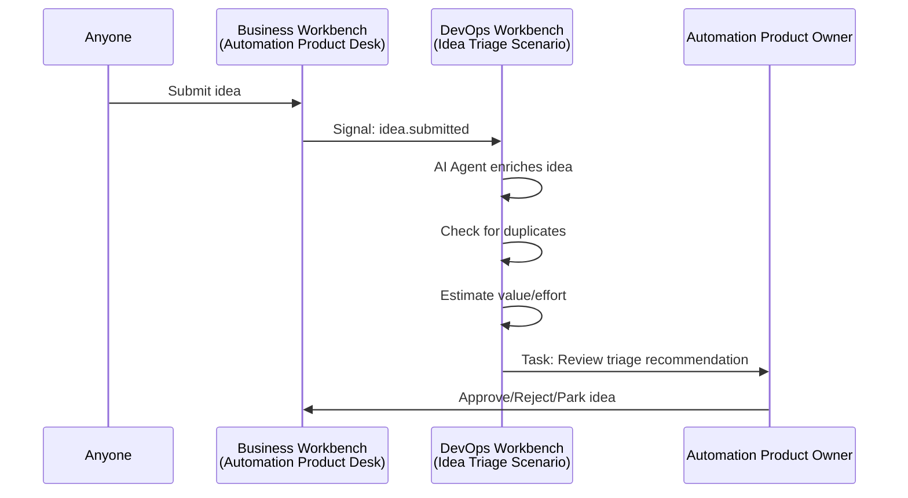

### AI Agent Contribution (DevOps Workbench)

The Idea Triage scenario runs in the DevOps Workbench:

1. **Enriches** the idea with context from the Business Workbench's knowledge bank
2. **Checks for duplicates** against existing ideas and scenarios
3. **Estimates** value and effort based on similar past automations
4. **Recommends** action: formalize, park, or reject

### Your Action (Automation Product Owner)

Review the AI-assisted triage in your task queue. The AI provides a recommendation with reasoning — you decide whether to accept, modify, or override it.

### Output

```yaml
idea:
  id: "IDEA-2026-0142"
  title: "Automate refund eligibility checking"
  status: approved_for_formalization
  
  ai_analysis:
    value_estimate: high
    effort_estimate: medium
    duplicate_check: "No duplicates found"
    recommendation: "Formalize as intent — clear ROI, aligns with dispute SLAs"
    confidence: 0.87
```

---

## Stage 2: Intent

**Goal:** Create a formalized business case with success criteria.

**Where it happens:**
- **Business Workbench:** Intent stored in Automation Ideation subsystem
- **DevOps Workbench:** Intent Drafting scenario assists the Automation Product Owner

### What Happens

The Automation Product Owner transforms the approved idea into a structured Intent with clear business justification, success criteria, and scope.

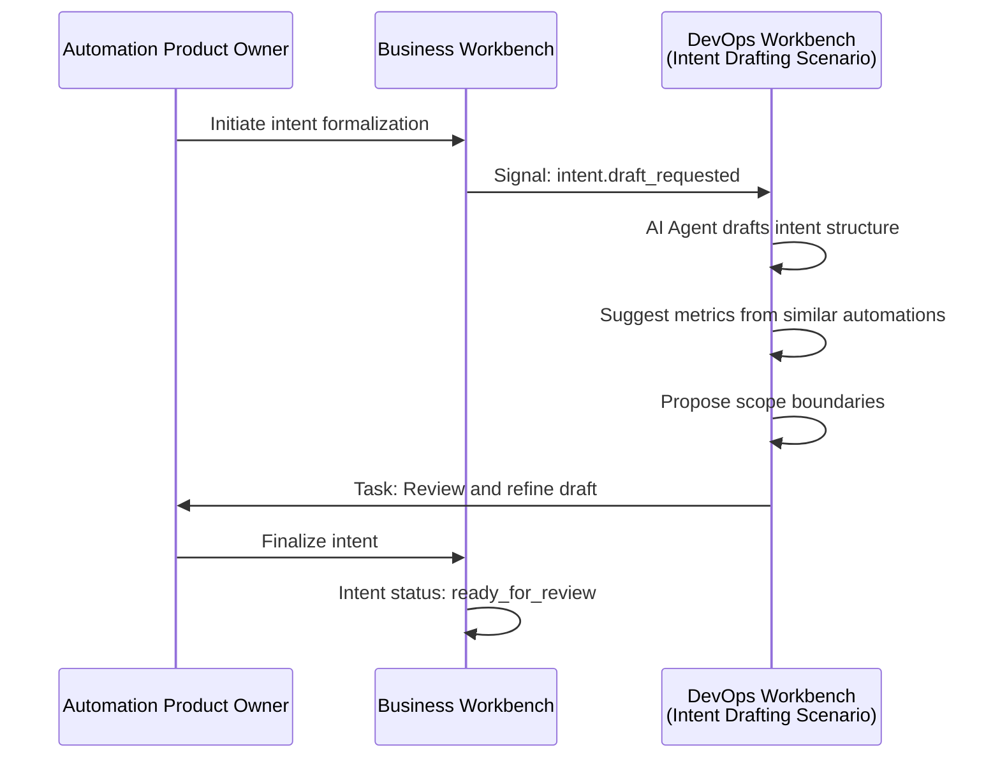

### AI Agent Contribution (DevOps Workbench)

The Intent Drafting scenario:

1. **Generates** initial intent structure from idea context
2. **Suggests** success metrics based on similar past automations in the Business Workbench
3. **Proposes** scope boundaries and out-of-scope items
4. **Recommends** automation approach (conventional vs. agentic)

### Your Action (Automation Product Owner)

Review the AI-drafted intent. Add business-specific context that only you know, refine success criteria to match your organization's priorities, and finalize the scope.

### Output

```yaml
intent:
  id: "INTENT-2026-0089"
  idea_ref: "IDEA-2026-0142"
  
  business_case:
    problem: "Manual refund eligibility takes 15 minutes per case"
    opportunity: "80% of refund checks follow standard rules"
    value: "Reduce to <30 seconds for qualifying cases"
  
  success_criteria:
    - metric: "Processing time (routine)"
      baseline: "15 minutes"
      target: "30 seconds"
    - metric: "Error rate"
      baseline: "3%"
      target: "<0.5%"
  
  scope:
    in_scope: 
      - "Card-present refunds"
      - "Standard return window"
    out_of_scope: 
      - "Disputed refunds"
      - "Cross-border transactions"
  
  recommended_approach: conventional
  status: ready_for_review
```

---

## Stage 3: Charter

**Goal:** Accept the intent and commit to designing the automation.

**Where it happens:**
- **Business Workbench:** Charter created in Automation Ideation subsystem
- **DevOps Workbench:** Intent Review scenario validates the intent

### What Happens

The Process Architect reviews the intent and, if accepted, creates a **Charter** — the design contract that commits to building the automation.

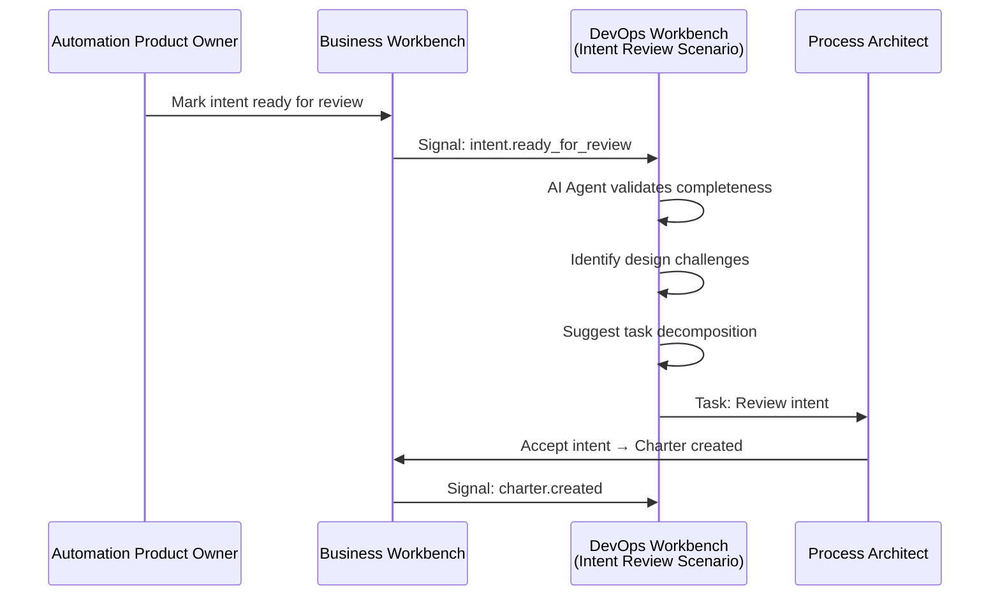

### AI Agent Contribution (DevOps Workbench)

The Intent Review scenario:

1. **Validates** intent completeness (are success criteria measurable? is scope clear?)
2. **Identifies** potential design challenges and dependencies
3. **Suggests** task decomposition for the scenario
4. **Flags** dependencies on existing scenarios, machines, or tools in the Business Workbench

### Your Action (Process Architect)

Review the AI analysis. If the intent is sound, accept it to create a charter. If clarification is needed, request it from the Automation Product Owner.

### Decision Point: Automation Approach

At charter creation, you confirm the automation approach:

| Approach | When to Choose | What Happens Next |
|----------|----------------|-------------------|
| **Conventional** | Clear rules, deterministic logic, structured workflows | Design proceeds in Hub |
| **Agentic** | Requires reasoning, judgment, unstructured inputs | Design proceeds with Seer involvement |
| **Hybrid** | Some tasks conventional, some agentic | Design addresses both paths |

→ *For agentic paths, see: [Agentic Automation Lifecycle](../../../olympus-seer-docs/seer-design/personas-and-needs/journeys/agentic-automation-lifecycle.md)*

### Output

```yaml
charter:
  id: "CHARTER-2026-0055"
  intent_ref: "INTENT-2026-0089"
  
  design_commitment:
    approach: conventional
    runtime: atlantis  # Decision rules engine
    workbench: dispute-resolution-dev
    
  task_decomposition:
    - "Receive refund request signal"
    - "Retrieve transaction details"
    - "Evaluate eligibility rules"
    - "Generate eligibility decision"
    - "Notify merchant system"
  
  dependencies:
    machines: ["core-banking", "merchant-gateway"]
    knowledge: ["refund-policies"]
  
  accepted_by: "Process Architect: John Chen"
  accepted_at: "2026-01-09T14:30:00Z"
```

---

## Stage 4: Design

**Goal:** Create the Scenario definition — the normative specification of what the automation does.

**Where it happens:**
- **Business Workbench:** ScenarioNormativeSpec CRD merged to Git
- **DevOps Workbench:** Scenario Drafting and SOP Generation scenarios create artifacts

### What Happens

The Process Architect designs the Scenario, defining tasks, roles, escalation rules, and policies. The DevOps Workbench AI agent drafts these artifacts and creates a Pull Request for review.

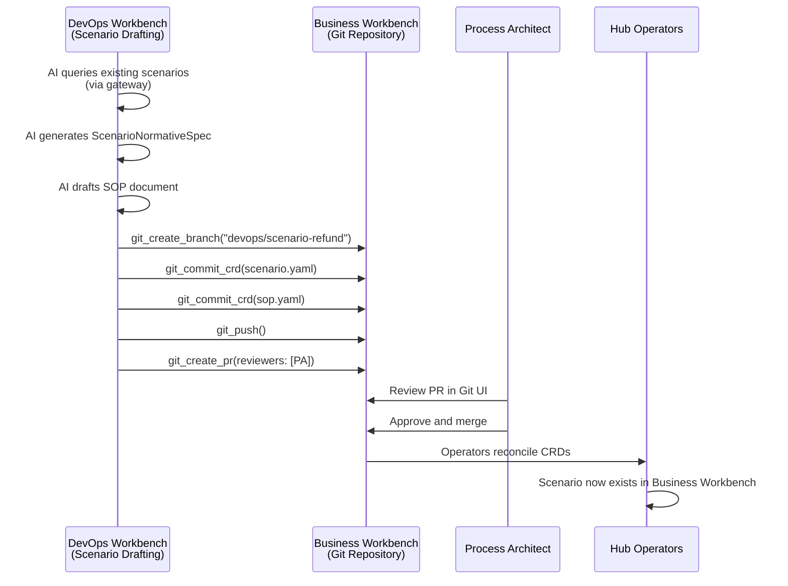

### AI Agent Contribution (DevOps Workbench)

The Scenario Drafting scenario:

1. **Queries** existing scenarios in the Business Workbench for patterns (via `{workbench}-gateway`)
2. **Generates** ScenarioNormativeSpec CRD based on the charter
3. **Drafts** initial SOP document
4. **Commits** CRDs to a feature branch (via `{workbench}-git`)
5. **Creates** Pull Request with the Process Architect as reviewer

### Your Action (Process Architect)

Review the Pull Request in your Git UI (GitHub, GitLab, etc.). The AI has generated:
- `crds/scenarios/refund-eligibility.yaml` — Scenario definition
- `crds/sops/refund-eligibility-sop.yaml` — Standard Operating Procedure

Edit as needed directly in the branch, then approve and merge.

### Output

```yaml
# crds/scenarios/refund-eligibility.yaml
apiVersion: hub.olympus.io/v1
kind: ScenarioNormativeSpec
metadata:
  name: refund-eligibility
  namespace: dispute-resolution
spec:
  name: "Refund Eligibility Check"
  description: "Determine if a refund request meets eligibility criteria"
  
  trigger:
    signal_type: refund.requested
    source: merchant-gateway
  
  tasks:
    - id: retrieve-transaction
      type: action
      description: "Fetch transaction from core banking"
      
    - id: evaluate-eligibility
      type: decision
      description: "Apply refund eligibility rules"
      decision_criteria:
        sop_ref: refund-eligibility-sop
      
    - id: notify-result
      type: action
      description: "Send eligibility result to merchant"
  
  escalation:
    on_rejection:
      level_1: supervisor-queue
      timeout: 15m
  
  request_policies:
    max_duration: 5m
    sla_target: 30s
```

### Gate

**PR Merged** → Hub Operators apply the CRD → Scenario exists in Business Workbench

---

## Stage 5: Build

**Goal:** Implement the automation — create the Hub Application and automation specs.

**Where it happens:**
- **Business Workbench:** HubApplicationSpec, ScenarioAutomationSpec, TriggerSpec CRDs + code merged to Git
- **DevOps Workbench:** App Scaffolding scenario generates artifacts

### What Happens

The Developer implements the scenario using the appropriate runtime. The DevOps Workbench AI agent scaffolds the application and creates a Pull Request.

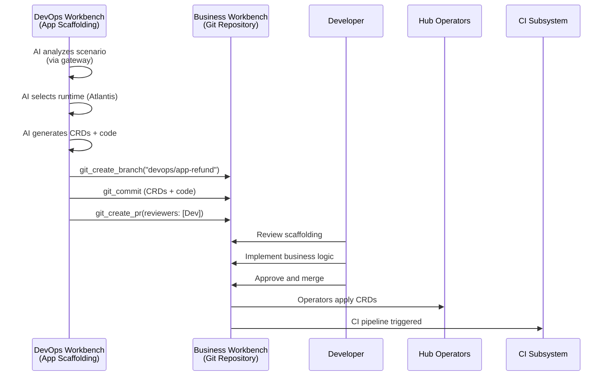

### AI Agent Contribution (DevOps Workbench)

The App Scaffolding scenario:

1. **Analyzes** the scenario definition (via `{workbench}-gateway`)
2. **Selects** appropriate runtime based on task types
3. **Generates** CRDs:
   - `HubApplicationSpec` — Application definition
   - `ScenarioAutomationSpec` — How scenario is automated
   - `TriggerSpec` — What signals trigger the scenario
   - For agentic: `TrainingSpec`, `EmploymentSpec` (Seer)
   - If new tools needed: `ToolDefinition`, `ToolInstance`
4. **Generates** code scaffolding:
   - Project structure
   - Entry point and handlers
   - Tool bindings
   - Test stubs
5. **Commits** all to Git and creates Pull Request

### Your Action (Developer)

Review the Pull Request. The AI has generated scaffolding — you need to:

1. **Implement** the actual business logic (rules, workflows, algorithms)
2. **Configure** tool bindings with actual endpoints and credentials
3. **Write** additional tests beyond the stubs
4. **Approve and merge** when ready

### Output

```
Business Workbench Git Repository:
├── crds/
│   ├── applications/
│   │   └── refund-eligibility-app.yaml      # HubApplicationSpec
│   ├── scenarios/
│   │   └── refund-eligibility-automation.yaml  # ScenarioAutomationSpec
│   ├── triggers/
│   │   └── refund-requested.yaml            # TriggerSpec
│   └── registry/
│       └── merchant-gateway-tool.yaml       # ToolInstance (if new)
└── src/
    ├── refund_eligibility/
    │   ├── __init__.py
    │   ├── handler.py       # Main entry point (YOU implement)
    │   ├── rules.py         # Eligibility rules (YOU implement)
    │   └── tools.py         # Tool bindings
    └── tests/
        ├── test_eligibility.py
        └── test_integration.py
```

### Gate

**PR Merged** → Hub Operators apply CRDs → CI pipeline triggered

---

## Stage 6: Test

**Goal:** Verify the automation works correctly before promotion.

**Where it happens:**
- **Business Workbench:** CI Subsystem runs build and tests
- **DevOps Workbench:** Test Diagnosis scenario activates on failures

### What Happens

The CI subsystem automatically runs when code is merged. If tests fail, the DevOps Workbench AI helps diagnose the issue.

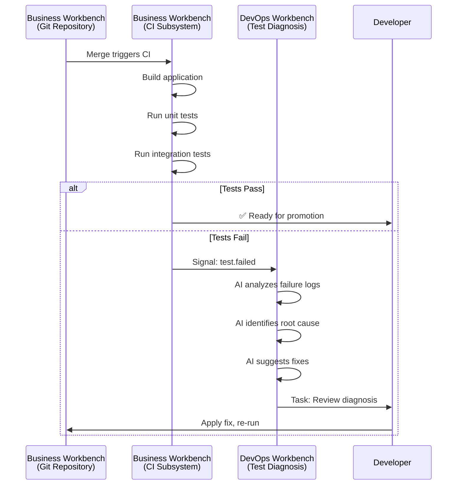

### AI Agent Contribution (DevOps Workbench)

The Test Diagnosis scenario (triggered on failure):

1. **Analyzes** failure logs and error messages
2. **Identifies** likely root cause (dependency issue? logic error? configuration?)
3. **Suggests** fixes with code snippets
4. **Creates** diagnosis report for the Developer

### Your Action (Developer)

**If tests pass:** Proceed to promotion.

**If tests fail:** Review the AI diagnosis in your task queue. The AI provides:
- Error summary
- Likely root cause
- Suggested fix with code

Apply the fix and re-run CI.

### Test Types

| Test Type | Runs When | What It Tests |
|-----------|-----------|---------------|
| **Unit Tests** | On every commit | Individual functions and rules |
| **Integration Tests** | On merge to main | Tool bindings, external systems |
| **Scenario Tests** | Before promotion | End-to-end scenario execution |

→ *Further reading: [CI Subsystem](../04-subsystems/ci-subsystem/README.md)*

---

## Stage 7: Promote

**Goal:** Move the tested automation from DEV to STAGING or PROD.

**Where it happens:**
- **Business Workbench (DEV):** Promotion requested
- **Business Workbench (STAGING/PROD):** Artifacts received
- **DevOps Workbench:** Promotion Review scenario validates eligibility

### What Happens

Promotion is a first-class Hub operation — not just a Git merge. It physically copies artifacts from one workbench to another with explicit approval and complete audit trail.

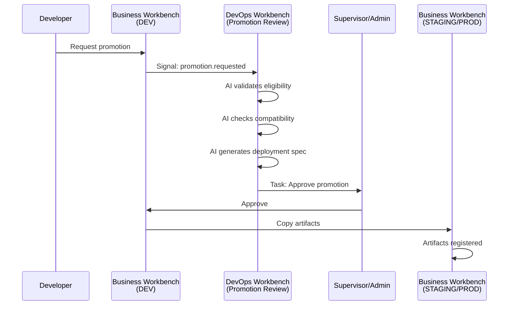

### AI Agent Contribution (DevOps Workbench)

The Promotion Review scenario:

1. **Validates** promotion eligibility (all tests passed? approvals in place?)
2. **Checks** compatibility with target environment
3. **Generates** ScenarioDeploymentSpec for target workbench
4. **Creates** promotion request for approval

### Your Action (Developer)

Request promotion in the Automation Development Desk. Specify:
- Target workbench (STAGING or PROD)
- Version to promote
- Any configuration overrides

### Promotion Paths

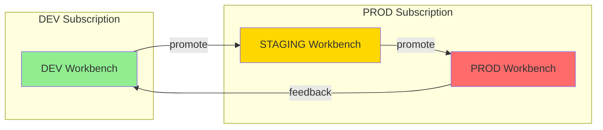

### Gate

**Promotion Approved** → Artifacts copied to target registry → Ready for deployment

→ *Further reading: [Promotion Concept](../02-system-design/implementation-concepts/promotion.md)*

---

## Stage 8: Deploy

**Goal:** Activate the scenario in the target environment.

**Where it happens:**
- **Business Workbench (STAGING/PROD):** Supervisor configures and activates

### What Happens

The Supervisor configures operational settings and activates the scenario. This is a manual step — the DevOps Workbench does not automate deployment decisions.

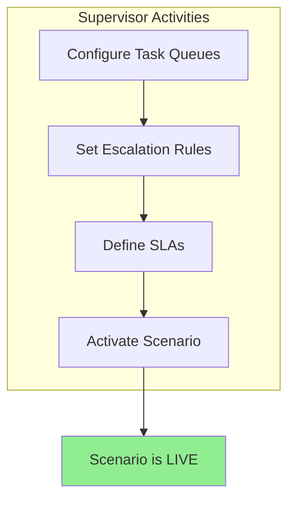

### Your Action (Supervisor)

In the Supervisor Desk of the target workbench:

1. **Configure task queues** — Which agents handle which tasks?
2. **Set escalation rules** — Time-based and rejection-based escalation
3. **Define SLAs** — Response time targets, monitoring thresholds
4. **Activate the scenario** — Flip the switch to start processing signals

### Output

The scenario is now **live** and processing incoming signals.

---

## Stage 9: Run

**Goal:** Operate the automation and handle exceptions.

**Where it happens:**
- **Business Workbench:** Automation processes signals, agents handle tasks

### What Happens

The automation processes incoming signals. Supervisors monitor operations; Agents handle escalated tasks.

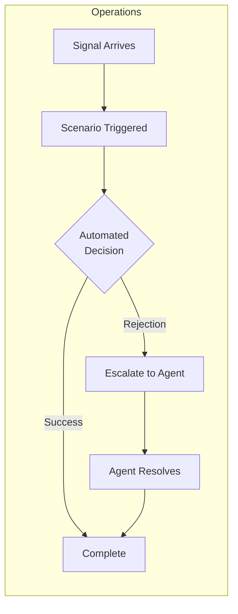

### Operational Activities

| Persona | Activities |
|---------|------------|
| **Supervisor** | Monitor SLA compliance, review escalation patterns, adjust queue assignments |
| **Agent** | Handle escalated tasks, make decisions, record evidence |
| **Auditor** | Review decision records, validate compliance |

### Monitoring

Key metrics to watch:
- SLA compliance rate
- Escalation rate
- Processing time (P50, P95, P99)
- Error rate

---

## Stage 10: Evolve

**Goal:** Improve the automation based on operational learnings.

**Where it happens:**
- **Business Workbench (PROD):** Feedback collected from operations
- **Business Workbench (DEV):** Feedback received for action
- **DevOps Workbench:** Feedback Triage scenario processes submissions

### What Happens

The Production Feedback Loop captures improvement opportunities and routes them back to the development workbench.

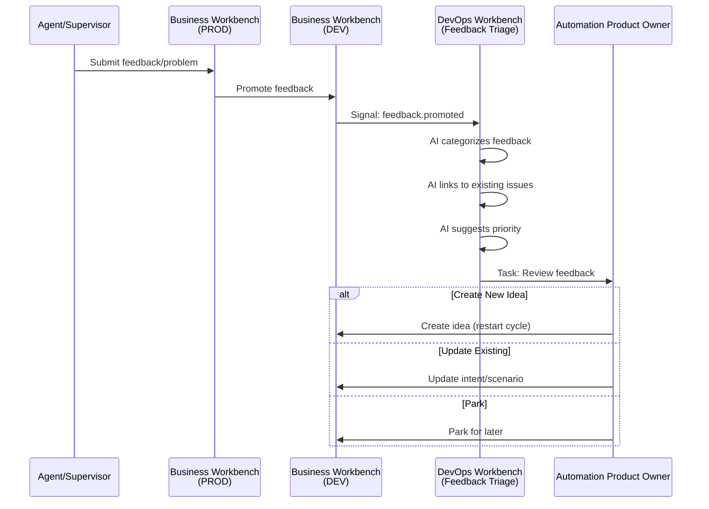

### Feedback Types

| Category | Subtypes | Example |
|----------|----------|---------|
| **Problems** | Bug, Issue, Critical Limitation | "System rejects valid refunds over $500" |
| **Feedback** | Observation, Suggestion, Learning | "Customers prefer email confirmation" |

### AI Agent Contribution (DevOps Workbench)

The Feedback Triage scenario:

1. **Categorizes** feedback (bug vs. suggestion vs. learning)
2. **Links** to existing issues or ideas if related
3. **Suggests** resolution priority based on impact and frequency
4. **Creates** task for Automation Product Owner

### Your Action (Automation Product Owner)

Review feedback in your Feedback Inbox. For each item:
- **Create new Idea** — if it's a significant improvement opportunity (restarts the cycle)
- **Update existing Intent** — if it refines current work
- **Park** — if it's valid but not a priority now

→ *Further reading: [Production Feedback Loop](../02-system-design/implementation-concepts/production-feedback.md)*

---

## Summary

### DevOps Workbench Involvement by Stage

| Stage | Primary Persona | DevOps Scenario | AI Contribution | Workbench |
|-------|-----------------|-----------------|-----------------|-----------|
| **1. Idea** | Automation Product Owner | Idea Triage | Enrich, dedupe, estimate, recommend | DevOps |
| **2. Intent** | Automation Product Owner | Intent Drafting | Draft structure, suggest metrics | DevOps |
| **3. Charter** | Process Architect | Intent Review | Validate, analyze, flag issues | DevOps |
| **4. Design** | Process Architect | Scenario Drafting, SOP Generation | Generate CRDs via Git | Both |
| **5. Build** | Developer | App Scaffolding | Generate code + CRDs via Git | Both |
| **6. Test** | Developer | Test Diagnosis, Build Resolution | Diagnose failures, suggest fixes | Both |
| **7. Promote** | Developer | Promotion Review | Validate, generate deployment specs | Both |
| **8. Deploy** | Supervisor | — | — | Business |
| **9. Run** | Supervisor, Agent | — | — | Business |
| **10. Evolve** | Automation Product Owner | Feedback Triage | Categorize, prioritize, link | DevOps |

### The Human Remains in Control

At every stage, the AI in the DevOps Workbench:
- **Drafts** artifacts for human review
- **Suggests** actions with reasoning
- **Creates** Pull Requests that require human approval
- **Never** deploys or activates without explicit human decision

---

## Appendix: Creating a New Workbench (Greenfield)

If you're starting from scratch and don't yet have a Business Workbench:

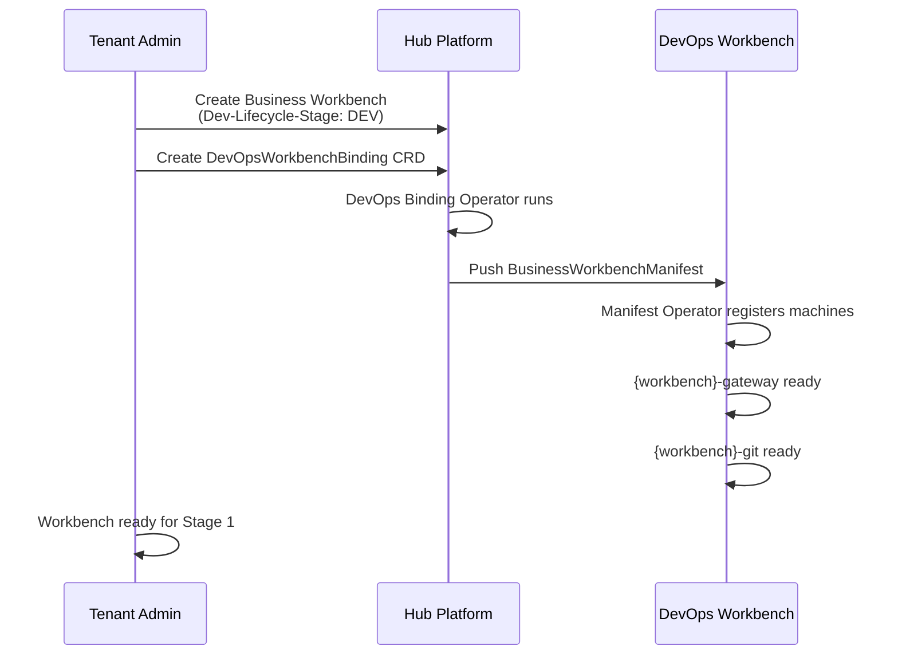

### Steps

1. **Tenant Admin creates Business Workbench** with `Dev-Lifecycle-Stage: DEV`
2. **Tenant Admin creates DevOpsWorkbenchBinding** CRD to associate a DevOps Workbench
3. **DevOps Binding Operator** provisions credentials and pushes manifest to DevOps Workbench
4. **Manifest Operator** in DevOps Workbench registers the gateway and Git machines
5. **Workbench is ready** — proceed with Stage 1 (Idea)

→ *Further reading: [DevOps Workbench Pattern](../09-composite-systems-and-patterns/devops-workbench/README.md)*

---

## Related Documentation

- [Automation Lifecycle (Conventional)](../08-personas-and-journeys/journeys/automation-lifecycle.md)
- [Agentic Automation Lifecycle](../../../olympus-seer-docs/seer-design/personas-and-needs/journeys/agentic-automation-lifecycle.md)
- [DevOps Workbench Pattern](../09-composite-systems-and-patterns/devops-workbench/README.md)
- [DevOps Scenarios](../09-composite-systems-and-patterns/devops-workbench/devops-scenarios.md)
- [Automation Ideation Subsystem](../04-subsystems/automation-ideation/README.md)
- [Promotion Concept](../02-system-design/implementation-concepts/promotion.md)
- [Dev-Lifecycle-Stage](../02-system-design/implementation-concepts/dev-lifecycle-stage.md)
- [Hub Personas](../08-personas-and-journeys/personas/README.md)

---

*This guide demonstrates how the DevOps Workbench transforms automation development from a manual, sequential process into an AI-assisted, accelerated workflow — while keeping humans in control of every decision.*
