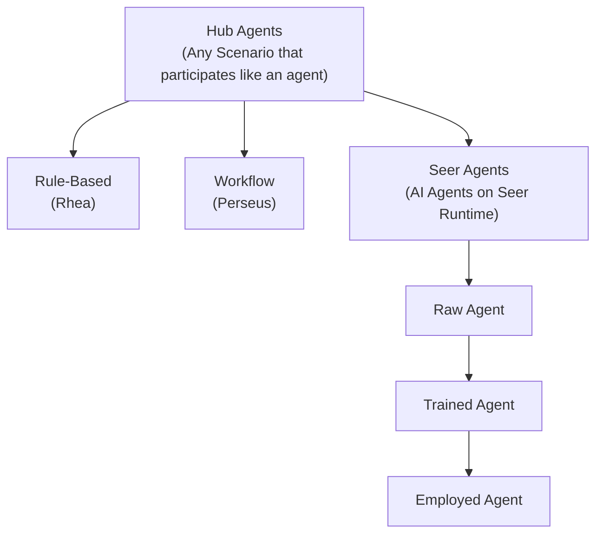
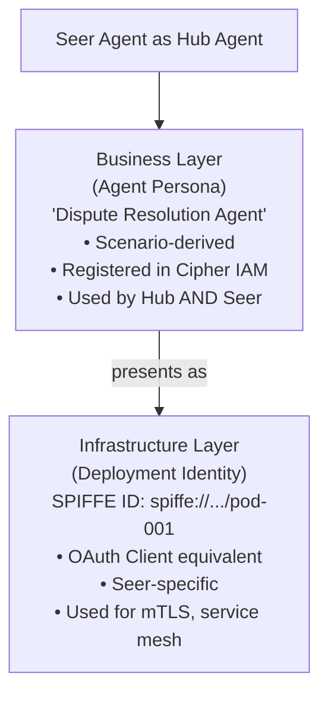
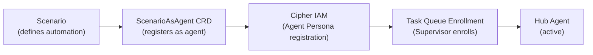
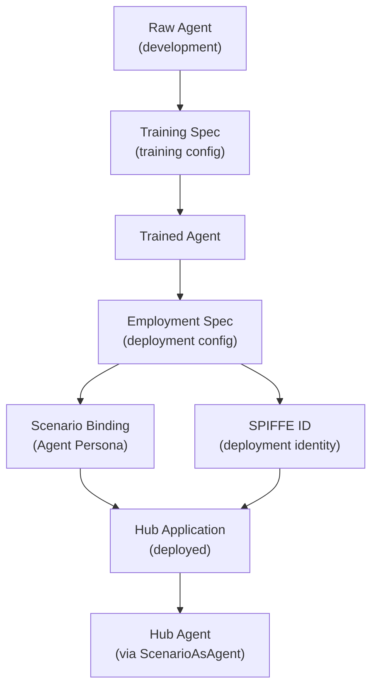
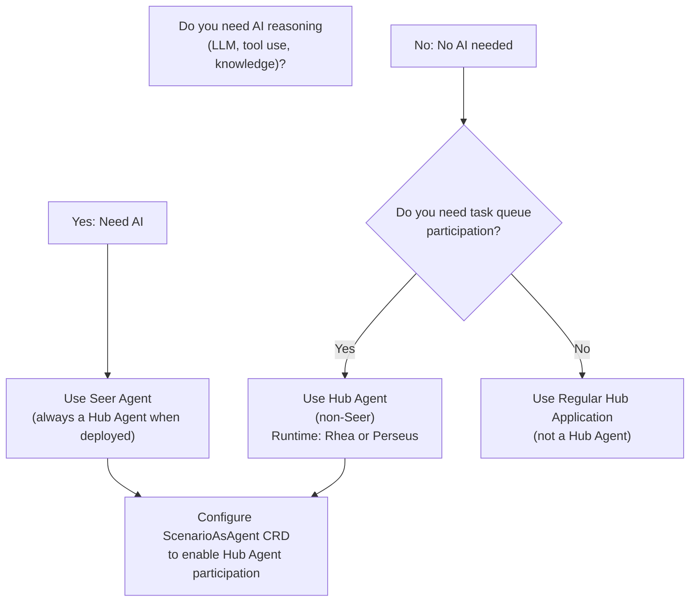

# Hub Agent vs Seer Agent: Core Concepts

> **Status**: 🟢 Design Complete  
> **Target Audience**: Process Architects, CSAs, Agent Engineers, Developers  
> **Purpose**: Comprehensive understanding, building basics, and decision framework

---

## Part 1: Understanding (What They Are)

### Core Distinction

**Hub Agent** is a participation pattern, not a technology. It represents any Scenario that can act autonomously like an agent within Hub's operational framework. The automation inside a Hub Agent can be rule-based, workflow-based, or AI-based. Hub provides the identity and participation model; it does not prescribe the implementation technology.

**Seer Agent** is a concrete AI implementation. It follows the Raw → Trained → Employed lifecycle, runs on Seer runtime (Atlantis containers), and has AI-specific capabilities: LLM reasoning, tool use, and knowledge access. Seer Agents require Training Specs and Employment Specs.

> **Reference**: [Agent Model](../../02-system-design/agent-model.md) describes how agents interact with Hub. [Scenario as Agent](../../02-system-design/implementation-concepts/scenario-as-agent.md) explains the pattern for exposing Scenarios as agents.

### Relationship: Seer Agent ⊆ Hub Agent

A Seer Agent is always a Hub Agent when deployed. A Hub Agent is not always a Seer Agent. Hub Agent is the superset: any automation that participates like an agent. Seer Agent is a specific type of Hub Agent: an AI agent on Seer runtime.

> **Reference**: [Hub Architecture](../../02-system-design/hub-architecture.md) describes the system model. [Agent Model](../../02-system-design/agent-model.md) explains agent types and collaboration.

### What Makes Something a "Hub Agent"?

A Scenario becomes a Hub Agent when it satisfies five criteria:

1. **Participate in Task Queues** — receive tasks like a human agent
2. **Act as Request Assignee** — be explicitly assigned to handle a Request
3. **Have an IAM Identity** — registered as an Agent Persona in Cipher IAM
4. **Produce Request Updates** — report decisions, memos, outcomes
5. **Be enrolled/unenrolled** — Supervisor can manage participation

> **Reference**: [Scenario as Agent](../../02-system-design/implementation-concepts/scenario-as-agent.md) defines the pattern and characteristics. [Agent Model](../../02-system-design/agent-model.md) describes agent capabilities.

### Hub Agent Identity Model

Hub Agent identity is primarily the **Agent Persona** (business identity):

- **Agent Persona**: Business identity derived from Scenario
  - Registered in Cipher IAM as Agent type
  - Scenario-bound — identity tied to Scenario
  - Participation-focused — what can it DO in Hub
  - Enrollment state — active in which queues/scenarios
  - Used for: access tokens, audit logs, delegation chains, business accountability
  - **This is the primary identity Hub cares about**

- **Deployment Identity**: Varies by runtime (infrastructure-level)
  - For Seer Agents: SPIFFE ID (OAuth Client equivalent)
  - For Rhea/Perseus: Runtime-specific deployment identity (may not be SPIFFE)
  - Used for: infrastructure authentication (mTLS, service mesh), request routing
  - **Hub doesn't require SPIFFE** — it's runtime-specific

**Key Point**: Hub Agent identity = Agent Persona. Deployment identity is a runtime concern.

> **Reference**: [ADR-0129: Agent Identity Model](../../decision-logs/0129-agent-identity-model.md) defines the two-layer identity model. [Agent Model](../../02-system-design/agent-model.md) describes AI Agent IAM.

### Seer Agent Identity Model

Seer Agents have a two-layer identity model (as defined in ADR-0129):

1. **Agent Persona** (Business Identity):
   - Derived from Scenario (same as Hub Agent)
   - Registered in Cipher IAM
   - Used for: access tokens, audit, delegation chains, business accountability
   - **This is the "who" in business terms** (e.g., "Dispute Resolution Agent")

2. **Deployment Identity** (Infrastructure Identity):
   - SPIFFE ID at Employment (OAuth Client equivalent)
   - Identifies the running pod/container (infrastructure-level)
   - Virtual Key for Model Gateway access
   - Used for: mTLS, service mesh authentication, infrastructure routing
   - **This is the "what" in infrastructure terms** (e.g., "pod-001 in namespace X")

**Token Structure** (both identities included):
- `sub`: Agent Persona (business identity)
- `client_id`: SPIFFE ID (deployment identity)
- `delegated_by`: Authority source (Scenario Identity Profile or Business User)

> **Reference**: [ADR-0129: Agent Identity Model](../../decision-logs/0129-agent-identity-model.md) provides the complete two-layer identity model. [Agent Identity and Credentials](../../../olympus-seer-docs/seer-design/implementation-concepts/agent-identity-credentials.md) describes Seer-specific identity details.

### Identity Composition: When Seer Agent is Hub Agent

When a Seer Agent is deployed as a Hub Agent:

- **Agent Persona**: **Shared** — both Hub and Seer use the same Scenario-derived persona
  - Hub sees: "This is the Dispute Resolution Agent" (persona-based)
  - Seer sees: "This agent represents the Dispute Resolution role" (persona-based)
  - Same business identity, same accountability

- **Deployment Identity**: **Seer adds SPIFFE layer** (infrastructure authentication)
  - Hub doesn't require SPIFFE (but doesn't prevent it)
  - Seer requires SPIFFE for mTLS and service mesh
  - SPIFFE acts as "OAuth Client" presenting the Agent Persona

- **Composite Identity in Tokens**:
  - Hub uses Agent Persona for authorization decisions
  - Seer uses both (Persona for business auth, SPIFFE for infrastructure auth)
  - Tokens include both: `sub` (Persona) + `client_id` (SPIFFE)

> **Reference**: [ADR-0129: Agent Identity Model](../../decision-logs/0129-agent-identity-model.md) explains the identity composition. [ADR-0130: Unified Delegation Model](../../decision-logs/0130-unified-delegation-model.md) describes how delegation uses both identity layers.

### Protocol Interfaces

Hub provides these protocol interfaces to ALL Hub Agents (regardless of runtime):

| Protocol | Use Case | Notes |
|----------|----------|-------|
| **HTTP/REST** | Standard request/response | Task APIs, Request Updates |
| **MCP** | Multi-turn, tool-based interaction | AI assistant integration |
| **A2A** | Agent-to-agent communication | Cross-agent collaboration |

These are Hub capabilities, not Seer-specific. Seer Agents use these through Hub, not directly.

> **Reference**: [Channel](../../02-system-design/implementation-concepts/channel.md) describes protocol interfaces. [Agent Model](../../02-system-design/agent-model.md) explains agent interaction channels.

### Common Misconceptions

| Misconception | Reality |
|--------------|---------|
| "Hub Agent = AI Agent" | Hub Agent is any automation that participates like an agent |
| "Seer Agent doesn't need Hub" | Seer Agents are always deployed within Hub Scenarios |
| "Must choose Hub OR Seer" | Seer Agents ARE Hub Agents when deployed |
| "Hub Agent has no AI" | Hub Agent can have AI (Seer) or not (Rhea, Perseus) |
| "A2A is only for Seer" | A2A is Hub protocol, available to all Hub Agents |
| "Hub Agent needs SPIFFE" | Hub Agent identity = Agent Persona; SPIFFE is Seer-specific |
| "Agent Persona and SPIFFE are the same" | Agent Persona = business identity; SPIFFE = infrastructure identity |
| "Delegation differs between Hub and Seer" | Both use unified delegation model (scenario-scoped or request-scoped) |

> **Reference**: [ADR-0129: Agent Identity Model](../../decision-logs/0129-agent-identity-model.md) clarifies identity distinctions. [ADR-0130: Unified Delegation Model](../../decision-logs/0130-unified-delegation-model.md) explains the unified delegation model.

---

## Part 2: Building (How They Are Created)

### Hub Agent Creation Process

Hub Agents are created through the Scenario as Agent pattern. The process involves:

1. **ScenarioAsAgent CRD Configuration** — registers the Scenario as an agent
2. **Agent Persona Registration** — Scenario's Agent Persona registered in Cipher IAM
3. **Task Queue Enrollment** — Supervisor enrolls the agent in task queue(s)
4. **Identity Flow** — Agent Persona becomes the Hub Agent's business identity

**Key Clarification**: Hub Agent is a configuration of Scenario, not a property of Hub Application. ScenarioAsAgent CRD is the only way to create Hub Agents.

> **Reference**: [Scenario as Agent](../../02-system-design/implementation-concepts/scenario-as-agent.md) provides the complete pattern definition. [ScenarioAsAgent CRD](../../02-system-design/implementation-concepts/scenario-as-agent.md#scenarioasagent-crd) shows the CRD structure.

### Seer Agent Creation Process

Seer Agents follow the Raw → Trained → Employed lifecycle:

1. **Raw Agent Development** — agent code and capabilities defined
2. **Training Spec** — training configuration and knowledge sources
3. **Employment Spec** — deployment configuration, Scenario binding, delegation settings
4. **Scenario Binding** — Employed Agent bound to specific Scenario(s)
5. **SPIFFE ID Provisioning** — deployment identity created at Employment
6. **Hub Application Deployment** — Employed Agent deployed as Hub Application

**Identity Flow**:
- Scenario defines Agent Persona → Registered in Cipher IAM → Hub recognizes as Agent
- Employment creates SPIFFE ID → Seer runtime uses for infrastructure auth
- Both identities used together in Delegation Access Tokens

> **Reference**: [Agent Lifecycle](../../../olympus-seer-docs/seer-design/implementation-concepts/agent-lifecycle.md) describes the Raw → Trained → Employed progression. [Employed Agent as Hub Application](../../../olympus-seer-docs/seer-design/hub-integration/employed-agent.md) explains Hub integration. [Employment Spec CRD](../../../olympus-seer-docs/seer-design/hub-integration/employment-spec-crd.md) defines the deployment configuration.

---

## Part 3: Decision Framework (When to Use What)

### Decision Tree

### Decision Matrix

| Criteria | Hub Agent (non-Seer) | Seer Agent | Regular Hub Application |
|----------|---------------------|------------|------------------------|
| **AI Reasoning Required** | No | Yes | No |
| **Task Queue Participation** | Yes | Yes | No |
| **Request Assignment** | Yes | Yes | No |
| **Runtime** | Rhea, Perseus | Seer (Atlantis) | Any |
| **Identity** | Agent Persona | Agent Persona + SPIFFE | Application identity |
| **Creation Method** | ScenarioAsAgent CRD | Raw → Trained → Employed | Hub Application deployment |
| **Use Case** | Rule-based or workflow automation in queues | AI-powered task completion | Event-driven processing |

### Runtime Selection Guide

| Runtime | Capabilities | Hub Agent Support | Use When |
|---------|--------------|-------------------|----------|
| **Rhea** | Rule-based automation | Yes (via ScenarioAsAgent) | Deterministic rules, simple logic |
| **Perseus** | Workflow automation (BPMN) | Yes (via ScenarioAsAgent) | Multi-step workflows, orchestration |
| **Seer (Atlantis)** | AI reasoning, LLM, tool use | Yes (always a Hub Agent when deployed) | Cognitive tasks, natural language, reasoning |
| **Atlantis (non-Seer)** | General container runtime | Yes (via ScenarioAsAgent) | Custom applications needing container runtime |

> **Reference**: [Automation Runtimes](../../04-subsystems/automation-runtimes/README.md) describes available runtimes. [Scenario as Agent](../../02-system-design/implementation-concepts/scenario-as-agent.md) explains how any runtime can become a Hub Agent.

### Identity Model Decisions

| Scenario | Identity Required | Notes |
|----------|-------------------|-------|
| **Hub Agent (non-Seer)** | Agent Persona only | Deployment identity is runtime-specific, not required by Hub |
| **Seer Agent** | Agent Persona + SPIFFE ID | Two-layer model required for Seer runtime |
| **Regular Hub Application** | Application identity | No Agent Persona needed |

> **Reference**: [ADR-0129: Agent Identity Model](../../decision-logs/0129-agent-identity-model.md) explains when each identity layer is needed.

### Task Queue Participation Requirements

To participate in task queues, a Scenario must:

1. Be registered as an Agent Persona in Cipher IAM (via ScenarioAsAgent CRD)
2. Be enrolled in task queue(s) by Supervisor
3. Implement standard agent operations (start, complete, abandon, memo)
4. Produce Request Updates for audit and coordination

> **Reference**: [Scenario as Agent](../../02-system-design/implementation-concepts/scenario-as-agent.md) describes task queue participation. [Task Allocation](../../02-system-design/implementation-concepts/task-allocation.md) explains work distribution.

---

## Related Documentation

### This Documentation Suite
- [Hub Agent vs Seer Agent](./hub-agent-vs-seer-agent.md) — Entry point and overview
- [Examples](./hub-agent-vs-seer-agent-examples.md) — Concrete use cases
- [Anti-patterns](./hub-agent-vs-seer-agent-anti-patterns.md) — When NOT to use Hub Agent pattern
- [Architectural Details](./hub-agent-vs-seer-agent-architectural-details.md) — C2-level implementation references
- [Customer Guide](./hub-agent-vs-seer-agent-customer-guide.md) — Customer-facing explanations

### Hub Documentation
- [Scenario as Agent](../../02-system-design/implementation-concepts/scenario-as-agent.md) — Pattern for creating Hub Agents
- [Hub Application](../../02-system-design/implementation-concepts/hub-application.md) — Automation artifact
- [Agent Model](../../02-system-design/agent-model.md) — Agent interaction model

### Seer Documentation
- [Agent Lifecycle](../../../olympus-seer-docs/seer-design/implementation-concepts/agent-lifecycle.md) — Raw → Trained → Employed progression
- [Employed Agent as Hub Application](../../../olympus-seer-docs/seer-design/hub-integration/employed-agent.md) — Hub integration
- [Agent Identity and Credentials](../../../olympus-seer-docs/seer-design/implementation-concepts/agent-identity-credentials.md) — Seer identity model

### Architectural Decisions
- [ADR-0129: Agent Identity Model](../../decision-logs/0129-agent-identity-model.md) — Two-layer identity model
- [ADR-0130: Unified Delegation Model](../../decision-logs/0130-unified-delegation-model.md) — Unified delegation model
