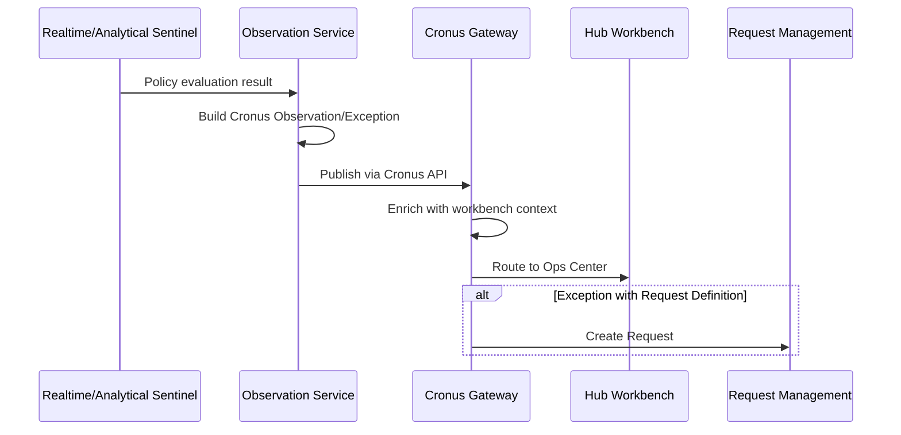

# ADR-0111: Seer Agent Session Supervisor Cronus Integration

**Status**: Accepted  
**Date**: 2026-01-13  
**Category**: seer

---

## Context

Agent Session Sentinel needs to generate Observations and Exceptions when sentinel policies detect conditions requiring attention (e.g., stuck agents, policy violations, cost anomalies). We needed to decide how to model and route these observations:

1. **Observation Model** — Create a new Seer-specific observation/exception model, or reuse existing Hub model?
2. **Routing** — How should observations/exceptions be routed to appropriate workbenches and personas?
3. **Integration** — How should supervisors integrate with Hub's operational workflows?

Key concerns: consistency with Hub patterns, avoiding redundant systems, integration complexity, operational workflows.

---

## Decision

Agent Session Sentinel **uses Hub's Cronus model** for Observations and Exceptions—no new model is created.

### Cronus Integration

**Sentinels generate Observations/Exceptions that conform to Hub's Cronus schema:**

| Aspect | Description |
|--------|-------------|
| **Observation Model** | Uses Cronus Observation/Exception schema (no new model) |
| **Exception Definitions** | Registered in Cronus Exception Registry |
| **Routing** | Via Cronus Gateway to appropriate Workbenches |
| **Display** | Appears in Hub Workbench Ops Center (same as other business exceptions) |
| **Auto-Request Creation** | Supports automatic Request creation for Exceptions with defined Request Definitions |

### Observation Service Responsibilities

The Observation Service:
- Generates Cronus-compliant Observations/Exceptions from sentinel policy results
- Populates `exception_specific_info` with relevant sentinel context
- Publishes to Cronus Gateway using standard Cronus publishing APIs
- Relies on Cronus for workbench context enrichment and routing

### Sentinel Policy → Cronus Flow

---

## Consequences

### Positive

1. **Consistency** — All business-level anomalies (Hub and Seer) use the same model and routing
2. **No Redundancy** — Avoids creating a new, parallel observation/exception system
3. **Seamless Integration** — Sentinel observations appear alongside other Hub exceptions in Ops Center
4. **Reuses Hub Infrastructure** — Leverages existing Cronus Gateway, Exception Registry, Request Management
5. **Unified Workflows** — Operators use same workflows for Hub and Seer exceptions
6. **Simplified Development** — Sentinels don't need to implement routing, display, or escalation logic

### Negative

1. **Cronus Dependency** — Sentinels depend on Cronus availability and schema
2. **Schema Constraints** — Must conform to Cronus schema (may limit flexibility)
3. **Hub Coupling** — Tight coupling with Hub's operational model

### Neutral

1. **Exception Definitions** — Must be registered in Cronus Exception Registry (standard Hub process)
2. **Workbench Context** — Cronus automatically enriches with workbench context (no supervisor burden)
3. **Request Creation** — Optional auto-Request creation for Exceptions (if Request Definition exists)

---

## Alternatives Considered

### 1. New Seer Observation Model

Create a Seer-specific observation/exception model separate from Cronus.

**Rejected because:**
- Creates redundant system with similar functionality
- Requires building routing, display, and escalation infrastructure
- Operators would need to learn and use two different systems
- Inconsistent with Hub's unified anomaly management approach

### 2. Direct Workbench Integration

Sentinels directly publish to Workbench Ops Centers, bypassing Cronus.

**Rejected because:**
- Bypasses Hub's standard exception routing and enrichment
- Requires sentinels to understand workbench structure
- Duplicates routing logic that Cronus already provides
- Inconsistent with Hub's exception management patterns

### 3. Signal Exchange Integration

Route observations through Signal Exchange as signals.

**Rejected because:**
- Signal Exchange routes to Hub Applications, not to operational consoles
- Observations are business-level anomalies, not application signals
- Would require Hub Applications to consume and display observations (indirect)
- Cronus is the appropriate channel for business exceptions

---

## Related

- [Agent Session Sentinel Subsystem](../../olympus-seer-docs/seer-design/subsystems/agent-session-sentinel/README.md)
- [Observation Service](../../olympus-seer-docs/seer-design/subsystems/agent-session-sentinel/observation-service.md) — Cronus integration implementation
- [Cronus Business Exceptions](../../04-subsystems/signal-providers/cronus-business-exceptions.md) — Hub Cronus model
- [Hub Request Management](../../04-subsystems/request-management/README.md) — Auto-Request creation
