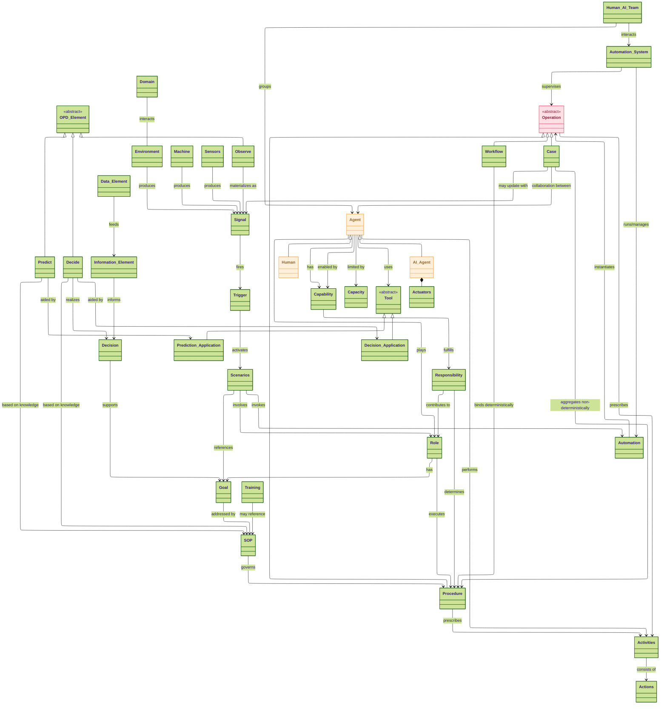
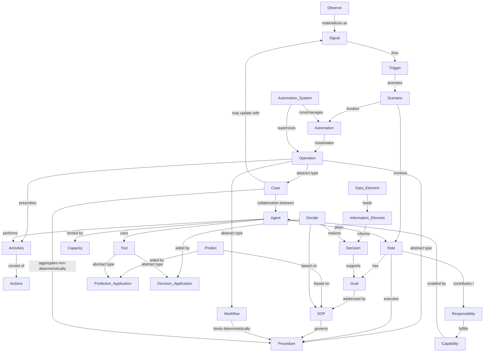

# Ontology of Human–AI Team Operations

This reference explains every concept in the ontology and how they relate.  
Core runtime lifecycle (strict, no shortcuts): **[Signal](#signal) → [Trigger](#trigger) → [Scenario](#scenario) → [Automation](#automation) → [Operation](#operation-abstract) → [Activities](#activities) → [Actions](#actions)**.

- See also: the **[Class Diagram (layered)](#appendix-mermaid-class-diagram-layered)** and **[Ontology Graph](#appendix-mermaid-ontology-graph)** at the end.

---

## Table of Contents

- [Introduction](#introduction)  

- [1. Perception Layer](#1-perception-layer)  
  - [Domain](#domain)  
  - [Environment](#environment)  
  - [Machine](#machine)  
  - [Sensors](#sensors)  
  - [Signal](#signal)  
  - [Trigger](#trigger)  
  - [Scenario](#scenario)  
  - [OPD Elements](#opd-elements-observe-predict-decide)  
- [2. Normative Layer](#2-normative-layer)  
  - [Role](#role)  
  - [Goal](#goal)  
  - [SOP (Standard Operating Procedure)](#sop-standard-operating-procedure)  
  - [Responsibility](#responsibility)  
  - [Capability](#capability)  
  - [Capacity](#capacity)  
  - [Decision](#decision)  
  - [Information Element](#information-element)  
  - [Data Element](#data-element)  
- [3. Execution Layer](#3-execution-layer)  
  - [Operation (abstract)](#operation-abstract)  
  - [Procedure](#procedure)  
  - [Workflow](#workflow)  
  - [Case](#case)  
  - [Activities](#activities)  
  - [Actions](#actions)  
  - [Agent](#agent)  
  - [Human](#human)  
  - [AI Agent](#ai-agent)  
  - [Human–AI Team](#humanai-team)  
  - [Training](#training)  
- [4. Automation Layer](#4-automation-layer)  
  - [Automation](#automation)  
  - [Automation System](#automation-system)  
  - [Tool (abstract)](#tool-abstract)  
  - [Prediction Application](#prediction-application)  
  - [Decision Application](#decision-application)  
  - [Actuators](#actuators)  
- [Appendix: Mermaid Diagrams](#appendix-mermaid-diagrams)  
  - [Mermaid Class Diagram (layered)](#appendix-mermaid-class-diagram-layered)  
  - [Mermaid Ontology Graph](#appendix-mermaid-ontology-graph)

---

## Introduction

The ontology of Human–AI Team Operations is organized into **four layers**.  
Each layer represents a distinct way of knowing and acting in the system, from raw perception of the world to codified automations that can be executed at scale.  
This layered approach makes it easier to understand *what is happening*, *what ought to be done*, *how it is actually done*, and *how it is codified in systems*.  

---

## Perception Layer — *“What’s happening?”*

The Perception Layer is concerned with **observing and interpreting reality**.  
It captures how the **environment** and its components — machines, sensors, data feeds — generate **signals**. These signals are then interpreted by **triggers** into meaningful **scenarios** that Human–AI teams must respond to.  

It is descriptive, not prescriptive: this layer does not say what should be done, only what *is happening*. It is the sensory nervous system of the ontology.  

**Example (aviation):**  
- A temperature sensor detects an engine overheating and emits a signal.  
- A trigger interprets that signal and activates the scenario “Engine Overheating.”  

**Example (banking):**  
- Login logs show 5 failed attempts in 2 minutes.  
- A trigger interprets this signal and activates the scenario “Suspicious Login Attempt.”  

---

## Normative Layer — *“What ought to be done?”*

The Normative Layer defines the **standards, rules, and goals** that shape expected behavior in a given scenario. It is *normative* because it encodes what ought to be done, not just what can be done.  

Here we find **roles** (who is responsible), **goals** (what outcomes they must achieve), **responsibilities** (duties), **capabilities and capacities** (what they can do and how much), and **SOPs** (codified best practices). This layer also covers **decisions**, where agents — human or AI — choose a course of action, often aided by information, data, and decision-support tools.  

It is the legal and procedural backbone: the framework of obligations and standards against which execution is measured.  

**Example (aviation):**  
- Role: Pilot.  
- Goal: Maintain aircraft safety.  
- SOP: Follow the engine flameout checklist.  
- Decision: Continue to destination or divert for emergency landing.  

**Example (banking):**  
- Role: Security Analyst.  
- Goal: Prevent account takeover.  
- SOP: Lock account after 3 failed attempts, notify the user.  
- Decision: Escalate incident to fraud response team.  

---

## Execution Layer — *“How is it done?”*

The Execution Layer is where **work actually happens**.  
Here, normative rules and goals are operationalized into **operations**:  
- **Procedures** (deterministic steps for a role),  
- **Workflows** (deterministic binding of procedures across multiple roles), and  
- **Cases** (non-deterministic, evolving collaborations across roles).  

These operations prescribe **activities**, which in turn consist of atomic **actions** performed by **agents** — humans or AI — often collaborating as a **Human–AI Team**. Training also lives here, ensuring agents have the skills needed to bridge their capabilities to specific role requirements.  

It is the execution muscle: the actual practice of duties under real conditions.  

**Example (aviation):**  
- Procedure: Pilot executes the flameout checklist.  
- Workflow: Pilot, Co-pilot, and Air Traffic Controller coordinate in a defined sequence.  
- Case: An evolving emergency response as new signals (engine fire, loss of altitude) come in.  

**Example (banking):**  
- Procedure: Security analyst checks logs, verifies user, resets password.  
- Workflow: Analyst investigates → IT resets account → Customer notified.  
- Case: Fraud investigation evolves as new suspicious transactions are reported.  

---

## Automation Layer — *“How is it codified and scaled?”*

The Automation Layer represents the **codified definitions** of operations, and the systems that run them.  
Here, **automations** are the software representations of procedures, workflows, or cases. These definitions live inside an **automation system**, which is a software orchestration platform responsible for instantiating and supervising live operations.  

This layer ensures consistency, scalability, and enforceability. It allows complex human–AI operations to be reliably repeated, monitored, and adapted by software systems.  

**Example (aviation):**  
- A case management automation codifies how incident reports flow between pilots, controllers, and maintenance teams.  
- The automation system (a case management platform) instantiates a new case when a trigger fires.  

**Example (banking):**  
- A BPMN workflow automation codifies suspicious login handling: lock account, notify user, reset password.  
- The automation system (e.g., Camunda, Temporal) automatically instantiates and supervises this workflow when the suspicious login scenario is triggered.  

---

## Layering Summary

The four layers connect in sequence:  

1. **Perception**: Detect what is happening.  
2. **Normative**: Define what ought to be done.  
3. **Execution**: Carry out what must be done.  
4. **Automation**: Codify and scale how it is done.  

Together they form a complete loop: from sensing reality, through norms and duties, into action, and finally into codified systems that sustain operations at scale.

## 1. Perception Layer

### Domain
**Definition:** Conceptual scope (e.g., aviation, healthcare, banking).  
**Role:** Frames typical [Scenarios](#scenario) and [Goals](#goal).  
**Relationships:** Interacts with the [Environment](#environment).  
**Example:** In the **banking** domain, common scenarios include “suspicious login” or “chargeback.”

**See also:** [Environment](#environment), [Scenario](#scenario)

---

### Environment
**Definition:** The *real* operational setting of an enterprise, including:
- Endpoints (HTTP/TCP) where systems are deployed.
- Access mechanisms (tokens, secrets).
- Event buses/topics to publish/subscribe.
- File drops / object stores for batch I/O.

**Role:** Hosts real I/O and produces [Signals](#signal).  
**Relationships:** Produces [Signals](#signal); contains [Machines](#machine) and [Sensors](#sensors); interacts with the [Automation System](#automation-system).  
**Example:** Kafka topics for transactions, OAuth-secured APIs, S3 buckets for statement files.

**See also:** [Signal](#signal), [Automation System](#automation-system)

---

### Machine
**Definition:** Deployed compute systems (apps, services, devices) within the [Environment](#environment). 

When the domain is about a functional business like Order Management, Invntory Management, then machines are the software applications that an entrprise uses to manage these functions. These are usually the Line-of-Business systems or the Core Systems (as in Banking). The signals of interest from these appliations relate to changes in the functional domain.

When the domain is about technical operations of a systems, then the Machine is the system being managed. The Sensors and signals of relevance differ between the functional and technical operations, while the machine in reference may still be the same.

**Role:** Emit or transform [Signals](#signal).  Provide commands that can be invoked as Actions by Agents.
**Relationships:** May host [Sensors](#sensors) and Commands; produce [Signals](#signal).  
**Example:** A payment switch microservice emitting authorization events.

**See also:** [Sensors](#sensors), [Signal](#signal)

---

### Sensors
**Definition:** Components that observe the environment or machines and generate [Signals](#signal).  
**Role:** Materialize “Observe” in OPD.  
**Relationships:** Produce [Signals](#signal).  
**Example:** A telemetry probe publishing CPU temperature; a fraud tap emitting feature vectors.

**See also:** [Signal](#signal), [OPD Elements](#opd-elements-observe-predict-decide)

---

### Signal
**Definition:** Atomic observation/event (telemetry, log, message, file arrival).  
**Role:** Starts the runtime flow.  
**Relationships:** Produced by [Environment](#environment)/[Machine](#machine)/[Sensors](#sensors); fed into a [Trigger](#trigger).  
**Example:** “5 failed logins in 2 minutes for user X.”

**See also:** [Trigger](#trigger), [Observe](#opd-elements-observe-predict-decide)

---

### Trigger
**Definition:** Interpreter that maps a [Signal](#signal) to one or more [Scenarios](#scenario).  
**Role:** Adds semantics to raw signals.  
**Relationships:** Receives [Signals](#signal); activates [Scenarios](#scenario).  
**Example:** On “failed logins spike,” activate **Account Takeover Suspected** scenario.

**See also:** [Scenario](#scenario), [Decision](#decision)

---

### Scenario
**Definition:** A situational context activated by a [Trigger](#trigger).  
**Role:** Determines which [Roles](#role) are involved and which [Automations](#automation) should be invoked.  
**Relationships:** Activated by [Trigger](#trigger); involves [Roles](#role); references their [Goals](#goal); invokes an [Automation](#automation).  
**Example:** “Unauthorized device login” involving Security Analyst, SRE, and an AI monitor.

**See also:** [Automation](#automation), [Role](#role)

---

### OPD Elements (Observe, Predict, Decide)
**Observe:** Materializes as [Signals](#signal).  
**Predict:** Uses [SOPs](#sop-standard-operating-procedure) and [Prediction Applications](#prediction-application) to forecast.  
**Decide:** An act by an [Agent](#agent), aided by [Decision Applications](#decision-application), producing a [Decision](#decision).

**See also:** [Decision](#decision), [Tool](#tool-abstract), [SOP](#sop-standard-operating-procedure)

---

## 2. Normative Layer

### Role
**Definition:** A functional responsibility played by an [Agent](#agent) in a [Scenario](#scenario).  
**Role:** Specifies duties and what Procedures are executed.  
**Relationships:** Has [Goals](#goal); executes [Procedures](#procedure); is played by [Agents](#agent); ties to [Responsibility](#responsibility), [Capability](#capability), [Capacity](#capacity).  
**Example:** “Security Analyst,” “Controller,” “Reviewer.”

**See also:** [Goal](#goal), [Procedure](#procedure), [Agent](#agent)

---

### Goal
**Definition:** Desired outcomes associated with a [Role](#role); **defined per role**, not per scenario.  
**Role:** Drive [SOP](#sop-standard-operating-procedure) design and [Procedure](#procedure) selection.  
**Relationships:** Addressed by [SOPs](#sop-standard-operating-procedure); referenced by [Scenarios](#scenario); supported by [Decisions](#decision).  
**Example:** “Maintain safe separation of aircraft,” “Protect user accounts from takeover.”

**See also:** [SOP](#sop-standard-operating-procedure), [Scenario](#scenario)

---

### SOP (Standard Operating Procedure)
**Definition:** Codified guidance to meet [Goals](#goal).  
**Role:** **Governs** [Procedures](#procedure); provides knowledge for OPD Predict/Decide.  
**Relationships:** Address [Goals](#goal); govern [Procedures](#procedure).  
**Example:** “Lock account after 3 failed attempts; notify user; require step-up auth.”

**See also:** [Procedure](#procedure), [Decision](#decision)

---

### Responsibility
**Definition:** Abstract duty bound to a [Role](#role).  
**Role:** Articulates the “what” a role is accountable for.  
**Relationships:** Contributes to [Capabilities](#capability); informs [Activities](#activities).

**See also:** [Role](#role), [Capability](#capability)

---

### Capability
**Definition:** Abstract abilities (skills/functions) available to an [Agent](#agent).  
**Role:** Enable [Activities](#activities).  
**Relationships:** Fulfill [Responsibilities](#responsibility); enabled by [Agents](#agent).

**See also:** [Capacity](#capacity), [Training](#training)

---

### Capacity
**Definition:** Abstract limits (time, throughput, concurrency) of an [Agent](#agent).  
**Role:** Constrains [Activities](#activities).  
**Relationships:** Bound to [Agents](#agent).

**See also:** [Activities](#activities)

---

### Decision
**Definition:** Act by a human or AI [Agent](#agent) to select a course of action.  
**Role:** Supports [Goals](#goal); may be aided by [Decision Applications](#decision-application).  
**Relationships:** Informed by [Information Elements](#information-element); realized in OPD **Decide**.  
**Example:** “Block IP,” “Escalate incident,” “Approve credit.”

**See also:** [Decision Application](#decision-application), [Goal](#goal)

---

### Information Element
**Definition:** Processed/curated data used to inform a [Decision](#decision).  
**Role:** Bridges raw [Data Elements](#data-element) to decision-ready signals.  
**Relationships:** Fed by [Data Elements](#data-element); informs [Decisions](#decision).  
**Example:** “5 failed logins from new device within 2 minutes.”

**See also:** [Data Element](#data-element)

---

### Data Element
**Definition:** Raw structured or unstructured data.  
**Role:** Source material for [Information Elements](#information-element).  
**Example:** Auth logs, sensor readings, transaction records.

**See also:** [Information Element](#information-element)

---

## 3. Execution Layer

### Operation (abstract)
**Definition:** Runtime instance of work invoked by a [Scenario](#scenario), instantiated from an [Automation](#automation).  
**Kinds:** [Procedure](#procedure), [Workflow](#workflow), [Case](#case).  
**Role:** Prescribes [Activities](#activities) for [Agents](#agent).  
**Relationships:** Instantiated by [Automation](#automation); occurs within [Scenario](#scenario).  
**Example:** “Password Reset Operation,” “Aircraft Separation Workflow,” “Fraud Investigation Case.”

**See also:** [Automation](#automation), [Activities](#activities)

---

### Procedure
**Definition:** Deterministic sequence of decisions and activities for a single [Role](#role) to meet its [Goals](#goal) in a [Scenario](#scenario).  
**Role:** Unit playbook, **governed by** [SOP](#sop-standard-operating-procedure).  
**Relationships:** Prescribes [Activities](#activities); executed by [Role](#role).  
**Example:** Analyst procedure: check logs → verify user → reset password.

**See also:** [SOP](#sop-standard-operating-procedure), [Workflow](#workflow)

---

### Workflow
**Definition:** Deterministic binding of multiple [Procedures](#procedure) across different [Roles](#role).  
**Role:** Cross-role orchestration with a defined sequence.  
**Relationships:** Binds [Procedures](#procedure); is an [Operation](#operation-abstract).  
**Example:** New employee onboarding: HR → IT → Manager.

**See also:** [Case](#case), [Automation](#automation)

---

### Case
**Definition:** Non-deterministic, evolving collaboration across [Roles](#role) to resolve a [Scenario](#scenario).  
**Role:** Supports flexible paths; can incorporate new [Signals](#signal) over time.  
**Relationships:** Aggregates [Procedures](#procedure); may update with [Signals](#signal); collaboration between [Agents](#agent).  
**Example:** Security incident response that evolves as new alerts arrive.

**See also:** [Workflow](#workflow), [Signal](#signal)

---

### Activities
**Definition:** Sets of tasks prescribed by [Procedures](#procedure) to be performed by [Agents](#agent).  
**Role:** Translate procedures into execution.  
**Relationships:** Consist of [Actions](#actions); performed by [Agents](#agent).  
**Example:** “Verify identity,” “Notify user,” “Rotate keys.”

**See also:** [Actions](#actions), [Agent](#agent)

---

### Actions
**Definition:** Atomic steps within [Activities](#activities).  
**Example:** “Check OTP,” “Call API /lockAccount,” “Update ticket status.”

**See also:** [Activities](#activities)

---

### Agent
**Definition:** Performer of work—human or AI.  
**Role:** Plays [Roles](#role), makes [Decisions](#decision), uses [Tools](#tool-abstract), performs [Activities](#activities).  
**Relationships:** Specialized into [Human](#human) and [AI Agent](#ai-agent).

**See also:** [Human–AI Team](#humanai-team), [Tool](#tool-abstract)

---

### Human
**Definition:** Human agent.  
**Role:** Performs activities, makes decisions, collaborates with AI.  
**See also:** [Agent](#agent), [Human–AI Team](#humanai-team)

---

### AI Agent
**Definition:** Software agent capable of perception/decision/action; may have [Actuators](#actuators).  
**Role:** Assists or autonomously performs tasks.  
**See also:** [Agent](#agent), [Tool](#tool-abstract)

---

### Human–AI Team
**Definition:** Group of [Agents](#agent) (human + AI) collaborating in an [Operation](#operation-abstract).  
**Role:** Execute multi-role work.  
**Relationships:** Composed of [Agents](#agent); interacts with the [Automation System](#automation-system).

**See also:** [Workflow](#workflow), [Case](#case)

---

### Training
**Definition:** **Pre-deployment** learning to equip [Agents](#agent) with role-specific skills—bridging general [Capability](#capability) to a [Role](#role).  
**Relationships:** May reference [SOPs](#sop-standard-operating-procedure).  
**Example:** Training analysts in phishing triage procedures.

**See also:** [Capability](#capability), [SOP](#sop-standard-operating-procedure)

---

## 4. Automation Layer

### Automation
**Definition:** The **codified definition** (in software) of an [Operation](#operation-abstract) that the [Automation System](#automation-system) can instantiate, run, and supervise.  
**Role:** Source of truth for executable behavior.  
**Relationships:** Invoked by [Scenarios](#scenario); instantiates [Operations](#operation-abstract); managed by the [Automation System](#automation-system).  
**Example:** BPMN/CMMN/DCR/DSL definition for a workflow or case; code for a procedure.

**See also:** [Operation](#operation-abstract), [Automation System](#automation-system)

---

### Automation System
**Definition:** **Software orchestration platform** that runs/manages [Automations](#automation) and supervises live [Operations](#operation-abstract).  
**Role:** Hosts automations; handles instantiation, monitoring, escalation.  
**Relationships:** Receives [Signals](#signal) from the [Environment](#environment); supervises [Operations](#operation-abstract); runs/manages [Automations](#automation).  
**Example:** Camunda or Temporal.

**See also:** [Scenario](#scenario), [Automation](#automation)

---

### Tool (abstract)
**Definition:** Applications that aid [Prediction](#opd-elements-observe-predict-decide) or [Decision](#decision).  
**Specializations:** [Prediction Application](#prediction-application), [Decision Application](#decision-application).  
**Relationships:** Used by [Agents](#agent).  
**Example:** Fraud scoring model; decision dashboard.

**See also:** [Agent](#agent), [OPD Elements](#opd-elements-observe-predict-decide)

---

### Prediction Application
**Definition:** A [Tool](#tool-abstract) that aids **Predict** (e.g., ML/analytics).  
**Role:** Provides forecasts/scores to inform [Decisions](#decision).  
**Example:** Model returning probability of fraud.

**See also:** [Tool](#tool-abstract), [Predict](#opd-elements-observe-predict-decide)

---

### Decision Application
**Definition:** A [Tool](#tool-abstract) that aids **Decide** (e.g., rule engines, DSS).  
**Role:** Supports or automates choice among actions.  
**Example:** Policy decision point evaluating access rules.

**See also:** [Decision](#decision), [Tool](#tool-abstract)

---

### Actuators
**Definition:** Mechanisms by which an [AI Agent](#ai-agent) effects change in the [Environment](#environment).  
**Role:** Execute actions beyond computation.  
**Relationships:** Composed within [AI Agents](#ai-agent).  
**Example:** Update firewall rule, move robot arm.

**See also:** [AI Agent](#ai-agent), [Environment](#environment)

---

## Appendix: Mermaid Diagrams

### Appendix: Mermaid Class Diagram (layered)

### Appendix: Mermaid Ontology Graph

