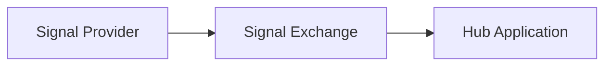

# Cursor Collaboration Feedback

Recommendations for improving our design documentation workflow.

**Last Updated:** 2026-01-06

---

## ✅ Addressed

| Item | Implementation |
|------|----------------|
| Template Library | `_templates/` folder with 8 templates |
| Review Checklists | `.cursor/rules/subsystem-documentation-rules.mdc` |
| Design Debt Tracking | `design-debt/` folder |
| Collaboration Standards | `.cursor/rules/collaboration-standards.mdc` |
| Session Handoff Protocol | Included in collaboration-standards.mdc |
| PERIODIC-TODO | `olympus-hub-docs/PERIODIC-TODO.md` |

---

## 🟡 Remaining Opportunities

### 1. **Formalize a Terminology Glossary**

We've established many domain terms (Request, Signal, Trigger, Task Queue, etc.). A formal glossary would:
- Help new team members onboard faster
- Ensure consistent term usage across documents
- Serve as a reference when terms are ambiguous

**Suggestion**: Create `olympus-hub-docs/glossary.md` and reference it from Cursor rules.

**Status**: To be discussed

---

### 2. **Diagram-as-Code (Mermaid)**

ASCII art works but is hard to maintain. Consider migrating key diagrams to Mermaid:

**Benefits**:
- Version-controlled like code
- Renderable in GitHub/GitLab
- Easier to update as design evolves

**Status**: Consider for next documentation pass

---

### 3. **Decision Dependency Graph**

Some ADRs depend on or supersede others. Consider:

- A visual ADR dependency diagram (Mermaid)
- Periodic "ADR health check" to ensure consistency

**Note**: ADR template already includes "Related Decisions" section. This is about visualization.

---

### 4. **Stakeholder-Aware Documentation**

Some documents serve multiple audiences. Consider:

- **TL;DR sections** at the top for executives/quick readers
- **Explicit audience markers**: "This section is for Developers"
- **Reading paths**: "If you're an Architect, read X, Y, Z in order"

---

### 5. **Feedback Mechanism**

How do we know if documentation is useful?

- Add "Feedback" sections or links
- Track questions that come up in other channels (Slack, meetings)
- If same question asked twice, documentation needs updating

---

## 🔴 Pain Points to Monitor

### Context Window Limits
As documentation grows, Cursor can't hold everything in context. Mitigations:
- Keep individual documents focused (< 500 lines ideal)
- Use explicit file references rather than assuming knowledge
- Consider a "context primer" document for complex sessions

### Multi-Author Collaboration
Currently single-author. For multiple authors:
- Establish "ownership" of sections
- Use PRs with review checklists
- Sync on terminology before parallel work

---

## Next Actions

| Action | Priority |
|--------|----------|
| Create `glossary.md` | High |
| Add Mermaid diagrams to 2-3 key docs | Medium |
| ADR dependency visualization | Low |