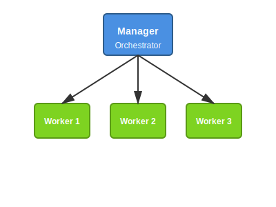
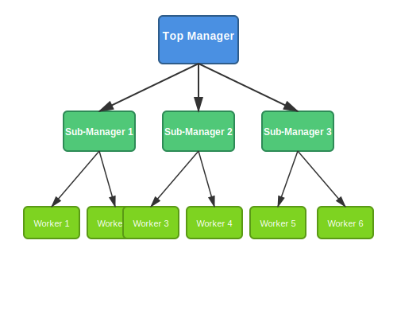
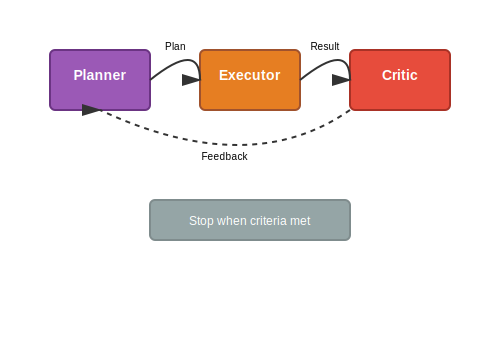
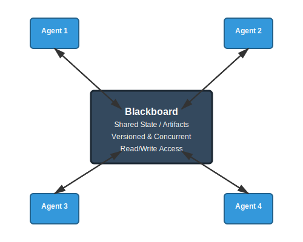
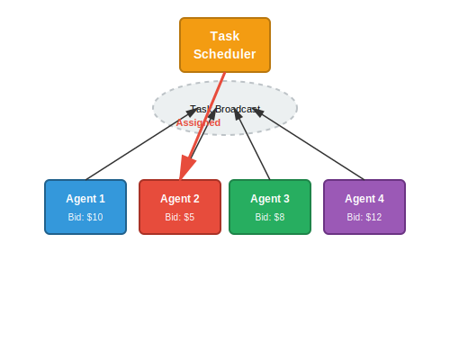
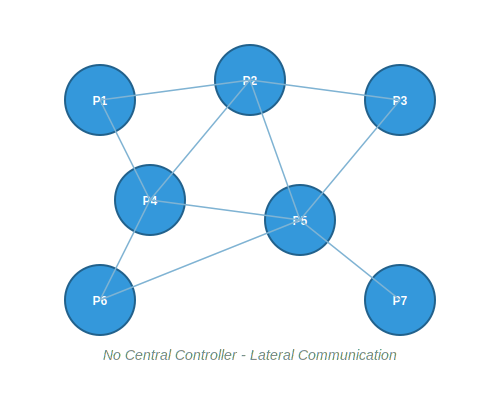
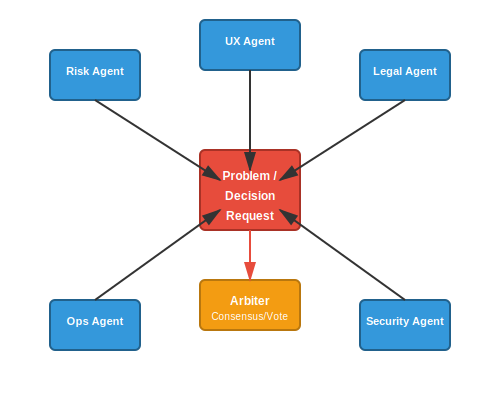
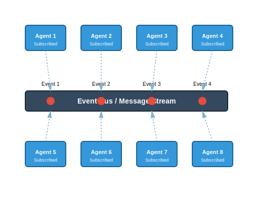
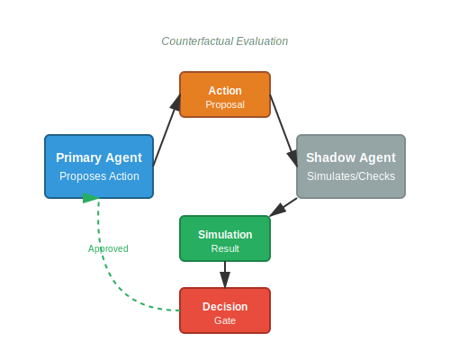

# Multi‑Agent Topologies / Patterns — List, Use‑Cases, Strengths, Failure Modes

This is a concise catalog of typical **multi‑agent collaboration topologies** you can use to assess whether **AOSM** supports them.

---

## 1) Manager–Worker (Orchestrator)

**Pattern**
- One **manager/orchestrator agent** decomposes a goal into tasks.
- Multiple **worker agents** execute subtasks.
- Manager aggregates outputs, validates, and decides next steps.

**Best for / Use‑cases**
- Task decomposition and delegation
- Document drafting pipelines (research → write → format)
- ETL / reconciliation steps (extract → normalize → validate)
- Customer service flows (triage → resolution → follow‑up)

**Strengths**
- Clear control plane and accountability
- Predictable execution path
- Easier governance in regulated settings

**Failure modes / Risks**
- Manager becomes throughput bottleneck
- Global plan may be wrong → workers waste cycles
- Over‑centralization limits adaptability

**Enterprise analogy**
- Project manager → functional teams

---

## 2) Hierarchical (Multi‑Level Orchestration)

**Pattern**
- Manager → **sub‑managers** → workers (multiple layers).
- Each layer owns a domain or abstraction level (strategy vs execution vs tooling).

**Best for / Use‑cases**
- Large multi‑domain initiatives (policy + data + ops)
- Multi‑journey servicing systems spanning channels and products
- Organization‑mirroring structures (domain squads)

**Strengths**
- Scales cognitively and operationally
- Local autonomy with global alignment
- Clear escalation paths

**Failure modes / Risks**
- Coordination latency across layers
- Semantic drift / inconsistent assumptions between layers
- Debugging “where did it go wrong” becomes harder

**Enterprise analogy**
- CEO → VPs → teams

---

## 3) Planner–Executor–Critic (PEC Loop)

**Pattern**
- **Planner** creates a plan.
- **Executor** performs actions.
- **Critic** evaluates outcomes and feeds back; loop repeats as needed.

**Best for / Use‑cases**
- High‑quality reasoning pipelines
- “Think, then do, then verify” workflows
- Safety‑sensitive actions (changes to prod, funds movement approvals)
- Report generation with quality gates

**Strengths**
- Strong self‑correction loop
- Explicit checkpoints for policy and safety
- Improves quality with iteration

**Failure modes / Risks**
- Latency and cost (looping)
- Can get stuck in critique loops without a stop rule
- Requires well‑defined acceptance criteria

**Enterprise analogy**
- Strategy → operations → QA/audit

---

## 4) Blackboard (Shared Memory Coordination)

**Pattern**
- Agents coordinate via a **shared blackboard/state** rather than direct messaging.
- Agents read/write artifacts; state changes trigger actions.

**Best for / Use‑cases**
- Loose coupling across teams/agents
- Multi‑specialist collaboration where tasks emerge
- Knowledge‑centric systems (cases, investigations, dossiers)

**Strengths**
- Highly extensible (add/remove agents easily)
- Natural for artifact‑based governance and auditing
- Encourages composability

**Failure modes / Risks**
- Race conditions / conflicting updates
- Requires strong versioning and concurrency controls
- Governance complexity: who can write what, when

**Enterprise analogy**
- Jira / Confluence / shared dashboards

---

## 5) Market‑Based / Auction

**Pattern**
- Tasks are broadcast; agents **bid** based on cost/confidence/availability.
- A scheduler assigns the task to the best bid (or top‑k).

**Best for / Use‑cases**
- Dynamic resource allocation
- Load balancing across specialist agents
- Optimization under uncertainty (routing, prioritization)

**Strengths**
- Scales well under variable demand
- Efficient task matching (capability ↔ task)
- Naturally supports elastic compute

**Failure modes / Risks**
- Harder to explain “why this agent” without good logging
- Requires robust utility/cost functions
- Can be gamed if incentives are mis‑specified

**Enterprise analogy**
- Internal marketplaces; compute schedulers

---

## 6) Peer‑to‑Peer (Swarm)

**Pattern**
- No single controller; agents communicate laterally.
- Global behavior emerges from local interactions.

**Best for / Use‑cases**
- Exploration and open‑ended discovery (research swarms)
- Robustness to node failure
- Situations where centralized planning is brittle

**Strengths**
- No single point of failure
- Highly adaptive
- Can explore multiple hypotheses in parallel

**Failure modes / Risks**
- Unpredictable outcomes; hard to guarantee constraints
- Can diverge, duplicate work, or thrash
- Very challenging to audit end‑to‑end causality

**Enterprise analogy**
- Informal collaboration networks

---

## 7) Role‑Specialized Committees (Multi‑Perspective Review)

**Pattern**
- Multiple agents with fixed roles (risk, legal, ops, UX, security) review the same problem.
- Final decision via **consensus**, **voting**, or an **arbiter**.

**Best for / Use‑cases**
- High‑stakes decisions (policy changes, customer disputes, fraud)
- Model/agent behavior reviews
- Regulated approvals and exception handling

**Strengths**
- Reduces single‑perspective bias
- Produces richer rationale and evidence bundles
- Natural fit for governance gates

**Failure modes / Risks**
- Slow; can deadlock on disagreements
- Needs a clear tie‑breaker/arbiter and escalation
- Risk of “committee bloat”

**Enterprise analogy**
- Review boards; credit committees

---

## 8) Event‑Driven Agents (Reactive Mesh)

**Pattern**
- Agents subscribe to events and react independently.
- Minimal global planning; behavior emerges from event flows.

**Best for / Use‑cases**
- Real‑time monitoring and response (incidents, fraud signals)
- Customer lifecycle triggers (activation nudges, KYC follow‑ups)
- Ops automation (alerts → diagnosis → remediation suggestion)

**Strengths**
- Low latency
- Decoupled systems scale naturally
- Works well with message buses / event streams

**Failure modes / Risks**
- Thrashing and feedback loops if not damped
- Hard to reason about end‑to‑end guarantees
- Ordering/idempotency becomes critical

**Enterprise analogy**
- Microservices reacting to Kafka events

---

## 9) Cognitive Twin / Shadow Agents (Simulate‑then‑Act)

**Pattern**
- One agent proposes an action; a **shadow/twin** simulates or checks counterfactuals.
- Actions are gated by shadow evaluation.

**Best for / Use‑cases**
- Risk‑heavy domains (payments, credit, compliance)
- “Pre‑flight checks” for operational actions (deploys, config changes)
- Explainability requirements (why this decision vs alternatives)

**Strengths**
- Safer decisions
- Produces strong audit trails (proposal + simulation + decision)
- Improves confidence before irreversible actions

**Failure modes / Risks**
- Higher compute and latency
- Simulation fidelity limits usefulness
- Can become overly conservative (false negatives)

**Enterprise analogy**
- Dry‑run environments; pre‑trade risk checks

---

## Notes for AOSM Assessment

When evaluating AOSM support, check whether you can represent:
- **Authority model:** centralized vs distributed vs layered
- **Coordination mechanism:** messages vs shared state vs events vs bids
- **Governance hooks:** policy gates, review/approval, audit logs
- **Memory/Artifacts:** versioning, concurrency, provenance
- **Stop rules:** termination criteria for loops/committees/swarm
