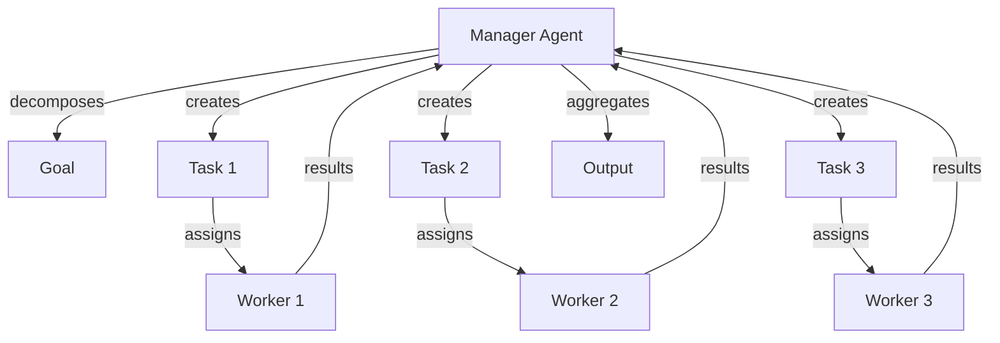
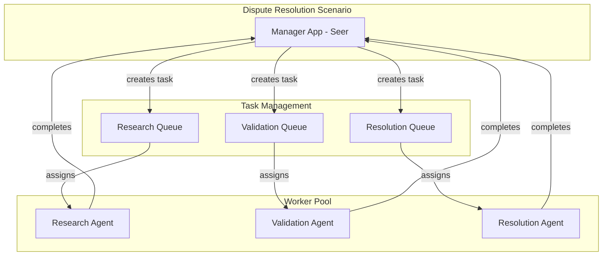
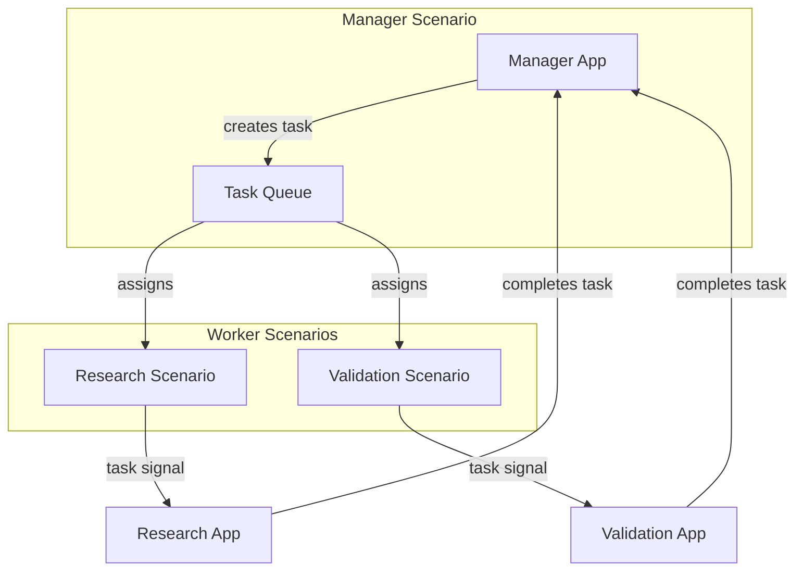
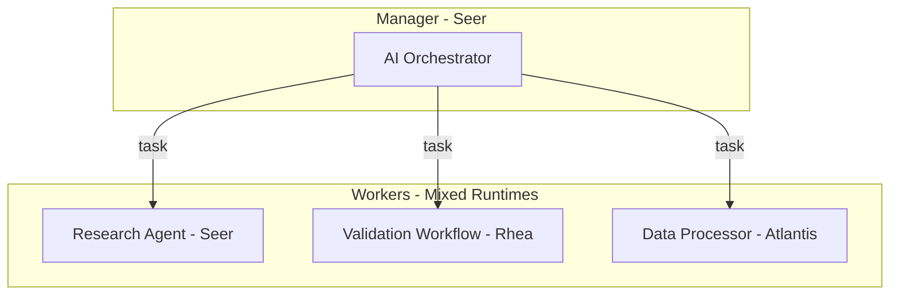

# Manager-Worker (Orchestrator) Topology

> **Status**: 🟡 Draft  
> **Topology Reference**: [Multi-Agent Topologies Catalog](../../../agentic-ai-concepts/multi-agent-topologies.md#1-managerworker-orchestrator)

---

## Overview

The **Manager-Worker** topology features one manager/orchestrator agent that decomposes goals into tasks, with multiple worker agents executing subtasks. The manager aggregates outputs, validates results, and decides next steps.



---

## When to Use

### Best Use Cases
- Task decomposition and delegation
- Document drafting pipelines (research → write → format)
- ETL / reconciliation steps (extract → normalize → validate)
- Customer service flows (triage → resolution → follow-up)

### Strengths
- Clear control plane and accountability
- Predictable execution path
- Easier governance in regulated settings

### Failure Modes
- Manager becomes throughput bottleneck
- Global plan may be wrong → workers waste cycles
- Over-centralization limits adaptability

---

## Hub/Seer Mapping

| Topology Concept | Hub/Seer Implementation |
|------------------|-------------------------|
| Manager Agent | Hub Application (Seer Employed Agent) |
| Worker Agent | Employed Agent assigned via Task Queue |
| Task | Hub Task created by Manager app |
| Task Assignment | Task Queue with Escalation Matrix |
| Result Aggregation | Manager receives task completion updates |

---

## Approach 1: Hub Application with Task Delegation

The manager is a Hub Application that creates tasks. Workers are Employed Agents (human or AI) assigned via task queue escalation matrix.

### Architecture



### Configuration

**Manager Hub Application Spec:**

```yaml
apiVersion: hub.olympus.io/v1
kind: HubApplicationSpec
metadata:
  name: dispute-manager
  namespace: acme-disputes
spec:
  display_name: "Dispute Resolution Manager"
  runtime:
    type: seer
  seerTrainingRef:
    name: dispute-manager-training
    version: "1.0.0"
```

**Task Queue Configuration:**

```yaml
apiVersion: hub.olympus.io/v1
kind: TaskQueueSpec
metadata:
  name: research-queue
  namespace: acme-disputes
spec:
  name: "Research Task Queue"
  allocation:
    algorithm: round-robin-with-capacity
  escalation_matrix:
    levels:
      - level: 0
        candidates:
          type: iam_role
          value: research-analyst
        threshold_minutes: null
      - level: 1
        candidates:
          type: iam_user_group
          value: senior-researchers
        threshold_minutes: 60
```

### Execution Flow

1. **Request Created**: Signal triggers dispute resolution scenario
2. **Manager Analyzes**: Manager app receives REQUEST_CREATED update
3. **Task Decomposition**: Manager creates tasks for each work item
   ```python
   # Manager creates research task
   await task_management.create_task(
       request_id=request.id,
       task_type="research",
       queue_id="research-queue",
       payload={"dispute_id": dispute.id, "documents": [...]}
   )
   ```
4. **Task Assignment**: Task Queue assigns to available worker agents
5. **Worker Execution**: Workers complete tasks, update with results
6. **Manager Aggregation**: Manager receives TASK_COMPLETED updates
7. **Decision**: Manager aggregates results and makes decision

---

## Approach 2: Scenario-as-Agent Workers

Workers are implemented as Scenario-as-Agent - full scenarios enrolled in the manager's task queue. This enables complex worker logic with their own automation.

### Architecture



### Configuration

**Scenario-as-Agent for Research Worker:**

```yaml
apiVersion: hub.olympus.io/v1
kind: ScenarioAsAgent
metadata:
  name: research-automation-agent
  namespace: acme-disputes
spec:
  # Source Scenario
  scenario_ref: research-automation
  
  # Agent Identity
  agent:
    name: research-automation-agent
    display_name: "Research Automation Agent"
    version: "1.0.0"
    
  # Capabilities
  capabilities:
    - document-research
    - data-extraction
    - source-verification
    
  # Automation type
  automation_type: llm-agent
  
  # Enrollment in manager's queue
  enrollment:
    task_queues:
      - queue_id: research-queue
        priority: 5
```

### When to Use Approach 2

| Criteria | Use Approach 2 When |
|----------|---------------------|
| Worker Complexity | Workers need their own multi-step automation |
| Reusability | Same worker automation used across multiple managers |
| Isolation | Workers need their own request context (child requests) |
| Fallback | Workers may need to escalate back to human agents |

---

## Comparison

| Aspect | Approach 1: Task Delegation | Approach 2: Scenario-as-Agent |
|--------|----------------------------|------------------------------|
| Worker Type | Employed Agents (human/AI) | Full Scenarios |
| Complexity | Simple task completion | Complex automation |
| Context | Shared request context | Own request context possible |
| Reusability | Agent skills reused | Entire scenario reused |
| Setup | Lower | Higher |
| Best For | Simple, focused tasks | Complex, multi-step workers |

---

## Multi-Runtime Example

Combine Seer AI manager with different runtime workers:



Each worker can be implemented in the most appropriate runtime:
- **Seer**: AI-driven research and analysis
- **Rhea**: BPMN workflow for structured validation
- **Atlantis**: Procedure for data processing

---

## Related Patterns

- [Hierarchical](./02-hierarchical.md) - Multi-level manager-worker
- [PEC Loop](./03-planner-executor-critic.md) - Manager with verification
- [Committees](./07-role-specialized-committees.md) - Multiple workers, voting decision

---

*The Manager-Worker topology provides clear accountability and predictable execution, making it ideal for regulated environments where audit trails are essential.*
