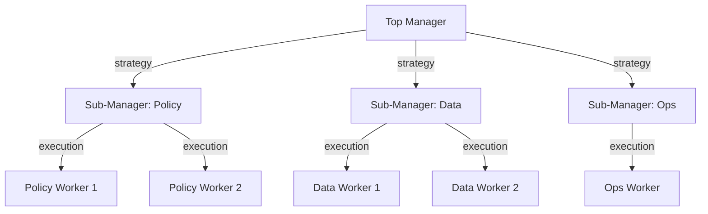
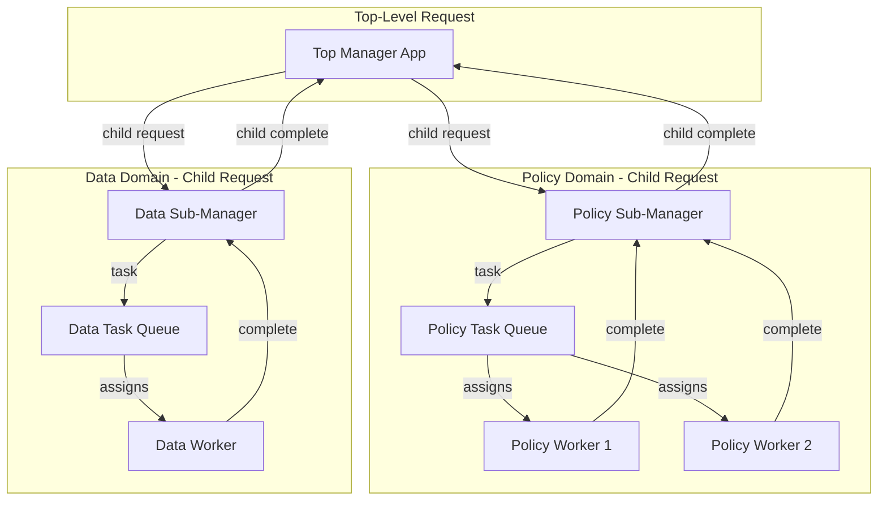
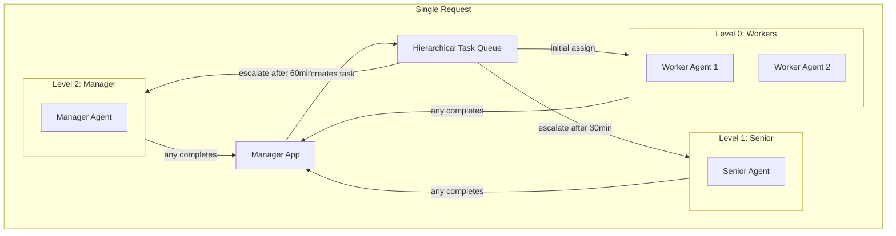
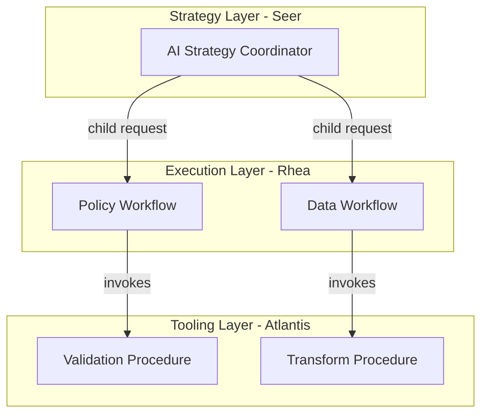

# Hierarchical (Multi-Level Orchestration) Topology

> **Status**: 🟡 Draft  
> **Topology Reference**: [Multi-Agent Topologies Catalog](../../../agentic-ai-concepts/multi-agent-topologies.md#2-hierarchical-multilevel-orchestration)

---

## Overview

The **Hierarchical** topology extends Manager-Worker with multiple layers: Manager → Sub-managers → Workers. Each layer owns a domain or abstraction level (strategy vs execution vs tooling).



---

## When to Use

### Best Use Cases
- Large multi-domain initiatives (policy + data + ops)
- Multi-journey servicing systems spanning channels and products
- Organization-mirroring structures (domain squads)

### Strengths
- Scales cognitively and operationally
- Local autonomy with global alignment
- Clear escalation paths

### Failure Modes
- Coordination latency across layers
- Semantic drift / inconsistent assumptions between layers
- Debugging "where did it go wrong" becomes harder

---

## Hub/Seer Mapping

| Topology Concept | Hub/Seer Implementation |
|------------------|-------------------------|
| Top Manager | Hub Application (root request) |
| Sub-Manager | Scenario-as-Agent creating child requests |
| Worker | Employed Agent in leaf-level queue |
| Layer Boundary | Parent-Child Request hierarchy |
| Result Propagation | Child completion updates parent |

---

## Approach 1: Parent-Child Request Hierarchy

Sub-managers are Scenario-as-Agent that create child requests for their domain. Results propagate automatically via parent-child request relationships.

### Architecture



### Configuration

**Top Manager Application:**

```yaml
apiVersion: hub.olympus.io/v1
kind: HubApplicationSpec
metadata:
  name: initiative-coordinator
  namespace: acme-initiatives
spec:
  display_name: "Initiative Coordinator"
  runtime:
    type: seer
  seerTrainingRef:
    name: initiative-coordinator-training
    version: "1.0.0"
```

**Sub-Manager as Scenario-as-Agent:**

```yaml
apiVersion: hub.olympus.io/v1
kind: ScenarioAsAgent
metadata:
  name: policy-domain-manager
  namespace: acme-initiatives
spec:
  scenario_ref: policy-domain-scenario
  
  agent:
    name: policy-domain-manager
    display_name: "Policy Domain Manager"
    version: "1.0.0"
    
  capabilities:
    - policy-analysis
    - compliance-review
    - regulation-mapping
    
  automation_type: llm-agent
  
  enrollment:
    task_queues:
      - queue_id: domain-manager-queue
        priority: 10
```

### Execution Flow

1. **Top Manager Receives Request**: Initiative created at top level
2. **Domain Decomposition**: Top manager identifies domains needing work
3. **Child Request Creation**: Creates child requests for each domain
   ```python
   # Top manager creates child request for policy domain
   child_request = await request_management.create_child_request(
       parent_request_id=request.id,
       scenario_id="policy-domain-scenario",
       context={
           "initiative_id": initiative.id,
           "domain": "policy",
           "scope": policy_scope
       }
   )
   ```
4. **Sub-Manager Activation**: Policy domain scenario activates
5. **Sub-Manager Creates Tasks**: Creates tasks for policy workers
6. **Workers Complete**: Workers complete tasks, update sub-manager
7. **Child Completion**: Sub-manager completes child request
8. **Parent Update**: Top manager receives child completion update
9. **Aggregation**: Top manager aggregates all domain results

### Result Propagation

Child request completion automatically updates parent:

```python
# Child agent can explicitly update parent request
await request_management.update_parent_request(
    child_request_id=child_request.id,
    update_type="DOMAIN_COMPLETE",
    payload={
        "domain": "policy",
        "findings": [...],
        "recommendations": [...]
    }
)
```

---

## Approach 2: Nested Task Queues with Escalation

Use escalation matrix levels to represent hierarchy. Each level adds new assignees (cumulative) without creating separate requests.

### Architecture



### Configuration

**Hierarchical Escalation Matrix:**

```yaml
apiVersion: hub.olympus.io/v1
kind: TaskQueueSpec
metadata:
  name: hierarchical-review-queue
  namespace: acme-bank
spec:
  name: "Hierarchical Review Queue"
  
  allocation:
    algorithm: round-robin-with-capacity
    
  escalation_matrix:
    levels:
      # Level 0: Junior analysts (initial assignment)
      - level: 0
        candidates:
          type: iam_role
          value: junior-analyst
        threshold_minutes: null  # Start here
        
      # Level 1: Senior analysts (after 30 min)
      - level: 1
        candidates:
          type: iam_role
          value: senior-analyst
        threshold_minutes: 30
        
      # Level 2: Team lead (after 60 min from Level 1)
      - level: 2
        candidates:
          type: iam_role
          value: team-lead
        threshold_minutes: 60
        
      # Level 3: Manager (after 120 min from Level 2)
      - level: 3
        candidates:
          type: workbench_role
          value: supervisor
        threshold_minutes: 120
```

### Key Principles

1. **Cumulative Assignment**: Higher levels add assignees; lower levels are not removed
2. **Any Can Complete**: Any assignee at any level can mark the task complete
3. **First Wins**: The first assignee to complete the task wins
4. **Nudging**: Higher-level assignees may coordinate with or nudge lower-level assignees

---

## Comparison

| Aspect | Approach 1: Parent-Child Requests | Approach 2: Escalation Matrix |
|--------|-----------------------------------|------------------------------|
| Request Scope | Separate request per domain | Single shared request |
| Context Isolation | Each domain has own context | Shared context |
| Complexity | Higher (multiple requests) | Lower (single request) |
| Audit Trail | Clear domain boundaries | Single timeline |
| Parallelism | Natural parallel execution | Sequential escalation |
| Best For | Domain isolation needed | Simple escalation hierarchy |

---

## Multi-Runtime Example

Three-tier hierarchy with different runtimes at each level:



- **Seer**: AI-driven strategic decisions at top level
- **Rhea**: BPMN workflows for execution orchestration
- **Atlantis**: Procedures for atomic operations

---

## Related Patterns

- [Manager-Worker](./01-manager-worker.md) - Single-level version
- [PEC Loop](./03-planner-executor-critic.md) - Adds verification layer
- [Blackboard](./04-blackboard.md) - Alternative to hierarchy via shared state

---

*The Hierarchical topology mirrors organizational structures, making it natural for enterprise adoption but requiring careful attention to cross-layer consistency.*
