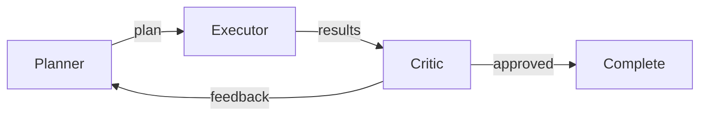
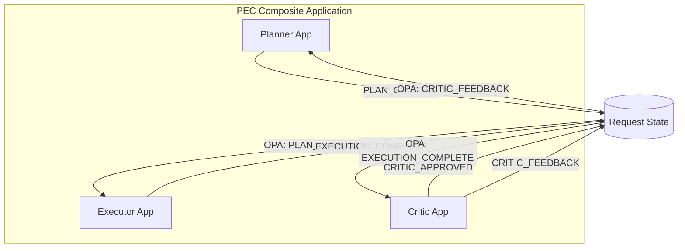
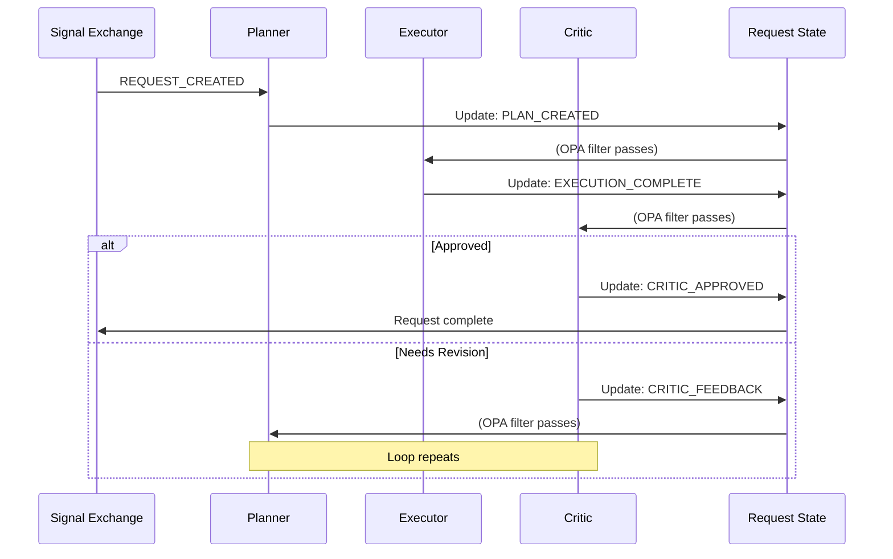
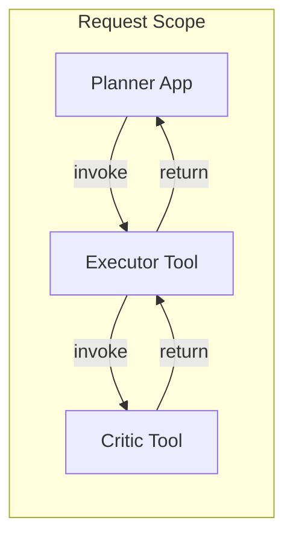
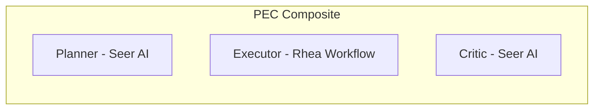

# Planner-Executor-Critic (PEC Loop) Topology

> **Status**: 🟡 Draft  
> **Topology Reference**: [Multi-Agent Topologies Catalog](../../../agentic-ai-concepts/multi-agent-topologies.md#3-plannerexecutorcritic-pec-loop)

---

## Overview

The **Planner-Executor-Critic (PEC Loop)** topology separates planning, execution, and verification into distinct agents that coordinate through iterative feedback cycles.



---

## When to Use

### Best Use Cases
- High-quality reasoning pipelines
- "Think, then do, then verify" workflows
- Safety-sensitive actions (changes to prod, funds movement approvals)
- Report generation with quality gates

### Strengths
- Strong self-correction loop
- Explicit checkpoints for policy and safety
- Improves quality with iteration

### Failure Modes
- Latency and cost (looping)
- Can get stuck in critique loops without a stop rule
- Requires well-defined acceptance criteria

---

## Hub/Seer Mapping

| Topology Concept | Hub/Seer Implementation |
|------------------|-------------------------|
| Planner Agent | Hub Application in Composite |
| Executor Agent | Hub Application in Composite |
| Critic Agent | Hub Application in Composite |
| Coordination | OPA filters on update types |
| Feedback Loop | Request state updates trigger next phase |

---

## Approach 1: Composite Application with OPA Filters

Three apps in a `HubCompositeApplicationSpec` coordinate via update types. OPA filters ensure each app only receives relevant updates.

### Architecture



### Configuration

**Composite Application Spec:**

```yaml
apiVersion: hub.olympus.io/v1
kind: HubCompositeApplicationSpec
metadata:
  name: pec-loop-composite
  namespace: acme-approvals
spec:
  display_name: "PEC Loop for High-Value Approvals"
  
  applications:
    # Planner: Receives request creation and critic feedback
    - name: planner
      ref:
        name: approval-planner
        version: "1.0.0"
      opa_filter:
        policy: |
          package composite.filter
          default allow = false
          allow { input.update_type == "REQUEST_CREATED" }
          allow { input.update_type == "CRITIC_FEEDBACK" }
    
    # Executor: Receives plan created
    - name: executor
      ref:
        name: approval-executor
        version: "1.0.0"
      opa_filter:
        policy: |
          package composite.filter
          default allow = false
          allow { input.update_type == "PLAN_CREATED" }
    
    # Critic: Receives execution complete
    - name: critic
      ref:
        name: approval-critic
        version: "1.0.0"
      opa_filter:
        policy: |
          package composite.filter
          default allow = false
          allow { input.update_type == "EXECUTION_COMPLETE" }
  
  metadata:
    topology_pattern: "pec_loop"
```

### Update Type Flow



### Execution Flow

1. **Request Created**: Planner receives initial request
2. **Planning**: Planner analyzes request, creates plan
   ```python
   await request.update(
       update_type="PLAN_CREATED",
       payload={
           "plan": {
               "steps": [...],
               "risk_assessment": {...},
               "estimated_duration": "2h"
           }
       }
   )
   ```
3. **Execution**: Executor receives PLAN_CREATED, executes plan
4. **Verification**: Critic receives EXECUTION_COMPLETE, evaluates
5. **Decision**: Critic either approves or sends feedback
   ```python
   # Critic sends feedback for revision
   await request.update(
       update_type="CRITIC_FEEDBACK",
       payload={
           "issues": ["Step 3 incomplete", "Missing validation"],
           "suggestions": ["Re-run validation", "Add audit log"]
       }
   )
   ```
6. **Loop**: Planner receives feedback, revises plan

### Stop Rules

Prevent infinite loops with configurable limits:

```yaml
# In Planner's configuration
max_iterations: 3
escalation_on_limit:
  action: escalate_to_supervisor
  message: "PEC loop exceeded max iterations"
```

---

## Approach 2: Scenario-as-Tool Chain

Synchronous invocation chain where each phase invokes the next as a tool.

### Architecture



### Configuration

**Executor as Tool:**

```yaml
apiVersion: hub.olympus.io/v1
kind: ScenarioAsTool
metadata:
  name: executor-tool
  namespace: acme-approvals
spec:
  scenario_ref: execution-scenario
  
  tool:
    name: execute-plan
    display_name: "Execute Approval Plan"
    version: "1.0.0"
    
  operations:
    - name: execute
      signal_type: plan.execute.requested
      parameters:
        - name: plan
          type: object
          required: true
      returns:
        type: object
        schema:
          execution_results: object
          status: string
```

**Critic as Tool:**

```yaml
apiVersion: hub.olympus.io/v1
kind: ScenarioAsTool
metadata:
  name: critic-tool
  namespace: acme-approvals
spec:
  scenario_ref: critic-scenario
  
  tool:
    name: evaluate-execution
    display_name: "Evaluate Execution Results"
    version: "1.0.0"
    
  operations:
    - name: evaluate
      signal_type: execution.evaluate.requested
      parameters:
        - name: plan
          type: object
          required: true
        - name: results
          type: object
          required: true
      returns:
        type: object
        schema:
          approved: boolean
          feedback: string
```

### Execution Flow (Synchronous)

```python
# Planner orchestrates the PEC loop
async def plan_execute_critique(request):
    plan = await create_plan(request)
    
    for iteration in range(max_iterations):
        # Execute plan (synchronous tool call)
        results = await tools.execute_plan(plan=plan)
        
        # Critique results (synchronous tool call)
        evaluation = await tools.evaluate_execution(
            plan=plan,
            results=results
        )
        
        if evaluation.approved:
            return results
        
        # Revise plan based on feedback
        plan = await revise_plan(plan, evaluation.feedback)
    
    # Max iterations reached
    await escalate_to_supervisor(request)
```

---

## Comparison

| Aspect | Approach 1: Composite + OPA | Approach 2: Scenario-as-Tool |
|--------|----------------------------|------------------------------|
| Coordination | Asynchronous via updates | Synchronous tool calls |
| Flexibility | Each app independent | Planner orchestrates |
| Parallelism | Apps can react independently | Sequential execution |
| Latency | Higher (async updates) | Lower (direct calls) |
| Observability | Each update logged | Tool calls logged |
| Best For | Independent verification | Tight coupling needed |

---

## Multi-Runtime Example

PEC loop with different runtimes for each phase:



- **Planner (Seer)**: AI agent creates adaptive plans
- **Executor (Rhea)**: BPMN workflow ensures structured execution
- **Critic (Seer)**: AI agent evaluates quality

---

## Related Patterns

- [Manager-Worker](./01-manager-worker.md) - Without verification loop
- [Cognitive Twin](./09-cognitive-twin-shadow.md) - Shadow verification before action
- [Committees](./07-role-specialized-committees.md) - Multiple critics

---

*The PEC Loop topology provides strong quality assurance through iterative refinement, essential for high-stakes decisions where correctness matters more than speed.*
