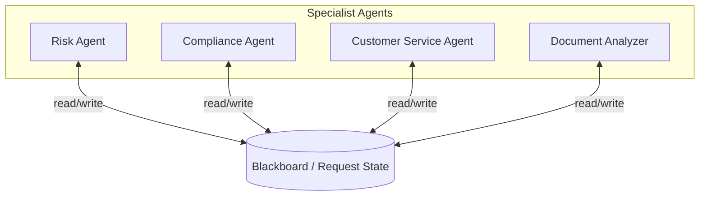
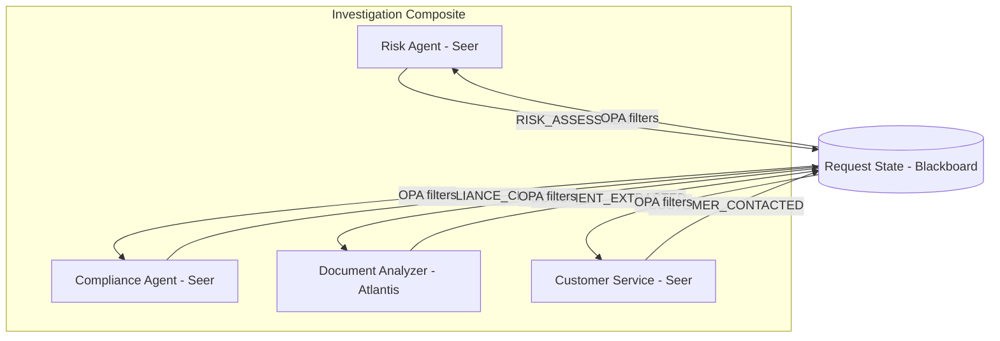
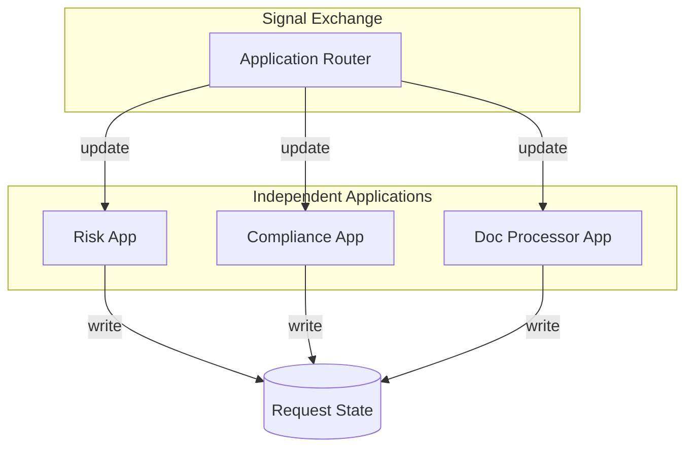

# Blackboard (Shared Memory Coordination) Topology

> **Status**: 🟡 Draft  
> **Topology Reference**: [Multi-Agent Topologies Catalog](../../../agentic-ai-concepts/multi-agent-topologies.md#4-blackboard-shared-memory-coordination)

---

## Overview

The **Blackboard** topology enables agents to coordinate via a shared state rather than direct messaging. Agents read/write artifacts to the blackboard; state changes trigger actions.



---

## When to Use

### Best Use Cases
- Loose coupling across teams/agents
- Multi-specialist collaboration where tasks emerge
- Knowledge-centric systems (cases, investigations, dossiers)

### Strengths
- Highly extensible (add/remove agents easily)
- Natural for artifact-based governance and auditing
- Encourages composability

### Failure Modes
- Race conditions / conflicting updates
- Requires strong versioning and concurrency controls
- Governance complexity: who can write what, when

---

## Hub/Seer Mapping

| Topology Concept | Hub/Seer Implementation |
|------------------|-------------------------|
| Blackboard | Request State |
| Agent | Hub Application in Composite |
| Read | Access Request state |
| Write | Request Update |
| State Change Trigger | OPA filter on update type |
| Conflict Resolution | Latest update wins |

---

## Approach 1: Composite Application (Primary)

Multiple specialist apps in a `HubCompositeApplicationSpec` share Request state as the blackboard. OPA filters route updates selectively.

### Architecture



### Configuration

**Composite Application Spec:**

```yaml
apiVersion: hub.olympus.io/v1
kind: HubCompositeApplicationSpec
metadata:
  name: investigation-composite
  namespace: acme-investigations
spec:
  display_name: "Multi-Specialist Investigation"
  
  applications:
    # Risk Agent: Reacts to document uploads and customer contact
    - name: risk-agent
      ref:
        name: risk-assessment-agent
        version: "1.0.0"
      opa_filter:
        policy: |
          package composite.filter
          default allow = false
          allow { input.update_type == "REQUEST_CREATED" }
          allow { input.update_type == "DOCUMENT_EXTRACTED" }
          allow { input.update_type == "CUSTOMER_CONTACTED" }
    
    # Compliance Agent: Reacts to risk assessments
    - name: compliance-agent
      ref:
        name: compliance-check-agent
        version: "1.0.0"
      opa_filter:
        policy: |
          package composite.filter
          default allow = false
          allow { input.update_type == "REQUEST_CREATED" }
          allow { input.update_type == "RISK_ASSESSMENT" }
    
    # Document Analyzer: Reacts to document uploads only
    - name: document-analyzer
      ref:
        name: document-analyzer-procedure
        version: "1.0.0"
      opa_filter:
        policy: |
          package composite.filter
          default allow = false
          allow { input.update_type == "DOCUMENT_UPLOADED" }
    
    # Customer Service: Reacts to investigation start
    - name: customer-service
      ref:
        name: customer-service-agent
        version: "1.0.0"
      opa_filter:
        policy: |
          package composite.filter
          default allow = false
          allow { input.update_type == "REQUEST_CREATED" }
  
  metadata:
    topology_pattern: "blackboard"
```

### Request State as Blackboard

```yaml
# Example Request State structure
request_state:
  id: "inv-2026-001"
  status: "IN_PROGRESS"
  
  # Blackboard artifacts
  artifacts:
    documents:
      - id: "doc-001"
        type: "bank_statement"
        extracted_data: {...}
        uploaded_at: "2026-01-15T10:00:00Z"
    
    risk_assessment:
      score: 72
      factors: ["high_transaction_volume", "new_account"]
      assessed_by: "risk-agent"
      assessed_at: "2026-01-15T10:05:00Z"
    
    compliance_check:
      status: "flagged"
      regulations: ["AML", "KYC"]
      checked_by: "compliance-agent"
      checked_at: "2026-01-15T10:10:00Z"
    
    customer_contact:
      contacted: true
      response: "Customer confirmed transactions"
      contacted_by: "customer-service-agent"
      contacted_at: "2026-01-15T10:15:00Z"
```

### Execution Flow

1. **Request Created**: All agents receive initial update (per OPA filters)
2. **Parallel Work**: Each agent works on its specialty
   - Document Analyzer extracts document data
   - Customer Service contacts customer
   - Risk Agent starts initial assessment
3. **Reactive Updates**: As artifacts are written to blackboard:
   - `DOCUMENT_EXTRACTED` triggers Risk Agent
   - `RISK_ASSESSMENT` triggers Compliance Agent
   - `CUSTOMER_CONTACTED` triggers Risk Agent (update assessment)
4. **Convergence**: Agents contribute until investigation complete

### Cross-Runtime Example

Combine specialists from different runtimes:

```yaml
applications:
  # Seer AI agents for reasoning
  - name: risk-agent
    ref:
      name: risk-assessment-agent
      version: "1.0.0"
    # runtime: seer (inferred from HubApplicationSpec)
  
  # Rhea workflow for structured compliance
  - name: compliance-workflow
    ref:
      name: compliance-check-workflow
      version: "1.0.0"
    # runtime: rhea
  
  # Atlantis procedure for document processing
  - name: document-processor
    ref:
      name: document-ocr-procedure
      version: "1.0.0"
    # runtime: atlantis
```

---

## Approach 2: Independent Hub Applications

Separate Hub Applications (not in a composite) coordinate via Request updates. Signal Exchange routes all updates to all interested apps.

### Architecture



### Configuration

Each app subscribes to the scenario via separate `ScenarioAutomationSpec`:

```yaml
# Risk Application bound to investigation scenario
apiVersion: hub.olympus.io/v1
kind: ScenarioAutomationSpec
metadata:
  name: investigation-risk
  namespace: acme-investigations
spec:
  normative_ref:
    name: fraud-investigation
    version: "1.0.0"
  application:
    ref:
      name: risk-assessment-app
      version: "1.0.0"
  triggers:
    - signal_source: internal
      signal_match:
        update_types:
          - REQUEST_CREATED
          - DOCUMENT_EXTRACTED
```

### When to Use Approach 2

| Criteria | Use Approach 2 When |
|----------|---------------------|
| Deployment | Apps deploy independently |
| Ownership | Different teams own different apps |
| Versioning | Apps version independently |
| Flexibility | Apps may serve multiple scenarios |

---

## Conflict Resolution

Multiple agents may update the same Request concurrently.

### Resolution Strategy

| Strategy | Description |
|----------|-------------|
| **Latest Wins** | Default - timestamp-based resolution |
| **Rejected Updates** | Illegal updates recorded in history |
| **Source Tracking** | Each update tagged with `source_app` |

### Update History

```yaml
history:
  - timestamp: "2026-01-15T10:05:00Z"
    source_app: "risk-agent"
    update_type: "RISK_ASSESSMENT"
    status: "accepted"
    
  - timestamp: "2026-01-15T10:05:01Z"
    source_app: "compliance-agent"
    update_type: "RISK_ASSESSMENT"  # Attempted same field
    status: "rejected"
    reason: "concurrent_update_conflict"
```

---

## Comparison

| Aspect | Approach 1: Composite | Approach 2: Independent Apps |
|--------|----------------------|------------------------------|
| Deployment | All-or-nothing | Independent |
| OPA Filters | Per-app in composite | Per-scenario |
| Ownership | Single team | Multiple teams |
| Versioning | Composite version | Individual versions |
| Best For | Tightly coupled specialists | Loosely coupled services |

---

## Related Patterns

- [PEC Loop](./03-planner-executor-critic.md) - Structured coordination instead of emergent
- [Peer-to-Peer](./06-peer-to-peer-swarm.md) - More dynamic discovery
- [Event-Driven](./08-event-driven-reactive.md) - Focus on events vs. artifacts

---

*The Blackboard topology excels at knowledge-centric work where specialists contribute independently and the shared state serves as the source of truth.*
