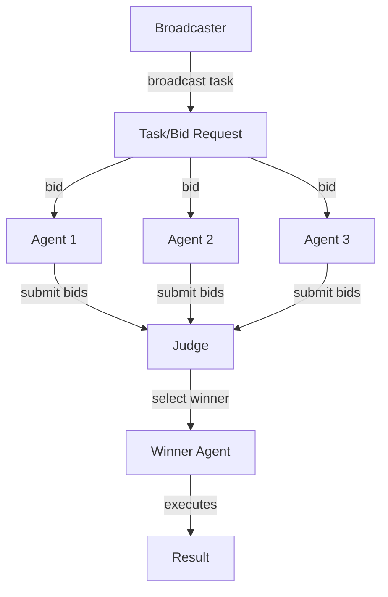
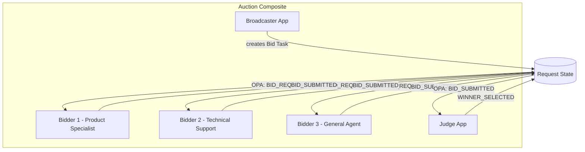
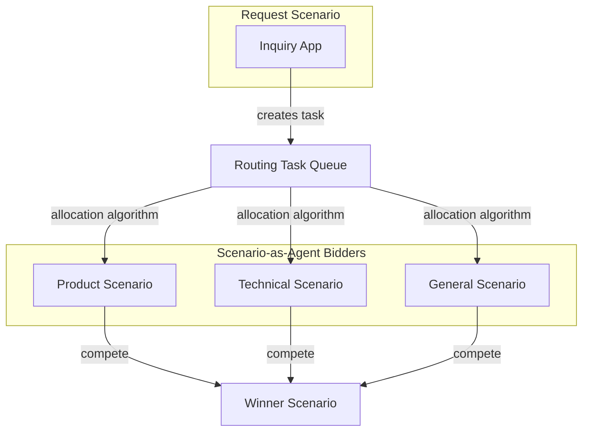

# Market-Based / Auction Topology

> **Status**: 🟡 Draft  
> **Topology Reference**: [Multi-Agent Topologies Catalog](../../../agentic-ai-concepts/multi-agent-topologies.md#5-marketbased--auction)

---

## Overview

The **Market-Based / Auction** topology broadcasts tasks and allows agents to bid based on cost, confidence, or availability. A scheduler/judge assigns the task to the best bid.



---

## When to Use

### Best Use Cases
- Dynamic resource allocation
- Load balancing across specialist agents
- Optimization under uncertainty (routing, prioritization)

### Strengths
- Scales well under variable demand
- Efficient task matching (capability ↔ task)
- Naturally supports elastic compute

### Failure Modes
- Harder to explain "why this agent" without good logging
- Requires robust utility/cost functions
- Can be gamed if incentives are mis-specified

---

## Hub/Seer Mapping

| Topology Concept | Hub/Seer Implementation |
|------------------|-------------------------|
| Broadcaster | Hub Application creating bid task |
| Bidders | Employed Agents or Apps assigned to bid task |
| Bid | Task update with cost/confidence fields |
| Judge | Hub Application evaluating bids |
| Timeout | Hub Scheduling for bid deadline |
| Winner Selection | Judge app evaluates bids, selects winner |

**Key Insight**: Hub doesn't natively recognize "bids" - they're modeled as task updates. The judge pattern is an arrangement between cooperating agents/apps.

---

## Approach 1: Composite with Judge Pattern

Broadcaster, Bidders, and Judge are apps in a composite. Bids are modeled as task updates. Judge uses Hub scheduling for timeouts.

### Architecture



### Configuration

**Composite Application Spec:**

```yaml
apiVersion: hub.olympus.io/v1
kind: HubCompositeApplicationSpec
metadata:
  name: dynamic-routing-auction
  namespace: acme-support
spec:
  display_name: "Dynamic Inquiry Routing Auction"
  
  applications:
    # Broadcaster: Creates bid requests
    - name: broadcaster
      ref:
        name: inquiry-router
        version: "1.0.0"
      opa_filter:
        policy: |
          package composite.filter
          default allow = false
          allow { input.update_type == "REQUEST_CREATED" }
    
    # Bidder 1: Product specialist
    - name: product-specialist
      ref:
        name: product-specialist-agent
        version: "1.0.0"
      opa_filter:
        policy: |
          package composite.filter
          default allow = false
          allow { input.update_type == "BID_REQUESTED" }
    
    # Bidder 2: Technical support
    - name: technical-support
      ref:
        name: technical-support-agent
        version: "1.0.0"
      opa_filter:
        policy: |
          package composite.filter
          default allow = false
          allow { input.update_type == "BID_REQUESTED" }
    
    # Judge: Evaluates bids
    - name: judge
      ref:
        name: bid-evaluator
        version: "1.0.0"
      opa_filter:
        policy: |
          package composite.filter
          default allow = false
          allow { input.update_type == "BID_SUBMITTED" }
          allow { input.update_type == "BID_TIMEOUT" }
  
  metadata:
    topology_pattern: "market_based"
```

### Bid Task Structure

```yaml
# Broadcaster creates bid task
task:
  id: "bid-task-001"
  type: "bid_request"
  
  payload:
    inquiry_type: "product_question"
    complexity: "medium"
    customer_tier: "premium"
    deadline: "2026-01-15T11:00:00Z"  # Bid deadline
    
  assignments:
    - agent: "product-specialist"
    - agent: "technical-support"
    - agent: "general-agent"
```

### Bid Submission

```python
# Bidder submits bid as task update
await task.update(
    update_type="BID_SUBMITTED",
    payload={
        "bidder": "product-specialist",
        "confidence": 0.95,  # 0-1 scale
        "estimated_time": "15min",
        "cost": 10,  # Internal cost units
        "reasoning": "Exact product expertise match"
    }
)
```

### Judge Evaluation

```python
# Judge waits for bids with timeout
async def evaluate_bids(task_id):
    # Use Hub scheduling for timeout
    await hub_scheduler.schedule(
        event="BID_TIMEOUT",
        delay_seconds=60,
        task_id=task_id
    )
    
    # Collect bids (reactive - receives BID_SUBMITTED updates)
    bids = await collect_bids(task_id)
    
    # Evaluate and select winner
    winner = select_winner(bids)  # Custom logic
    
    await request.update(
        update_type="WINNER_SELECTED",
        payload={
            "winner": winner.bidder,
            "winning_bid": winner.bid,
            "evaluation_criteria": "confidence * (1/cost)"
        }
    )
```

### Execution Flow

1. **Request Created**: Broadcaster receives inquiry
2. **Bid Broadcast**: Broadcaster creates bid task, assigns to all bidders
3. **Timeout Scheduled**: Hub scheduling sets bid deadline
4. **Bids Submitted**: Each bidder evaluates and submits bid
5. **Judge Evaluates**: Judge receives bids, waits for deadline
6. **Winner Selected**: Judge selects winner based on criteria
7. **Execution**: Winner executes the inquiry

---

## Approach 2: Task Queue with Scenario-as-Agent Bidders

Multiple Scenario-as-Agent enrolled in the same task queue. The allocation algorithm acts as implicit "judge".

### Architecture



### Configuration

**Scenario-as-Agent for Bidder:**

```yaml
apiVersion: hub.olympus.io/v1
kind: ScenarioAsAgent
metadata:
  name: product-specialist-bidder
  namespace: acme-support
spec:
  scenario_ref: product-specialist-scenario
  
  agent:
    name: product-specialist-bidder
    display_name: "Product Specialist (Auto)"
    version: "1.0.0"
    
  capabilities:
    - product-questions
    - feature-explanations
    - pricing-inquiries
    
  # Custom attributes for allocation
  attributes:
    specialty: "product"
    confidence_threshold: 0.8
    cost_per_task: 10
    
  enrollment:
    task_queues:
      - queue_id: inquiry-routing-queue
        priority: 10  # Higher priority = preferred
```

**Task Queue with Capability-Based Allocation:**

```yaml
apiVersion: hub.olympus.io/v1
kind: TaskQueueSpec
metadata:
  name: inquiry-routing-queue
  namespace: acme-support
spec:
  name: "Inquiry Routing Queue"
  
  allocation:
    algorithm: capability-weighted
    parameters:
      match_capabilities: true
      consider_load: true
      consider_priority: true
```

### Implicit Bidding

In this approach, "bidding" is implicit:
- Agent capabilities match task requirements
- Allocation algorithm considers load, priority, history
- First capable agent to accept wins

---

## Comparison

| Aspect | Approach 1: Composite + Judge | Approach 2: Task Queue |
|--------|------------------------------|------------------------|
| Bidding | Explicit bid submission | Implicit capability matching |
| Judge | Dedicated app | Allocation algorithm |
| Flexibility | Custom bid criteria | Standard allocation |
| Observability | Bid history in request | Allocation logs |
| Latency | Wait for bids + evaluation | Immediate assignment |
| Best For | Complex bid evaluation | Simple capability matching |

---

## Bid Evaluation Criteria

The judge can use any criteria - Hub doesn't impose rules:

| Criteria | Description | Example |
|----------|-------------|---------|
| **Confidence** | Agent's self-reported confidence | 0.95 = high match |
| **Cost** | Internal cost units | 10 credits |
| **Time Estimate** | Expected completion time | 15 minutes |
| **History** | Past performance on similar tasks | 95% success rate |
| **Load** | Current agent workload | 3 active tasks |

```python
def select_winner(bids):
    # Example: weighted score
    scored = []
    for bid in bids:
        score = (
            bid.confidence * 0.4 +
            (1 / bid.cost) * 0.3 +
            (1 / bid.estimated_time) * 0.2 +
            bid.history_score * 0.1
        )
        scored.append((bid, score))
    
    return max(scored, key=lambda x: x[1])[0]
```

---

## Related Patterns

- [Manager-Worker](./01-manager-worker.md) - Static assignment instead of bidding
- [Committees](./07-role-specialized-committees.md) - All provide input, not competing
- [Peer-to-Peer](./06-peer-to-peer-swarm.md) - Self-organization instead of auction

---

*The Market-Based topology enables efficient resource allocation through competition, ideal for environments with variable demand and diverse agent capabilities.*
