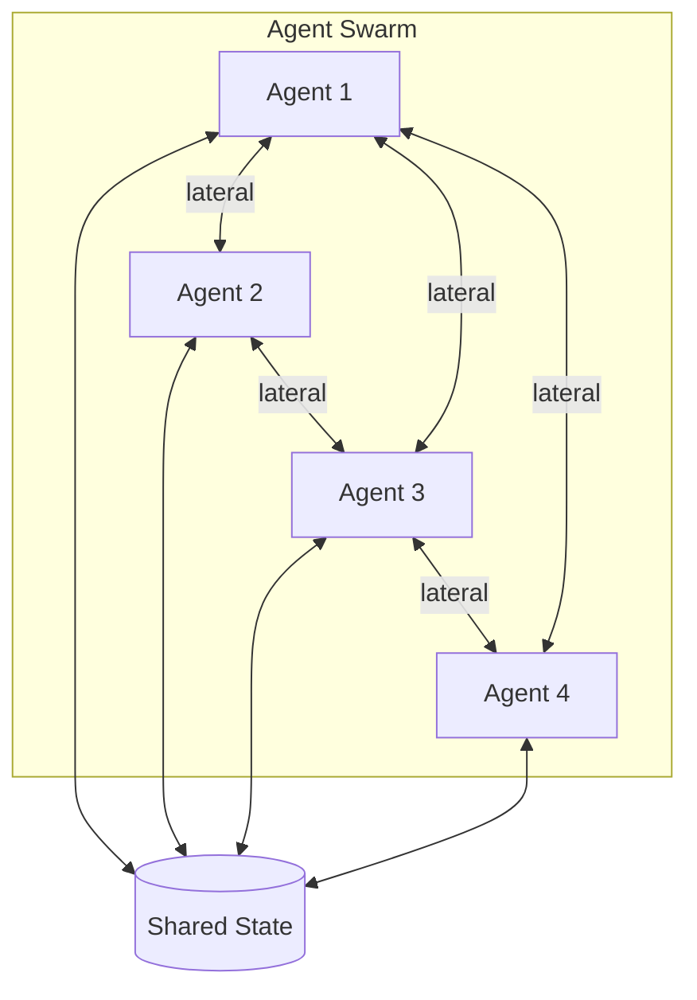
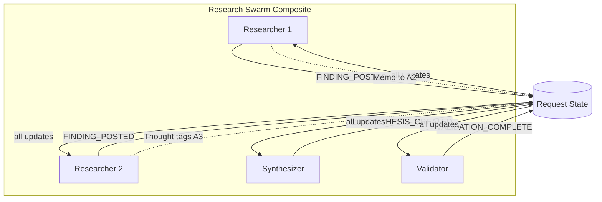
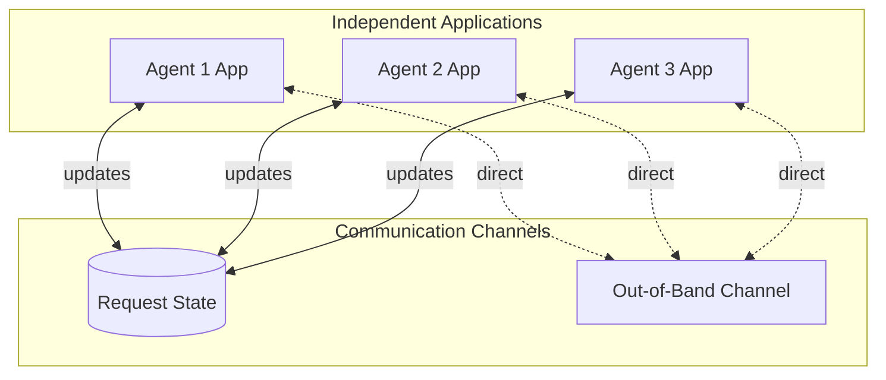
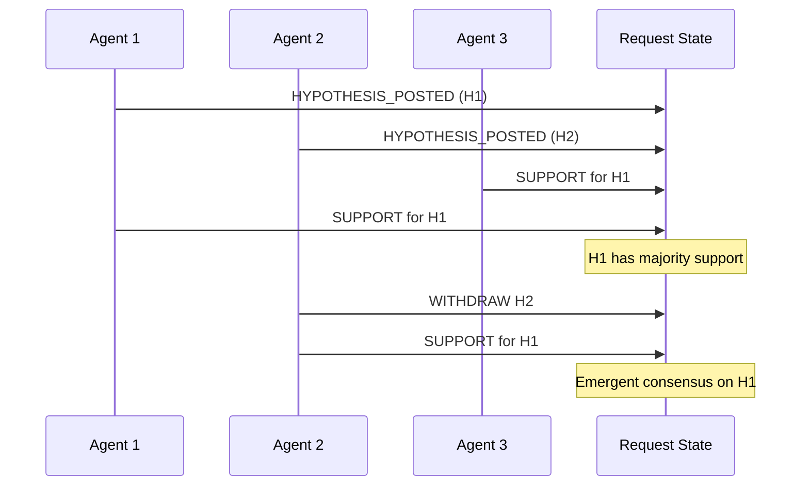

# Peer-to-Peer (Swarm) Topology

> **Status**: 🟡 Draft  
> **Topology Reference**: [Multi-Agent Topologies Catalog](../../../agentic-ai-concepts/multi-agent-topologies.md#6-peertopeer-swarm)

---

## Overview

The **Peer-to-Peer (Swarm)** topology has no single controller. Agents communicate laterally, and global behavior emerges from local interactions.



---

## When to Use

### Best Use Cases
- Exploration and open-ended discovery (research swarms)
- Robustness to node failure
- Situations where centralized planning is brittle

### Strengths
- No single point of failure
- Highly adaptive
- Can explore multiple hypotheses in parallel

### Failure Modes
- Unpredictable outcomes; hard to guarantee constraints
- Can diverge, duplicate work, or thrash
- Very challenging to audit end-to-end causality

---

## Hub/Seer Mapping

| Topology Concept | Hub/Seer Implementation |
|------------------|-------------------------|
| Agent | Hub Application in Composite |
| Lateral Communication | Memos (scoped), Thoughts (tagged), Request updates |
| Discovery | Agent Directories as tools |
| Shared State | Request State |
| Emergence | Agents react independently to updates |

**Key Insight**: Request is a "collaboration substrate" - it doesn't enforce coordination patterns but enables any topology through its primitives.

---

## Approach 1: Composite with Event-Driven Coordination

All agents in a composite react independently to Request updates. Memos and Thoughts enable targeted lateral communication.

### Architecture



### Configuration

**Composite Application Spec:**

```yaml
apiVersion: hub.olympus.io/v1
kind: HubCompositeApplicationSpec
metadata:
  name: research-swarm
  namespace: acme-research
spec:
  display_name: "Research Swarm"
  
  applications:
    # All agents receive all updates (no OPA filters = swarm behavior)
    - name: researcher-1
      ref:
        name: research-agent
        version: "1.0.0"
      # No OPA filter - receives all updates
    
    - name: researcher-2
      ref:
        name: research-agent
        version: "1.0.0"
    
    - name: synthesizer
      ref:
        name: synthesis-agent
        version: "1.0.0"
    
    - name: validator
      ref:
        name: validation-agent
        version: "1.0.0"
  
  metadata:
    topology_pattern: "peer_to_peer"
```

### Lateral Communication Mechanisms

#### 1. Memos (Targeted Communication)

Agent A can send a memo scoped to Agent B:

```python
# Researcher 1 sends memo to Researcher 2
await request.add_memo(
    content="Found relevant paper on topic X - suggest reviewing",
    scope={
        "type": "agent",
        "agent_id": "researcher-2"
    },
    visibility="targeted"
)
```

#### 2. Thoughts (Tagged Communication)

Agents can write thoughts and tag other agents:

```python
# Synthesizer posts thought tagging researchers
await request.add_thought(
    content="Need clarification on finding F-003",
    tags=["researcher-1", "researcher-2"],
    thought_type="question"
)
```

#### 3. Request State Updates (Broadcast)

Standard updates visible to all agents:

```python
# Post finding to shared state (all agents see this)
await request.update(
    update_type="FINDING_POSTED",
    payload={
        "finding_id": "F-003",
        "content": "Evidence suggests...",
        "confidence": 0.8,
        "source": "researcher-1"
    }
)
```

### Agent Discovery

Agents can discover each other via directories exposed as tools:

```python
# Agent discovers other agents in the swarm
available_agents = await tools.agent_directory.list(
    workbench_id=request.workbench_id,
    capabilities=["research", "synthesis"]
)

# Introduce new agent to request
await request.add_assignee(
    agent_id="domain-expert-agent",
    role="consultant"
)
```

---

## Approach 2: Independent Apps with Out-of-Band Communication

Agents operate as independent Hub Applications with optional out-of-band communication via Raw Agent capabilities.

### Architecture



### Out-of-Band Communication

Raw Agents (the base agents that Employed Agents are derived from) can provide direct communication channels:

```python
# Agent uses Raw Agent capability for direct communication
# (Not via Signal Exchange)
await raw_agent_channel.send(
    recipient="agent-2",
    message={
        "type": "coordination",
        "content": "Taking lead on subtopic Y"
    }
)
```

**Note**: Out-of-band communication bypasses Hub's observability. Use judiciously.

---

## Emergent Behavior

In swarm topologies, behavior emerges from local interactions:

### Example: Convergence on Consensus



### Swarm Coordination Patterns

| Pattern | Description | Implementation |
|---------|-------------|----------------|
| **Stigmergy** | Coordinate via environment | Agents modify Request state; others react |
| **Gossip** | Spread information peer-to-peer | Memos between agents |
| **Voting** | Emerge consensus | Support/oppose updates accumulate |
| **Recruitment** | Agents bring in others | Add assignees via directory |

---

## Sentinel Enhancement

Swarm topologies benefit from oversight:

### Realtime Sentinel for Swarm Health

```yaml
apiVersion: seer.olympus.io/v1
kind: SentinelSpec
metadata:
  name: swarm-health-sentinel
  namespace: acme-research
spec:
  type: realtime
  
  policy: |
    package swarm.health
    
    # Detect stuck swarm (no updates for 30 min)
    stuck_swarm {
      last_update_age > 1800
    }
    
    # Detect thrashing (too many updates without progress)
    thrashing {
      update_count_last_hour > 100
      progress_indicators_unchanged
    }
    
    # Detect divergence (agents posting conflicting findings)
    divergence {
      conflicting_findings_count > 3
    }
  
  observation_config:
    on_stuck_swarm:
      action: create_observation
      severity: warning
    on_thrashing:
      action: create_exception
      severity: error
    on_divergence:
      action: create_observation
      severity: info
```

---

## Comparison

| Aspect | Approach 1: Composite | Approach 2: Independent + OOB |
|--------|----------------------|------------------------------|
| Observability | Full (all via Hub) | Partial (OOB not logged) |
| Deployment | All-or-nothing | Independent |
| Communication | Memos, Thoughts, Updates | + Out-of-band |
| Governance | Standard Hub policies | Harder to enforce |
| Best For | Observable swarms | High-performance swarms |

---

## Best Practices

### Do

- Set up health monitoring (sentinels)
- Define clear termination criteria
- Log all significant interactions
- Use directories for agent discovery

### Avoid

- Unbounded swarm execution
- Over-reliance on out-of-band communication
- Swarms for tasks requiring deterministic outcomes
- Lack of progress indicators

---

## Related Patterns

- [Blackboard](./04-blackboard.md) - More structured shared state
- [Event-Driven](./08-event-driven-reactive.md) - Reactive but with OPA filtering
- [Committees](./07-role-specialized-committees.md) - Structured multi-perspective

---

*The Peer-to-Peer topology embraces emergence and adaptability, trading predictability for resilience and exploration capability.*
