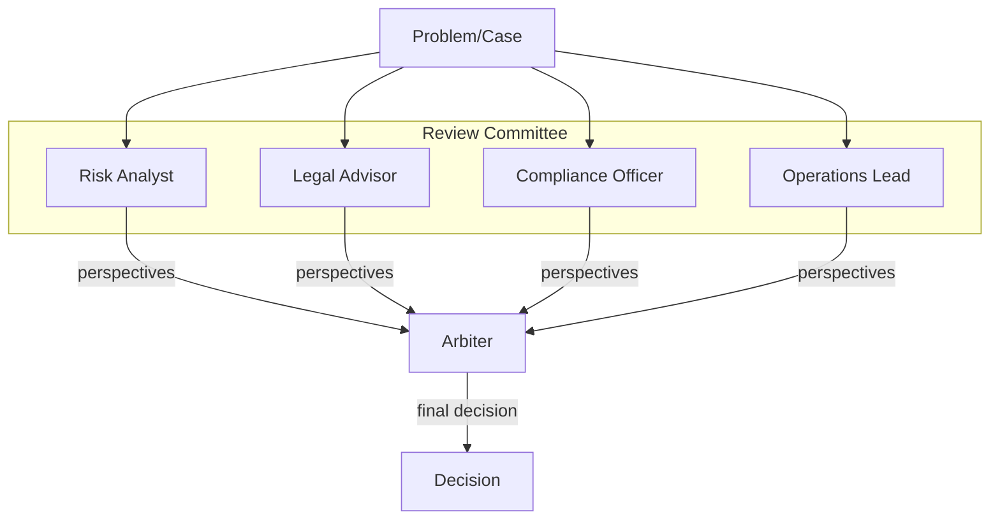
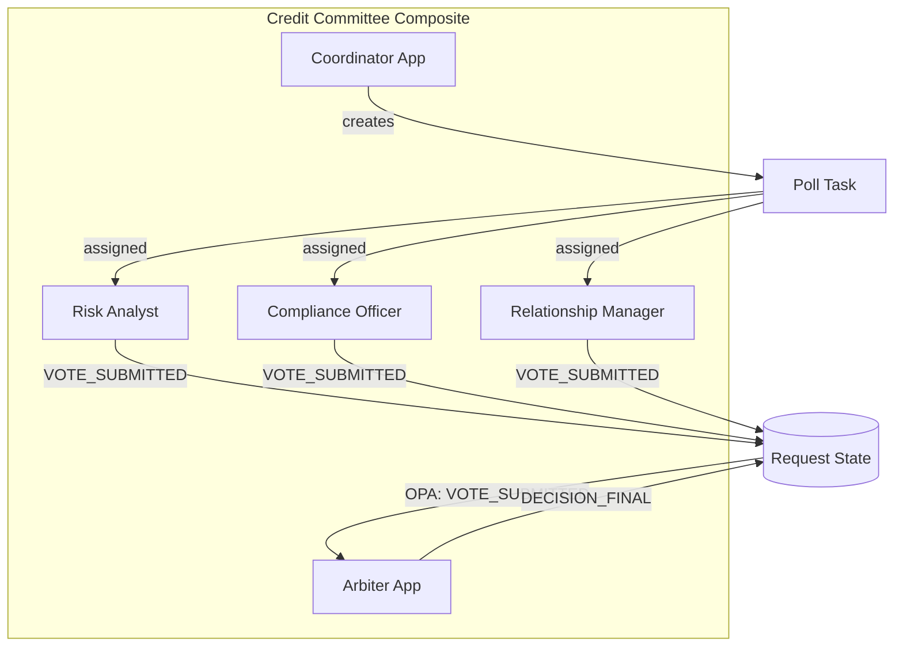
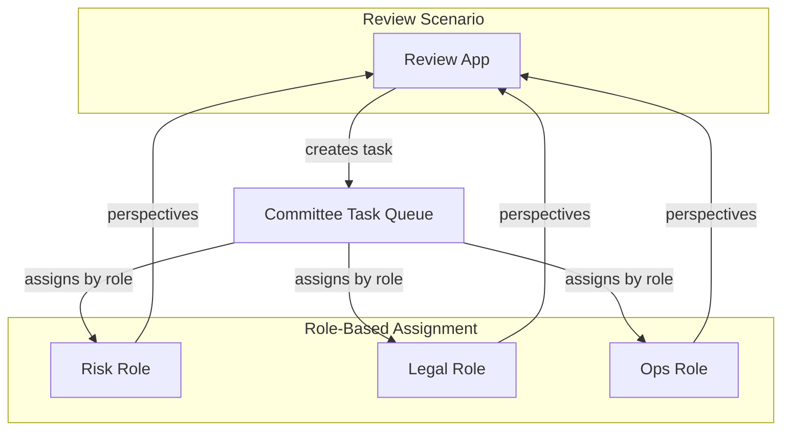

# Role-Specialized Committees (Multi-Perspective Review) Topology

> **Status**: 🟡 Draft  
> **Topology Reference**: [Multi-Agent Topologies Catalog](../../../agentic-ai-concepts/multi-agent-topologies.md#7-rolespecialized-committees-multiperspective-review)

---

## Overview

The **Role-Specialized Committees** topology has multiple agents with fixed roles (risk, legal, ops, UX, security) review the same problem. Final decision is made via consensus, voting, or an arbiter.



---

## When to Use

### Best Use Cases
- High-stakes decisions (policy changes, customer disputes, fraud)
- Model/agent behavior reviews
- Regulated approvals and exception handling

### Strengths
- Reduces single-perspective bias
- Produces richer rationale and evidence bundles
- Natural fit for governance gates

### Failure Modes
- Slow; can deadlock on disagreements
- Needs a clear tie-breaker/arbiter and escalation
- Risk of "committee bloat"

---

## Hub/Seer Mapping

| Topology Concept | Hub/Seer Implementation |
|------------------|-------------------------|
| Committee Member | Hub Application in Composite |
| Review Problem | Request with case data |
| Vote/Perspective | Task update or Poll Task |
| Consensus | Arbiter evaluates votes |
| Arbiter | Hub Application evaluating perspectives |
| Quorum | Hub Scheduling for timeout |

---

## Approach 1: Composite with Poll Task Pattern

Committee members are apps in a composite. A coordinator creates a Poll Task assigned to all members. Arbiter evaluates votes and makes final decision.

### Architecture



### Configuration

**Composite Application Spec:**

```yaml
apiVersion: hub.olympus.io/v1
kind: HubCompositeApplicationSpec
metadata:
  name: credit-committee
  namespace: acme-credit
spec:
  display_name: "Credit Committee"
  
  applications:
    # Coordinator: Creates poll task
    - name: coordinator
      ref:
        name: committee-coordinator
        version: "1.0.0"
      opa_filter:
        policy: |
          package composite.filter
          default allow = false
          allow { input.update_type == "REQUEST_CREATED" }
    
    # Risk Analyst
    - name: risk-analyst
      ref:
        name: risk-analyst-agent
        version: "1.0.0"
      opa_filter:
        policy: |
          package composite.filter
          default allow = false
          allow { input.update_type == "POLL_CREATED" }
    
    # Compliance Officer
    - name: compliance-officer
      ref:
        name: compliance-officer-agent
        version: "1.0.0"
      opa_filter:
        policy: |
          package composite.filter
          default allow = false
          allow { input.update_type == "POLL_CREATED" }
    
    # Relationship Manager
    - name: relationship-manager
      ref:
        name: relationship-manager-agent
        version: "1.0.0"
      opa_filter:
        policy: |
          package composite.filter
          default allow = false
          allow { input.update_type == "POLL_CREATED" }
    
    # Arbiter: Evaluates votes
    - name: arbiter
      ref:
        name: committee-arbiter
        version: "1.0.0"
      opa_filter:
        policy: |
          package composite.filter
          default allow = false
          allow { input.update_type == "VOTE_SUBMITTED" }
          allow { input.update_type == "QUORUM_TIMEOUT" }
  
  metadata:
    topology_pattern: "committee"
```

### Poll Task Creation

```python
# Coordinator creates poll task for committee
poll_task = await task_management.create_task(
    request_id=request.id,
    task_type="committee_poll",
    payload={
        "question": "Approve credit limit increase to $50,000?",
        "case_id": case.id,
        "options": ["approve", "reject", "escalate"],
        "quorum_required": 3,  # Need 3 votes
        "deadline": "2026-01-15T12:00:00Z"
    },
    assignments=[
        {"agent": "risk-analyst"},
        {"agent": "compliance-officer"},
        {"agent": "relationship-manager"}
    ]
)

# Schedule quorum timeout
await hub_scheduler.schedule(
    event="QUORUM_TIMEOUT",
    delay_seconds=3600,  # 1 hour
    task_id=poll_task.id
)
```

### Vote Submission

```python
# Committee member submits vote
await task.update(
    update_type="VOTE_SUBMITTED",
    payload={
        "voter": "risk-analyst",
        "vote": "approve",
        "confidence": 0.85,
        "rationale": "Customer has strong payment history",
        "conditions": ["Require quarterly review"],
        "evidence": [
            {"type": "credit_score", "value": 780},
            {"type": "debt_ratio", "value": 0.25}
        ]
    }
)
```

### Arbiter Evaluation

```python
# Arbiter collects votes and makes decision
async def evaluate_committee(request, votes):
    # Count votes
    approve_count = sum(1 for v in votes if v.vote == "approve")
    reject_count = sum(1 for v in votes if v.vote == "reject")
    escalate_count = sum(1 for v in votes if v.vote == "escalate")
    
    # Determine outcome
    if escalate_count > 0:
        decision = "escalate"
        reason = "One or more members requested escalation"
    elif approve_count > reject_count:
        decision = "approve"
        reason = f"Majority approved ({approve_count}/{len(votes)})"
    elif reject_count > approve_count:
        decision = "reject"
        reason = f"Majority rejected ({reject_count}/{len(votes)})"
    else:
        decision = "tie_escalate"
        reason = "Tie vote - escalating to supervisor"
    
    # Aggregate conditions from approving votes
    conditions = []
    for v in votes:
        if v.vote == "approve" and v.conditions:
            conditions.extend(v.conditions)
    
    # Post final decision
    await request.update(
        update_type="DECISION_FINAL",
        payload={
            "decision": decision,
            "reason": reason,
            "vote_summary": {
                "approve": approve_count,
                "reject": reject_count,
                "escalate": escalate_count
            },
            "conditions": conditions,
            "evidence_bundle": [v.evidence for v in votes]
        }
    )
```

---

## Approach 2: Parallel Task Assignment with Role-Based Queue

Committee task created with multiple assignees using role-based assignment. Each assignee provides perspective.

### Architecture



### Configuration

**Task Queue with Multi-Role Assignment:**

```yaml
apiVersion: hub.olympus.io/v1
kind: TaskQueueSpec
metadata:
  name: committee-review-queue
  namespace: acme-credit
spec:
  name: "Committee Review Queue"
  
  allocation:
    algorithm: role-parallel
    parameters:
      require_all_roles: true
      timeout_minutes: 60
      
  escalation_matrix:
    levels:
      - level: 0
        candidates:
          type: composite
          members:
            - type: iam_role
              value: risk-analyst
            - type: iam_role
              value: compliance-officer
            - type: iam_role
              value: relationship-manager
        threshold_minutes: null
        
      # Escalate to senior committee after 2 hours
      - level: 1
        candidates:
          type: iam_role
          value: senior-committee-member
        threshold_minutes: 120
```

### Completion Semantics

| Mode | Description |
|------|-------------|
| **All-Must-Complete** | Task remains open until all assignees provide input |
| **First-Wins** | First completion ends task (not suitable for committees) |
| **Quorum** | Task completes when N of M assignees respond |

---

## Decision Strategies

### Voting Strategies

| Strategy | Description | Implementation |
|----------|-------------|----------------|
| **Majority** | More than 50% agree | `approve_count > total / 2` |
| **Unanimous** | All must agree | `approve_count == total` |
| **Weighted** | Votes weighted by role | `sum(vote * weight) > threshold` |
| **Veto** | Any rejection blocks | `reject_count > 0 → reject` |

### Weighted Voting Example

```python
role_weights = {
    "risk-analyst": 2.0,      # Risk has double weight
    "compliance-officer": 1.5,
    "relationship-manager": 1.0
}

def weighted_decision(votes):
    approve_score = sum(
        role_weights[v.voter] for v in votes if v.vote == "approve"
    )
    reject_score = sum(
        role_weights[v.voter] for v in votes if v.vote == "reject"
    )
    
    if approve_score > reject_score:
        return "approve"
    else:
        return "reject"
```

---

## Comparison

| Aspect | Approach 1: Composite + Poll Task | Approach 2: Role-Based Queue |
|--------|----------------------------------|------------------------------|
| Coordination | Poll Task pattern | Task queue allocation |
| Arbiter | Dedicated app | App logic |
| Flexibility | Full control | Standard allocation |
| Setup | Higher | Lower |
| Best For | Complex voting rules | Simple multi-role review |

---

## Multi-Runtime Example

Committee with different runtime specialists:

```yaml
applications:
  # AI agents for analysis
  - name: risk-analyst
    ref:
      name: risk-analyst-agent  # Seer
      version: "1.0.0"
  
  # Workflow for compliance checklist
  - name: compliance-workflow
    ref:
      name: compliance-review-workflow  # Rhea
      version: "1.0.0"
  
  # Procedure for data aggregation
  - name: data-aggregator
    ref:
      name: credit-data-procedure  # Atlantis
      version: "1.0.0"
```

---

## Related Patterns

- [Market-Based](./05-market-based-auction.md) - Competition instead of collaboration
- [PEC Loop](./03-planner-executor-critic.md) - Sequential instead of parallel review
- [Blackboard](./04-blackboard.md) - Shared state without voting

---

*The Committees topology ensures multi-perspective review for high-stakes decisions, providing richer rationale and reducing single-point-of-failure bias.*
