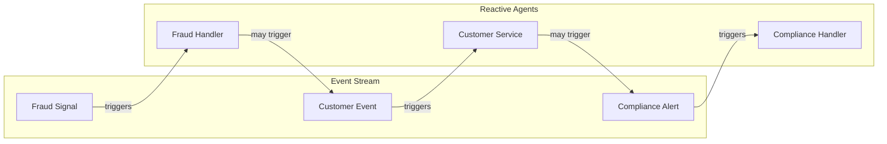
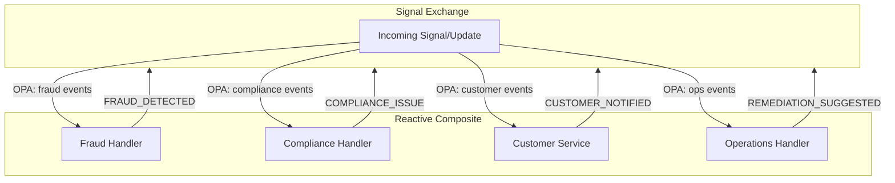
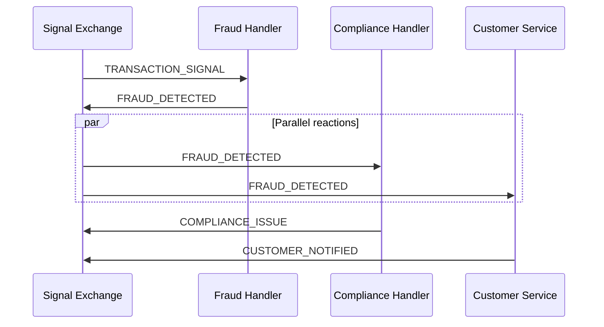
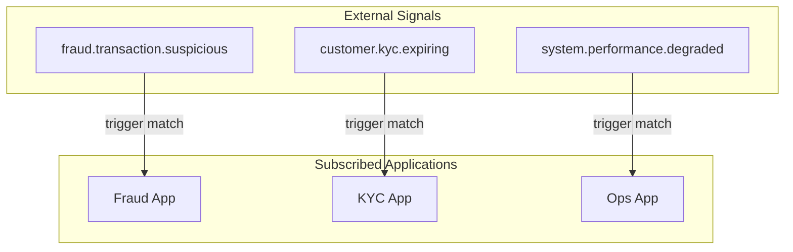
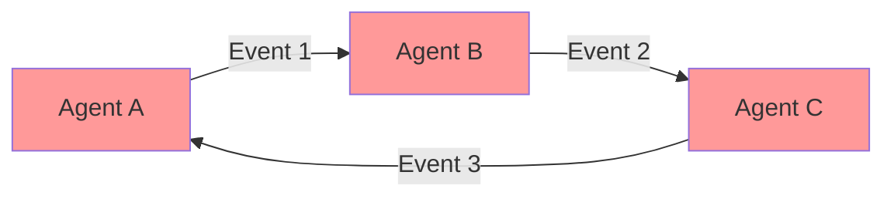

# Event-Driven Agents (Reactive Mesh) Topology

> **Status**: 🟡 Draft  
> **Topology Reference**: [Multi-Agent Topologies Catalog](../../../agentic-ai-concepts/multi-agent-topologies.md#8-eventdriven-agents-reactive-mesh)

---

## Overview

The **Event-Driven Agents** topology has agents subscribe to events and react independently. There's minimal global planning; behavior emerges from event flows.



---

## When to Use

### Best Use Cases
- Real-time monitoring and response (incidents, fraud signals)
- Customer lifecycle triggers (activation nudges, KYC follow-ups)
- Ops automation (alerts → diagnosis → remediation suggestion)

### Strengths
- Low latency
- Decoupled systems scale naturally
- Works well with message buses / event streams

### Failure Modes
- Thrashing and feedback loops if not damped
- Hard to reason about end-to-end guarantees
- Ordering/idempotency becomes critical

---

## Hub/Seer Mapping

| Topology Concept | Hub/Seer Implementation |
|------------------|-------------------------|
| Event | Signal or Request Update |
| Agent | Hub Application in Composite |
| Subscription | OPA filter on update types |
| Event Stream | Signal Exchange |
| Reaction | App triggered by matching update |

---

## Approach 1: Composite Application with OPA Filters

Multiple reactive apps in a composite. OPA filters route events to relevant apps based on update type or signal content.

### Architecture



### Configuration

**Composite Application Spec:**

```yaml
apiVersion: hub.olympus.io/v1
kind: HubCompositeApplicationSpec
metadata:
  name: realtime-response-mesh
  namespace: acme-monitoring
spec:
  display_name: "Real-time Response Mesh"
  
  applications:
    # Fraud Handler: Reacts to fraud signals
    - name: fraud-handler
      ref:
        name: fraud-detection-agent
        version: "1.0.0"
      opa_filter:
        policy: |
          package composite.filter
          default allow = false
          allow { input.update_type == "TRANSACTION_SIGNAL" }
          allow { input.update_type == "VELOCITY_ALERT" }
          allow { 
            input.update_type == "EXTERNAL_SIGNAL"
            input.update_payload.source == "fraud_vendor"
          }
    
    # Compliance Handler: Reacts to compliance events
    - name: compliance-handler
      ref:
        name: compliance-monitor-agent
        version: "1.0.0"
      opa_filter:
        policy: |
          package composite.filter
          default allow = false
          allow { input.update_type == "FRAUD_DETECTED" }
          allow { input.update_type == "KYC_EXPIRING" }
          allow { input.update_type == "REGULATORY_ALERT" }
    
    # Customer Service: Reacts to customer-facing events
    - name: customer-service
      ref:
        name: customer-notification-agent
        version: "1.0.0"
      opa_filter:
        policy: |
          package composite.filter
          default allow = false
          allow { input.update_type == "FRAUD_DETECTED" }
          allow { input.update_type == "COMPLIANCE_ISSUE" }
          allow { input.update_type == "ACCOUNT_RESTRICTED" }
    
    # Operations Handler: Reacts to system events
    - name: ops-handler
      ref:
        name: ops-automation-agent
        version: "1.0.0"
      opa_filter:
        policy: |
          package composite.filter
          default allow = false
          allow { input.update_type == "SYSTEM_ALERT" }
          allow { input.update_type == "PERFORMANCE_DEGRADATION" }
  
  metadata:
    topology_pattern: "event_driven"
```

### Event Chaining

One agent's output can trigger another:



### Reaction Patterns

```python
# Fraud Handler reacts to transaction signals
async def handle_transaction_signal(request, update):
    transaction = update.payload.transaction
    
    # Analyze for fraud
    fraud_score = await analyze_fraud(transaction)
    
    if fraud_score > 0.8:
        # Emit FRAUD_DETECTED - triggers other agents
        await request.update(
            update_type="FRAUD_DETECTED",
            payload={
                "transaction_id": transaction.id,
                "fraud_score": fraud_score,
                "risk_factors": ["velocity", "geo_mismatch"],
                "recommended_action": "block"
            }
        )
```

---

## Approach 2: Signal-Based Subscription

Apps subscribe to specific signal types via scenario triggers. No composite needed - Signal Exchange routes by signal match.

### Architecture



### Configuration

**Scenario Automation with Signal Triggers:**

```yaml
apiVersion: hub.olympus.io/v1
kind: ScenarioAutomationSpec
metadata:
  name: fraud-monitoring-automation
  namespace: acme-monitoring
spec:
  normative_ref:
    name: fraud-monitoring
    version: "1.0.0"
    
  application:
    ref:
      name: fraud-detection-agent
      version: "1.0.0"
      
  triggers:
    - id: transaction-trigger
      signal_source: external
      signal_match:
        type_pattern: "fraud.transaction.*"
      context_transform:
        transaction: "$.payload.transaction"
        
    - id: velocity-trigger
      signal_source: internal
      signal_match:
        type_pattern: "velocity.alert.*"
```

---

## Feedback Loop Prevention

Event-driven systems risk feedback loops:



### Prevention Strategies

| Strategy | Description | Implementation |
|----------|-------------|----------------|
| **Idempotency** | Process each event only once | Event ID tracking |
| **Circuit Breaker** | Stop after N reactions | Counter in request state |
| **Damping** | Delay between reactions | Hub scheduling with delay |
| **Sentinel Detection** | Monitor for loops | Realtime Sentinel |

### Idempotency Example

```python
async def handle_event(request, update):
    # Check if already processed
    event_id = update.payload.event_id
    processed = request.state.get("processed_events", [])
    
    if event_id in processed:
        return  # Skip duplicate
    
    # Process event
    await process_event(update)
    
    # Mark as processed
    processed.append(event_id)
    await request.update_state({"processed_events": processed})
```

---

## Sentinel Enhancement

### Feedback Loop Detection

```yaml
apiVersion: seer.olympus.io/v1
kind: SentinelSpec
metadata:
  name: event-loop-detector
  namespace: acme-monitoring
spec:
  type: realtime
  
  policy: |
    package event.monitoring
    
    # Detect rapid event cycling
    feedback_loop {
      event_count_last_minute > 10
      unique_event_types < 3
    }
    
    # Detect event storm
    event_storm {
      event_count_last_minute > 100
    }
  
  observation_config:
    on_feedback_loop:
      action: create_exception
      severity: error
      message: "Potential feedback loop detected"
    on_event_storm:
      action: create_exception
      severity: critical
```

### Analytical Sentinel for Patterns

```yaml
apiVersion: seer.olympus.io/v1
kind: SentinelSpec
metadata:
  name: event-pattern-analyzer
  namespace: acme-monitoring
spec:
  type: analytical
  
  query_template: |
    SELECT 
      request_id,
      COUNT(*) as event_count,
      COUNT(DISTINCT update_type) as unique_types,
      MAX(timestamp) - MIN(timestamp) as duration
    FROM request_updates
    WHERE timestamp > NOW() - INTERVAL '1 hour'
    GROUP BY request_id
    HAVING COUNT(*) > 50 AND COUNT(DISTINCT update_type) < 5
  
  schedule: "*/5 * * * *"  # Every 5 minutes
```

---

## Comparison

| Aspect | Approach 1: Composite + OPA | Approach 2: Signal Triggers |
|--------|----------------------------|----------------------------|
| Deployment | All-or-nothing | Independent |
| Routing | OPA policy evaluation | Signal pattern matching |
| Flexibility | Full OPA capabilities | Pattern-based only |
| Setup | Higher | Lower |
| Best For | Complex event filtering | Simple signal routing |

---

## Multi-Runtime Example

Event-driven mesh with different runtime handlers:

```yaml
applications:
  # Seer AI for fraud detection
  - name: fraud-handler
    ref:
      name: fraud-detection-agent  # Seer
      version: "1.0.0"
  
  # Rhea workflow for compliance escalation
  - name: compliance-workflow
    ref:
      name: compliance-escalation-workflow  # Rhea
      version: "1.0.0"
  
  # Atlantis procedure for data enrichment
  - name: data-enricher
    ref:
      name: event-enrichment-procedure  # Atlantis
      version: "1.0.0"
```

---

## Related Patterns

- [Blackboard](./04-blackboard.md) - Shared state vs. event stream
- [Peer-to-Peer](./06-peer-to-peer-swarm.md) - More lateral communication
- [PEC Loop](./03-planner-executor-critic.md) - Structured instead of reactive

---

*The Event-Driven topology enables low-latency, decoupled responses ideal for real-time monitoring and automation, with careful attention to loop prevention.*
