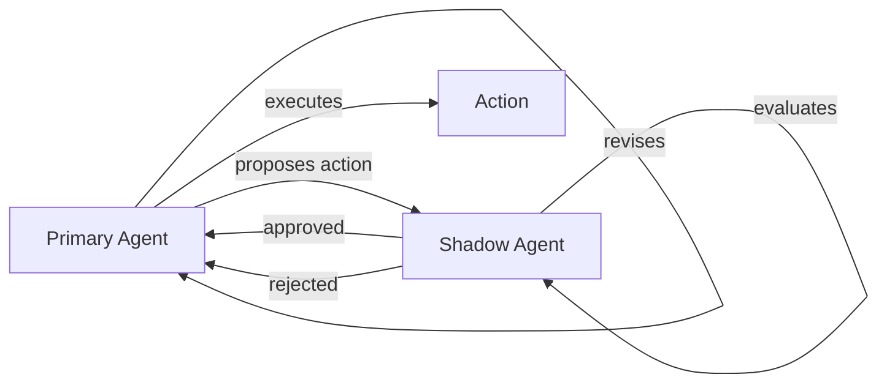
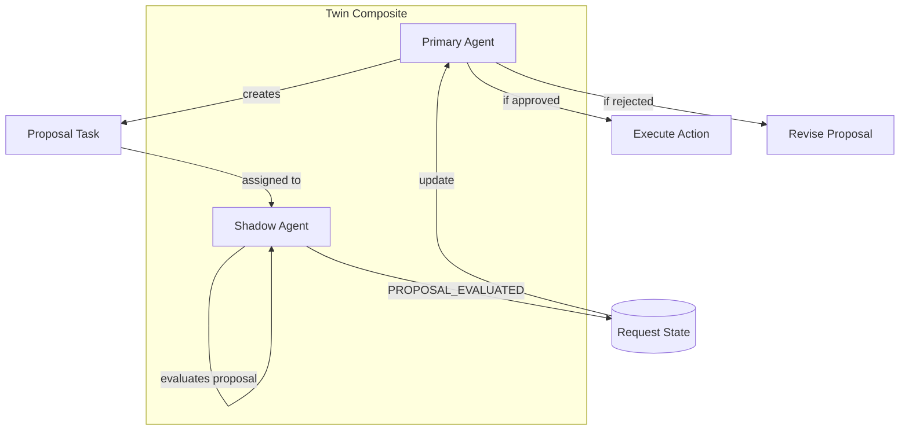
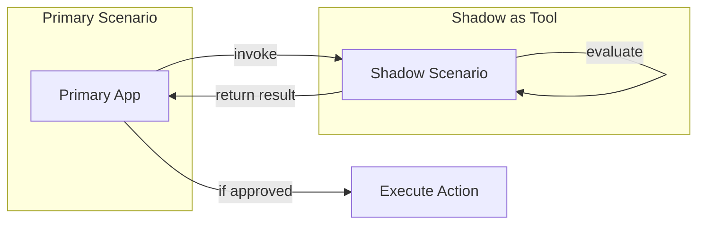

# Cognitive Twin / Shadow Agents Topology

> **Status**: 🟡 Draft  
> **Topology Reference**: [Multi-Agent Topologies Catalog](../../../agentic-ai-concepts/multi-agent-topologies.md#9-cognitive-twin--shadow-agents-simulatethenact)

---

## Overview

The **Cognitive Twin / Shadow Agents** topology has one agent propose an action while a shadow/twin simulates or checks counterfactuals. Actions are gated by shadow evaluation.



---

## When to Use

### Best Use Cases
- Risk-heavy domains (payments, credit, compliance)
- "Pre-flight checks" for operational actions (deploys, config changes)
- Explainability requirements (why this decision vs alternatives)

### Strengths
- Safer decisions
- Produces strong audit trails (proposal + simulation + decision)
- Improves confidence before irreversible actions

### Failure Modes
- Higher compute and latency
- Simulation fidelity limits usefulness
- Can become overly conservative (false negatives)

---

## Hub/Seer Mapping

| Topology Concept | Hub/Seer Implementation |
|------------------|-------------------------|
| Primary Agent | Hub Application in Composite |
| Shadow Agent | Hub Application in Composite |
| Proposal | Proposal Task assigned to Shadow |
| Evaluation | Shadow updates task with assessment |
| Gating | Primary checks result before acting |
| Action Blocking | Guardrails enforce shadow approval |

**Key Insight**: Primary waits for shadow to update the Proposal Task with its assessment. This is an explicit arrangement between cooperating agents.

---

## Approach 1: Composite with Proposal Task Pattern

Primary and Shadow are apps in a composite. Primary creates a Proposal Task assigned to Shadow. Shadow evaluates and updates the task.

### Architecture



### Configuration

**Composite Application Spec:**

```yaml
apiVersion: hub.olympus.io/v1
kind: HubCompositeApplicationSpec
metadata:
  name: payment-twin
  namespace: acme-payments
spec:
  display_name: "Payment Processing Twin"
  
  applications:
    # Primary: Proposes and executes actions
    - name: primary
      ref:
        name: payment-processor-agent
        version: "1.0.0"
      opa_filter:
        policy: |
          package composite.filter
          default allow = false
          allow { input.update_type == "REQUEST_CREATED" }
          allow { input.update_type == "PROPOSAL_EVALUATED" }
    
    # Shadow: Evaluates proposals
    - name: shadow
      ref:
        name: payment-shadow-agent
        version: "1.0.0"
      opa_filter:
        policy: |
          package composite.filter
          default allow = false
          allow { input.update_type == "PROPOSAL_CREATED" }
  
  metadata:
    topology_pattern: "cognitive_twin"
```

### Proposal Task Creation

```python
# Primary creates proposal task for shadow evaluation
async def propose_action(request, action):
    # Create proposal task assigned to shadow
    proposal_task = await task_management.create_task(
        request_id=request.id,
        task_type="proposal_evaluation",
        payload={
            "proposed_action": action.type,
            "parameters": action.parameters,
            "rationale": action.rationale,
            "risk_factors": action.identified_risks,
            "alternatives_considered": action.alternatives
        },
        assignments=[
            {"agent": "shadow"}
        ]
    )
    
    # Emit PROPOSAL_CREATED to trigger shadow
    await request.update(
        update_type="PROPOSAL_CREATED",
        payload={
            "proposal_id": proposal_task.id,
            "action": action.type
        }
    )
    
    return proposal_task.id
```

### Shadow Evaluation

```python
# Shadow evaluates the proposal
async def evaluate_proposal(request, proposal_task):
    proposal = proposal_task.payload
    
    # Run simulation / counterfactual analysis
    simulation_result = await simulate_action(
        action=proposal["proposed_action"],
        parameters=proposal["parameters"]
    )
    
    # Check against policies
    policy_result = await check_policies(proposal)
    
    # Check alternatives
    alternatives_analysis = await analyze_alternatives(
        proposal["alternatives_considered"]
    )
    
    # Make decision
    if simulation_result.success and policy_result.compliant:
        decision = "approved"
        reason = "Simulation successful, policies satisfied"
    else:
        decision = "rejected"
        reason = simulation_result.failure_reason or policy_result.violation
    
    # Update proposal task
    await proposal_task.update(
        update_type="PROPOSAL_EVALUATED",
        payload={
            "decision": decision,
            "reason": reason,
            "simulation_result": simulation_result.summary,
            "policy_check": policy_result.summary,
            "recommendations": alternatives_analysis.better_options,
            "confidence": 0.92
        }
    )
```

### Primary Waits and Acts

```python
# Primary receives PROPOSAL_EVALUATED update
async def handle_proposal_result(request, update):
    evaluation = update.payload
    
    if evaluation["decision"] == "approved":
        # Execute the proposed action
        await execute_action(
            request,
            action=original_proposal.action,
            shadow_approval=evaluation
        )
    elif evaluation["decision"] == "rejected":
        # Revise based on feedback
        revised_action = await revise_action(
            original=original_proposal.action,
            feedback=evaluation["reason"],
            recommendations=evaluation["recommendations"]
        )
        
        # Create new proposal
        await propose_action(request, revised_action)
```

---

## Approach 2: Scenario-as-Tool Shadow

Primary invokes Shadow scenario as a tool for synchronous evaluation. Simpler but tightly coupled.

### Architecture



### Configuration

**Shadow as Tool:**

```yaml
apiVersion: hub.olympus.io/v1
kind: ScenarioAsTool
metadata:
  name: shadow-evaluator-tool
  namespace: acme-payments
spec:
  scenario_ref: shadow-evaluation-scenario
  
  tool:
    name: evaluate-proposal
    display_name: "Shadow Proposal Evaluator"
    version: "1.0.0"
    
  operations:
    - name: evaluate
      signal_type: proposal.evaluate.requested
      parameters:
        - name: proposed_action
          type: object
          required: true
        - name: context
          type: object
          required: true
      returns:
        type: object
        schema:
          decision: string
          reason: string
          confidence: number
```

### Synchronous Invocation

```python
# Primary invokes shadow synchronously
async def process_with_shadow(request, action):
    # Invoke shadow as tool
    evaluation = await tools.evaluate_proposal(
        proposed_action=action,
        context={
            "request_id": request.id,
            "customer": request.customer,
            "amount": action.amount
        }
    )
    
    if evaluation.decision == "approved":
        await execute_action(request, action)
    else:
        await handle_rejection(request, action, evaluation)
```

---

## Guardrails Enhancement

Guardrails can enforce shadow approval, preventing bypasses:

```yaml
# Guardrail on Primary agent
guardrails:
  - id: require-shadow-approval
    type: action_gate
    description: "Block high-risk actions without shadow approval"
    
    trigger:
      action_types:
        - payment_execute
        - credit_approve
        - account_close
        
    condition: |
      # Check if shadow approved in current request
      shadow_approved = request.state.get("shadow_approval", {})
      action_id = context.action.id
      
      return shadow_approved.get(action_id, {}).get("decision") == "approved"
      
    on_violation:
      action: block
      message: "Action requires shadow approval before execution"
```

---

## Comparison

| Aspect | Approach 1: Composite + Proposal Task | Approach 2: Scenario-as-Tool |
|--------|--------------------------------------|------------------------------|
| Coordination | Asynchronous via task | Synchronous call |
| Coupling | Loose | Tight |
| Latency | Higher | Lower |
| Observability | Full task history | Tool call logs |
| Shadow Scope | Same request | Child request |
| Best For | Complex evaluation | Simple check |

---

## Shadow Evaluation Scope

| Option | Description | When to Use |
|--------|-------------|-------------|
| **Same Request** | Both in composite, share state | Tight coordination needed |
| **Child Request** | Shadow via Scenario-as-Tool | Isolation needed |
| **Request Sentinel** | **NOT RECOMMENDED** | Primary must be aware of shadow |

**Why not Request Sentinel?**

In this topology, Primary must explicitly wait for Shadow's assessment. Request Sentinels operate independently and don't provide the gating mechanism Primary needs.

---

## Multi-Runtime Example

Primary as AI agent, Shadow as rule-based procedure:

```yaml
applications:
  # Primary: AI agent making decisions
  - name: primary
    ref:
      name: payment-decision-agent  # Seer
      version: "1.0.0"
  
  # Shadow: Deterministic rule checker
  - name: shadow
    ref:
      name: payment-rules-procedure  # Atlantis
      version: "1.0.0"
```

This combines AI creativity with deterministic safety:
- **Seer AI**: Proposes nuanced actions
- **Atlantis Procedure**: Checks hard rules and limits

---

## Related Patterns

- [PEC Loop](./03-planner-executor-critic.md) - Iterative verification
- [Committees](./07-role-specialized-committees.md) - Multiple shadows (committee review)
- [Blackboard](./04-blackboard.md) - Shared state for evaluation

---

*The Cognitive Twin topology provides safety through simulation, essential for high-stakes decisions where the cost of errors exceeds the cost of verification.*
