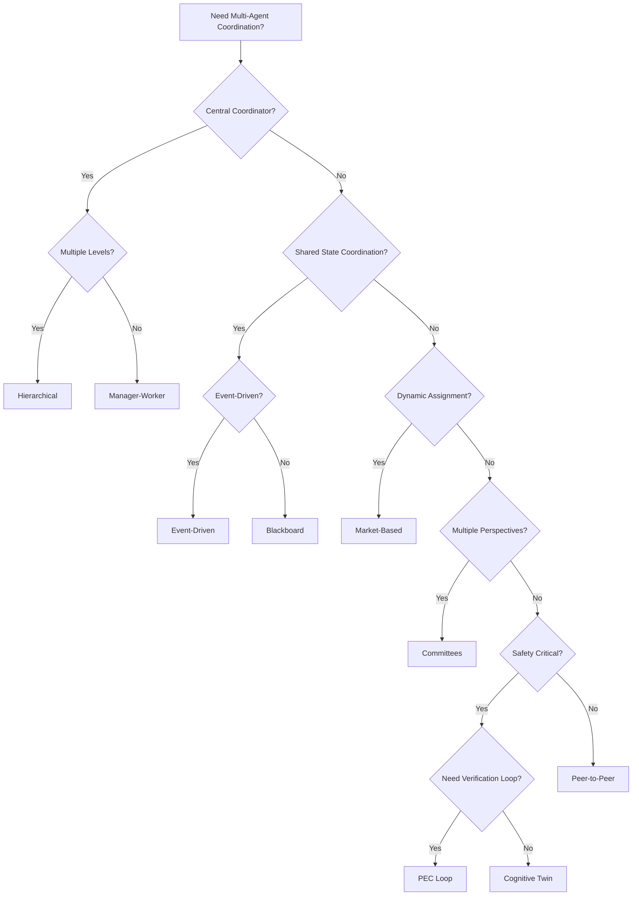

# Multi-Agent Topology Implementation Guides

> **Status**: 🟡 Draft  
> **Last Updated**: 2026-01-15

Guides for implementing multi-agent collaboration patterns using Hub and Seer.

---

## Overview

This guide series explains how to implement each multi-agent topology from the [Multi-Agent Topologies Catalog](../../../agentic-ai-concepts/multi-agent-topologies.md) using Hub and Seer capabilities. Each guide provides multiple implementation approaches with architecture diagrams, configuration examples, and best practices.

---

## Topologies

| # | Topology | Primary Pattern | Key Concepts |
|---|----------|-----------------|--------------|
| 1 | [Manager-Worker](./01-manager-worker.md) | Task Delegation | Task queues, Employed Agents |
| 2 | [Hierarchical](./02-hierarchical.md) | Multi-Level | Parent-child requests, Scenario-as-Agent |
| 3 | [PEC Loop](./03-planner-executor-critic.md) | Composite + OPA | Update type routing |
| 4 | [Blackboard](./04-blackboard.md) | Composite | Shared Request state |
| 5 | [Market-Based](./05-market-based-auction.md) | Judge Pattern | Bid tasks, scheduling |
| 6 | [Peer-to-Peer](./06-peer-to-peer-swarm.md) | Discovery | Memos, Directories |
| 7 | [Committees](./07-role-specialized-committees.md) | Poll Task | Voting, arbiter |
| 8 | [Event-Driven](./08-event-driven-reactive.md) | Reactive | OPA filters, signals |
| 9 | [Cognitive Twin](./09-cognitive-twin-shadow.md) | Proposal Task | Shadow evaluation |

---

## Key Patterns

These recurring patterns are used across multiple topologies:

| Pattern | Description | Used In |
|---------|-------------|---------|
| **Composite Application** | Multiple apps participate in same Request | PEC, Blackboard, Market, Swarm, Committees, Event-Driven, Twin |
| **Scenario-as-Agent** | Automation enrolled in task queue | Manager-Worker, Hierarchical, Market |
| **Scenario-as-Tool** | Synchronous scenario invocation | PEC, Twin |
| **Judge/Arbiter** | Wait for inputs, evaluate, decide | Market, Committees |
| **Proposal Task** | Primary → Shadow → Primary | Twin |
| **Poll Task** | Coordinator → Voters → Arbiter | Committees |

---

## Hub Concepts Mapping

| Hub/Seer Concept | Topology Use |
|------------------|--------------|
| **Task Queue** | Agent assignment via escalation matrix |
| **Employed Agent** | AI or human worker receiving tasks |
| **Composite Application** | Multiple apps in same Request |
| **OPA Filters** | Selective update routing |
| **Parent-Child Requests** | Hierarchical coordination |
| **Memos** | Targeted agent-to-agent communication |
| **Thoughts** | Tagged communication visible to specific agents |
| **Directories** | Agent discovery as tools |
| **Hub Scheduling** | Timeouts for bids, votes, quorum |
| **Guardrails** | Action blocking and enforcement |
| **Request Sentinels** | Oversight and monitoring |

---

## Choosing a Topology

---

## References

### Hub Documentation
- [Hub Composite Application](../../../../olympus-hub-docs/02-system-design/implementation-concepts/hub-composite-application.md)
- [Scenario as Agent](../../../../olympus-hub-docs/02-system-design/implementation-concepts/scenario-as-agent.md)
- [Scenario as Tool](../../../../olympus-hub-docs/02-system-design/implementation-concepts/scenario-as-tool.md)
- [Task Queues](../../../../olympus-hub-docs/04-subsystems/task-management/task-queues.md)
- [Using Composite Applications](../../../../olympus-hub-docs/10-guides/using-composite-applications.md)

### Seer Documentation
- [Employed Agent](../../hub-integration/employed-agent.md)
- [Seer Sentinels](../../subsystems/seer-sentinels/README.md)
- [Multi-Agent Topologies Catalog](../../../agentic-ai-concepts/multi-agent-topologies.md)

---

*These guides demonstrate that Hub's Request model serves as a flexible "collaboration substrate" - it doesn't impose coordination patterns but enables any topology through its primitives.*
