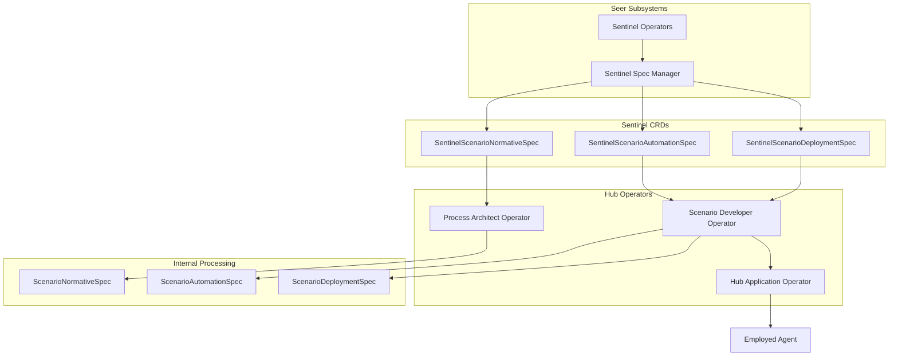
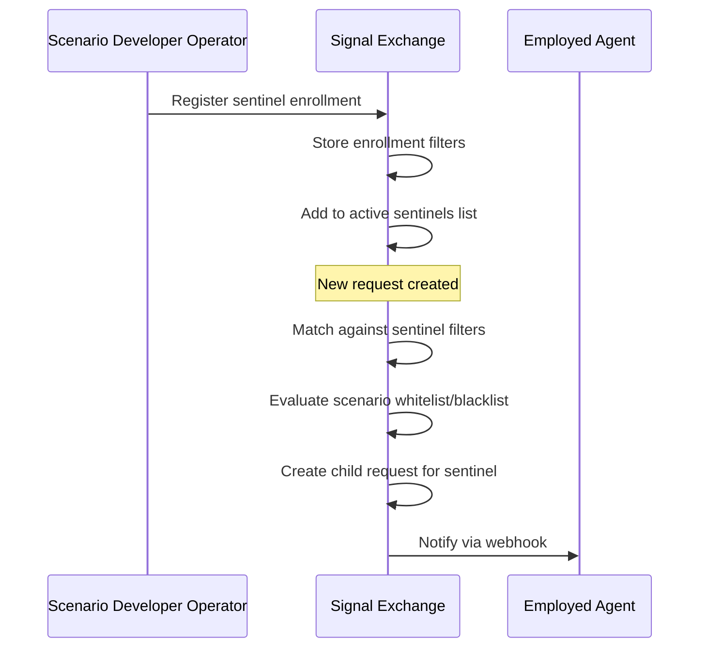
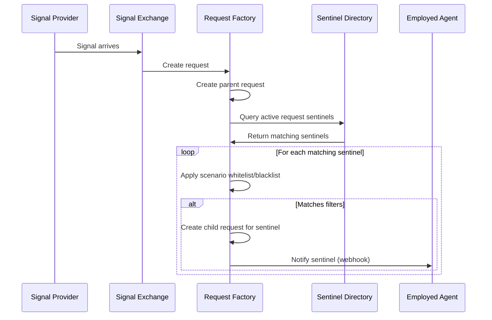
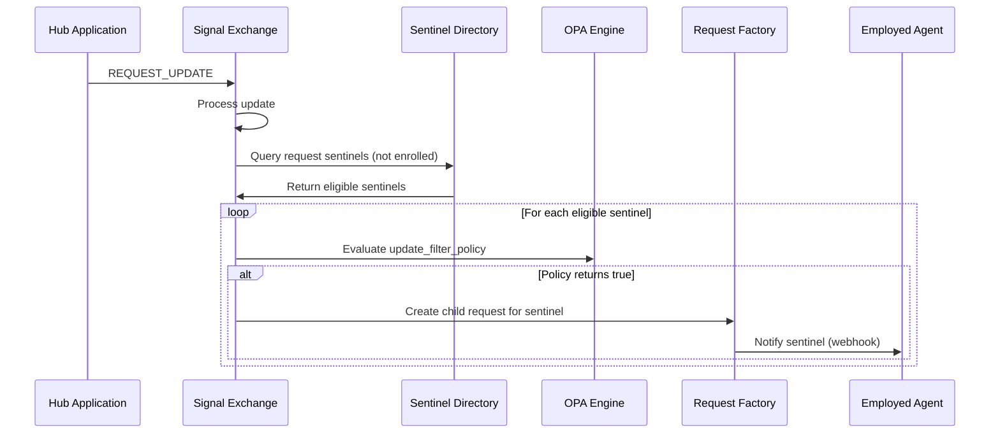

# Sentinel Scenario Processing

> **Status**: 🟢 Design Complete  
> **Last Updated**: 2026-01-14  
> **Parent**: [Seer-Hub Integration](./README.md)

---

## Overview

This document describes how Hub Operators process **SentinelScenarioSpec** CRDs created by Request Sentinels. When a Request Sentinel is deployed, its SentinelScenarioSpec CRDs are forwarded to Hub Operators, which process them as extensions of the standard ScenarioSpec types.

---

## Processing Flow



---

## CRD Transformation

Hub Operators recognize SentinelScenarioSpec CRDs and process them as extensions of ScenarioSpec types:

### SentinelScenarioNormativeSpec → ScenarioNormativeSpec

| Field | Processing |
|-------|------------|
| All standard fields | Passed through unchanged |
| Metadata labels | `sentinel: true` label added |

The Process Architect Operator processes SentinelScenarioNormativeSpec identically to ScenarioNormativeSpec, as there are no Sentinel-specific additions at the normative layer.

### SentinelScenarioAutomationSpec → ScenarioAutomationSpec

| Field | Processing |
|-------|------------|
| `normative_ref` | Passed through |
| `application` | Passed through, resolved to HubApplicationSpec |
| `triggers` | Typically empty for Request Sentinels (enrollment-based, not trigger-based) |
| `tools` | Passed through |
| `ai_agent` | Passed through |
| `sentinel` section | **Extracted and registered with Signal Exchange** |

The Scenario Developer Operator:
1. Processes standard ScenarioAutomationSpec fields
2. Extracts the `sentinel` section
3. Registers enrollment filters with Signal Exchange

### SentinelScenarioDeploymentSpec → ScenarioDeploymentSpec

| Field | Processing |
|-------|------------|
| `automation_ref` | Passed through |
| `activation` | Passed through |
| `task_queues` | Passed through |
| `sla` | Passed through |
| `agent_enrollment` | Passed through |
| `capacity` | Passed through |
| `sentinel_deployment` section | **Used for Employed Agent configuration** |

The Scenario Developer Operator:
1. Processes standard ScenarioDeploymentSpec fields
2. Uses `sentinel_deployment` section for:
   - Enrollment limits
   - Notification delivery configuration
   - Child request configuration

---

## Sentinel Section Extraction

The `sentinel` section from SentinelScenarioAutomationSpec is extracted and registered separately:

```yaml
# Extracted from SentinelScenarioAutomationSpec
sentinel_registration:
  sentinel_id: "token-usage-governance"
  workbench_id: "acme-disputes"
  
  participation:
    mode: "observe_and_participate"
    
  filters:
    scenario_whitelist:
      - "standard-dispute"
      - "high-value-dispute"
    scenario_blacklist: []
    on_request_update:
      enabled: true
      update_filter_policy: |
        package seer.sentinel.enrollment
        
        default allow = false
        
        allow {
          input.update_type == "DECISION"
        }
```

This registration is sent to Signal Exchange for auto-enrollment processing.

---

## Signal Exchange Registration

When Hub Operators process a SentinelScenarioDeploymentSpec (triggering deployment), Signal Exchange is notified:



---

## Employed Agent Creation

The Hub Application Operator creates an Employed Agent for the Request Sentinel:

### Reference Chain Resolution

```
SentinelScenarioAutomationSpec
       │
       │ application.ref
       ▼
HubApplicationSpec
       │
       │ seerTrainingRef
       ▼
TrainingSpec
       │
       │ Seer Operator creates
       ▼
EmploymentSpec → Employed Agent
```

### EmploymentSpec Configuration

The Employed Agent is configured with Request Sentinel-specific settings:

```yaml
apiVersion: seer.olympus.io/v1
kind: EmploymentSpec
metadata:
  name: token-usage-governance-employment
  namespace: acme-disputes
spec:
  trainingRef:
    name: token-usage-governance-training-v1
    version: "1.0.0"
  
  workScope:
    workbench: acme-disputes
    scenario: token-usage-governance
  
  operationalEnv:
    toolEndpoints:
      # Resolved from HubApplicationSpec dependencies
      agent-analytics-token-metrics: "https://analytics.hub/token-metrics"
      cronus-add-observation: "https://cronus.hub/observations"
    
    # Sentinel-specific configuration
    sentinel:
      enrollment_limits:
        max_concurrent_requests: 100
        cooldown_after_enrollment_ms: 1000
      notification_delivery:
        method: webhook
        endpoint: "https://hub/sentinels/token-usage-governance/updates"
  
  capacity:
    tokenBudget:
      perRequest: 5000
      perDay: 100000
  
  delegation:
    principal: "disputes-supervisor"
```

---

## Enrollment Flow

When a Request Sentinel is deployed and active:

### Request Creation Enrollment



### Request Update Enrollment



---

## Child Request Creation

When a sentinel enrolls in a request, a child request is created:

```yaml
child_request:
  id: "req-child-sentinel-001"
  parent_request_id: "req-parent-001"
  workbench_id: "acme-disputes"
  scenario_id: "token-usage-governance"  # Sentinel's scenario
  
  hierarchy:
    parent_request_id: "req-parent-001"
    root_request_id: "req-parent-001"
    depth: 1
  
  # Sentinel metadata
  sentinel_metadata:
    sentinel_id: "token-usage-governance"
    participation_mode: "observe_and_participate"
    enrolled_at: "2026-01-14T10:30:00Z"
    enrollment_trigger: "on_request_creation"  # or "on_request_update"
  
  status: "ACTIVE"
```

---

## Lifecycle Cascade

Child requests created for sentinels follow standard request hierarchy cascade rules:

| Parent Status | Child Request Behavior |
|---------------|----------------------|
| `COMPLETED` | Child marked `COMPLETED` with reason `PARENT_COMPLETED` |
| `CANCELLED` | Child marked `CANCELLED` with reason `PARENT_CANCELLED` |
| `ACTIVE` → `PENDING` | No cascade, sentinel continues observing |

---

## Related Documentation

- [Sentinel Spec Manager](../subsystems/seer-sentinels/sentinel-spec-manager.md) — Sentinel specification management
- [Sentinel Scenario Automation Spec](../subsystems/seer-sentinels/sentinel-scenario-automation-spec.md) — Automation configuration with sentinel section
- [Employed Agent](./employed-agent.md) — How Employed Agents are created
- [Hub Developer Operators](../../../olympus-hub-docs/04-subsystems/operators/developer-operators.md) — Hub operator patterns
- [Signal Exchange](../../../olympus-hub-docs/04-subsystems/signal-exchange/README.md) — Request routing and observer notifications
- [Request Hierarchy](../../../olympus-hub-docs/04-subsystems/request-management/request-hierarchy.md) — Parent-child request relationships

---

*Sentinel Scenario Processing describes how Hub Operators process SentinelScenarioSpec CRDs and coordinate with Signal Exchange for Request Sentinel enrollment.*
