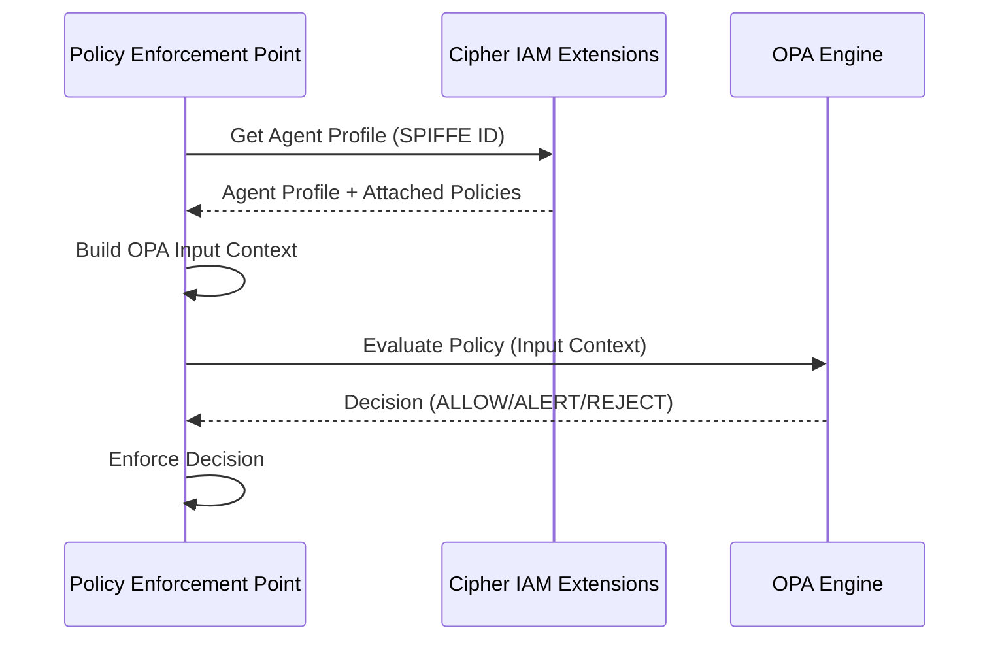

# Authority Enforcement

> **Status**: 🟢 Implemented — Concept  
> **Last Updated**: 2026-01-12

## Overview

Authority enforcement ensures AI agents operate within their delegated limits. Seer provides **multiple enforcement points** with **OPA-based policies** that validate agent actions against their authorized scope. **Cipher IAM Extensions** provide the foundational identity and policy infrastructure for all enforcement points.

**Key Principle**: Enforcement is **layered** — violations are caught at the appropriate point and recorded on the Request for audit and corrective action.

---

## Enforcement Architecture

```
┌─────────────────────────────────────────────────────────────────────────────┐
│                    AUTHORITY ENFORCEMENT FLOW                                │
│                                                                              │
│                         Agent Action                                         │
│                              │                                               │
│                              ▼                                               │
│   ┌─────────────────────────────────────────────────────────────────────┐   │
│   │                   CIPHER IAM EXTENSIONS                              │   │
│   │                   • Agent Identity (SPIFFE)                          │   │
│   │                   • Authority Delegation (inherited from Supervisor) │   │
│   │                   • Policy Enforcement Points (PEPs)                 │   │
│   └─────────────────────────────────────────────────────────────────────┘   │
│                              │                                               │
│                              ▼                                               │
│   ┌─────────────────────────────────────────────────────────────────────┐   │
│   │                   1. SIDECAR GUARDRAILS                              │   │
│   │                   (Tenant-defined, custom logic)                     │   │
│   │                   → Transform, Reject, or Pass                       │   │
│   └─────────────────────────────────────────────────────────────────────┘   │
│                              │                                               │
│                              ▼                                               │
│   ┌─────────────────────────────────────────────────────────────────────┐   │
│   │                   2. TOOL GATEWAY                                    │   │
│   │                   • OPA policies (Tool Spec + Employment Spec)       │   │
│   │                   • IAM role and scope validation                    │   │
│   │                   → ALLOW / ALERT / REJECT                           │   │
│   └─────────────────────────────────────────────────────────────────────┘   │
│                              │                                               │
│                              ▼                                               │
│                      Tool Execution                                          │
│                              │                                               │
│                              ▼                                               │
│   ┌─────────────────────────────────────────────────────────────────────┐   │
│   │                   3. SIGNAL EXCHANGE                                 │   │
│   │                   • OPA policies on REQUEST_UPDATE                   │   │
│   │                   • Any agent update subject to policy               │   │
│   │                   → ALLOW / ALERT / REJECT                           │   │
│   └─────────────────────────────────────────────────────────────────────┘   │
│                              │                                               │
│                              ▼                                               │
│                    Request Updated / Violation Recorded                      │
```

---

## Cipher IAM Extensions Integration

**Cipher IAM Extensions** provide the foundational identity and policy infrastructure that all enforcement points rely upon. This integration ensures that every agent has a verified identity, delegated authority, and attached policies.

### Agent Identity Verification

Every Employed Agent receives a **SPIFFE-based identity** from Cipher IAM Extensions:

```
spiffe://hub.olympus.io/seer/tenant/{tenant_id}/workbench/{workbench_id}/agent/{agent_id}
```

This identity is:
- **Cryptographically verified** via X.509 certificates
- **Automatically rotated** by the SPIRE agent
- **Used by all enforcement points** to authenticate the agent

### Authority Delegation Model

Agent authority is derived through a **ceiling model** where:
- Employed Agents inherit authority from their Supervisor (delegating human)
- Each layer (Training → Employment) can only **narrow** authority
- All authority is traceable to a human principal

```mermaid
graph TD
    Supervisor[Supervisor<br/>(Human Principal)] --> EA[Employed Agent]
    EA --> |Ceiling Model| ToolGateway[Tool Gateway PEP]
    EA --> |Ceiling Model| SignalExchange[Signal Exchange PEP]
    EA --> |Ceiling Model| ModelGateway[Model Gateway PEP]
```

> **See**: [Authority Delegation](../subsystems/cipher-iam-extensions/authority-delegation.md) for the complete delegation model and inheritance algorithms.

### Policy Enforcement Points (PEPs)

Cipher IAM Extensions provide a **PEP registration model** that enables each enforcement point to attach and evaluate agent-specific policies:

| PEP | Purpose | Policy Types |
|-----|---------|--------------|
| `tool-gateway` | Tool invocation authorization | Tool access, parameter validation |
| `signal-exchange` | Request update authorization | Update scope, content validation |
| `model-gateway` | LLM access authorization | Model access, budget enforcement |
| `guardrail-service` | Custom enforcement | Tenant-defined rules |

Policies are attached via the `EmploymentSpec`:

```yaml
spec:
  delegation:
    policies:
      - pep: "tool-gateway"
        policyRef: "policies/tool-access.rego"
      - pep: "model-gateway"
        policyRef: "policies/model-budget.rego"
```

> **See**: [Policy Enforcement Points](../subsystems/cipher-iam-extensions/policy-enforcement-points.md) for C3 detail on policy evaluation flow.

---

## Enforcement Points

### 1. Sidecar Guardrails

Tenant-defined guardrails provide **custom enforcement logic**:
- Deployed as Istio sidecars in agent pods
- Execute on inbound `/dispatch` requests and outbound Hub API calls
- Can Allow, Alert, Deny, Transform, or Redact requests
- **Authenticate agent via SPIFFE identity** from Cipher IAM Extensions

**Use Case**: Domain-specific rules, compliance requirements, custom thresholds.

> **See**: [Guardrail Service Design](../subsystems/seer-sidecar/guardrail-service.md) for detailed implementation.

### 2. Tool Gateway

The Tool Gateway is the **primary enforcement point** for tool invocations:
- OPA policy evaluation (Tool Spec + Training Spec + Employment Spec)
- IAM role and scope validation via **Cipher IAM Extensions**
- Decision types: ALLOW, ALERT, REJECT

**Policy Sources:**
- Tool Specification policies (per-tool defaults)
- Training Specification policies (per-agent type)
- Employment Specification policies (per-deployment, overrides training)

**Cipher IAM Integration:**
- Retrieves agent profile from Cipher IAM Extensions API
- Validates authority against ceiling constraints
- Evaluates attached policies for `tool-gateway` PEP

### 3. Signal Exchange

Signal Exchange enforces policies on all agent updates:
- OPA policies on REQUEST_UPDATE messages
- Any agent update subject to policy evaluation
- Decision types: ALLOW, ALERT, REJECT
- **Agent identity verified** via Cipher IAM Extensions

### 4. Model Gateway

The Model Gateway enforces LLM access policies:
- Model whitelist enforcement based on `EmploymentSpec`
- Budget enforcement at workbench and agent levels
- Rate limiting via OPA policies
- **Virtual key management** via Cipher IAM Extensions

> **See**: [Model Gateway Policy Enforcement](../subsystems/model-gateway/policy-enforcement.md) for C3 detail.

---

## OPA Policy Model

Policies are defined in Training and Employment Specs using OPA (Open Policy Agent). **Cipher IAM Extensions** manage policy attachment and provide the agent context for policy evaluation.

**Policy Definition:**
- Declarative policies with known outcomes
- Employment Spec can override Training Spec policies (narrowing only)
- OPA decision types: ALLOW, ALERT, REJECT

**OPA Context Schema (from Cipher IAM Extensions):**
- `AgentContext` — Agent identity (SPIFFE), profile type (Raw/Trained/Employed), authority ceiling
- `DelegationContext` — Delegating supervisor, inheritance chain, accountability
- `AccessContext` — Request context, user context, resource identifiers
- `ToolGatewayContext` — Tool parameters, resource access, invocation metadata
- `SignalExchangeContext` — Update content, request state, scenario binding
- `ModelGatewayContext` — Model request, budget status, virtual key

**Policy Evaluation Flow:**



> **See**: [Policy Enforcement Points](../subsystems/cipher-iam-extensions/policy-enforcement-points.md) for C3 detail on the policy evaluation flow.

---

## Violation Handling

When a violation is detected:

1. **Recording** — Violation recorded on Request
2. **Notification** — Observers, accountable person, workbench notified
3. **Corrective Actions** — Escalation, reassignment, intervention

---

## Key Principles

- **Layered Enforcement** — Multiple enforcement points catch violations at appropriate layers
- **OPA-Based** — Declarative policies with known outcomes
- **Policy Override** — Employment Spec can narrow (never expand) Training Spec policies
- **Violation Recording** — All violations recorded on Request for audit
- **Compound Agents** — Enforcement scoped to outer agent only
- **Human Accountability** — All agent authority traceable to accountable human via Cipher IAM
- **SPIFFE Identity** — Cryptographic identity verification at all enforcement points

---

## Related

### Cipher IAM Extensions (Identity & Policy Foundation)
- [Cipher IAM Extensions README](../subsystems/cipher-iam-extensions/README.md) — Extensions overview
- [Authority Delegation](../subsystems/cipher-iam-extensions/authority-delegation.md) — Ceiling model, inheritance algorithms
- [Policy Enforcement Points](../subsystems/cipher-iam-extensions/policy-enforcement-points.md) — PEP registration, policy evaluation flow
- [Human Accountability](../subsystems/cipher-iam-extensions/human-accountability.md) — Accountability assignment, audit trail
- [ADR-0106: Cipher IAM Extensions for Agent Profiles](../../../olympus-hub-docs/decision-logs/0106-seer-cipher-iam-extensions-agent-profiles.md)

### Enforcement Points
- [Seer Sidecar](../subsystems/seer-sidecar/README.md) — Sidecar guardrails and enforcement
- [Authority Enforcement Service](../subsystems/seer-sidecar/authority-enforcement-service.md) — Ceiling enforcement
- [Policy Enforcement Service](../subsystems/seer-sidecar/policy-enforcement-service.md) — OPA policy evaluation
- [Model Gateway Policy Enforcement](../subsystems/model-gateway/policy-enforcement.md) — LLM access policies

### Lifecycle & Configuration
- [Agent Lifecycle Manager](../subsystems/agent-lifecycle-manager/README.md) — Policy configuration
- [Guardrails Concepts](./guardrails.md) — Guardrails (complementary to authority enforcement)

### Decision Logs
- [ADR-0073: Authority Enforcement via OPA](../../../olympus-hub-docs/decision-logs/0073-seer-authority-enforcement-opa.md)
- [ADR-0106: Cipher IAM Extensions for Agent Profiles](../../../olympus-hub-docs/decision-logs/0106-seer-cipher-iam-extensions-agent-profiles.md)

---

*For detailed sidecar implementation, see [Authority Enforcement Service](../subsystems/seer-sidecar/authority-enforcement-service.md) and [Policy Enforcement Service](../subsystems/seer-sidecar/policy-enforcement-service.md). For identity and policy infrastructure, see [Cipher IAM Extensions](../subsystems/cipher-iam-extensions/README.md).*
