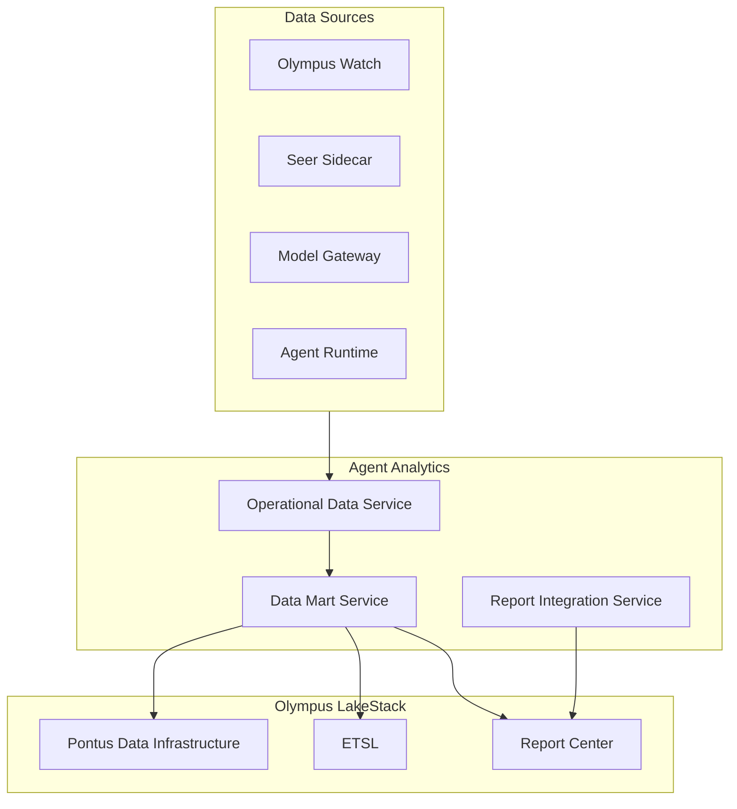

# Agent Analytics

> **Status**: 🟢 Design Complete  
> **Last Updated**: 2026-01-13

## Overview

Agent Analytics provides a data mart for agent operational data. It answers questions based on historic health, cost, effectiveness, feedback, and behavior of agents—not runtime observability.

**Key Principle**: Agent Analytics is a data mart (analogous to Hub Analytics) that houses operational data for agents. Runtime observability is provided by Observability Extensions to Watch (separate subsystem).

---

## Design Documents

| Document | Description | Status |
|----------|-------------|--------|
| [SCOPE.md](./SCOPE.md) | Design scope, coverage summary, key decisions | Overview |
| [Operational Data Service](./operational-data-service.md) | Data collection, aggregation, validation, staging | C2 |
| [Data Mart Service](./data-mart-service.md) | Data mart construction, ETSL integration, data product creation | C2 |
| [Report Integration Service](./report-integration-service.md) | LakeStack Report Center integration, catalog sync, access mapping, context injection | C2 |

---

## Architecture

---

## Key Design Decisions

### Data Mart Model

- **Agent Analytics is a data mart**, not runtime observability
- Data is collected, aggregated, and stored for historical analysis
- Runtime observability is provided by Observability Extensions to Watch (separate subsystem)

### LakeStack Integration

- **Uses Pontus infrastructure** for data mart construction and storage
- **Leverages ETSL** for enterprise-wide semantic consistency
- **Follows Hub Analytics pattern** for consistency across Olympus products

### Separation from Observability

- **Agent Analytics** = Historical data mart for analytics and reporting
- **Observability Extensions to Watch** = Runtime observability for AREs and Cognitive Operations Stewards
- **Clear separation** between historical analysis and real-time monitoring

---

## Related

- [Observability Extensions to Watch](../observability-extensions-to-watch/README.md) — Runtime observability (separate subsystem)
- [Agent Session Sentinel](../agent-session-sentinel/README.md) — Uses Agent Analytics data mart for analytical sentinels
- [Agent Health Monitor](../agent-health-monitor/README.md) — Uses Agent Analytics data mart for SLO evaluation
- [Hub Analytics](../../../olympus-hub-docs/04-subsystems/hub-analytics/README.md) — Analogous Hub subsystem
- [Olympus LakeStack](../../../olympus-hub-docs/05-infrastructure/olympus-lakestack.md) — LakeStack Pontus and Report Center infrastructure
