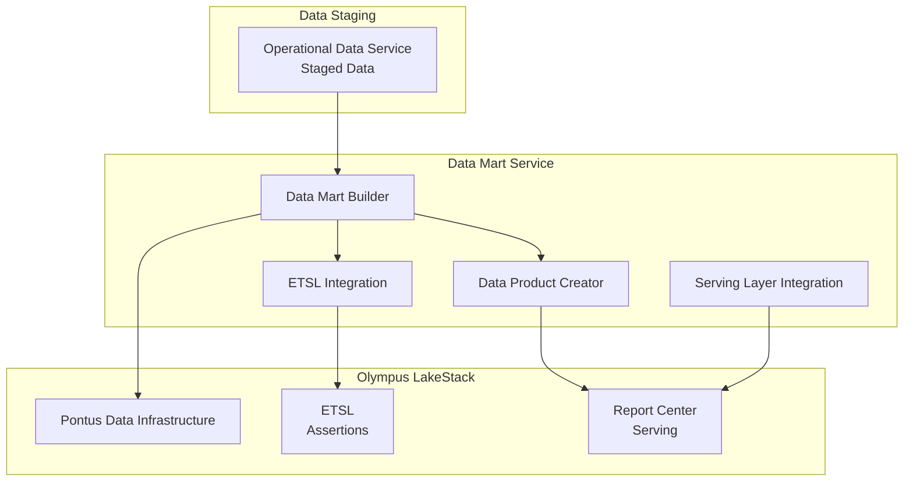
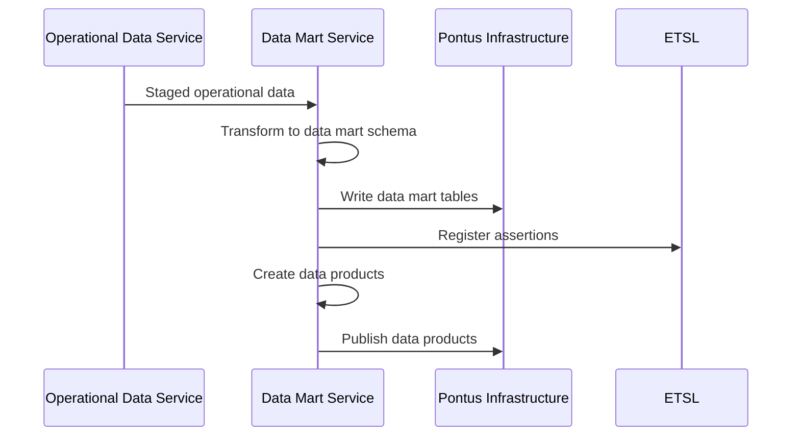
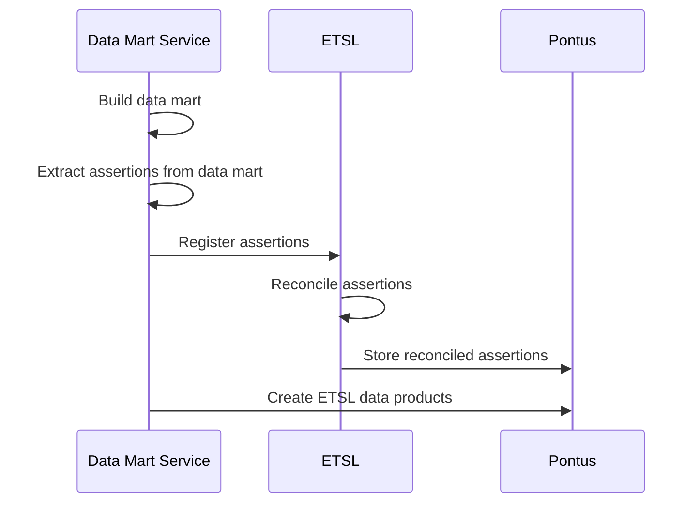
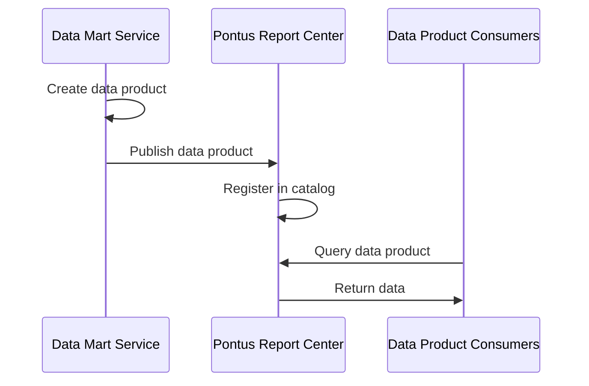
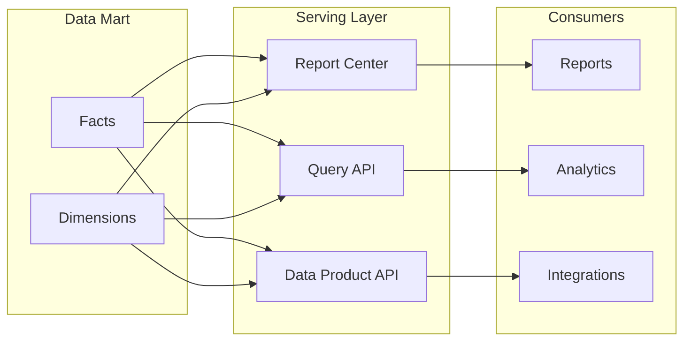

# Data Mart Service

> **Status**: 🟢 Design Complete  
> **Last Updated**: 2026-01-13  
> **Design Level**: C2 (Container)

---

## Overview

Data Mart Service builds and maintains agent data marts using Olympus LakeStack Pontus infrastructure. It transforms staged operational data into analytical data marts, integrates with ETSL (Enterprise Truth & Semantics Layer), and creates data products for reporting and analytics.

**Key Principle**: Data Mart Service uses Pontus infrastructure for data mart construction and ETSL integration, following the same pattern as Hub Analytics.

---

## Architecture



---

## Functional Scope

### Data Mart Construction

Data Mart Service constructs agent operational data marts using Pontus infrastructure:

#### Data Mart Structure

```yaml
agent_data_mart:
  facts:
    - agent_requests:
        dimensions: [agent_id, workbench_id, scenario_id, training_spec_id, timestamp]
        measures: [request_count, latency_p50, latency_p95, latency_p99, error_count, success_count]
    
    - agent_cost:
        dimensions: [agent_id, workbench_id, model_id, timestamp]
        measures: [total_cost, token_count, request_count, cost_per_request]
    
    - agent_health:
        dimensions: [agent_id, workbench_id, timestamp]
        measures: [availability, error_rate, success_rate, avg_latency]
    
    - agent_behavior:
        dimensions: [agent_id, workbench_id, training_spec_id, timestamp]
        measures: [tool_invocation_count, guardrail_violation_count, policy_violation_count, escalation_count]
    
    - agent_feedback:
        dimensions: [agent_id, workbench_id, feedback_type, timestamp]
        measures: [feedback_count, avg_rating, positive_feedback_count, negative_feedback_count]

  dimensions:
    - agents:
        attributes: [agent_id, agent_name, training_spec_id, workbench_id, deployment_status]
    
    - workbenches:
        attributes: [workbench_id, workbench_name, tenant_id]
    
    - training_specs:
        attributes: [training_spec_id, training_spec_name, raw_agent_id, version]
    
    - models:
        attributes: [model_id, model_name, provider, cost_per_token]
    
    - scenarios:
        attributes: [scenario_id, scenario_name, workbench_id]
```

#### Data Mart Build Process



#### Data Mart Refresh

| Refresh Type | Frequency | Scope |
|-------------|-----------|-------|
| **Incremental** | Hourly | New data since last refresh |
| **Full** | Daily | Complete data mart rebuild |
| **On-Demand** | As needed | Manual refresh trigger |

---

### ETSL Integration

Data Mart Service integrates agent operational data into ETSL as assertions:

#### Assertion Registration

```yaml
etsl_assertions:
  agent_performance:
    assertion_type: "agent.performance"
    authority: "seer.agent-analytics"
    scope: "workbench"
    attributes:
      - agent_id
      - workbench_id
      - timestamp
      - performance_metrics
      - health_score
  
  agent_cost:
    assertion_type: "agent.cost"
    authority: "seer.agent-analytics"
    scope: "workbench"
    attributes:
      - agent_id
      - workbench_id
      - timestamp
      - cost_metrics
      - budget_status
  
  agent_behavior:
    assertion_type: "agent.behavior"
    authority: "seer.agent-analytics"
    scope: "workbench"
    attributes:
      - agent_id
      - workbench_id
      - timestamp
      - behavior_metrics
      - compliance_status
```

#### ETSL Integration Flow



#### What Data Mart Service Does NOT Do

| Aspect | Data Mart Service Role |
|--------|------------------------|
| **ETSL Semantic Modeling** | Does not define ETSL semantic artifacts—that's ETSL's responsibility |
| **Authority Modeling** | Does not model ETSL authority—references existing ETSL authority definitions |
| **Direct ETSL Consumption** | Seer components do not directly consume ETSL Data Artifacts |

---

### Data Product Creation

Data Mart Service creates data products from data marts for consumption:

#### Data Product Types

| Data Product | Description | Consumers |
|--------------|-------------|-----------|
| **Agent Performance Data Product** | Agent performance metrics and health scores | Report Center, Agent Session Supervisor, Agent Health Monitor |
| **Agent Cost Data Product** | Agent cost metrics and budget tracking | Report Center, Agent Health Monitor |
| **Agent Behavior Data Product** | Agent behavior metrics and compliance status | Report Center, Agent Session Supervisor, Agent Health Monitor |
| **Agent Feedback Data Product** | Agent feedback metrics and ratings | Report Center, Training Feedback Services |

#### Data Product Structure

```yaml
data_product:
  name: "agent-performance"
  description: "Agent performance metrics and health scores"
  source: "agent_data_mart.agent_requests, agent_data_mart.agent_health"
  dimensions: [agent_id, workbench_id, training_spec_id, timestamp]
  measures: [request_count, latency_p50, latency_p95, error_rate, availability, health_score]
  refresh_frequency: "hourly"
  retention: "1 year"
```

#### Data Product Publishing

Data products are published to Pontus Report Center for serving:



---

### Serving Layer Integration

Data Mart Service integrates with Pontus serving mechanisms:

#### Serving Mechanisms

| Mechanism | Description | Use Case |
|-----------|-------------|----------|
| **Report Center** | Pre-built reports and dashboards | Operational reports, trend analysis |
| **Query API** | Direct query access to data marts | Custom analytics, ad-hoc queries |
| **Data Product API** | Structured data product access | Integration with other systems |

#### Serving Layer Flow



---

## Integration Points

### Upstream Integration

| Service | Integration Method | Purpose |
|---------|-------------------|---------|
| **Operational Data Service** | Read from staging | Source data for data mart construction |

### Downstream Integration

| Service | Integration Method | Purpose |
|---------|-------------------|---------|
| **LakeStack Pontus** | Data mart storage, ETSL integration | Data mart infrastructure |
| **LakeStack Report Center** | Data product publishing | Report serving |
| **ETSL** | Assertion registration | Enterprise semantic layer integration |

### Consumer Integration

| Service | Integration Method | Purpose |
|---------|-------------------|---------|
| **Report Integration Service** | Report Center catalog | Report access and embedding |
| **Agent Session Supervisor** | Data product queries | Analytical supervisor queries |
| **Agent Health Monitor** | Data product queries | SLO evaluation |

---

## Key Design Decisions

### LakeStack Native

- **Uses Pontus infrastructure** for all data mart construction and storage
- **Leverages ETSL** for enterprise-wide semantic consistency
- **Follows Hub Analytics pattern** for consistency across Olympus products

### Data Mart vs. Runtime Observability

- **Data Mart Service builds historical data marts** for analytics and reporting
- **Runtime observability** is provided by Observability Extensions to Watch
- **Clear separation** between historical analysis and real-time monitoring

### ETSL Integration

- **Registers assertions** into ETSL for enterprise semantic consistency
- **Does not define ETSL semantics**—references existing ETSL authority definitions
- **Creates data products** from ETSL Data Artifacts for consumption

### Data Product Model

- **Data products are consumer-aligned** interpretations of data marts
- **Published to Report Center** for serving
- **Structured for common query patterns** (agent-level, workbench-level, time-based)

---

## Related Documentation

- [Operational Data Service](./operational-data-service.md) — Data collection and staging
- [Report Integration Service](./report-integration-service.md) — Report Center integration
- [Hub Analytics](../../../olympus-hub-docs/04-subsystems/hub-analytics/README.md) — Analogous Hub subsystem
- [Olympus LakeStack](../../../olympus-hub-docs/05-infrastructure/olympus-lakestack.md) — Pontus and ETSL infrastructure
- [Storage Architecture — ETSL Integration](../../../olympus-hub-docs/07-data-architecture/storage-architecture.md#etsl-and-pontus-integration-touch-points) — ETSL integration details

---

*Data Mart Service builds and maintains agent operational data marts using LakeStack Pontus infrastructure, enabling historical analysis and reporting.*
