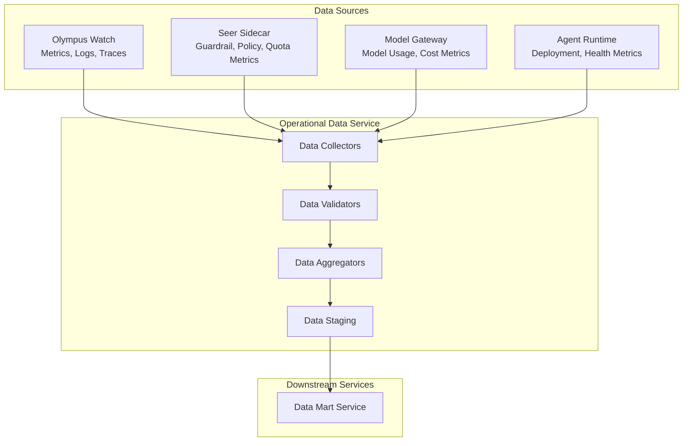
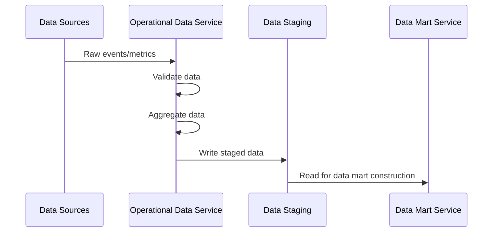

# Operational Data Service

> **Status**: 🟢 Design Complete  
> **Last Updated**: 2026-01-13  
> **Design Level**: C2 (Container)

---

## Overview

Operational Data Service is the foundational component of the Agent Analytics subsystem. It collects and aggregates agent operational data from multiple sources (Olympus Watch, Seer Sidecar, Model Gateway, Agent Runtime) to build a comprehensive data mart for historical analysis, reporting, and analytics.

**Key Principle**: Agent Analytics is a data mart for historical analysis—not runtime observability. It answers questions based on historic health, cost, effectiveness, feedback, and behavior of agents.

---

## Architecture



---

## Functional Scope

### Data Collection

Operational Data Service collects agent operational data from multiple sources:

#### Olympus Watch

| Data Type | Description | Collection Method |
|-----------|-------------|-------------------|
| **Metrics** | Prometheus metrics from agent pods | Prometheus scrape endpoints |
| **Logs** | Structured logs from agent pods | Log aggregation pipeline |
| **Traces** | Distributed traces from agent operations | OpenTelemetry collector |

**Key Metrics Collected:**
- Agent request metrics (latency, throughput, error rates)
- LLM call metrics (token usage, model selection, latency)
- Tool invocation metrics (tool selection, success rates, latency)
- Memory operation metrics (read/write operations, cache hit rates)
- Context assembly metrics (retrieval latency, context size)

#### Seer Sidecar

| Data Type | Description | Collection Method |
|-----------|-------------|-------------------|
| **Guardrail Metrics** | Guardrail execution, results, violations | Sidecar metrics endpoint |
| **Policy Enforcement Metrics** | Policy evaluations, violations, decisions | Sidecar metrics endpoint |
| **Resource Quota Metrics** | Request counts, call counts, rate limits | Sidecar metrics endpoint |
| **Fair Usage Budget Metrics** | Budget consumption, exhaustion events | Sidecar metrics endpoint |

**Key Metrics Collected:**
- Guardrail execution duration and results (Allow/Alert/Deny)
- Policy evaluation duration and decisions
- Authority ceiling checks and violations
- Resource quota consumption and limits
- Budget consumption and threshold breaches

#### Model Gateway

| Data Type | Description | Collection Method |
|-----------|-------------|-------------------|
| **Model Usage Metrics** | Model selection, routing decisions | Model Gateway metrics API |
| **Cost Metrics** | Token consumption, cost per request | Model Gateway cost tracking |
| **Fallback Metrics** | Fallback events, model availability | Model Gateway metrics API |

**Key Metrics Collected:**
- Model selection by agent and request type
- Token consumption (input/output) by model
- Cost per request, cost per agent
- Fallback events and reasons
- Model availability and health

#### Agent Runtime

| Data Type | Description | Collection Method |
|-----------|-------------|-------------------|
| **Deployment Metrics** | Pod health, scaling events, restarts | Kubernetes metrics API |
| **Health Metrics** | Agent availability, error rates | Runtime health endpoints |
| **Resource Metrics** | CPU, memory usage (if available) | Kubernetes metrics API |

**Key Metrics Collected:**
- Agent pod status and health
- Scaling events (HPA scaling)
- Pod restarts and failure reasons
- Agent availability and uptime
- Resource utilization (CPU, memory)

---

### Data Aggregation

Operational Data Service aggregates collected data for efficient storage and querying:

#### Temporal Aggregation

| Aggregation Level | Window | Purpose |
|------------------|-------|---------|
| **Raw** | Per-event | Detailed event-level data |
| **Minute** | 1-minute windows | Near-real-time analysis |
| **Hour** | 1-hour windows | Hourly trends and patterns |
| **Day** | 1-day windows | Daily summaries and reports |

#### Dimensional Aggregation

Data is aggregated across multiple dimensions:

| Dimension | Examples |
|-----------|----------|
| **Agent** | Per-agent metrics, per-agent cost |
| **Workbench** | Per-workbench metrics, per-workbench cost |
| **Training Spec** | Per-Training Spec metrics, per-Training Spec cost |
| **Scenario** | Per-scenario metrics, per-scenario cost |
| **Model** | Per-model usage, per-model cost |
| **Tool** | Per-tool usage, per-tool success rates |

#### Metric Aggregation

| Aggregation Type | Description | Examples |
|------------------|-------------|----------|
| **Count** | Total occurrences | Total requests, total tool invocations |
| **Sum** | Total values | Total cost, total tokens |
| **Average** | Mean values | Average latency, average cost per request |
| **Percentiles** | Distribution metrics | P50, P95, P99 latency |
| **Min/Max** | Range metrics | Min/max cost per request |

---

### Data Validation

Operational Data Service validates collected data before aggregation:

#### Validation Rules

| Validation Type | Description | Action on Failure |
|-----------------|-------------|-------------------|
| **Schema Validation** | Data structure matches expected schema | Reject and log error |
| **Range Validation** | Numeric values within expected ranges | Reject and log error |
| **Required Fields** | All required fields present | Reject and log error |
| **Timestamp Validation** | Timestamps valid and within acceptable range | Reject and log error |
| **Reference Validation** | References to agents, workbenches, etc. are valid | Reject and log error |

#### Data Quality Metrics

Operational Data Service tracks data quality:

| Metric | Description |
|--------|-------------|
| **Collection Rate** | Percentage of expected data points collected |
| **Validation Failure Rate** | Percentage of data points failing validation |
| **Completeness** | Percentage of required fields present |
| **Timeliness** | Latency from event occurrence to data availability |

---

### Data Staging

Operational Data Service stages validated and aggregated data for downstream processing:

#### Staging Structure

```yaml
staging_structure:
  raw_events:
    retention: 7 days
    format: parquet
    partitioning: [date, agent_id, workbench_id]
  
  aggregated_minute:
    retention: 30 days
    format: parquet
    partitioning: [date, hour, agent_id]
  
  aggregated_hour:
    retention: 90 days
    format: parquet
    partitioning: [date, agent_id]
  
  aggregated_day:
    retention: 1 year
    format: parquet
    partitioning: [year, month, agent_id]
```

#### Data Flow



---

## Integration Points

### Data Source Integration

| Source | Integration Method | Frequency |
|--------|-------------------|-----------|
| **Olympus Watch** | Prometheus scrape, log aggregation, trace collection | Continuous |
| **Seer Sidecar** | Metrics endpoint scrape | Continuous |
| **Model Gateway** | Metrics API polling | Continuous |
| **Agent Runtime** | Kubernetes metrics API, health endpoints | Continuous |

### Downstream Integration

| Service | Integration Method | Purpose |
|---------|-------------------|---------|
| **Data Mart Service** | Read from staging | Data mart construction |

---

## Key Design Decisions

### Data Mart Model

- **Agent Analytics is a data mart**, not runtime observability
- Data is collected, aggregated, and stored for historical analysis
- Runtime observability is provided by Observability Extensions to Watch

### Data Retention

- **Raw events**: 7 days (detailed event-level data)
- **Minute aggregations**: 30 days (near-real-time analysis)
- **Hour aggregations**: 90 days (hourly trends)
- **Day aggregations**: 1 year (long-term analysis)

### Data Partitioning

- Data is partitioned by date, agent_id, and workbench_id for efficient querying
- Partitioning strategy optimized for common query patterns (agent-level, workbench-level, time-based)

### Data Quality

- **Validation is mandatory**—invalid data is rejected and logged
- Data quality metrics are tracked and monitored
- Missing or incomplete data is flagged for investigation

---

## Related Documentation

- [Data Mart Service](./data-mart-service.md) — Data mart construction and ETSL integration
- [Report Integration Service](./report-integration-service.md) — LakeStack Report Center integration
- [Observability Extensions to Watch](../observability-extensions-to-watch/README.md) — Runtime observability (separate subsystem)
- [Seer Sidecar Metrics Service](../seer-sidecar/metrics-service.md) — Sidecar metrics source
- [Model Gateway Observability](../model-gateway/observability.md) — Model Gateway metrics source
- [Hub Analytics](../../../olympus-hub-docs/04-subsystems/hub-analytics/README.md) — Analogous Hub subsystem

---

*Operational Data Service provides the foundation for Agent Analytics by collecting and aggregating agent operational data from multiple sources.*
