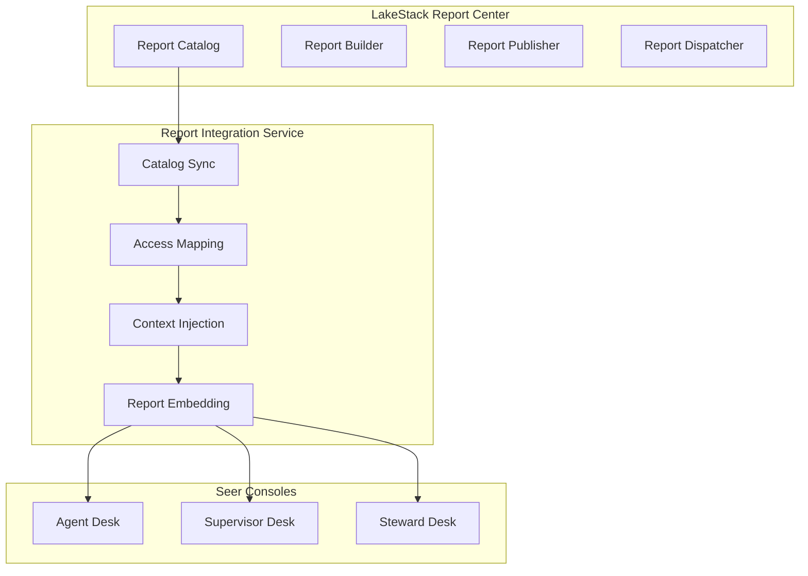
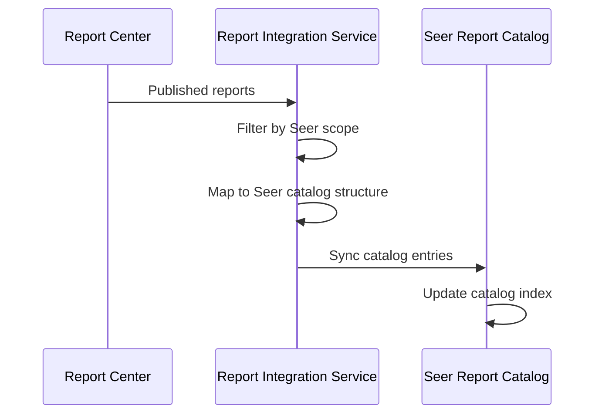
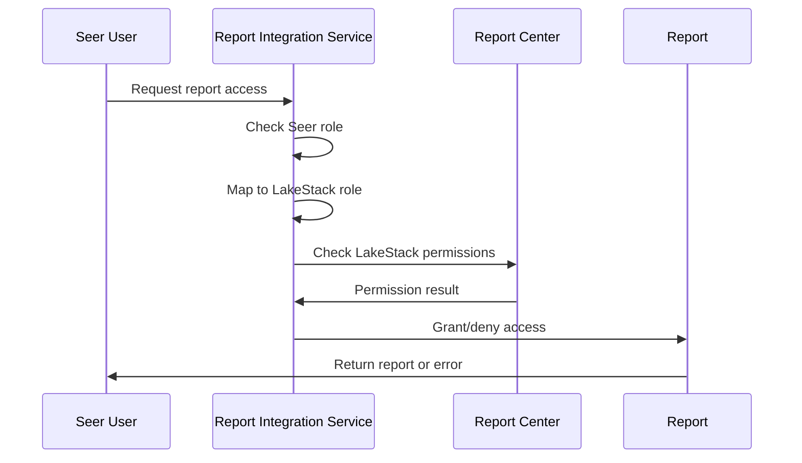
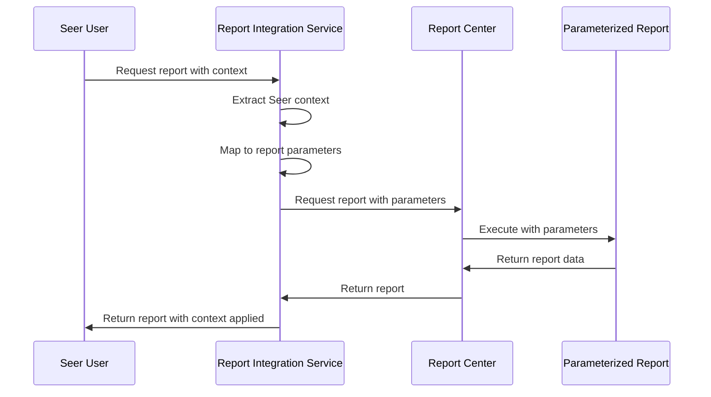
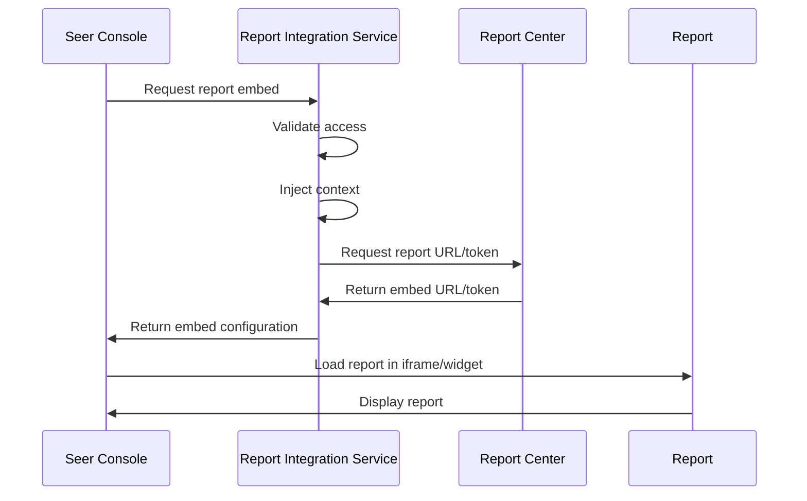

# Report Integration Service

> **Status**: 🟢 Design Complete  
> **Last Updated**: 2026-01-13  
> **Design Level**: C2 (Container)

---

## Overview

Report Integration Service integrates Agent Analytics with Olympus LakeStack Report Center. It synchronizes report catalogs, maps access permissions, injects context, and enables report embedding in Seer consoles.

**Key Principle**: Report Integration Service provides the glue between LakeStack Report Center and Seer consoles, following the same pattern as Hub Analytics.

---

## Architecture



---

## Functional Scope

### Catalog Sync

Report Integration Service synchronizes published reports from LakeStack Report Center to Seer report catalogs:

#### Report Catalog Structure

```yaml
seer_report_catalog:
  workbench_id: "acme-disputes"
  
  operational_reports:
    - id: "agent-performance-dashboard"
      source: agent_analytics
      title: "Agent Performance Dashboard"
      desks: [supervisor, steward]
      data_product: "agent-performance"
    
    - id: "agent-cost-analysis"
      source: agent_analytics
      title: "Agent Cost Analysis"
      desks: [supervisor, steward]
      data_product: "agent-cost"
    
    - id: "agent-behavior-report"
      source: agent_analytics
      title: "Agent Behavior Report"
      desks: [supervisor, steward]
      data_product: "agent-behavior"
    
    - id: "agent-feedback-summary"
      source: agent_analytics
      title: "Agent Feedback Summary"
      desks: [supervisor, steward, agent]
      data_product: "agent-feedback"
  
  business_reports:
    - id: "dispute-trend-analysis"
      source: lakestack
      machine: "card-network"
      desks: [supervisor, agent]
```

#### Catalog Sync Process



#### Sync Frequency

| Sync Type | Frequency | Scope |
|-----------|-----------|-------|
| **Incremental** | Every 5 minutes | New/changed reports since last sync |
| **Full** | Daily | Complete catalog refresh |
| **On-Demand** | As needed | Manual sync trigger |

---

### Access Mapping

Report Integration Service maps LakeStack report permissions to Seer roles:

#### Role Mapping

| LakeStack Role | Seer Role | Desks |
|---------------|----------|-------|
| **Report Viewer** | Agent | Agent Desk |
| **Report Analyst** | Supervisor | Supervisor Desk |
| **Report Admin** | Steward | Steward Desk |
| **Report Owner** | Steward | All Desks |

#### Access Control Flow



#### Access Control Rules

| Rule | Description |
|------|-------------|
| **Workbench Isolation** | Users can only access reports for their workbench |
| **Role-Based Access** | Access based on Seer role (Agent, Supervisor, Steward) |
| **Report Type Filtering** | Operational reports vs. business reports have different access rules |
| **Tenant Isolation** | Reports are isolated by tenant |

---

### Context Injection

Report Integration Service injects Seer context into parameterized reports:

#### Context Parameters

```yaml
seer_context:
  workbench_id: "acme-disputes"
  tenant_id: "acme-bank"
  user_id: "user@acme.com"
  user_role: "supervisor"
  agent_id: "fraud-analyst-acme-retail"  # Optional
  scenario_id: "standard-dispute"  # Optional
  time_range:  # Optional
    start: "2026-01-01T00:00:00Z"
    end: "2026-01-31T23:59:59Z"
```

#### Context Injection Flow



#### Context Mapping

| Seer Context | Report Parameter | Description |
|--------------|------------------|-------------|
| **workbench_id** | `workbench` | Filter by workbench |
| **agent_id** | `agent` | Filter by agent (if provided) |
| **scenario_id** | `scenario` | Filter by scenario (if provided) |
| **time_range** | `start_date`, `end_date` | Time range filter (if provided) |
| **user_role** | `role` | Role-based data filtering |

---

### Report Embedding

Report Integration Service enables report embedding in Seer console frames:

#### Embedding Methods

| Method | Description | Use Case |
|--------|-------------|----------|
| **Iframe Embedding** | Embed report in iframe | Full report display |
| **Widget Embedding** | Embed report as widget | Dashboard widgets |
| **Data API** | Access report data via API | Custom visualizations |

#### Embedding Flow



#### Embedding Configuration

```yaml
embed_config:
  report_id: "agent-performance-dashboard"
  embed_type: "iframe"
  width: "100%"
  height: "600px"
  parameters:
    workbench: "acme-disputes"
    agent: "fraud-analyst-acme-retail"
    time_range: "last_30_days"
  access_token: "..."  # Temporary token for report access
```

---

## Report Distribution

Reports appear in the Reports Console of each desk:

| Desk | Report Types | Access Level |
|------|-------------|--------------|
| **Agent Desk** | Agent feedback reports, operational reports (as needed) | View only |
| **Supervisor Desk** | All operational reports, business domain reports | View and analyze |
| **Steward Desk** | All operational reports (workbench/agent health) | Full access |

### Report Console Structure

```yaml
reports_console:
  agent_desk:
    sections:
      - name: "My Agent Performance"
        reports: [agent-feedback-summary, agent-performance-dashboard]
        access: view
  
  supervisor_desk:
    sections:
      - name: "Agent Operations"
        reports: [agent-performance-dashboard, agent-cost-analysis, agent-behavior-report]
        access: view_analyze
      - name: "Business Reports"
        reports: [dispute-trend-analysis]
        access: view_analyze
  
  steward_desk:
    sections:
      - name: "Agent Analytics"
        reports: [agent-performance-dashboard, agent-cost-analysis, agent-behavior-report, agent-feedback-summary]
        access: full
      - name: "Workbench Health"
        reports: [workbench-health-dashboard]
        access: full
```

---

## Integration Points

### Upstream Integration

| Service | Integration Method | Purpose |
|---------|-------------------|---------|
| **LakeStack Report Center** | Report catalog API, report access API | Report catalog sync, report access |
| **Data Mart Service** | Data product references | Link reports to data products |

### Downstream Integration

| Service | Integration Method | Purpose |
|---------|-------------------|---------|
| **Seer Consoles** | Report embedding API | Report display in consoles |
| **Seer RBAC** | Role-based access control | Access permission mapping |

---

## Key Design Decisions

### LakeStack Native

- **Leverages LakeStack Report Center** for all report building and publishing
- **Report Integration Service provides the glue** between LakeStack and Seer consoles
- **Follows Hub Analytics pattern** for consistency across Olympus products

### Context-Aware Reports

- **Reports receive Seer context** (workbench, user, agent, scenario) for filtering
- **Context injection is automatic** based on user's current context
- **Parameterized reports** support dynamic filtering based on context

### Access Control

- **Access based on Seer roles** (Agent, Supervisor, Steward)
- **Workbench isolation** ensures users only see reports for their workbench
- **Role mapping** translates Seer roles to LakeStack permissions

### Embedding Model

- **Multiple embedding methods** support different use cases
- **Secure embedding** with temporary access tokens
- **Responsive embedding** adapts to console layout

---

## Related Documentation

- [Operational Data Service](./operational-data-service.md) — Data collection and staging
- [Data Mart Service](./data-mart-service.md) — Data mart construction and data products
- [Hub Analytics](../../../olympus-hub-docs/04-subsystems/hub-analytics/README.md) — Analogous Hub subsystem
- [Olympus LakeStack](../../../olympus-hub-docs/05-infrastructure/olympus-lakestack.md) — Report Center infrastructure

---

*Report Integration Service integrates Agent Analytics with LakeStack Report Center, enabling report access and embedding in Seer consoles.*
