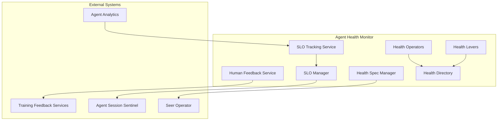

# Agent Health Monitor

> **Status**: 🟢 Design Complete  
> **Last Updated**: 2026-01-13

## Overview

Agent Health Monitor tracks and monitors health-related Service Level Objectives (SLOs) for agents, including cost SLOs (ARE), behavior SLOs (COS), and feedback SLOs (PA/APO).

---

## Design Documents

| Document | Description | Status |
|----------|-------------|--------|
| [SCOPE.md](./SCOPE.md) | Design scope, coverage summary, key decisions | Overview |
| [Health Spec Manager](./health-spec-manager.md) | Spec structure, SLO definitions, validation, deployment configuration | C2 |
| [SLO Manager](./slo-manager.md) | SLO definition and threshold management | C2 |
| [SLO Tracking Service](./slo-tracking-service.md) | SLO deviation tracking using Agent Analytics data mart | C2 |
| [Human Feedback Service](./human-feedback-service.md) | Feedback collection, routing, metric calculation | C2 |
| [Health Operators](./health-operators.md) | Lifecycle management, state transitions | C2 |
| [Health Levers](./health-levers.md) | Runtime controls, enable/disable, suspend | C2 |
| [Health Directory](./health-directory.md) | Registry, search, version tracking, SLO status | C2 |

---

## Architecture

---

## Key Design Decisions

### SLO Types by Persona

- **Cost SLOs (ARE)**: Address ARE needs for cost governance
- **Behavior SLOs (COS)**: Address COS needs for behavior monitoring
- **Feedback SLOs (PA/APO)**: Address Process Architect and APO needs for feedback tracking

### No Enforcement

- **SLO Manager and Tracking Service only manage and track**—no enforcement
- **Enforcement handled by sentinels** (if configured) or external systems
- **Tracking and alerting only**

### Agent Analytics Integration

- **Uses Agent Analytics data mart** for SLO evaluation
- **Historical data** for trend analysis and burn rate calculation
- **Efficient aggregation** for SLO evaluation

### Lifecycle Pattern

- **Follows same pattern** as Sentinel lifecycle managers
- **Spec Manager handles validation** and structure management
- **Seer Operator reconciles** CRDs to Kubernetes state

---

## Related

- [Agent Analytics](../agent-analytics/README.md) — Uses Agent Analytics data mart for SLO evaluation
- [Seer Sentinels](../seer-sentinels/README.md) — Can trigger sentinels on SLO deviations (if configured)
- [Training Feedback Services](../trained-agent-lifecycle-manager/training-feedback-services.md) — Routes feedback for Training Spec improvements
