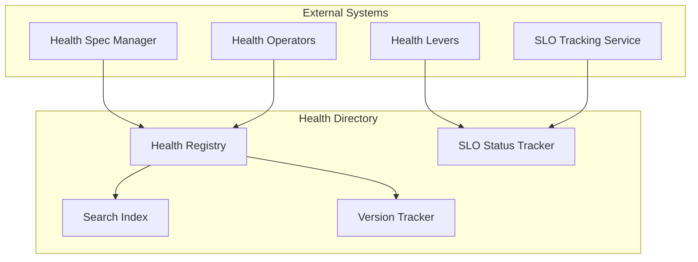
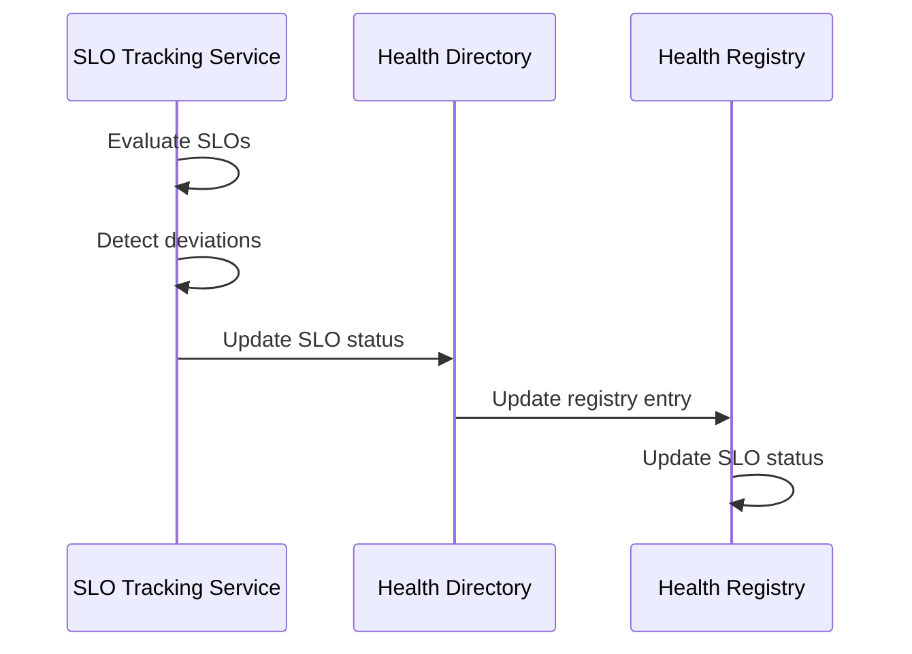

# Health Directory

> **Status**: 🟢 Design Complete  
> **Last Updated**: 2026-01-13  
> **Design Level**: C2 (Container)

---

## Overview

Health Directory is the registry for Health Specs and Deployments. It provides search, version tracking, and SLO status for health monitoring.

**Key Principle**: Health Directory maintains a searchable index of all health specs, their versions, deployment status, and SLO compliance status.

---

## Architecture



---

## Functional Scope

### Health Registry

Health Directory maintains a registry of Health Specs:

#### Registry Entry Structure

```yaml
health_entry:
  health_spec_id: "fraud-analyst-health"
  health_spec_name: "Fraud Analyst Health Monitor"
  version: "1.0.0"
  workbench_id: "acme-disputes"
  target_scope:
    workbench_ids: ["acme-disputes"]
    agent_ids: ["fraud-analyst-acme-retail"]
  slos:
    cost_slos: 2
    behavior_slos: 3
    feedback_slos: 2
  state: "deployed"  # drafted | validated | deployed | suspended | archived
  deployment_status:
    deployment_id: "fraud-analyst-health-deployment"
    replicas: 1
    active_replicas: 1
    last_deployment: "2026-01-13T10:00:00Z"
  slo_status:
    compliant_slos: 5
    deviating_slos: 2
    last_evaluation: "2026-01-13T10:30:00Z"
  metadata:
    created_at: "2026-01-13T09:00:00Z"
    created_by: "user@acme.com"
    updated_at: "2026-01-13T10:00:00Z"
```

#### Registry Indexes

| Index | Purpose |
|-------|---------|
| **By Health Spec ID** | Direct lookup |
| **By Workbench** | Workbench-scoped health specs |
| **By Agent** | Agent-scoped health specs |
| **By State** | Active health specs |
| **By SLO Status** | SLO compliance status |
| **By Deployment Status** | Deployment health |

---

### Search & Discovery

Health Directory provides search capabilities:

#### Search Queries

| Query Type | Description | Example |
|-----------|-------------|---------|
| **By Workbench** | Find health specs for a workbench | `workbench_id=acme-disputes` |
| **By Agent** | Find health specs targeting an agent | `target_agent_id=fraud-analyst` |
| **By State** | Find health specs in a specific state | `state=deployed` |
| **By SLO Status** | Find health specs by SLO compliance | `slo_status=deviating` |
| **By Deployment Status** | Find health specs by deployment health | `deployment_status=healthy` |

#### Search Example

```yaml
search_query:
  workbench_id: "acme-disputes"
  state: "deployed"
  
search_results:
  - health_spec_id: "fraud-analyst-health"
    health_spec_name: "Fraud Analyst Health Monitor"
    state: "deployed"
    slo_status: "deviating"
    deployment_status: "healthy"
  - health_spec_id: "dispute-resolver-health"
    health_spec_name: "Dispute Resolver Health Monitor"
    state: "deployed"
    slo_status: "compliant"
    deployment_status: "healthy"
```

---

### Version Tracking

Health Directory tracks health spec versions:

#### Version History

```yaml
version_history:
  health_spec_id: "fraud-analyst-health"
  versions:
    - version: "1.0.0"
      state: "deployed"
      deployed_at: "2026-01-13T10:00:00Z"
      deployment_id: "fraud-analyst-health-deployment-v1"
    - version: "0.9.0"
      state: "archived"
      archived_at: "2026-01-13T09:00:00Z"
```

#### Version Compatibility

- **Version tracking** for spec evolution
- **Compatibility matrix** for version upgrades
- **Migration paths** for version transitions

---

### SLO Status Tracking

Health Directory tracks SLO compliance status:

#### SLO Status

| Status | Description |
|--------|-------------|
| **Compliant** | All SLOs within thresholds |
| **Deviating** | One or more SLOs deviating |
| **Critical** | One or more SLOs critically deviating |
| **Unknown** | Status cannot be determined |

#### SLO Status Update Flow



---

## Integration Points

### Upstream Integration

| Service | Integration Method | Purpose |
|---------|-------------------|---------|
| **Health Spec Manager** | Spec registration API | Register new specs |
| **Health Operators** | Lifecycle API | Update lifecycle state |
| **Health Levers** | Status update API | Update runtime status |
| **SLO Tracking Service** | SLO status API | Update SLO compliance status |

### Downstream Integration

| Service | Integration Method | Purpose |
|---------|-------------------|---------|
| **Search Consumers** | Search API | Query health spec registry |

---

## Key Design Decisions

### Registry Model

- **Centralized registry** for all health specs
- **Searchable indexes** for efficient queries
- **Version tracking** for spec evolution

### Status Tracking

- **Real-time SLO status updates** from SLO Tracking Service
- **Deployment health** monitoring
- **State synchronization** across systems

### Discovery Model

- **Workbench-scoped** health spec discovery
- **Agent-scoped** health spec discovery
- **SLO status-based** health spec filtering

---

## Related Documentation

- [Health Spec Manager](./health-spec-manager.md) — Spec structure and registration
- [Health Operators](./health-operators.md) — Lifecycle management
- [Health Levers](./health-levers.md) — Runtime controls
- [SLO Tracking Service](./slo-tracking-service.md) — SLO status updates

---

*Health Directory provides a searchable registry of Health Specs and Deployments with version tracking and SLO status.*
