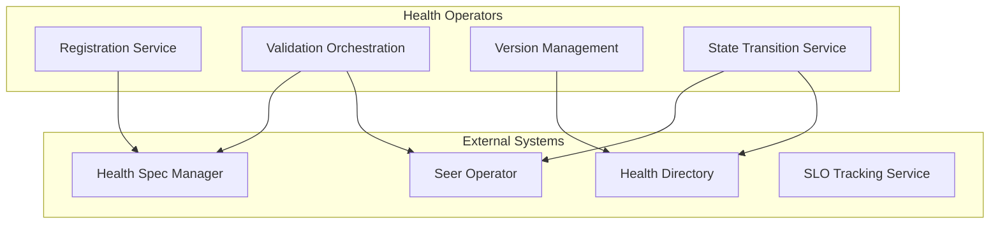
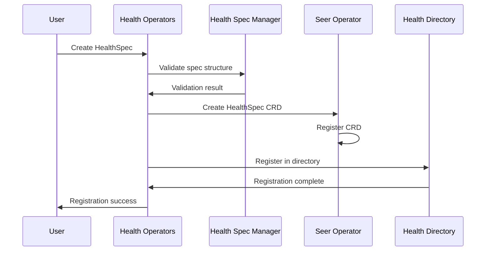
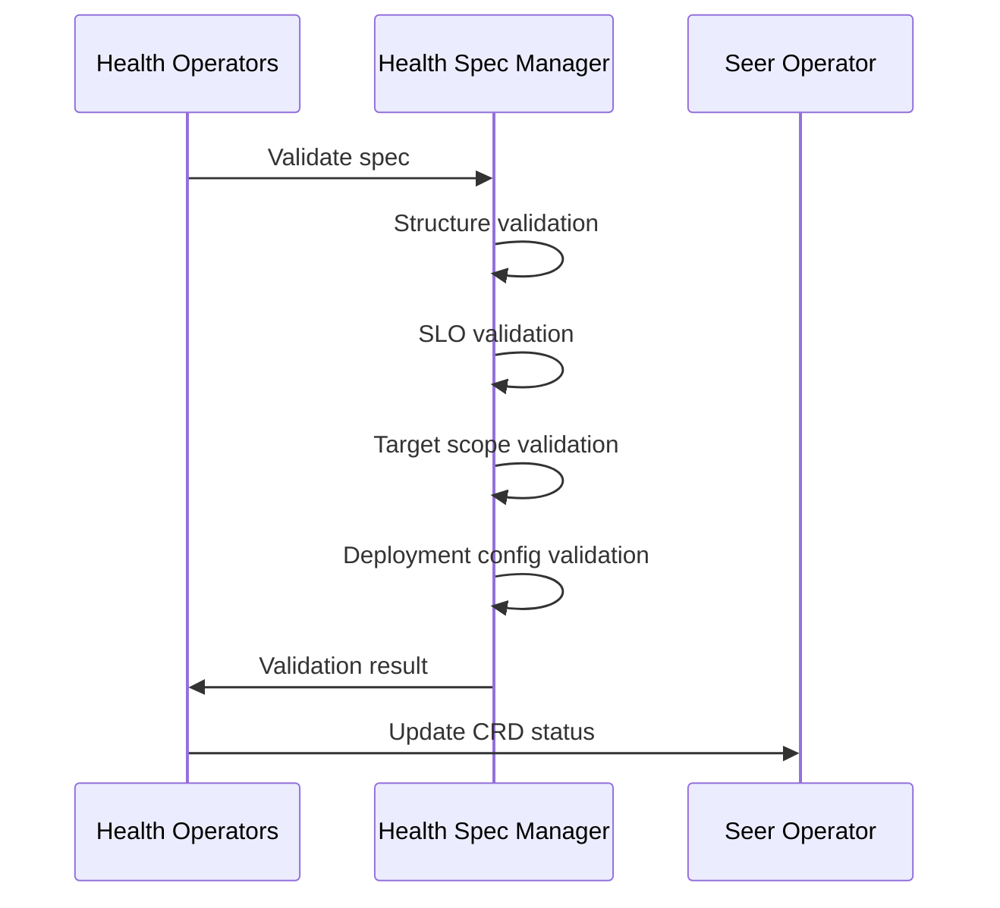
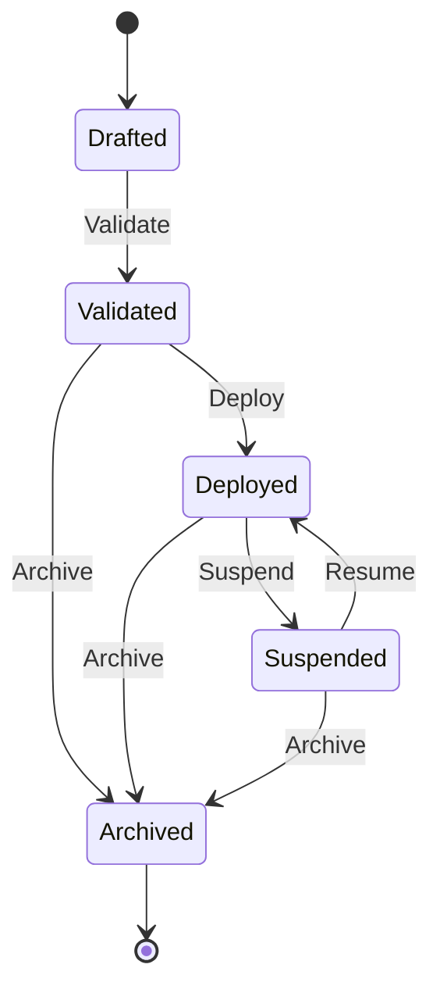

# Health Operators

> **Status**: 🟢 Design Complete  
> **Last Updated**: 2026-01-13  
> **Design Level**: C2 (Container)

---

## Overview

Health Operators manage the lifecycle of Health Specs and Deployments via Seer Operator. They handle registration, validation, versioning, and state transitions for health monitoring.

**Key Principle**: Health Operators coordinate lifecycle management across Health Spec Manager, Health Directory, and Seer Operator, following the same pattern as Supervisor lifecycle managers.

---

## Architecture

---

## Functional Scope

### Registration Service

Health Operators register new Health Specs:

#### Registration Flow

#### Registration Steps

1. **Spec Validation**: Validate spec structure via Health Spec Manager
2. **CRD Creation**: Create HealthSpec CRD via Seer Operator
3. **Directory Registration**: Register spec in Health Directory
4. **State Initialization**: Initialize spec state (Drafted)

---

### Validation Orchestration

Health Operators orchestrate validation across systems:

#### Validation Checks

| Check | Description | Validated By |
|-------|-------------|--------------|
| **Structure Validation** | Spec structure, required fields | Health Spec Manager |
| **SLO Validation** | SLO definitions valid | Health Spec Manager |
| **Target Scope Validation** | Target agents/workbenches exist | Health Spec Manager |
| **Deployment Config Validation** | Deployment configuration valid | Health Spec Manager |

#### Validation Flow

---

### Version Management

Health Operators manage health spec versions:

#### Version Assignment

| State | Version Rule |
|-------|-------------|
| **Drafted** | No version assigned |
| **Validated** | Version assigned (e.g., `1.0.0`) |
| **Deployed** | Version locked |

#### Version Compatibility

- **Major version**: Breaking changes (incompatible SLO definitions)
- **Minor version**: New features (backward compatible)
- **Patch version**: Bug fixes (backward compatible)

---

### State Transition Service

Health Operators manage health spec state transitions:

#### Lifecycle States

| State | Description | Allowed Transitions |
|-------|-------------|-------------------|
| **Drafted** | Spec created, not validated | → Validated |
| **Validated** | Spec validated, ready for deployment | → Deployed, → Archived |
| **Deployed** | Health monitor deployed and active | → Suspended, → Archived |
| **Suspended** | Health monitor suspended (temporarily disabled) | → Deployed, → Archived |
| **Archived** | Health monitor archived (no longer active) | (terminal) |

#### State Transition Flow

#### State Transition Rules

| Transition | Condition | Action |
|-----------|-----------|--------|
| **Drafted → Validated** | Spec validation passes | Assign version, update CRD status |
| **Validated → Deployed** | Deployment CRD created | Deploy health monitor service |
| **Deployed → Suspended** | Suspend lever activated | Stop health monitor service |
| **Suspended → Deployed** | Resume lever activated | Restart health monitor service |
| **Any → Archived** | Archive lever activated | Remove health monitor service, mark archived |

---

## Integration Points

### Upstream Integration

| Service | Integration Method | Purpose |
|---------|-------------------|---------|
| **Health Spec Manager** | Spec validation API | Validate specs before registration |
| **Seer Operator** | CRD reconciliation | CRD creation and state management |

### Downstream Integration

| Service | Integration Method | Purpose |
|---------|-------------------|---------|
| **Health Directory** | Spec registration API | Register specs in directory |
| **SLO Tracking Service** | Deployment trigger | Deploy SLO tracking service |

---

## Key Design Decisions

### Lifecycle Pattern

- **Follows same pattern** as Supervisor lifecycle managers
- **State-based lifecycle** with clear transition rules
- **Version management** for spec evolution

### Seer Operator Boundary

- **Health Operators coordinate** lifecycle management
- **Seer Operator reconciles** CRDs to Kubernetes state
- **Clear separation** between business logic and controller logic

### Deployment Model

- **Deployment CRDs** reference HealthSpec CRDs
- **Deployment triggers** health monitor service deployment
- **State transitions** control health monitor lifecycle

---

## Related Documentation

- [Health Spec Manager](./health-spec-manager.md) — Spec structure and validation
- [Health Levers](./health-levers.md) — Runtime controls and state transitions
- [Health Directory](./health-directory.md) — Registry and search
- [Seer Operator](../../hub-integration/training-spec-crd.md) — CRD reconciliation

---

*Health Operators manage the lifecycle of Health Specs and Deployments via Seer Operator.*
