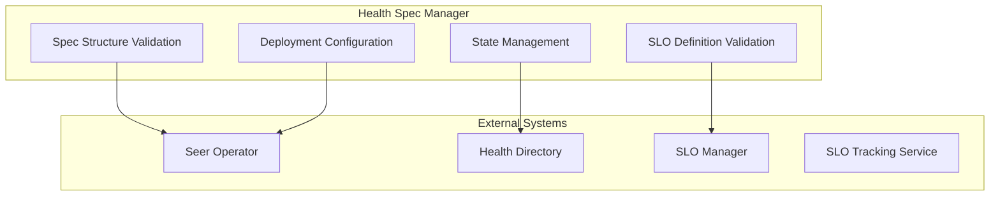
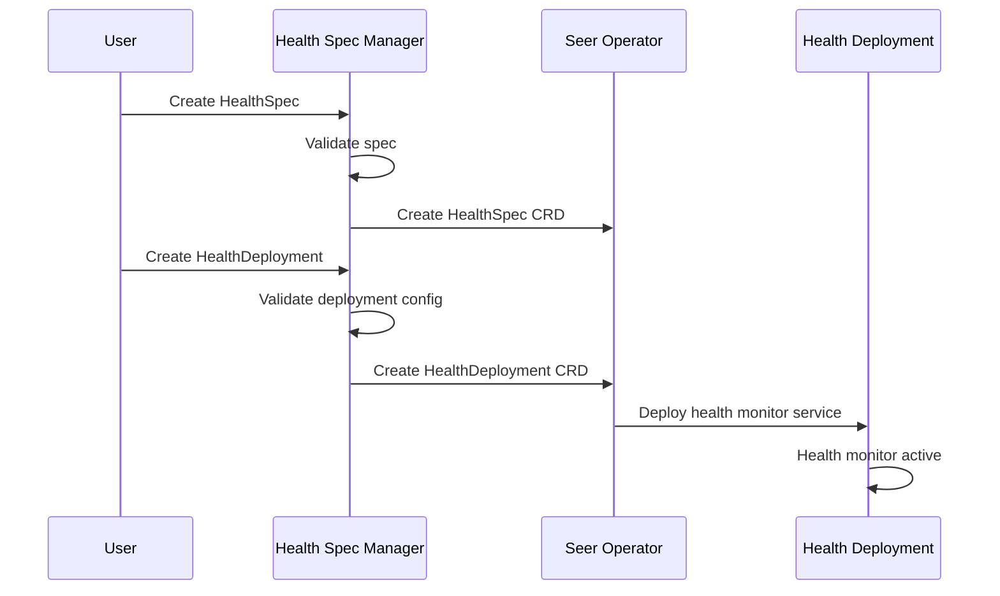

# Health Spec Manager

> **Status**: 🟢 Design Complete  
> **Last Updated**: 2026-01-13  
> **Design Level**: C2 (Container)

---

## Overview

Health Spec Manager is the foundational component of the Agent Health Monitor subsystem. It manages Health Specifications (HealthSpec CRDs) that define SLOs (Service Level Objectives) for agents, including Cost SLOs (ARE), Behavior SLOs (COS), and Feedback SLOs (PA/APO).

Health Spec Manager handles spec structure validation, SLO definition validation, and deployment configuration.

---

## Architecture



---

## Functional Scope

### Health Spec Structure

Health Spec Manager validates the complete structure of HealthSpec CRDs:

#### Core Components

| Component | Description | Validation Rules |
|-----------|-------------|------------------|
| **Health Spec Name** | Unique identifier | Required, must be unique within workbench |
| **Target Scope** | Agents/workbenches to monitor | Required, must specify agent_ids or workbench_ids |
| **Cost SLOs** | Cost-related SLOs (ARE) | Optional, validated for threshold syntax |
| **Behavior SLOs** | Behavior-related SLOs (COS) | Optional, validated for threshold syntax |
| **Feedback SLOs** | Feedback-related SLOs (PA/APO) | Optional, validated for threshold syntax |
| **Deployment Configuration** | Deployment CRD reference | Required for deployment |

#### Spec Structure Example

```yaml
apiVersion: seer.olympus.io/v1
kind: HealthSpec
metadata:
  name: fraud-analyst-health
  namespace: acme-disputes
spec:
  # Target Scope (required)
  target:
    workbench_ids: ["acme-disputes"]
    agent_ids: ["fraud-analyst-acme-retail"]
  
  # Cost SLOs (ARE)
  cost_slos:
    - name: "cost_per_request"
      threshold: 0.50  # dollars
      window: "24h"
      evaluation: "p95"  # p50 | p95 | p99 | max
      action: "alert"  # alert | exception
  
    - name: "daily_budget"
      threshold: 100.00  # dollars
      window: "24h"
      evaluation: "sum"
      action: "exception"
  
  # Behavior SLOs (COS)
  behavior_slos:
    - name: "agent_health_score"
      threshold: 0.80
      window: "7d"
      evaluation: "average"
      action: "alert"
    
    - name: "error_rate"
      threshold: 0.01  # 1%
      window: "24h"
      evaluation: "rate"
      action: "exception"
    
    - name: "latency_p99"
      threshold: 3.0  # seconds
      window: "24h"
      evaluation: "p99"
      action: "alert"
  
  # Feedback SLOs (PA/APO)
  feedback_slos:
    - name: "user_satisfaction"
      threshold: 0.85
      window: "7d"
      evaluation: "average"
      action: "alert"
    
    - name: "override_rate"
      threshold: 0.05  # 5%
      window: "7d"
      evaluation: "rate"
      action: "alert"
  
  # Deployment Configuration (required)
  deployment:
    enabled: true
    replicas: 1
    resources:
      cpu: "100m"
      memory: "256Mi"
```

---

### SLO Definition Validation

Health Spec Manager validates SLO definitions:

#### SLO Validation Rules

| Validation Type | Description | Action on Failure |
|-----------------|-------------|-------------------|
| **SLO Name Validation** | SLO name is unique within spec | Reject spec |
| **Threshold Validation** | Threshold is numeric and within valid range | Reject spec |
| **Window Validation** | Window is valid time duration | Reject spec |
| **Evaluation Validation** | Evaluation method is valid (p50, p95, p99, max, sum, average, rate) | Reject spec |
| **Action Validation** | Action is valid (alert, exception) | Reject spec |

#### SLO Type Validation

| SLO Type | Valid Metrics | Valid Evaluation Methods |
|----------|--------------|-------------------------|
| **Cost SLOs** | cost_per_request, daily_budget, total_cost | p50, p95, p99, max, sum |
| **Behavior SLOs** | agent_health_score, error_rate, latency_p99, availability | p50, p95, p99, max, average, rate |
| **Feedback SLOs** | user_satisfaction, override_rate, feedback_rating | average, rate |

---

### Deployment Configuration

Health Spec Manager manages deployment configuration:

#### Deployment CRD Structure

```yaml
apiVersion: seer.olympus.io/v1
kind: HealthDeployment
metadata:
  name: fraud-analyst-health-deployment
  namespace: acme-disputes
spec:
  health_spec_ref:
    name: fraud-analyst-health
    version: "1.0.0"
  
  deployment_config:
    replicas: 1
    resources:
      cpu: "100m"
      memory: "256Mi"
    
    tracking_config:
      evaluation_interval: "5m"  # Evaluate SLOs every 5 minutes
      data_source: "agent_analytics"  # Use Agent Analytics data mart
```

#### Deployment Flow



---

### Spec Validation

Health Spec Manager validates health specs:

#### Validation Rules

| Validation Type | Description | Action on Failure |
|-----------------|-------------|-------------------|
| **Structure Validation** | Required fields present, correct types | Reject spec |
| **SLO Validation** | SLO definitions valid | Reject spec |
| **Target Scope Validation** | Target agents/workbenches exist | Reject spec |
| **Deployment Config Validation** | Deployment configuration valid | Reject spec |

---

## Integration Points

### Upstream Integration

| Service | Integration Method | Purpose |
|---------|-------------------|---------|
| **Seer Operator** | CRD reconciliation | CRD creation and state management |

### Downstream Integration

| Service | Integration Method | Purpose |
|---------|-------------------|---------|
| **Health Directory** | Spec registration | Registry and search |
| **SLO Manager** | SLO definition | SLO threshold management |
| **SLO Tracking Service** | Spec configuration | SLO evaluation |
| **Health Operators** | Spec lifecycle | Registration and state transitions |

---

## Key Design Decisions

### SLO Types

- **Cost SLOs (ARE)**: Address ARE needs for cost governance
- **Behavior SLOs (COS)**: Address COS needs for behavior monitoring
- **Feedback SLOs (PA/APO)**: Address Process Architect and APO needs for feedback tracking

### Metrics Granularity

- **Metrics at per Agent level** with rollup to Workbench
- **Agent-level SLOs** for individual agent monitoring
- **Workbench-level SLOs** for aggregate monitoring

### Lifecycle Pattern

- **Follows same pattern** as Supervisor lifecycle managers
- **Spec Manager handles validation** and structure management
- **Seer Operator reconciles** CRDs to Kubernetes state

---

## Related Documentation

- [SLO Manager](./slo-manager.md) — SLO definition and threshold management
- [SLO Tracking Service](./slo-tracking-service.md) — SLO deviation tracking
- [Health Operators](./health-operators.md) — Lifecycle management and state transitions
- [Health Directory](./health-directory.md) — Registry and search

---

*Health Spec Manager provides the foundation for Agent Health Monitor by managing health specifications and SLO definitions.*
