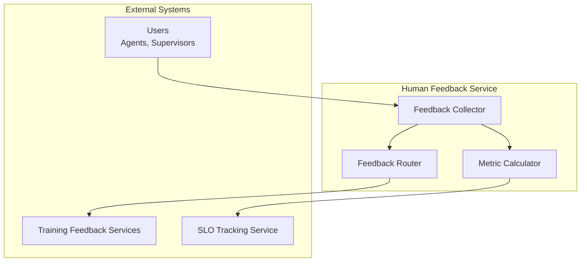
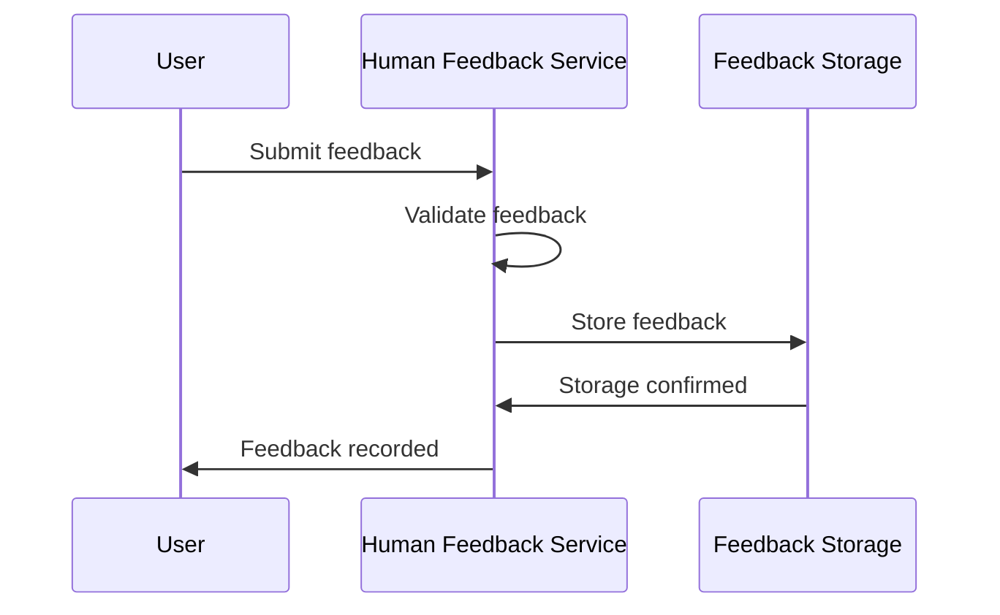
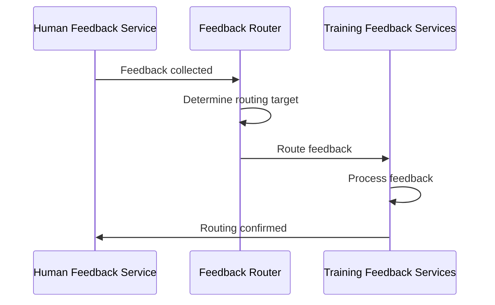
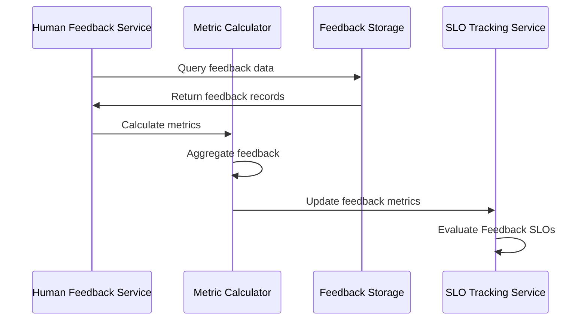

# Human Feedback Service

> **Status**: 🟢 Design Complete  
> **Last Updated**: 2026-01-13  
> **Design Level**: C2 (Container)

---

## Overview

Human Feedback Service collects, routes, and calculates feedback metrics for agents. It collects feedback from users, routes feedback to Training Feedback Services, and calculates feedback-based metrics for SLO evaluation.

**Key Principle**: Human Feedback Service handles the complete feedback lifecycle—collection, routing, and metric calculation.

---

## Architecture



---

## Functional Scope

### Feedback Collection

Human Feedback Service collects feedback from users:

#### Feedback Types

| Feedback Type | Description | Source |
|---------------|-------------|--------|
| **Explicit Feedback** | Direct user ratings, corrections | Users, Supervisors |
| **Implicit Feedback** | Override patterns, escalation frequency | System events |
| **Outcome Feedback** | Business results linked to decisions | Business systems |

#### Feedback Structure

```yaml
feedback:
  feedback_id: "feedback-12345"
  agent_id: "fraud-analyst-acme-retail"
  workbench_id: "acme-disputes"
  request_id: "req-abc123"
  feedback_type: "explicit"  # explicit | implicit | outcome
  rating: 0.85  # 0.0 - 1.0
  comment: "Good analysis, but missed one transaction pattern"
  feedback_source: "user@acme.com"
  timestamp: "2026-01-13T10:30:00Z"
  metadata:
    override: false
    escalation: false
```

#### Feedback Collection Flow



---

### Feedback Routing

Human Feedback Service routes feedback to Training Feedback Services:

#### Routing Rules

| Feedback Type | Routing Target | Purpose |
|---------------|----------------|---------|
| **Training Spec Improvements** | Training Feedback Services | Improve Training Specs |
| **Agent Behavior Feedback** | Training Feedback Services | Improve agent behavior |
| **Capability Gaps** | Training Feedback Services | Identify capability gaps |
| **Safety Concerns** | Training Feedback Services | Address safety issues |
| **Performance Issues** | Training Feedback Services | Improve performance |

#### Routing Flow



---

### Feedback Metric Calculation

Human Feedback Service calculates feedback-based metrics:

#### Metrics Calculated

| Metric | Description | Calculation |
|--------|-------------|-------------|
| **user_satisfaction** | Average user satisfaction rating | Average of explicit feedback ratings |
| **override_rate** | Human override rate | Overrides / Total decisions |
| **feedback_rating** | Average feedback rating | Average of all feedback ratings |
| **escalation_rate** | Escalation rate | Escalations / Total requests |

#### Metric Calculation Flow



---

## Integration Points

### Upstream Integration

| Service | Integration Method | Purpose |
|---------|-------------------|---------|
| **Users** | Feedback submission API | Collect feedback |

### Downstream Integration

| Service | Integration Method | Purpose |
|---------|-------------------|---------|
| **Training Feedback Services** | Feedback routing API | Route feedback for improvement |
| **SLO Tracking Service** | Feedback metric API | Provide feedback metrics for SLO evaluation |

---

## Key Design Decisions

### Complete Feedback Lifecycle

- **Collection**: Collect feedback from multiple sources
- **Routing**: Route feedback to appropriate services
- **Metric Calculation**: Calculate feedback-based metrics for SLO evaluation

### Feedback Types

- **Explicit**: Direct user ratings and corrections
- **Implicit**: Behavioral indicators (overrides, escalations)
- **Outcome**: Business results linked to decisions

### Training Feedback Integration

- **Routes feedback to Training Feedback Services** for continuous improvement
- **Feedback informs Training Spec improvements**
- **Feedback informs agent behavior improvements**

---

## Related Documentation

- [SLO Tracking Service](./slo-tracking-service.md) — Uses feedback metrics for SLO evaluation
- [Training Feedback Services](../trained-agent-lifecycle-manager/training-feedback-services.md) — Feedback routing target

---

*Human Feedback Service collects, routes, and calculates feedback metrics for agents.*
