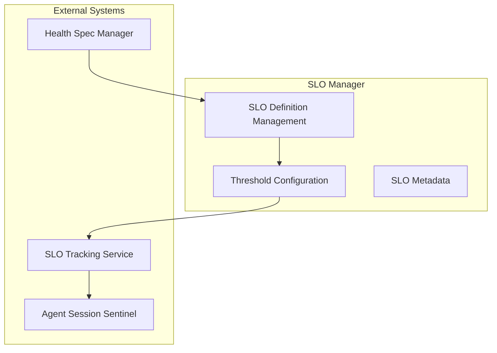

# SLO Manager

> **Status**: 🟢 Design Complete  
> **Last Updated**: 2026-01-13  
> **Design Level**: C2 (Container)

---

## Overview

SLO Manager manages SLO definitions and thresholds for Cost SLOs (ARE), Behavior SLOs (COS), and Feedback SLOs (PA/APO). It provides SLO definition management, threshold configuration, and SLO metadata.

**Key Principle**: SLO Manager manages SLO definitions and thresholds—it does not enforce SLOs. Enforcement is handled by sentinels (if configured) or external systems.

---

## Architecture



---

## Functional Scope

### SLO Definition Management

SLO Manager manages SLO definitions:

#### Cost SLOs (ARE)

| SLO Name | Description | Threshold Type | Evaluation Method |
|----------|-------------|----------------|-------------------|
| **cost_per_request** | Cost per request | Dollar amount | p50, p95, p99, max |
| **daily_budget** | Daily spending limit | Dollar amount | sum |
| **total_cost** | Total cost over period | Dollar amount | sum |
| **cost_anomaly_score** | Cost anomaly detection | Score (0-1) | average |

#### Behavior SLOs (COS)

| SLO Name | Description | Threshold Type | Evaluation Method |
|----------|-------------|----------------|-------------------|
| **agent_health_score** | Agent Health Score (AHS) | Score (0-1) | average |
| **error_rate** | Error rate | Percentage | rate |
| **latency_p99** | P99 latency | Seconds | p99 |
| **availability** | Agent availability | Percentage | average |
| **success_rate** | Task success rate | Percentage | rate |

#### Feedback SLOs (PA/APO)

| SLO Name | Description | Threshold Type | Evaluation Method |
|----------|-------------|----------------|-------------------|
| **user_satisfaction** | User satisfaction rating | Score (0-1) | average |
| **override_rate** | Human override rate | Percentage | rate |
| **feedback_rating** | Average feedback rating | Score (0-1) | average |
| **escalation_rate** | Escalation rate | Percentage | rate |

---

### Threshold Configuration

SLO Manager manages SLO thresholds:

#### Threshold Structure

```yaml
threshold_config:
  slo_name: "agent_health_score"
  threshold: 0.80
  window: "7d"
  evaluation: "average"
  action: "alert"  # alert | exception
  burn_rate_alerts:
    warning: 2.0  # 2x burn rate
    critical: 5.0  # 5x burn rate
    emergency: 10.0  # 10x burn rate
```

#### Threshold Types

| Threshold Type | Description | Example |
|----------------|-------------|---------|
| **Absolute** | Fixed threshold value | `threshold: 0.80` |
| **Relative** | Relative to baseline | `threshold: "baseline * 1.2"` |
| **Dynamic** | Computed threshold | `threshold: "p95(historical)"` |

---

### SLO Metadata

SLO Manager maintains SLO metadata:

#### Metadata Structure

```yaml
slo_metadata:
  slo_name: "agent_health_score"
  slo_type: "behavior"  # cost | behavior | feedback
  persona: "cos"  # are | cos | pa | apo
  description: "Agent Health Score (AHS) - composite metric"
  components:
    - accuracy: 0.3
    - success_rate: 0.25
    - compliance: 0.25
    - user_satisfaction: 0.2
  measurement_window: "7d"
  evaluation_frequency: "5m"
```

---

## Integration Points

### Upstream Integration

| Service | Integration Method | Purpose |
|---------|-------------------|---------|
| **Health Spec Manager** | SLO definition API | SLO definition from Health Specs |

### Downstream Integration

| Service | Integration Method | Purpose |
|---------|-------------------|---------|
| **SLO Tracking Service** | SLO threshold API | SLO evaluation thresholds |
| **Seer Sentinels** | SLO deviation trigger | Trigger sentinels on SLO deviations (if configured) |

---

## Key Design Decisions

### SLO Types by Persona

- **Cost SLOs (ARE)**: Address ARE needs for cost governance
- **Behavior SLOs (COS)**: Address COS needs for behavior monitoring
- **Feedback SLOs (PA/APO)**: Address Process Architect and APO needs for feedback tracking

### No Enforcement

- **SLO Manager only manages definitions and thresholds**—no enforcement
- **Enforcement handled by sentinels** (if configured) or external systems
- **Tracking only**—SLO Tracking Service tracks deviations

### Metrics Granularity

- **Metrics at per Agent level** with rollup to Workbench
- **Agent-level SLOs** for individual agent monitoring
- **Workbench-level SLOs** for aggregate monitoring

---

## Related Documentation

- [Health Spec Manager](./health-spec-manager.md) — Spec structure and SLO definitions
- [SLO Tracking Service](./slo-tracking-service.md) — SLO deviation tracking
- [Seer Sentinels](../seer-sentinels/README.md) — Can trigger on SLO deviations

---

*SLO Manager manages SLO definitions and thresholds for Cost, Behavior, and Feedback SLOs.*
