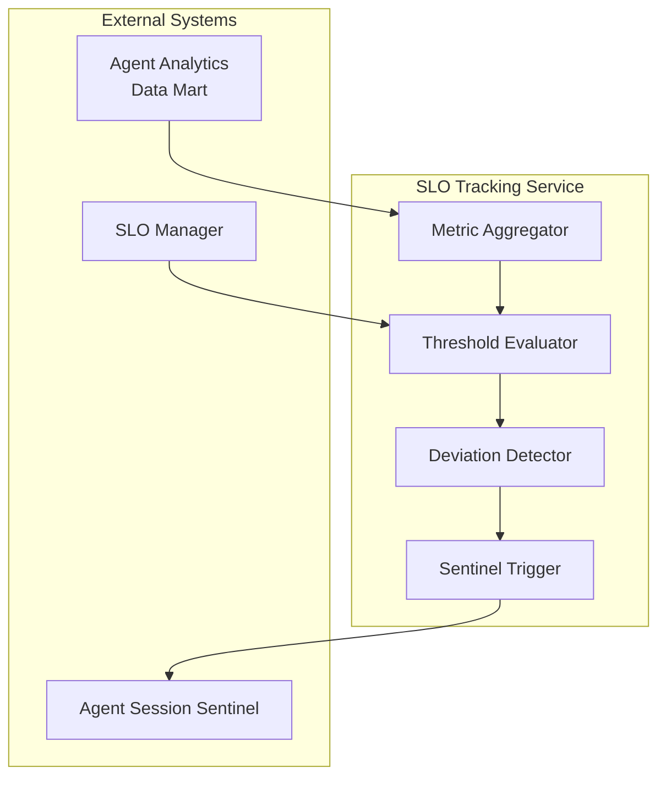
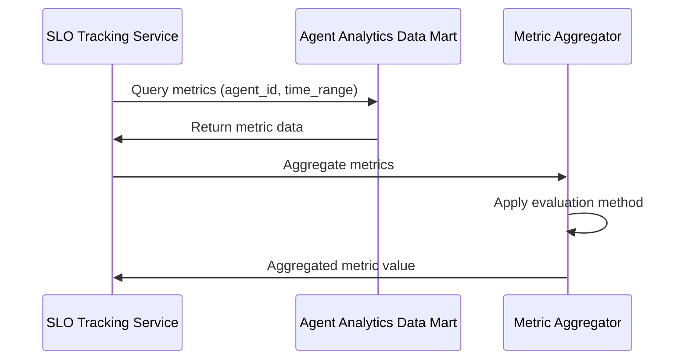
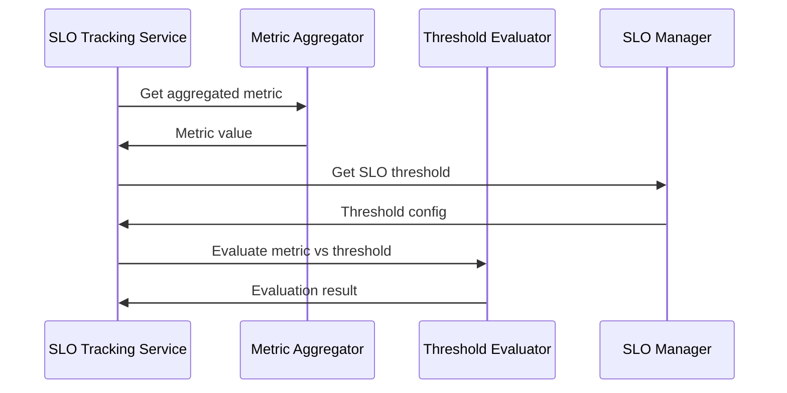
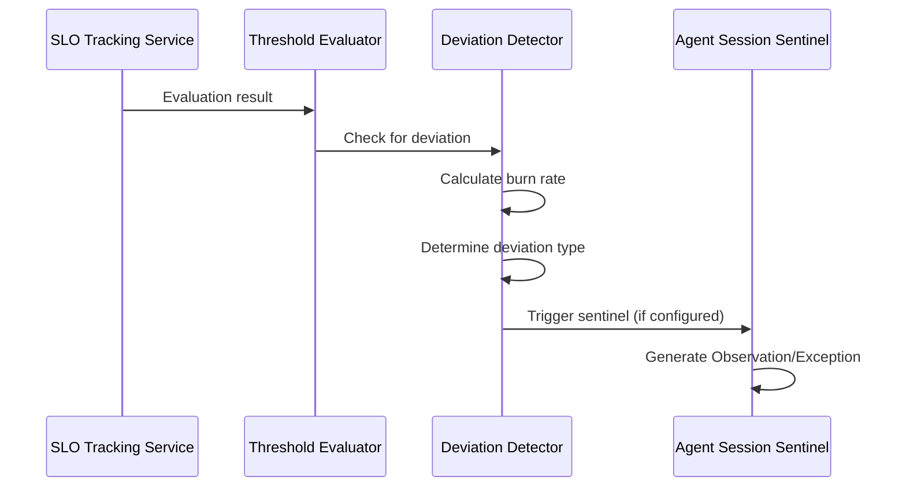
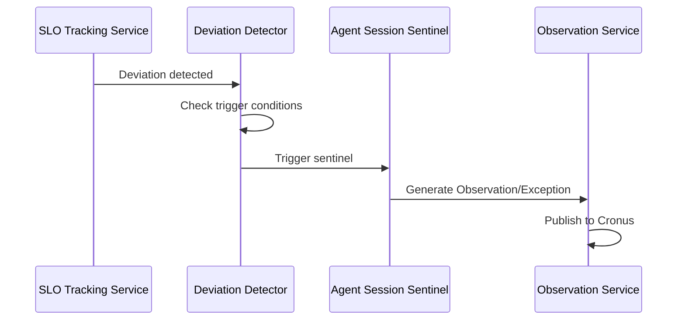

# SLO Tracking Service

> **Status**: 🟢 Design Complete  
> **Last Updated**: 2026-01-13  
> **Design Level**: C2 (Container)

---

## Overview

SLO Tracking Service tracks SLO deviations using the Agent Analytics data mart. It evaluates SLO thresholds, aggregates metrics, and detects deviations that require attention.

**Key Principle**: SLO Tracking Service uses Agent Analytics data mart for SLO evaluation—it does not enforce SLOs. It tracks deviations and can trigger sentinels (if configured).

---

## Architecture



---

## Functional Scope

### Metric Aggregation

SLO Tracking Service aggregates metrics from Agent Analytics data mart:

#### Aggregation Methods

| Method | Description | Use Case |
|--------|-------------|----------|
| **p50, p95, p99** | Percentile aggregation | Latency, cost per request |
| **max** | Maximum value | Peak cost, peak latency |
| **sum** | Sum aggregation | Total cost, total errors |
| **average** | Average aggregation | Agent Health Score, user satisfaction |
| **rate** | Rate calculation | Error rate, override rate |

#### Aggregation Flow



---

### Threshold Evaluation

SLO Tracking Service evaluates metrics against SLO thresholds:

#### Evaluation Process

```yaml
evaluation:
  slo_name: "agent_health_score"
  metric_value: 0.75
  threshold: 0.80
  window: "7d"
  evaluation_method: "average"
  result: "deviation"  # compliant | deviation
  deviation_amount: 0.05
  deviation_percentage: 6.25%
```

#### Evaluation Flow



---

### Deviation Detection

SLO Tracking Service detects SLO deviations:

#### Deviation Types

| Deviation Type | Description | Action |
|----------------|-------------|--------|
| **Threshold Breach** | Metric exceeds threshold | Alert or Exception (based on SLO action) |
| **Burn Rate Warning** | 2x burn rate detected | Warning alert |
| **Burn Rate Critical** | 5x burn rate detected | Critical alert |
| **Burn Rate Emergency** | 10x burn rate detected | Emergency exception |

#### Deviation Detection Flow



---

### Sentinel Triggering

SLO Tracking Service can trigger sentinels on SLO deviations:

#### Sentinel Trigger Configuration

```yaml
sentinel_trigger:
  slo_name: "agent_health_score"
  deviation_type: "threshold_breach"
  sentinel_id: "slo-deviation-sentinel"
  trigger_condition: "deviation_percentage > 5%"
```

#### Sentinel Trigger Flow



---

## Integration Points

### Upstream Integration

| Service | Integration Method | Purpose |
|---------|-------------------|---------|
| **Agent Analytics** | Data mart query API | Metric aggregation |
| **SLO Manager** | SLO threshold API | SLO threshold configuration |

### Downstream Integration

| Service | Integration Method | Purpose |
|---------|-------------------|---------|
| **Agent Session Sentinel** | Sentinel trigger API | Trigger sentinels on SLO deviations (if configured) |

---

## Key Design Decisions

### Agent Analytics Integration

- **Uses Agent Analytics data mart** for SLO evaluation
- **Historical data** for trend analysis and burn rate calculation
- **Efficient aggregation** for SLO evaluation

### No Enforcement

- **SLO Tracking Service only tracks deviations**—no enforcement
- **Enforcement handled by sentinels** (if configured) or external systems
- **Tracking and alerting only**

### Burn Rate Alerts

- **Burn rate alerts** catch problems before SLOs are breached
- **Warning (2x)**, **Critical (5x)**, **Emergency (10x)** burn rate levels
- **Proactive monitoring** for SLO compliance

---

## Related Documentation

- [SLO Manager](./slo-manager.md) — SLO definition and threshold management
- [Agent Analytics](../agent-analytics/data-mart-service.md) — Analytics data mart source
- [Agent Session Sentinel](../agent-session-sentinel/README.md) — Sentinel triggering

---

*SLO Tracking Service tracks SLO deviations using Agent Analytics data mart and can trigger sentinels on deviations.*
